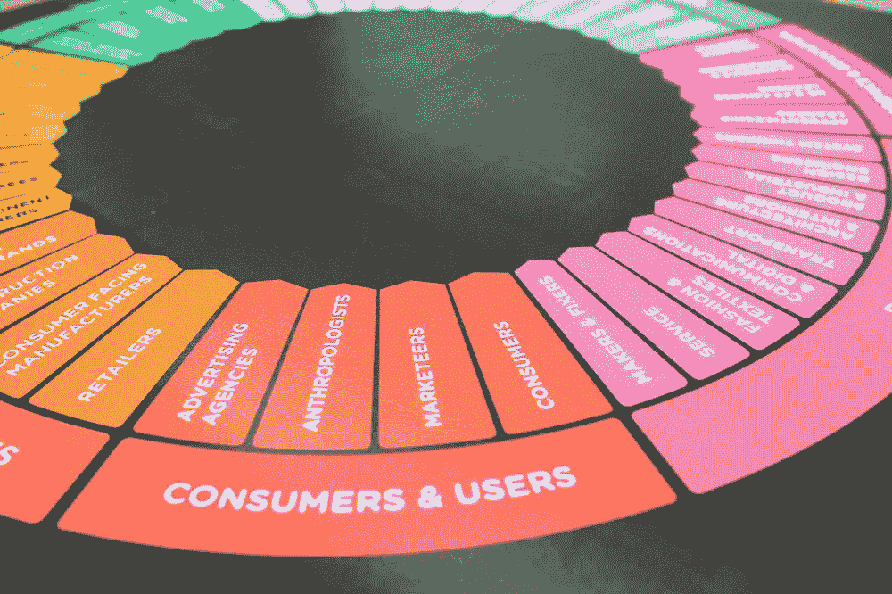
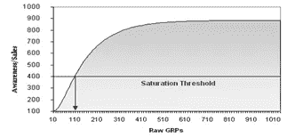
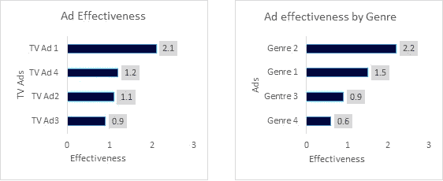

# 市场组合建模(MMM) — 101

> 原文：<https://towardsdatascience.com/market-mix-modeling-mmm-101-3d094df976f9?source=collection_archive---------1----------------------->

Source: [tvba.co.uk](http://www.tvba.co.uk/article/route-to-market-finding-the-back-door-to-tough-markets)

市场组合建模(MMM)是一种技术，有助于量化几种营销投入对销售或市场份额的影响。使用 MMM 的目的是了解每项营销投入对销售额的贡献，以及每项营销投入的花费。

MMM 有助于确定每项营销投入在投资回报方面的有效性。换句话说，投资回报率(ROI)较高的营销投入作为媒介比投资回报率较低的营销投入更有效。

MMM 使用回归技术，通过回归执行的分析进一步用于提取关键信息/见解。

在这篇文章中，我将谈论与理解 MMM 相关的各种概念。

**1。** **多元线性回归:**

如前所述，市场组合建模使用多元线性回归原理。因变量可以是销售额或市场份额。通常使用的独立变量有分销、价格、电视支出、户外活动支出、报纸和杂志支出、线下促销支出和消费者促销信息等。如今，一些营销人员大量使用数字媒体来提高品牌知名度。因此，像数字消费、网站访客等输入。也可用作 MMM 的输入。

因变量和预测变量之间形成一个方程。这个方程可以是线性的，也可以是非线性的，这取决于因变量和各种营销投入之间的关系。有些变量，如电视广告，与销售呈非线性关系。这意味着电视 GRP 的增长与销售额的增长不成正比。我将在下一节中更详细地讨论这一点。

回归分析生成的 betas 有助于量化每个输入的影响。基本上，beta 表示投入值增加一个单位将增加 Beta 单位的销售额/利润，同时保持其他营销投入不变。

Sales Equation

**2。** **线性和非线性影响的预测因子:**

某些变量与销售额呈线性关系。这意味着随着我们增加这些投入，销售额将持续增长。但是像电视 GRP 这样的变量对销售没有线性影响。电视 grp 的增加只会在一定程度上增加销售额。一旦达到饱和点，GRP 的每一个增量单位对销售的影响都将减少。因此，对这种非线性变量进行一些转换，以便将它们包含在线性模型中。

电视 GRP 被认为是一个非线性变量，因为根据营销人员的说法，广告只会在一定程度上引起消费者的注意。超过某一点，增加广告曝光不会在顾客中产生任何进一步的增加的意识，因为他们已经知道该品牌。

因此，为了将 TV GRP 视为建模输入之一，将其转换为 adstock。

电视广告由两部分组成。

**a.** **收益递减:**电视广告的基本原理是，电视广告的曝光在一定程度上在消费者的头脑中创造了意识。除此之外，随着时间的推移，接触广告的影响开始减弱。GRP 的每一个增量对销售或认知度的影响都会降低。因此，增量 GRP 产生的销售额开始减少并保持不变。从上图中可以看出这种影响，其中电视 GRP 和销售额之间的关系是非线性的。这种类型的关系可以通过计算 GRP 的指数或对数来获得。

**b.** **结转效应或衰减效应:**过去的广告对现在销售的影响被称为结转效应。一个称为 lambda 的小部分乘以上个月的 GRP 值。这一部分也被称为衰减效应，因为前几个月的广告影响会随着时间的推移而衰减。

**3。** **基础销售和增量销售:**

在市场组合建模中，销售分为两个部分:

**a .基础销售额:**基础销售额是营销人员不做任何广告而得到的。这是多年来建立的品牌资产带来的销售额。基本销售额通常是固定的，除非经济或环境因素发生变化。

**b .增量销售:**电视广告、平面广告、数字消费、促销等营销活动产生的销售。总增量销售额被分割成每个输入的销售额，以计算对总销售额的贡献。

**4。** **贡献图表:**

贡献图是表示每项营销投入的销售额的最简单方法。每个营销投入的贡献是其 beta 系数和投入值的乘积。

例如:报纸贡献= β*报纸支出

为了计算贡献率%,将每个投入的贡献率除以总贡献率。我将在 MMM 101 第 2 部分详细阐述贡献图的解释。

**5。** **深潜**

MMM 结果可进一步用于执行深潜分析。通过深入了解哪些活动或创意比其他活动或创意更有效，可以评估每个活动的效果。它可以用于按类型、语言、渠道等对创意进行复制分析。

从深潜中获得的洞察力被考虑用于预算优化。资金从低绩效渠道或类型转移到高绩效渠道/类型，以增加整体销售或市场份额。

**6。** **预算优化**

对于任何企业来说，预算优化都是出于规划目的而采取的关键决策之一。

MMM 有助于营销人员优化未来支出和最大化效益。使用 MMM 方法，可以确定哪些介质比其他介质效果更好。然后，完成预算分配，将资金从低投资回报率媒介转移到高投资回报率媒介，从而在保持预算不变的同时最大限度地提高销售额。

各位，这是一个关于市场组合建模的简介。

请继续关注 MMM 上的更多文章。

如果你喜欢我的文章，给它一些掌声，或者更好地与你的朋友或同事分享。

页（page 的缩写）最近，很多人问我是否做市场组合建模/营销分析方面的咨询。

答案是肯定的。您可以将您的咨询问题发送到 https://www.arymalabs.com/[的](https://www.arymalabs.com/)

领英:[https://www.linkedin.com/in/ridhima-kumar7/](https://www.linkedin.com/in/ridhima-kumar7/)

**版权所有 2019 www.arymalabs.com 保留所有权利。**