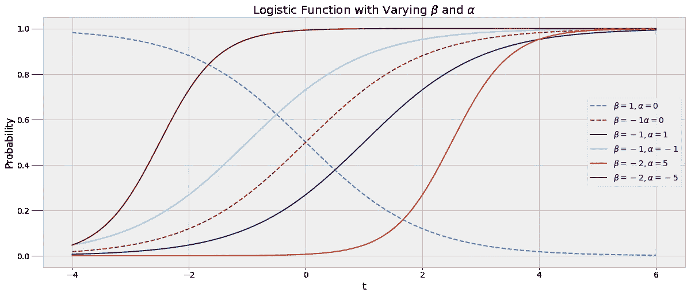
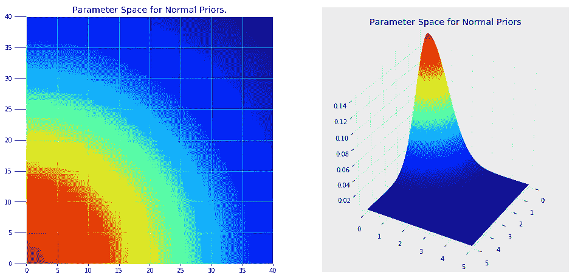
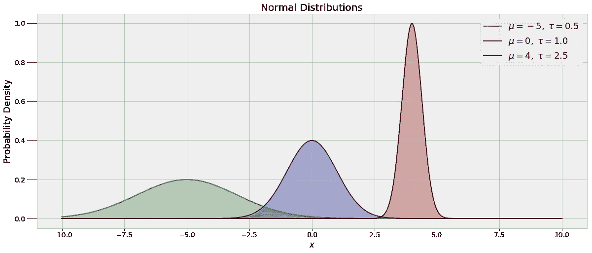
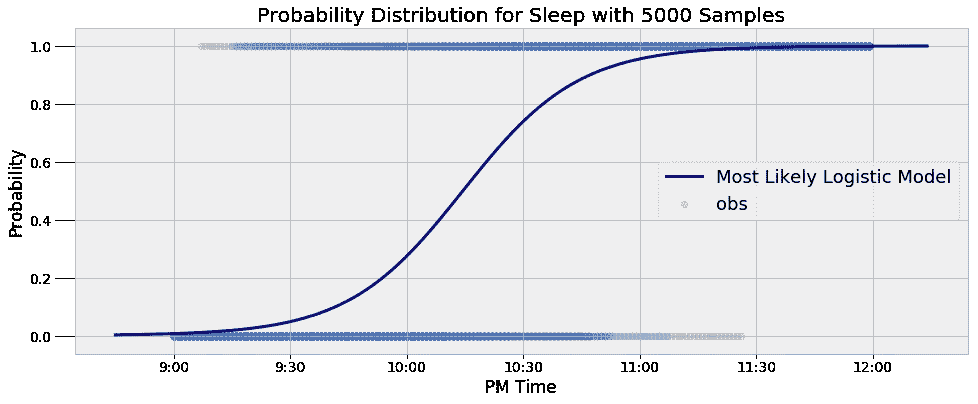
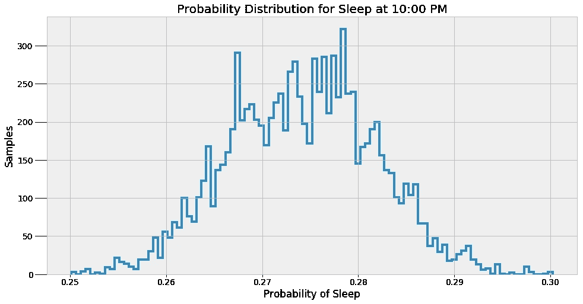
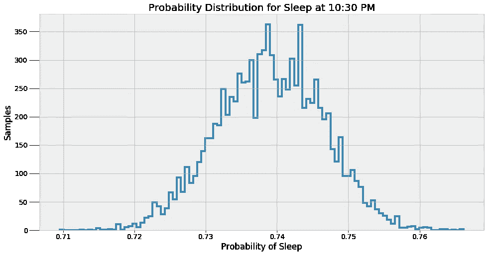
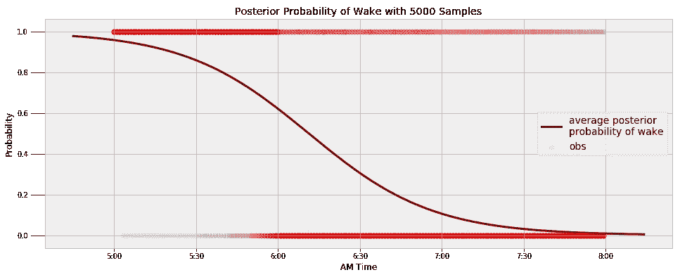
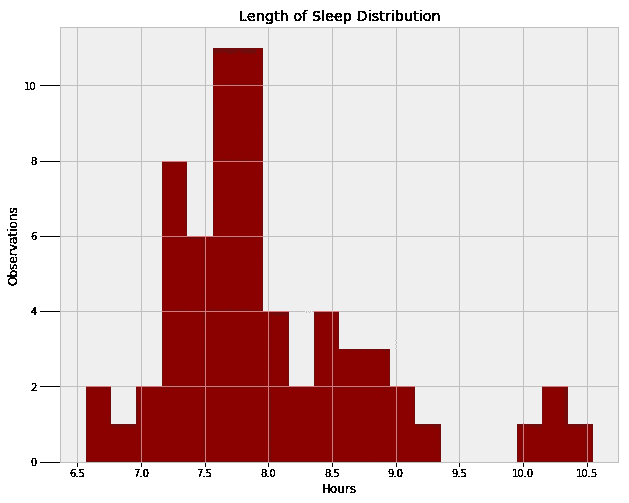

# Python 中的马尔可夫链蒙特卡罗

> 原文：<https://towardsdatascience.com/markov-chain-monte-carlo-in-python-44f7e609be98?source=collection_archive---------0----------------------->


**一个完整的现实世界实现**

在过去的几个月里，我在数据科学世界里反复遇到一个术语:马尔可夫链蒙特卡罗。在我的研究实验室里，在播客里，在文章里，每当我听到这个短语时，我都会点头，认为这听起来很酷，只是模糊地知道任何人在谈论什么。有几次我试图学习 MCMC 和贝叶斯推理，但每次我开始阅读这些书籍时，我很快就放弃了。恼怒之下，我求助于学习任何新技能的最佳方法:将它应用于一个问题。

利用我一直想探索的一些睡眠数据和一本基于实践应用的书(*黑客贝叶斯方法*、[网上免费提供](https://github.com/CamDavidsonPilon/Probabilistic-Programming-and-Bayesian-Methods-for-Hackers))，我终于通过一个现实世界的项目学会了马尔可夫链蒙特卡罗。和往常一样，当我把技术概念应用到问题中时，理解它们比把它们作为纸上的抽象概念阅读要容易得多(也更令人愉快)。这篇文章介绍了用 Python 实现马尔可夫链蒙特卡罗，最终教会了我这个强大的建模和分析工具。

这个项目的全部代码和数据在 GitHub 上。我鼓励任何人看一看并将其用于自己的数据。这篇文章的重点是应用和结果，所以有很多高层次的主题，但我试图为那些想了解更多的人提供链接！

# **简介**

我的 Garmin Vivosmart 手表根据心率和运动跟踪我何时入睡和醒来。它不是 100%准确，但真实世界的数据从来都不是完美的，我们仍然可以通过正确的模型从嘈杂的数据中提取有用的知识！


Typical Sleep Data

这个项目的目标是使用睡眠数据创建一个模型，该模型将睡眠的后验概率指定为时间的函数。由于时间是一个连续变量，指定整个后验分布是困难的，我们转向近似分布的方法，如马尔可夫链蒙特卡罗(MCMC)。

## 选择概率分布

在我们开始使用 MCMC 之前，我们需要确定一个合适的函数来模拟睡眠的后验概率分布。做到这一点的一个简单方法是目视检查数据。我入睡时的观察结果作为时间的函数如下所示。


Sleeping Data

每个数据点表示为一个点，点的强度表示特定时间的观察次数。我的手表只记录我入睡的那一分钟，所以为了扩展数据，我在精确时间的两边的每一分钟都加上了点。如果我的手表显示我在晚上 10:05 睡着了，那么之前的每一分钟都表示为 0(醒着)，之后的每一分钟都得到 1(睡着了)。这将大约 60 个晚上的观察扩展为 11340 个数据点。

我们可以看到，我倾向于在晚上 10:00 后入睡，但我们希望创建一个模型，以概率的形式捕捉从清醒到入睡的过渡。我们可以为我们的模型使用一个简单的阶跃函数，它在一个精确的时间从清醒(0)变为睡眠(1)，但是这并不代表数据中的不确定性。我不是每晚都在同一时间睡觉，我们需要一个函数来模拟一个渐进的过渡过程，以显示可变性。给定数据的最佳选择是在 0 和 1 之间平滑过渡的逻辑函数。以下是睡眠概率随时间变化的逻辑方程


这里，β (beta)和α (alpha)是我们在 MCMC 期间必须学习的模型参数。具有不同参数的逻辑函数如下所示。



逻辑函数符合数据，因为睡着的概率逐渐变化，捕捉到我睡眠模式的可变性。我们希望能够在函数中插入一个时间 t，并得出睡眠的概率，它必须在 0 和 1 之间。我们可以得到一个*概率，而不是对问题“我晚上 10:00 睡着了吗”的直接回答是或否。*为了创建这一模型，我们使用数据，通过一种称为马尔可夫链蒙特卡罗的技术，找到最佳的α和β参数。

# 马尔可夫链蒙特卡罗

[马尔可夫链蒙特卡罗](https://jeremykun.com/2015/04/06/markov-chain-monte-carlo-without-all-the-bullshit/)是指一类从概率分布中进行抽样的方法，以构建*最可能*分布。我们不能直接计算逻辑分布，因此我们为函数的参数(α和β)生成数千个值(称为样本),以创建分布的近似值。MCMC 背后的想法是，随着我们产生更多的样本，我们的近似值越来越接近实际的真实分布。

马尔可夫链蒙特卡罗方法有两个部分。[蒙特卡洛](http://statweb.stanford.edu/~owen/mc/)是指利用重复随机样本获得数值答案的通用技术。蒙特卡洛可以被认为是进行许多实验，每次改变模型中的变量并观察反应。通过选择随机值，我们可以探索参数空间的大部分，变量的可能值的范围。下面显示了使用变量的正态先验的问题的参数空间(稍后将详细介绍)。



显然，我们无法尝试这些图中的每一个点，但通过从高概率区域(红色)随机取样，我们可以为我们的问题创建最可能的模型。

## 马尔可夫链

一个[马尔可夫链](https://brilliant.org/wiki/markov-chains/)是一个下一个状态只依赖于当前状态的过程。(该上下文中的状态指的是给参数赋值)。马尔可夫链是无记忆的，因为只有当前状态是重要的，而不是它是如何到达那个状态的。如果这有点难以理解，考虑一个日常现象，天气。如果我们想预测明天的天气，只需利用今天的天气就可以得到合理的估计。如果今天下雪，我们会查看显示下雪后一天天气分布的历史数据，以估计明天天气的可能性。马尔可夫链的概念是，我们不需要知道一个过程的整个历史来预测下一个输出，这是一种在许多现实世界情况下都适用的近似方法。

将马尔可夫链和蒙特卡罗的思想结合在一起，MCMC 是一种基于当前值重复绘制分布参数的随机值的方法。值的每个样本都是随机的，但是值的选择受到当前状态和假设的参数先验分布的限制。MCMC 可以被认为是逐渐收敛到真实分布的随机游走。

为了得出α和β的随机值，我们需要假设这些值的先验分布。由于我们事先没有关于参数的假设，我们可以使用正态分布。正态或高斯分布由平均值和方差定义，前者显示数据的位置，后者显示分布。具有不同平均值和分布的几种正态分布如下:



我们正在使用的特定 MCMC 算法被称为 [Metropolis Hastings](http://www.mit.edu/~ilkery/papers/MetropolisHastingsSampling.pdf) 。为了将我们观察到的数据与模型联系起来，每次绘制一组随机值时，算法都会根据数据对它们进行评估。如果它们与数据不一致(我在这里做了一点简化)，这些值将被拒绝，模型将保持当前状态。如果随机值与数据一致，则这些值被分配给参数并成为当前状态。这个过程持续特定数量的步骤，模型的精度随着步骤数量的增加而提高。

综上所述，在我们的问题中，马尔可夫链蒙特卡罗的基本过程如下:

1.  为逻辑函数的参数α和β选择一组初始值。
2.  根据当前状态，为 alpha 和 beta 随机分配新值。
3.  检查新的随机值是否与观察值一致。如果没有，则拒绝这些值并返回到以前的状态。如果是，则接受这些值作为新的当前状态。
4.  重复步骤 2 和 3，重复指定的迭代次数。

该算法返回它为 alpha 和 beta 生成的所有值。然后，我们可以使用这些值的平均值作为逻辑函数中α和β最可能的最终值。MCMC 不能返回“真实”值，而是近似的分布。给定数据的睡眠概率的最终模型将是具有α和β平均值的逻辑函数。

# Python 实现

上面的细节在我脑海里过了很多遍，直到我用 Python 应用了它们！亲眼看到结果比阅读别人的描述更有帮助。为了用 Python 实现 MCMC，我们将使用 [PyMC3 贝叶斯推理库。它抽象掉了大部分细节，使我们能够创建模型而不会迷失在理论中。](http://docs.pymc.io/notebooks/getting_started.html)

下面的代码用参数`alpha`和`beta`、概率`p`和观察值`observed`创建完整的模型，`step`变量指的是特定的算法，`sleep_trace`保存模型生成的所有参数值。

(查看笔记本中的完整代码)

为了了解运行这段代码时会发生什么，我们可以查看模型运行期间生成的所有 alpha 和 beta 值。


这些被称为跟踪图。我们可以看到，每个状态都与之前的状态相关，即马尔可夫链，但值会显著振荡，即蒙特卡洛采样。

在 MCMC 中，通常会丢弃高达 90%的轨迹。该算法不会立即收敛到真实分布，并且初始值通常不准确。参数的后期值通常更好，这意味着我们应该使用它们来构建我们的模型。我们使用了 10000 个样本，并丢弃了前 50%，但一个行业应用可能会使用数十万或数百万个样本。

给定足够的步骤，MCMC 收敛到真实值，但是评估收敛性可能是困难的。我不会在这篇文章中讨论这个话题(一种方法是测量轨迹的[自相关](http://www.itl.nist.gov/div898/handbook/eda/section3/eda35c.htm)),但如果我们想要最精确的结果，这是一个重要的考虑因素。PyMC3 内置了评估模型质量的函数，包括轨迹和自相关图。

```
pm.traceplot(sleep_trace, ['alpha', 'beta'])
pm.autocorrplot(sleep_trace, ['alpha', 'beta'])
```


Trace (left) and autocorrelation (right) plots

# **睡眠模式**

最终构建并运行模型后，就该使用结果了。我们将最后 5000 个α和β样本的平均值作为参数的最可能值，这允许我们创建模拟后验睡眠概率的单一曲线:



该模型很好地表示了数据。此外，它还捕捉到了我睡眠模式中固有的可变性。这个模型给了我们一个概率，而不是一个简单的是或否的答案。例如，我们可以查询模型以找出在给定时间我睡着的概率，并找出睡着的概率超过 50%的时间:

```
**9:30  PM probability of being asleep: 4.80%.
10:00 PM probability of being asleep: 27.44%.
10:30 PM probability of being asleep: 73.91%.****The probability of sleep increases to above 50% at 10:14 PM.**
```

虽然我试着在晚上 10:00 上床睡觉，但很明显大多数晚上都不会这样！我们可以看到我睡觉的平均时间是晚上 10:14 左右。

这些值是给定数据的*最可能的*估计值。但是，这些概率存在不确定性，因为模型是近似的。为了表示这种不确定性，我们可以使用所有α和β样本而不是平均值来预测给定时间的睡眠概率，然后绘制结果的直方图。



这些结果更好地说明了 MCMC 模型真正的作用。该方法不会找到单一答案，而是可能值的样本。贝叶斯推理在现实世界中很有用，因为它用概率来表达预测。我们可以说有一个最可能的答案，但更准确的回答是任何预测都有一个取值范围。

## 尾流模型

我可以利用清醒时的数据为我早上醒来时找到一个相似的模型。我试着总是在早上 6:00 起床，但是我们可以看到这并不总是发生！下图显示了从睡眠到清醒的过渡的最终模型以及观察结果。



我们可以查询这个模型，找出我在给定时间睡着的概率，以及我最有可能醒来的时间。

```
**Probability of being awake at 5:30 AM: 14.10%. 
Probability of being awake at 6:00 AM: 37.94%. 
Probability of being awake at 6:30 AM: 69.49%.****The probability of being awake passes 50% at 6:11 AM.**
```

看来我得好好修理一下那个警报器了！

# 睡眠持续时间

我想创建的最后一个模型——出于好奇和实践——是我的睡眠时间。首先，我们需要找到一个函数来模拟数据的分布。提前，我觉得会很正常，但是我们只能通过检查数据来发现！



正态分布可以工作，但是它不能捕捉到右边的外围点(我严重睡过头的时候)。我们可以使用两个独立的正态分布来表示这两种模式，但我将使用一个偏态正态分布。偏斜正态有三个参数:均值、方差和α，即偏斜度。所有这三个都必须从 MCMC 算法中学习。以下代码创建模型并实现 Metropolis Hastings 采样。

现在，我们可以使用三个参数的平均值来构建最可能的分布。下面是数据顶部的最终偏态正态分布。


看起来很合身！我们可以查询该模型，以找到我至少获得一定量睡眠的可能性以及最可能的睡眠持续时间:

```
**Probability of at least 6.5 hours of sleep = 99.16%.
Probability of at least 8.0 hours of sleep = 44.53%.
Probability of at least 9.0 hours of sleep = 10.94%.****The most likely duration of sleep is 7.67 hours.**
```

我对那些结果并不完全满意，但是作为一名研究生你能期待什么呢？

# 结论

完成这个项目再一次向我展示了解决问题的[重要性，最好是有现实应用的问题](/how-to-master-new-skills-656d42d0e09c)！在使用马尔可夫链蒙特卡罗构建贝叶斯推理的端到端实现的过程中，我学到了许多基础知识，并在这个过程中乐在其中。我不仅了解了一点我的习惯(以及我需要改进的地方)，现在我终于可以理解大家说的 MCMC 和贝叶斯推断是什么了。数据科学就是不断地向您的技能库中添加工具，而最有效的方法就是找到问题并开始行动！

一如既往，我欢迎反馈和建设性的批评。可以通过推特 [@koehrsen_will](https://twitter.com/koehrsen_will) 联系到我。