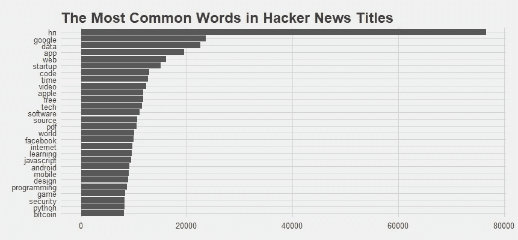
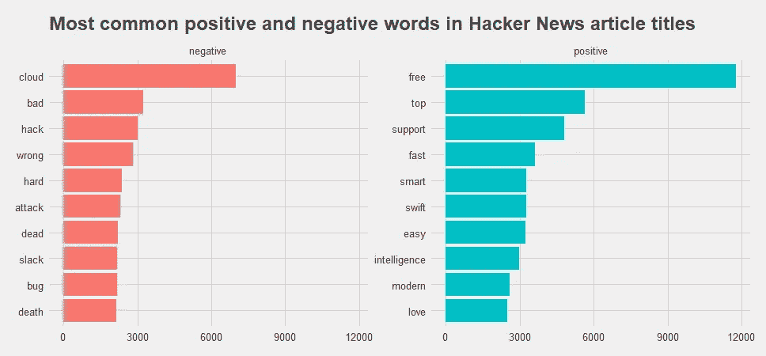
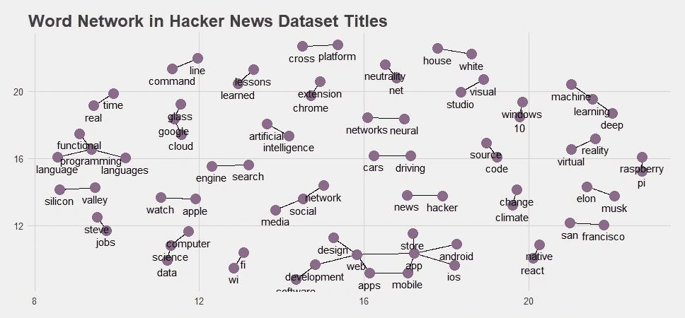

# 掌握文本分析技巧并取得成功

> 原文：<https://towardsdatascience.com/master-the-skill-of-text-analytics-and-be-successful-87ad4a7dfcb0?source=collection_archive---------4----------------------->

# 介绍

如果您像我们一样在分析或数据科学领域工作，您会熟悉这样一个事实，即数据以令人难以置信的速度到达，数据科学家和分析师接受过处理最具数值性和分类性的表格数据的培训。但是今天，大部分可用的业务数据是非结构化的，并且是大量文本，例如书籍、文章、网站文本、博客帖子、社交媒体帖子等。公司高管制定重要的业务规则，主要是基于潜在客户、客户和合作伙伴提供的自由格式文本字段中的关键字和短语的使用，以及它们的使用频率和彼此之间的接近度。这是我们的梦想和噩梦:可能有太多的数据要处理。

这就是为什么我们写了这篇关于文本分析的文章，来帮助你跟上将文本转化为数字的速度，并实现一些常见的文本挖掘技术。最终，我们希望您能够将强大的算法应用到您组织的大型文档文本数据库中。

Hacker News 是我们最喜欢的网站之一，用来了解技术和创业新闻，但是浏览这个简约的网站有时会很乏味。因此，我在这篇文章中的计划是尽可能以非技术性的方式向您介绍如何分析这个社交新闻网站，并展示一些初步结果，以及一些关于我们下一步将如何发展的想法。

我下载的黑客新闻数据集包含了从 2013 年 9 月到 2017 年 6 月的一百万篇黑客新闻文章标题。

首先，让我们看看黑客新闻标题中最常见的词的可视化。

# 一些初步的简单探索

Figure 1

图 1 显示了 2013 年 9 月至 2017 年 6 月黑客新闻标题上出现频率最高的词。

在很大程度上，我们认为这是黑客新闻标题中一个相当标准的常用词列表。最上面的词是“hn”，因为“问 hn”、“秀 hn”是社交新闻网站结构的一部分。“google”、“data”、“app”、“web”、“startup”等等出现频率第二高的词，对于一个像黑客新闻这样的社交新闻网站来说，都在我们的预期之内。

如何将这种方法应用到您的业务中？如果您正在对客户故障单进行故障诊断，而不必通读成千上万的故障单，您希望能够搜索故障单特定字段中有计数的常用单词或短语。

# 简单的情感分析

让我们来谈谈情感分析这个话题。情感分析根据积极或消极来检测文本主体的情感。当使用时，特别是在大规模使用时，它可以向你展示人们对你重要的话题的感受——特别是你的品牌和产品。

我们可以分析对每种情绪有贡献的字数。从黑客新闻文章中，我们发现每个单词对每个情绪有多大的贡献。

Figure 2

马上，我们在这里发现了一些问题，“cloud”和“slack”被我使用的词典归类为否定词。实际上，“云”是“云计算”的意思，“slack”是黑客新闻上下文中的软件公司。因此，我们的领域知识开始发挥作用，并有助于在这种情况下做出最终判断。

Word cloud 是识别趋势和模式的好主意，否则这些趋势和模式在表格格式中是不清楚或难以看到的。我们还可以比较词云中最常见的正面词和负面词。

Figure 3

如何将这种方法应用到您的业务中？客户支持工作的核心是客户的幸福。自然，你希望他们喜欢你的产品或服务。无论您是在分析反馈表格、聊天记录、电子邮件还是社交媒体，情绪分析都将帮助您听到客户的真实声音，以及他们对您的产品或服务的感受。

# 词语之间的关系

我们经常想了解文档中单词之间的关系。文本中有哪些常见的单词序列？给定一个单词序列，接下来最有可能是哪个单词？哪些词之间的关系最强？因此，许多有趣的文本分析都是基于这些关系。当我们检查两个连续单词对时，它通常被称为“二元模型”。

Figure 4

从图 4 中我们可以看到，黑客新闻数据中最常见的 bigram 的赢家去了“机器学习”，第二名是“硅谷”。

如何申请到你的企业？分析文本数据的挑战在于理解单词的意思。如果与“水”和“学习”相对，那么“深”就有不同的含义。因此，文本数据中单词计数的简单汇总可能会令人困惑，除非在没有假设独立的单词选择过程的情况下，分析将它与同样出现的其他单词相关联。

# 词汇网络

单词网络分析是一种对文本中单词之间的关系进行编码并构建链接单词网络的方法。这种技术基于这样一种假设，即语言和知识可以被建模为单词的网络以及它们之间的关系。

Figure 5

对于黑客新闻数据，如图 5 所示，我们可以可视化文本结构的一些细节。例如，我们可以看到组成常见短语的成对或三元组(“社交媒体网络”或“神经网络”)。

如何将这种方法应用到您的业务中？这种类型的网络分析主要是向我们展示文本中的重要名词，以及它们之间的关系。由此产生的图表可以用来获得文本的快速视觉摘要，阅读最相关的摘录。

我们认为文本分析是从客户关系管理中诞生的工具和方法。deepPiXEL 已经在将文本分析应用于组织的服务请求内容方面做了一些有益的研究。我们了解到文本分析是一个旅程，我们看到越来越多的组织转向文本分析，以便更长久地留住更多的客户。没有结构化调查数据能更好地预测客户行为以及客户文本评论和消息的实际声音！

我们希望这篇短文对您有所帮助。一旦组织有能力从文本分析中自动获得见解，他们就可以将见解转化为行动。

你在文本分析方面最著名的技巧是什么？请在下面的评论中与我们分享。