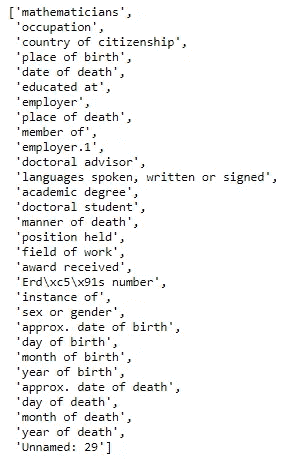
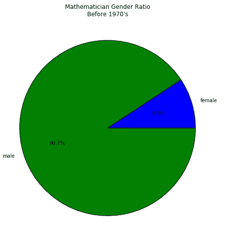
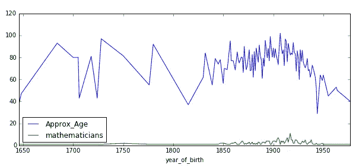
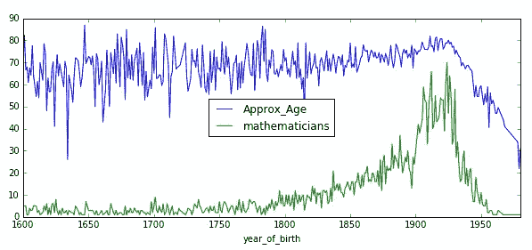
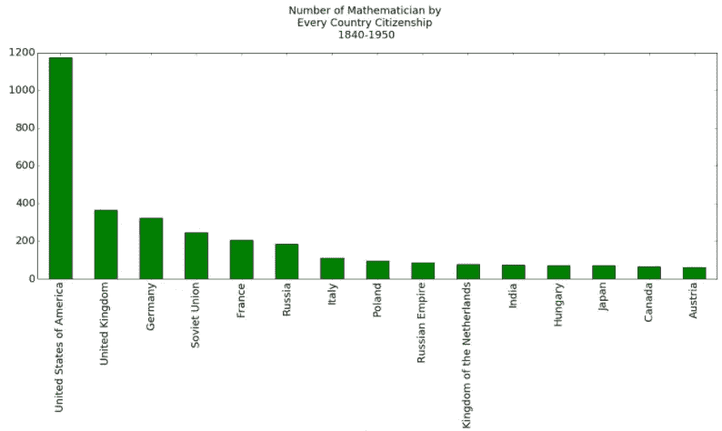
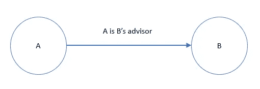
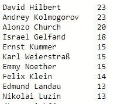
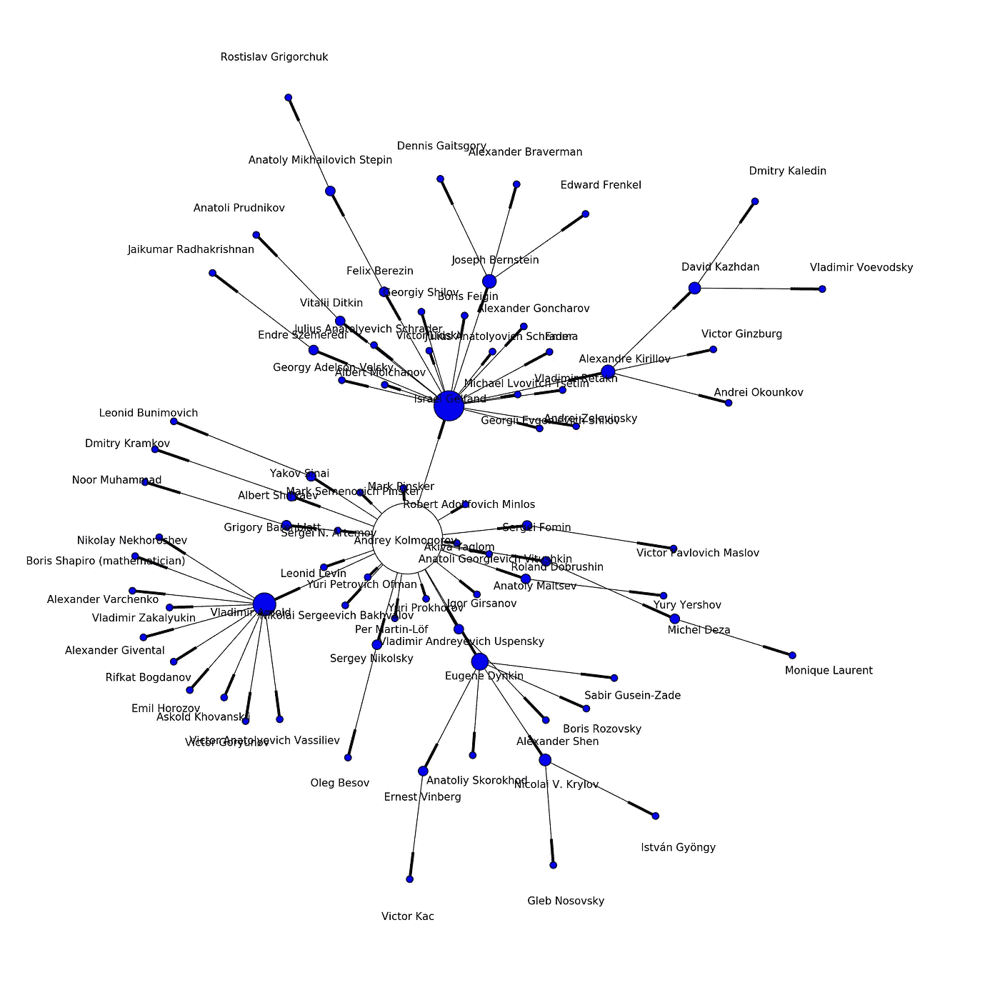
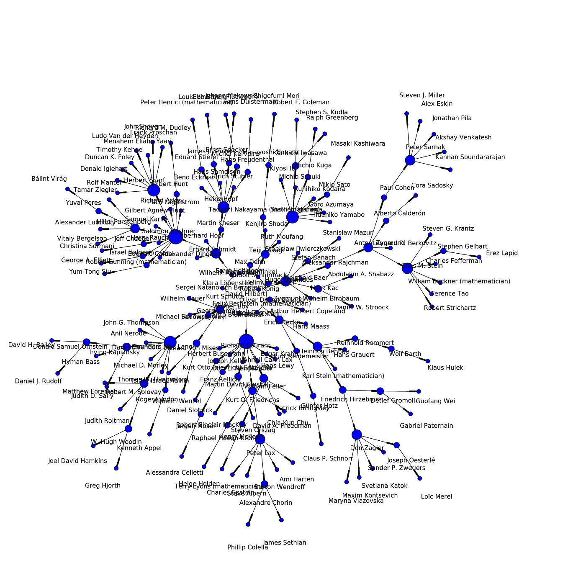

# 数学家，用数字记录历史

> 原文：<https://towardsdatascience.com/mathematician-the-history-by-numbers-bf17f95a7b0b?source=collection_archive---------7----------------------->

2017 年 9 月中旬，我所在社区的一位成员( [datascience.or.id](http://datascience.or.id) )分享了一个有趣的数据表。它包含了 8000 多名出生或生活在 1980 年之前的数学家的信息，包括性别、国籍、领域等等。这是数据表的完整列，

Table Columns

我们只有有限的栏目，包含 8595 名数学家的出生日期、死亡日期、学位、雇主、博士生导师或学生等信息。让我们看看，我们如何从这个表中进行数据分析，我们可以从中获得什么样的历史。

**目标和假设**

数据只是以特定方式格式化的一组信息。如果不提出正确的问题并进行分析，这些数据不可能给出我们正在寻找的有价值的见解。假设和熟悉如何收集数据对于限制期望值、获得无偏见的见解以及从目标中得出有意义的答案或故事也很重要。

Define the objective

数据分析的目的或目标在许多情况下是不同的，它可以在获得数据后创建(有时使用另一个支持的附加数据)或收集与目标对应的数据。在数学家数据案例中，我们确实有数据，并试图从数据中获得洞察力，目标如下:

*   一段时间内的性别构成
*   数学家的期望年龄
*   拥有最多数学家的国家公民
*   数学家最多的数学领域
*   博士生导师学生[社交网络](https://www.merriam-webster.com/dictionary/social%20network)

这个目标是通过检查列生成的，您可以使用[整体](https://hbr.org/2014/04/are-you-a-holistic-or-a-specific-thinker)方法来获得不同的目标。同样，对于“数学家”的分析，假设是:

1.  数据获得得很好
2.  95%的出生于 20 世纪 80 年代之前的有影响力的数学家都被记录在案(基于检查我的著名数学家名单的名字)
3.  其他假设根据每个目标进行调整
4.  (读者理解数学-统计-数据-工程术语)

## **清理数据**

有人说过，80%的数据分析工作都是清理，包括检查数据、指标定义、数据类型检查、匹配数据、缺失值、数据验证、过滤、切片、分组，甚至旋转。清理的难度取决于数据表甚至数据集的“脏”程度。

我不会在这里解释我所做的所有清洁过程，但有几点需要注意。(你可以在这里找到完整的分析

*a .唯一性* 调查数据的唯一性对于确定表的主键或理解数据是如何读取的很重要。在我们的数据中，我假设“数学家”列是主键。我用 python 来看独特性，我得到了这个

Uniqueness Checking

有两个相同的名字，经过我的调查，他们是父子关系。虽然，在写“Jr”的“职业”上可以看出来。知道这一点后(他们是不同的人)，我改变数据如下。

Preprocessing Result

然而，我不是只改变一行，因为我发现事实上有很多行的“职业”都填有“小”(见下一个解释)

*b . Value Every columns validation* 每列必须为每行提供相同类型的信息，可以是日期、数字、字符串或布尔值。对于我们的情况，就像我上面说的，我发现了这个

Not True Columns

正如您所看到的，表值正在移动，这就是为什么有一个名为“未命名:_29”的列。桌子正在移动，大约像这样，

Shifting Table Column

你必须分割数据，然后移动列名，而不是移动行，然后再连接。这里可以看到详情[。](https://github.com/alamhanz/history_mathematician)

## 结果

数据分析是为了回答我们制定的目标，并创建另一个目标以获得更深入的见解。

*   *一段时间内的性别构成*

为了得到这个，表格应该按照“性别”列分组，并计算“数学家”的数量。

Gender Grouping

正因为如此，只有当单词包含在实体上时，我们才应该将' sex_or_gender '上的实体改为*男*或*女*。如果实体不是字符串，我们将其更改为 *not_clear_2* (并根据数学家的名字将“*[‘h*”更改为 *male，*)。

Gender Grouping After Editing

上面的结果给了我们这样的答案:在 20 世纪 70 年代以前，女数学家只占所有男数学家的 1/10。这可能是由许多因素造成的，尤其是女性在那些年所扮演的角色。你可以越来越深入地了解真正的原因，比如开始创建一个时间表，看看性别加班之间的比例，等等。我不会那样做，因为我们需要更多的数据和信息。无论如何，这只是一个触发的“问题和答案”来开始更广泛地关注问题。

Mathematician Gender Ratio

*   *数学家的期望年龄*

另一个让我感兴趣的方面是数学家的年龄预期，因为表中有关于出生和死亡年份的信息。很容易得到这些数学家的年龄，但是表格上的一些“年份”是用字符串写的，比如“1980 年代”。在我清理数据后，我开始查看年龄，并决定过滤年龄超过 20 岁且出生于公元 500 年以上的数学家的数据。这个过滤器将表切割成 4663 个数学家。

Mathematician Age Ditribution

上面的年龄分布给出了数学家的预期年龄在 70-80 岁之间的信息。它的年龄为 72.42 岁，精确的方差根为 14.86 年(你可以做 [T-test](http://www.statisticshowto.com/probability-and-statistics/t-test/) 来获得置信度，但是对于如此大量的样本，我认为没有必要)。

从那以后，我对男女之间不同的年龄期望感到好奇。由于女数学家的局限性，我将再次过滤数据以进行比较。从表中可以得出结论，女数学家从 19 世纪 50 年代开始被认为是有影响的数学家。

Number of Female Mathematicians over year of birth and age expectation who born that year

这一数字不同于自 17 世纪以来做出贡献并得到认可的男性数学家，也不同于 1900 年至 1950 年间达到顶峰的数学家人数(无论是女性还是男性)。这一现象可能会让我们做出一个假设，即数学是 1900-1950 年世界上最热门或最性感的话题。可以进一步研究或者问历史学家。

Number of Male Mathematicians over year of birth and age expectation who born that year

在我过滤了 1850 年至 1940 年间出生的数学家的数据后，我计算了性别间的平均值和方差。

1850 to 1940 Mathematician Age Calculation

通过 T 检验，我得到男女数学家年龄差异的置信区间为 2.42 岁到 6.14 岁，置信水平为 95%。女数学家似乎比男数学家年龄大，最少有 2.5 年的空闲时间。预计这一条件将适用于 1940 年以后出生的下一位数学家。

*   *国籍和数学领域拥有最多数学家的国家*

想象一下，你在一个大行业，你的大老板想知道什么是最有价值的产品或最赚钱的地区，这个部分就像那些问题一样。它很容易生产。

Mathematician Citizenship

此外，你不需要花太多时间来获取数据和创建可视化(尤其是如果你在技术行业)。可以用 python 或者 tableau 做可视化。在我们的例子中，结果会像我上面和下面呈现的那样。

Mathematician Field

可视化使理解数据和回答问题变得更加容易。然而，如果你只是像那样给出可视化会不会很无聊？。有些老板可能会问“从这里我们能看出什么？”尽管对他来说要求很明确。

例如，在我们的例子中，由于上面的可视化，我们目标的答案很容易。美国拥有大多数出生于 1840-1950 年间的数学家，这些数学家大多专注于数学分析。然而，我们可以扩大我们的分析的答案，使更有趣的故事，如果我们告诉“假设”的原因，为什么我们和数学分析将是最。还要解释其他国家或领域之间的显著差异。

*   *博士-导师-学生社交网络*

在桌子上，有一个专栏是关于这位数学家和另一位博士导师学生之间的关系。因此，我们可以创建具有直接边缘的社会网络作为指导者和学生之间的连接。

Edge Meaning on The Network

在我们创建了网络之后，我们选择一个数学家或者具有最大出度数的节点，这意味着该数学家已经建议了许多数学家。此外，我们假设以他为根的 bfs 树将给出网络上最大的树。

Top 10 of Outdegree Number

从计算来看，安德雷·柯尔莫哥洛夫和戴维·希尔伯特谁的[领先度最大](http://kias.dyndns.org/comath/33.html)。这个拾取应该已经完成了，因为我想从这个复杂的网络中呈现足够清晰的可视化。它几乎有 3314 个节点(我过滤了表格，只选择了有导师或学生的数学家)和 2838 个连接，这意味着它不是一个连通图。因为复杂性，我想通过网络上最大的 bfs 树来可视化。(可视化中的节点大小取决于其输出度数)

Andrey Kolmogorov bfs-tree

这是一棵相当大的树。同时，这是一棵希尔伯特树。

David Hilbert bfs-tree

从上面的图表中可以构建出许多其他的故事。然而，这里不做解释。
PS:用有限的技巧创造敏锐的网络并不容易。

## 结论

对于我们的数据，可以很容易地说，数学家有很大的性别差异范基础。假设最低工作年龄为 15 年，那么 1855 年和 1965 年是这一伟大课题最多产的时期。此外，他们中的大多数人拥有美国和欧洲国籍(显然，由于他们对科学的支持)，数学分析是主要领域，其次是数论和几何。最后，在这些数学家之间，直到 20 世纪 80 年代末，戴维·希尔伯特和安德雷·柯尔莫哥洛夫是他们那个时代勤奋地给许多数学家出谋划策的人。

这并不难，对吗？不对。

数据分析是一种通过数据获取信息的方法，在我们的例子中，数据是在一张表上形成的。它从目标、假设开始，然后创建假设或直接深入数据。错误的目标和松散的假设会让你得到有偏见的结果，在做这件事的时候要小心谨慎。有许多技术可以用来操作数据或表格以达到目标。我已经在上面演示过了，从简单的社交网络表示的比例问题开始。为了提高你对这个问题的直觉，你必须对多种形式的数据进行大量的练习。它很有用，但需要努力。