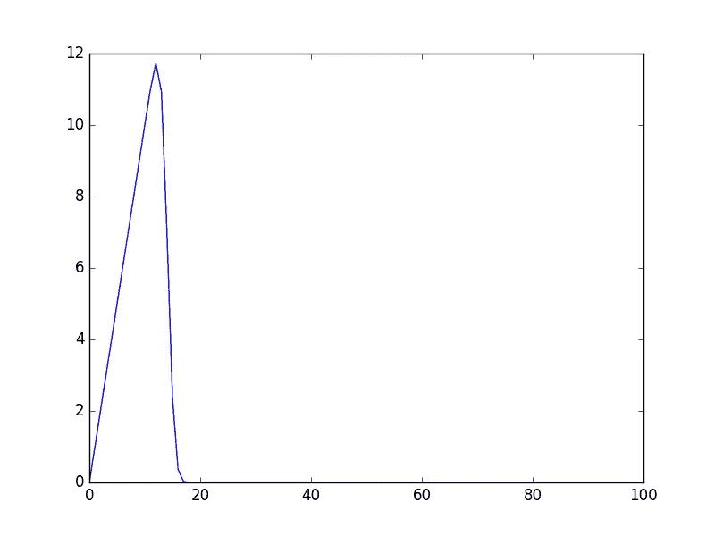
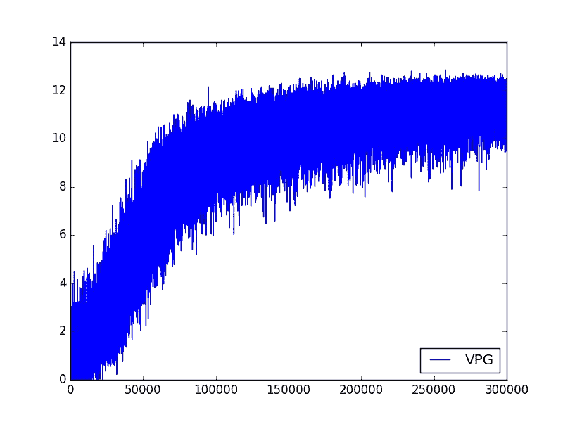
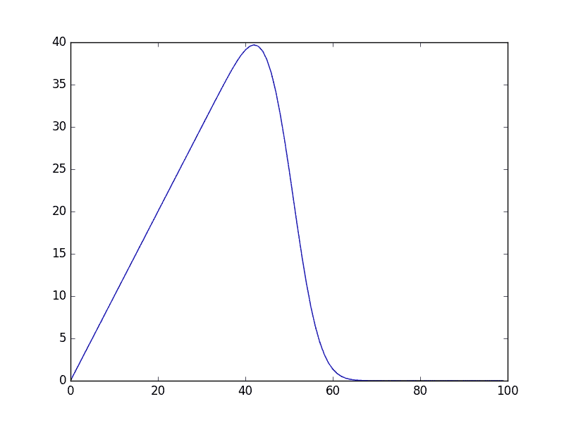

# 使用强化学习优化多交易场景中的广告收益

> 原文：<https://towardsdatascience.com/maximize-ads-yield-in-a-multi-exchange-scenario-using-reinforcement-learning-46fa62a0b86?source=collection_archive---------5----------------------->

正如我之前的帖子所暗示的，这篇帖子是关于工作中可以使用 RL 的一些东西。设置如下:

假设你开发了某种网站或者 app。幸运的是，你已经吸引了一个坚实的用户群，现在费用变得足够高，你需要使用广告来赚钱的产品。你会发现有很多广告交易所，谷歌、脸书、Appnexus 等等。，你可以连接到。你如何最大化你的收益？一种方法是使用中介，目前大多数中介都是静态的。中介经常从各种网络中抓取数据来安排订单。另一种方法是使用标题竞价，这种方法不适用于应用程序。最后，我们可以使用服务器端的交叉交换竞价，这需要一个特殊的平台，如 DFP(交换竞价)。我在这里尝试的方法只是使用强化学习来预测您应该向哪个广告交易所发送广告请求。而且稍微有趣一点，应该用什么底价。

因为大多数广告交易不会提供每次请求的获胜价格；这意味着我们不能轻易获得奖励信号。虽然我们可以用每日收入作为信号，但我认为这太稀疏了，因为任何像样的出版商每天都会有数百万的广告请求。我们要使用的解决方法是:设置一组 adunitss，比如说 100 个，每个 adunit 都有一个单独的底价，比如说 1-100。如果一个特定广告单元的广告请求被满足，我们认为报酬是“底价+0.5”(0.5 只是一个使报酬不为 0 的小把戏；实际上，CPM 通常略高于底价)。这显然没有为我们建立完美的环境，但我认为这是一个合理的近似值(记住:DQN 也有过冲)。原因如下:

我用正态分布来模拟中标价格。这里是当分布为 norm(14，1)时的预期收益率分布。最大预期收益率 11.72 美元是在 12 美元的底价下，这意味着如果我们只连接到这一个交易所，我们应该始终使用将底价设置为 12 美元的 adunit。

现在，如果我使用 TensorForce 的 VPG 在相同的设置上运行 RL，我会得到以下结果:

如您所见，它非常接近 11，12 范围(尽管我们必须减去 0.5，因为它是一个人工项)。行动围绕着 12 美元的底价展开。

增加更多的交流让学习变得更难，但没什么好怕的。下面是我们有 5 个交换[[18，5]，[4，5]，[18，2]，[50，5]，[6，0]]的场景。每个子列表的第一个数字是正态分布的平均值，第二个是方差。

最后的行动不仅选择最有希望的广告交换，而且选择以 41，42 为中心的底价。假设我们实际上知道模型动态，它几乎与下面的分析结果完全一致。

在这个设置中，我做了一些重要的假设:

1.  (最大的一个)分布是平稳的。虽然我认为具体的分布并不重要(RL 所做的只是最大化平均值，根据 DeepMind 的最新论文，这可能不是最好的方法)，但环境绝对必须是静止的。我不相信主流 RL 研究已经破解了非平稳 RL，尽管我知道一些公司如阿里巴巴使用在线 RL 来解决这个问题。一个简单但不完美的解决方法是每天晚上训练模型，这提供了一个相对最新的模型。在这方面，为了节省计算，[切尔西·芬恩关于元学习的工作](http://bair.berkeley.edu/blog/2017/07/18/learning-to-learn/)可能会派上用场，这显然是前沿研究(更新:OpenAI 的[新论文](https://arxiv.org/abs/1710.03641)试图解决非平稳性问题)。
2.  在实际应用中，对应用程序来说更难，因为客户端应用程序保存数据，不像 web 服务器。通常我们能做的是将数据上传到服务器进行训练，并将学习到的模型发送回客户端执行。这很复杂，但肯定是可行的(因为每个设备上的广告数据不应该那么大)。但是我相信谷歌的联合学习更有前途。
3.  我已经将环境大大简化为本质上的强盗问题。现实世界肯定有某种连锁效应，例如，用 adunit Y 选择 exchange X 会影响后面选择的性能(想想在 Go 中你的第一步如何影响后面的游戏)。我不知道目前如何最好地模拟这种环境(奖励函数有点难以指定——这是 RL 中的一个大挑战，也是为什么我们需要反向 RL；我可能会在未来更多地探讨这一点)，但我认为任何中型/大型出版商都应该有大量的数据作为环境。因此，研究真实数据将是一个更好的方法。顺便说一句，腾讯有人一直在这个问题上挑战我——他认为连锁效应不存在。我可以举的一个例子是:假设有 2 个鞋类广告，一个来自耐克，另一个来自非品牌，首先显示耐克的广告肯定会影响非品牌的点击率。
4.  此外，我还忽略了“直销”广告。这是故意的。预订购买通常具有更高的优先级，甚至可以在进入这种情况之前处理。

总之，我构建了一个利用 RL 的广告收益最大化的简化模拟(总的来说，我对数据效率不太满意)。我听说一些公司正在做类似的事情，但这肯定不是一种广泛采用的做法。我希望这是一个开始。

这里的代码是。其实超级简单。