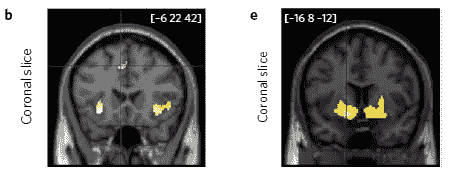

# 也许杯子终究是半满的…

> 原文：<https://towardsdatascience.com/maybe-the-glass-is-half-full-after-all-fed6508e985f?source=collection_archive---------5----------------------->

## 科学家发现，大脑天生就会关注好消息，忽略坏消息。

## 我们天生乐观吗？

当你思考你的未来时，你相信会发生什么？总的来说，你认为事情会怎样发展？自古以来，青少年杂志、小报和网上性格测试就充斥着测试你是“半杯水”还是“半杯水”的测试。虽然这可能是一个有趣的话题，但乍一看，它似乎不是科学研究中最自然的领域。

然而，无数的研究已经开始研究这个问题:我们天生倾向于乐观还是悲观？30 多年的研究结果如此压倒性地支持一方的论点，以至于出现了被称为“*不切实际的乐观主义”的现象。一次又一次，在各种背景下，人们高估了发生在自己身上的积极事件的可能性，同时低估了消极事件的可能性。重度吸烟者低估了他们早死的几率；女性低估了她们患乳腺癌的风险；普通人认为他们比其他人更有可能变得富有。*

*然而，到目前为止，这一领域的研究在很大程度上涉及到对其中一个结果的某种程度的先验吸引力——即，对我来说，患癌症的可能性越低，结果就越好。这造成了一个复杂的混淆，不清楚是潜在的强化学习偏向于好消息，还是复杂的信念形成和更新过程倾向于那些乐观的个人结果。巴黎认知神经科学实验室最近的一项研究试图解开这个困惑。*

## *最新研究*

*由 Germain Lefebvre 领导的研究小组探索了这一主题，要求参与者在成对的中性选项中进行选择。以这种方式，在选择之间不可能存在现有的推断的合意性的差异。50 名参与者被展示成对的抽象视觉符号，并被要求选择一个。某些符号与正的、零的或负的金钱回报的高或低的概率相关联，在每个选择后都有反馈。在 24 次试验中，由参与者从经验中学习，哪个符号对应于哪个结果。抽象符号看起来像这样:*

**

*Abstract cues were used in the study to avoid participants having any affective association with them before choosing.*

*参与者被要求按下一个按钮，在左边和右边的符号之间做出选择。一旦做出选择，立即给出反馈，告诉他们是收到了€0.50，没有收到€0.50 还是失去了€0.50。*

*行为实验中所做选择产生的数据符合两种不同的强化学习(RL)模型。第一个是标准的 RL 模型，它平等地考虑了所有的结果，不管它们是积极的还是消极的。这被称为 Rescorla-Wagner 模型(RW ),可追溯到 20 世纪 70 年代早期。简单地说，该模型计算*预测误差—* ,即预期结果与实际结果之间的差异。然后，这个预测误差的某一部分被用于更新下一组期望。用于后续更新的预测误差部分被称为“学习率”，用希腊字母 alpha (α)表示。学习率的界限如下，0 > α > 1，α值越高，表示从以前的经验中学习得越多。第二个模型也被用来拟合数据。这一个，RW 模型，允许正面结果(α+)和负面结果(α-)有不同的α值。该实验旨在观察哪种模型更准确地拟合数据；标准 RW 模型或 RW 模型。*

## *一些有趣的结果*

*通过统计分析，Lefebvre 和他的同事发现 RW 模型比 RW 模型更好地解释了数据。假设积极和消极结果的学习率不同，可以改进我们如何从抽象符号中选择的预测。他们发现，积极结果α+的不同学习率明显高于消极结果α-的学习率。在最基本的层面上，我们从产生比预期更好结果的环境中获取的信息比从产生比预期更差结果的环境中获取的信息更多。在 50 名参与者中，发现 21 名具有对称的学习率(α+ = α-)，即他们是无偏见的学习者；另外 29 个被发现有不对称的学习率，其中 25 个是“乐观”的学习者(α+ > α-)，4 个是“悲观”的学习者(α+ < α-)。*

## *但是等等，还有更多…*

*尽管这项行为实验的发现很有用，但作者的研究还有一个更有趣的转折。参与者在这些抽象符号之间做出的所有 24 个决定都是在他们躺在核磁共振成像仪里的时候做出的！通过这种方式，研究人员可以看到在做出每个选择和接收反馈时，大脑的哪些确切部分是活跃的。通过将行为数据与 fMRI 时间编码扫描配对，有可能区分出那些乐观的参与者和那些学习速度无偏见的参与者中显示活动增加的精确大脑位置。他们发现，对于乐观的学习者来说，在给予反馈时，纹状体和腹内侧前额叶皮层(vmPFC)的活动明显更多(在神经科学中，这被称为“奖励预测误差编码”)。*

**

*Areas of the brain that are activated during choice (left) and outcome (right) for optimistic reinforcement learning, α+.*

## *那么这一切到底意味着什么呢？*

*这项研究认为，在基本层面上，我们的大脑倾向于偏爱好消息而不是坏消息。但是这是怎么发生的呢？大量研究表明，在日常生活中，乐观主义者往往生活得更好；拥有更健康的心脏，更少压力，拥有更广泛的朋友圈。也许目前的这项研究显示了一种先天的生理偏见，表明乐观，即使不切实际，似乎也赋予了一种进化优势。*

*所以，下一次，当你发现自己在对需要多长时间的评估过于乐观后，匆忙地完成某件事情，或者在没有带伞后，把自己抖干，记住，这是你大脑的方式，保持乐观实际上符合你的最佳利益，即使这可能在当时提供不了多少安慰。*

## *参考文章:*

*Lefebvre，g .，Lebreton，m .，Meyniel，f .，Bourgeois-Gironde，s .，和 Palminteri，S. (2017 年)。乐观强化学习的行为和神经特征。*自然人类行为，1，67，*1–9。*