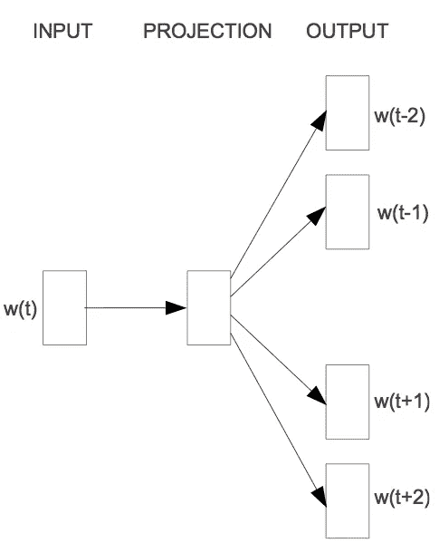

# 使用预先训练的 word2vec 进行模因搜索

> 原文：<https://towardsdatascience.com/meme-search-using-pretrained-word2vec-9f8df0a1ade3?source=collection_archive---------5----------------------->

## 沙巴发展故事#02


模因抵得上千言万语。它们是一种文化。我和我的朋友过去常常用 Giphy 在 Messenger 上发送很多这样的消息。事情是这样的，我们有自己的模因，我们懒得上传到某个地方。与此同时，当你开始在一个文件夹中有很多迷因时，就很难记住它们的文件名了。


Little UI for the search system.

让我们尝试快速构建一个小工具，帮助我们了解哪些模因更有可能对应一个输入的句子。我们会有一个配对列表。每一对都是一个图像 URL(而不是本地路径，对您来说更容易测试)和与之相关的描述。

```
url_descr = [
    ('[https://tny.im/a13](http://tny.im/a13)['](https://giphy.com/embed/26uTr7qPYM4OHAwBW'), 'we don\'t care'),   
    ('[https://tny.im/a0-](http://tny.im/a0-)['](https://giphy.com/embed/3o6Zt6D0wctP0kpuwg'), 'i love you'),
    ('[https://tny.im/a12](http://tny.im/a12)['](https://giphy.com/embed/aJlKIh8Kh0NLa'), 'relax take it easy'),
    ('[https://tny.im/a16](http://tny.im/a16)['](https://giphy.com/embed/ohyNdetcfoJ9K'), 'that is embarrassing'),
    ('[https://tny.im/a10](http://tny.im/a10)['](https://giphy.com/embed/lwrxYI7f2tNFS'), 'screw you guys')
]
```

我不会在这里详细解释单词嵌入；已经有关于这个主题的好文章[1，2],没有必要重新发明轮子。但是，我将给出一个高层次的概述，以便每个人都可以遵循。

## 单词嵌入和 word2vec

单词是离散的符号，表示它们的一种简单方法是一键向量。假设我们有一个大小为 4 的词汇表，每个单词由 4 个元素组成的列表来表示，在当前单词的索引处，除了 1 之外，所有元素都是 0。

```
vocabulary = ['hello', 'sun', 'desert', 'hi']
hello = [1 0 0 0]
sun = [0 1 0 0]
desert = [0 0 1 0]
hi = [0 0 0 1]
```

如你所见，这种表示法并不是最好的，因为如果词汇表包含成千上万的单词，那么列表将呈线性增长。但另一件重要的事情是，这种表征没有给我们任何关于单词含义的线索，甚至没有给我们任何单词之间如何联系的线索。在我们的词汇中,“hello”和“hi”有相同的意思，但是我们看不到这种与一个热点向量的关系。这里来了一个名为 [*word2vec*](https://en.wikipedia.org/wiki/Word2vec) 的文字嵌入算法。

这个想法是将我们的热点向量映射到密集(更密集)的向量，这样我们就可以解决大小问题；理想情况下，我们希望具有相似/相关含义的单词具有彼此接近的向量，就好像向量空间已经编码了单词的语义/上下文表示。



Skip-gram word2vec, a neural network trained to predict a window of words given the focus word as input. The word embedding matrix is the resulting weight matrix after training.

我们要训练一个 word2vec 模型吗？那鸿我们说我们想快速构建这个工具，为此我们将使用预训练的 word2vec 向量，即使我们想训练我们自己的模型，我们也不能，因为我们没有足够的数据来做这件事。

现在，让我们开始编码，我们将从[这个 google drive](https://drive.google.com/file/d/0B7XkCwpI5KDYNlNUTTlSS21pQmM/edit) 下载在 Google News 上训练过的预训练 w2v，然后是`pip install gensim`。Gensim 是一个很棒的库，允许以一种高级的方式处理 NLP。加载预训练的 word2vec 只需要一行代码。

```
import gensim
model = gensim.models.KeyedVectors.load_word2vec_format(W2V_PATH, binary=True)
```

现在模型加载完毕，我们可以看看单词是如何表示的:

```
>>> model.wv['hello'].shape
(300,)
>>> model.wv['hello']
array([-0.05419922, 0.01708984, ..., -0.25], dtype=float32)
```

向量的大小为 300，而谷歌新闻的词汇量约为 300 万字！我们说过，word2vec 的一个特点是，出现在相同上下文中的单词在距离方面倾向于具有彼此接近的向量，因为从语义上来说，它们可能是接近的。

```
>>> model.similar_by_word('hello', topn=5)
[('hi', 0.6548984050750732), ('goodbye', 0.639905571937561), ('howdy', 0.6310957074165344), ('goodnight', 0.5920578241348267), ('greeting', 0.5855877995491028)]
```

你可以看到根据余弦相似度(一种常用的距离度量)，“hi”是最接近“hello”的单词。我总是对此感到惊讶；我们现在有了一个更小的向量空间，它似乎对关系进行了编码，而不是一个大的独热向量，它不能告诉我们单词之间的关系。

```
def cosine_sim(a, b):
    return np.dot(a, b) / (np.linalg.norm(a) * np.linalg.norm(b))
```


[Cosine similarity.](https://en.wikipedia.org/wiki/Cosine_similarity) The closer to one the better

## 句子呢？

到目前为止，我们一直在谈论单词和它们之间的相似性，但我们需要的是一种方法来衡量两个句子之间的相似性，这似乎很复杂。当然，它是，但是我们正在建立一个小工具，我们想要好的结果而不是完美的。

```
def avg_sentence(sentence, wv):
  v = np.zeros(300)
  for w in sentence:
    if w in wv:
      v += wv[w]
  return v / len(sentence)
```

平均单词向量是一种比较两个句子的简单方法，是的，这是一个嘈杂的过程，因为我们丢失了短语中的单词顺序，所以两个单词顺序相反的句子会给出相同的平均向量，但通常意义不同。另外，所有的单词都有相同的权重，而像“a”或“the”这样的单词在理想情况下应该不那么重要。然而，这个技巧非常有效，所以我们将坚持使用它，以使整个事情更简单。这种技巧背后的直觉是，如果两个句子相似，它们的平均向量将在(几乎)相同的位置结束。

```
>>> inputv = avg_sentence('i like you'.split(), model.wv)
>>> vec2 = avg_sentence('i love you'.split(), model.wv)
>>> vec3 = avg_sentence('screw you guys'.split(), model.wv)
>>> cosine_sim(inputv, vec2)
0.87972317862080773
>>> cosine_sim(inputv, vec3)
0.66992365073780347
```

所以现在我们有办法知道两个句子是否相似，接下来的步骤非常简单。记住我们有一个配对列表。每一对都是一个图像 URL 和与之相关的描述。
按顺序:

1.  平均输入查询和模因描述
2.  计算平均输入和平均描述之间的余弦相似度
3.  按照余弦相似度降序排列列表，这样与输入句子最相似的描述将首先出现。

```
>>> avgs = list(map(lambda p: p + (avg_sentence(p[1].split, model.wv),), url_descr))
>>> sims = list(map(lambda p: p[:2] + (cosine_sim(inputv, p[2]),), avgs))
>>> most_similar_meme = sorted(sims, key=lambda p: p[2], reverse=True)
>>> most_similar_meme
[('[https://tny.im/a0-'](https://tny.im/a0-'), 'i love you', 0.87972317862080773), ('[https://tny.im/a10'](https://tny.im/a10'), 'screw you guys', 0.66992365073780347), ('[http://tny.im/a13'](http://tny.im/a13'), "we don't care", 0.56639891559620026), ('[https://tny.im/a12'](https://tny.im/a12'), 'relax take it easy', 0.40517121688823338), ('[https://tny.im/a16'](https://tny.im/a16'), 'that is embarrassing', 0.2843743794717129)]
```

## 结论

我们看到了如何使用预训练的单词嵌入来构建一个非常基本但还不错的迷因检索系统。然而，它远非完美，例如:

```
>>> inputv = avg_sentence('i like you'.split(), model.wv)
>>> vec2 = avg_sentence('i love you'.split(), model.wv)
>>> vec3 = avg_sentence('i hate you'.split(), model.wv)
>>> cosine_sim(inputv, vec2)
0.87972
>>> cosine_sim(inputv, vec3)
0.87976
```

根据这个模型，“恨”比“爱”更像“喜欢”(尽管差别很小)。这可以用这样一个事实来解释，即在训练中,“恨”和“喜欢”在相同的上下文中出现的次数比“爱”和“喜欢”多一点。然而，还有很大的改进空间，可以用来纠正这些缺陷，如句子分类，词频加权(tf-idf)等

我尽了最大努力让这篇文章尽可能简单(例如，我假设语义和上下文是一回事，而它们不是)，如果你发现任何错误，请在 Twitter[*@ eyyub _ s*](http://twitter.com/eyyub_s)*或在评论区告诉我。大大感谢我的 shab*[*@ ImLaaraj*](https://twitter.com/ImLaaraj)*。*

## 要点

[1][http://mccormickml . com/2016/04/19/word 2 vec-tutorial-the-skip-gram-model/](http://mccormickml.com/2016/04/19/word2vec-tutorial-the-skip-gram-model/)
【2】[http://colah . github . io/posts/2014-07-NLP-RNNs-re presentations/](http://colah.github.io/posts/2014-07-NLP-RNNs-Representations/)