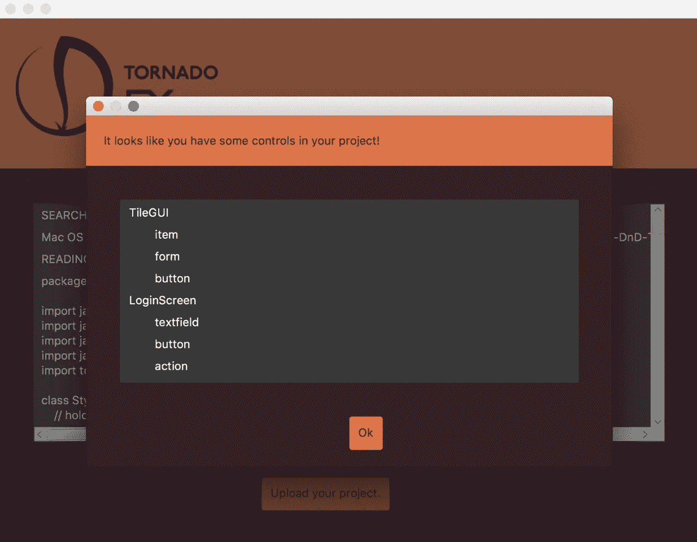
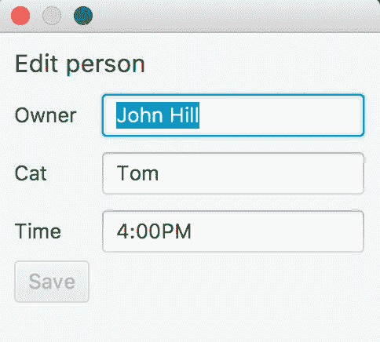
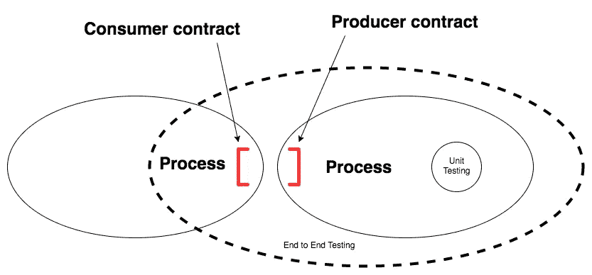
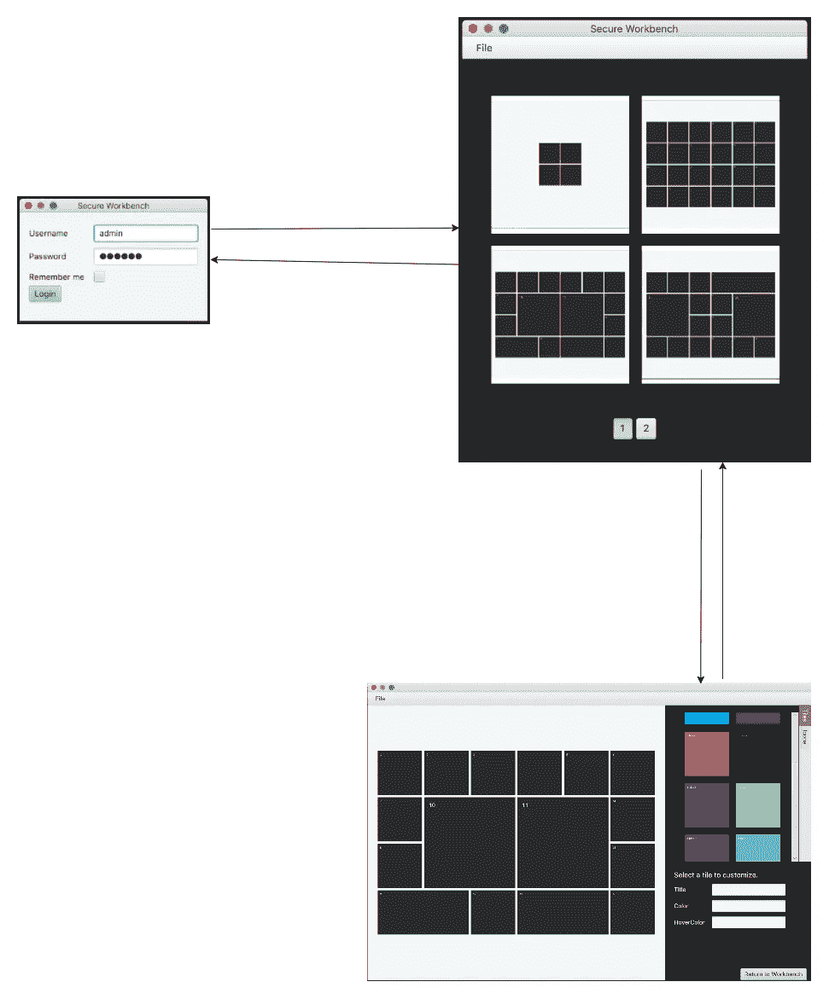
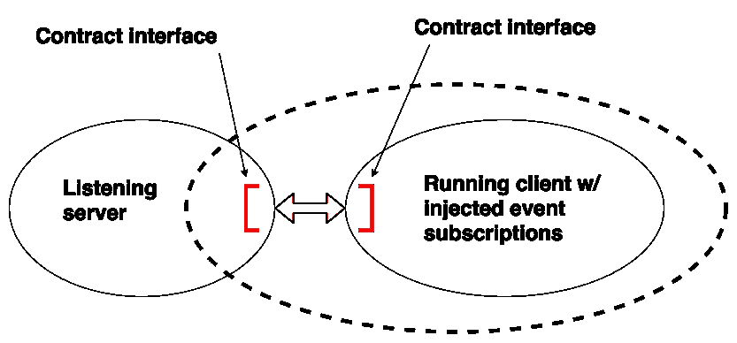

# UI 测试的元编程:抽象组合契约

> 原文：<https://towardsdatascience.com/metaprogramming-for-ui-testing-pbt-abstract-compositional-contracting-ad0bc816e503?source=collection_archive---------16----------------------->

正如在之前的[博客](/kotlin-the-next-frontier-in-modern-meta-programming-8c0ac2babfaa)中提到的，我们已经实现了能够在 TornadoFX 应用程序中检测 UI 组件。

Input Detection accomplished. Still buggy but accomplished.

由于我们正在重构并将代码库转移到 Gradle，为测试存根的生成做准备，我需要思考那些可以在没有智能的情况下生成，但可以提供足够信息使其值得分析的测试。我和比我聪明得多的人(有过跨多个框架编写测试的经验)参加了一个芝加哥 KUG 会议，讨论是否有可能创建 UI **基于属性的测试(PBT)。**

## 有哪些类型的 UI 测试？

让我们来看一个表单，在这个表单中，我们正在编辑从人员表中选择的人员:

让我们从为这个视图编写测试的角度来考虑这些特征:

*   **接近度&渲染视图的排序** —视图如何相对于彼此进行渲染？它们呈现的顺序是什么？车主`field`坐在`textfield`的左边吗？形式`above`就是`button`？
*   **QA 测试** —在运行时探索环境，四处点击等。我输入一些信息，然后点击“保存”。
*   **与视图相关的模型属性**——当时间表模型的状态变脏时，是否启用“保存”`button`？父组件是否反映了对实例的特定子集所做的更改？如果我把约翰·希尔换成无名氏，约翰·希尔就不在另一个`View`里了吗？

我们如何在不关心模型、改变视图和增加不属于视图的组合动作的情况下，将这些属性定义为可测试的东西？

我们需要将我们对视图的关注提升到一个更高的抽象层次，这样我们就可以将想法归纳为一组规则，或者**属性**，来描述视图如何在应用程序中协同工作。

## **什么是基于属性的测试(PBT)？**

基于属性的测试可以定义为满足一组属性的测试，与我们定义的特定输入或边缘情况相反。测试让我们努力思考，PBT 让我们更加努力思考。它不能替代基于单元的测试，但是更加努力地思考目标(而不是实现)可以帮助我们编写更强大的测试并降低成本。这意味着更高质量的产品和更少的维护。

PBT 最优雅的例子之一可以通过交换性来检验。

Commutative Properties

向左，我们发现加法运算是可交换的，而减法运算不是。

在数学中，我们可以概括说，如果改变输入的顺序不改变输出，二元运算是可交换的。

同样，我们可以尝试描述通用属性来帮助我们编写 UI 测试。

## 为什么我要为用户界面创建 PBT？

有很多方法可以创建视图并测试它们。许多人对这些测试应该如何设计和编写非常固执己见，但是这些测试对于算法、数据处理和 API 来说更容易编写。你投入一些资源，你期望一定的产出。但是，如果视图没有被形式化，我们如何描述我们对视图的期望呢？作为一个在我的职业生涯中花了一部分时间做 UI 开发人员的人，我避免尝试编写这样的测试，其他人也和我分享了类似的观点。

如果程序能够为特定的应用程序形式化关于一组检测到的视图的属性，那么元编程只能编写 UI 测试。

这是我们想出的主意。

# 抽象 UI 树收缩

当我们查看**契约测试**时，我们正在测试一个流程和另一个流程之间的通信行为。我们正在检查模式、实现的状态以及由*消费者契约触发的*生产者契约*中调用的行为。*

这是一种常见的微服务之间的测试和不同 API 之间的通信。我们不关心业务逻辑，也不关心预期调用的结果。我们只关心另一份合同的预期通知已经发出。

让我们从上到下看一个应用程序。在这里，我们有一个登录屏幕，正确的凭证提供了对我们可能能够使用的网格选项工作台的访问。选择一个`datagrid`项会让位于一个平铺图形用户界面，在这个界面中，我们可以将平铺图形和图像拖放到一个预定义的布局上。

我们可以使用`drawer`来访问图标。单击瓷砖将显示瓷砖的属性。我们还能够导航回工作台。

之前，我们解析了 Kotlin 语言的*抽象语法树* (AST)来概括语言组件，并递归和不可识别地检测 UI 输入。

我们不关心与应用程序相关的业务逻辑，也不关心我们在应用程序中创建和使用的模型。**为我们的组件** **映射一个组合抽象可以帮助定义我们认为应用程序中作为单个关注点的动作周围的属性:**

*   特定视图在什么上下文中？
*   视图由哪些节点组成？
*   在这些节点中，哪些节点有输入？这些输入是布尔型还是多输入型？
*   那些节点有指向其他节点的指针吗？

创建这个组合的“线框”映射可以帮助我们创建一组自定义的属性，我们可以根据这些属性进行测试。

此时，我们已经有能力检测 UI 控件。我们可以修改我们的扫描视图并注入事件订阅，这些事件订阅将监听任何编程输入并将节点分配给状态。

现在我们有了一组抽象的属性来描述我们的 UI，我们在容器中运行的客户端版本和我们的服务器程序之间创建契约接口，并通过套接字促进通信。

为可能的输入组合创建排列应该不难。**每次触发控制事件时，我们可以对状态应用二元运算，并可以对这些节点运行状态检查。**如果任何财产被侵犯，那么合同就被破坏。

反过来，**当且仅当** *状态的二元运算在单个节点* **和** *上适当改变时，UI 被称为“工作中” **整体结果存在于先前由其代表性组合图定义的应用程序属性的范围内。***

# 我们能在 PBT 上使用机器学习吗？

在我看来，数据科学是好奇的，而不是固执己见的。我们可以从收集自愿数据开始，例如:

*   哪些测试失败了
*   通过什么测试
*   跟踪测试结果和应用程序崩溃之间的相关性

我不能说我知道我们会发现什么，但我们会让分析检测那些有趣的数据趋势。

一旦用元编程实现了 PBT，下一阶段的重点是让这个应用程序对更广泛的受众和更多的框架可用。敬请期待！