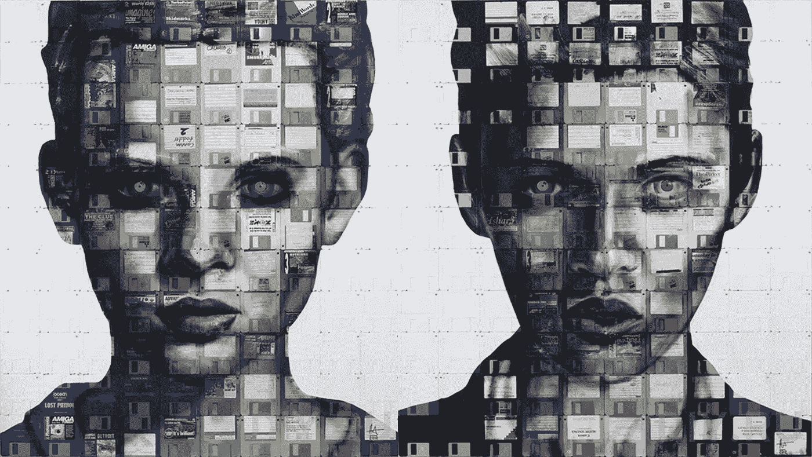

# 减轻预测正义中的算法偏差:人工智能公平性的 4 个设计原则

> 原文：<https://towardsdatascience.com/mitigating-algorithmic-bias-in-predictive-justice-ux-design-principles-for-ai-fairness-machine-learning-d2227ce28099?source=collection_archive---------7----------------------->

## 算法正被用于给罪犯定罪和决定监禁时间。我们需要确保它们是公平的。

当网飞得到一个[电影推荐](https://www.thrillist.com/entertainment/nation/how-new-netflix-recommendation-algorithm-works)错误时，你可能会认为这没什么大不了的。同样，当你最喜欢的运动鞋没有被列入亚马逊的[推荐商品清单](https://www.amazon.com/gp/help/customer/display.html?nodeId=13316081)，这可能不是世界末日。但是，当一种算法给你分配一个从 1 到 500 的威胁分数[来决定你的监禁时间时，你可能会对预测分析的这种使用产生一些担忧。](https://www.reuters.com/article/us-chicago-police-technology/as-shootings-soar-chicago-police-use-technology-to-predict-crime-idUSKBN1AL08P)

人工智能(AI)现在几乎已经渗透到我们生活的方方面面。自然，机器预测不可能总是 100%准确。但是当人工智能在高风险环境中实施时，错误的成本会急剧增加。这可能包括推荐新的癌症治疗方法的药物，或者帮助法官评估嫌疑人再次犯罪可能性的刑事司法。事实上，近年来人工智能最有争议的用途之一是[预测性警务](https://gizmodo.com/study-finds-predictive-policing-no-more-racist-than-reg-1823733844)。

对于普通观众来说，预测性警务方法最广为人知的可能是 2002 年由汤姆·克鲁斯主演的科幻电影《T2》中的《少数派报告》。这部电影根据[菲利普·K·蒂克](https://en.wikipedia.org/wiki/The_Minority_Report)的短篇小说改编，展现了一个犯罪可以被预测和预防的未来景象。这听起来像是一个牵强的乌托邦场景。然而，预测正义[今天已经存在](http://time.com/4966125/police-departments-algorithms-chicago/)。基于先进的机器学习系统，出现了一波为法院提供预测服务的新公司；例如，以[风险评估算法](https://www.washingtonpost.com/news/monkey-cage/wp/2016/10/17/can-an-algorithm-be-racist-our-analysis-is-more-cautious-than-propublicas/?noredirect=on&utm_term=.68bfbc303ed5)的形式，评估罪犯再次犯罪的可能性，以帮助法官做出决策。

## 机器能识别未来的罪犯吗？

美国的刑期越来越多地基于有偏见的人工智能预测。例如，在 2013 年被捕后，Eric Loomis 被判处六年监禁，部分原因是基于一个不透明的算法预测，即他会犯下更多罪行。Eric Loomis 的[案件](http://www.scotusblog.com/wp-content/uploads/2017/02/16-6387-op-bel-wis.pdf)中使用的[专有软件](http://www.northpointeinc.com/files/downloads/Northpointe_Suite.pdf)背后的[公司](http://www.equivant.com/)equivant(前身为 Northpointe)声称提供了被告的 360 度视角，以便为司法决策提供详细的算法协助。

这家公司是美国预测司法领域的众多参与者之一。[电子隐私信息中心](https://epic.org/algorithmic-transparency/crim-justice/)最近的一份报告发现，算法越来越多地在法庭上被用于“*设定保释金，决定判决，甚至有助于判定有罪或无罪*”。这种在法庭上向更多机器智能的转变，允许人工智能增强人类的判断，对整个司法系统来说可能是极其有益的。

然而， [ProPublica](https://www.propublica.org/article/machine-bias-risk-assessments-in-criminal-sentencing) 的一份调查报告发现，这些算法往往会强化执法数据中的种族偏见。算法评估倾向于错误地将黑人被告标记为未来的罪犯，其比率几乎是白人被告的两倍。此外，依赖这些风险评估的法官通常不明白分数是如何计算出来的。

这是有问题的，因为机器学习模型只与它们在上接受训练的数据[一样可靠。如果基础数据存在任何形式的偏差，那么结构性不平等和不公平的偏差不仅会被复制，还会被放大。在这方面，AI 工程师必须特别警惕他们的盲点和隐含假设；重要的不仅仅是机器学习技术的选择，还有所有关于为人工智能模型寻找、组织和标记训练数据的](https://cloud.google.com/blog/products/ai-machine-learning/steering-the-right-course-for-ai)[小决定](https://cloud.google.com/blog/products/ai-machine-learning/steering-the-right-course-for-ai)。

## 有偏见的数据反馈有偏见的算法

即使很小的不规则和偏差也会在最终的风险评估中产生可测量的差异。关键问题是，像种族偏见和结构性歧视这样的问题在我们周围的世界里根深蒂固。

例如，有证据表明，尽管吸毒率相似，但美国黑人因涉毒指控被捕的比例是白人的四倍。即使工程师忠实地收集这些数据，并用它训练机器学习模型，人工智能仍然会将[嵌入偏差](https://researchportal.bath.ac.uk/en/publications/semantics-derived-automatically-from-language-corpora-necessarily)作为模型的一部分。

系统性的不平等模式无处不在。如果你看看 2014/2015 年票房最高的电影，你会发现无论是在屏幕时间还是说话时间方面，女性角色[都远远不足。新的机器学习模型可以](https://seejane.org/wp-content/uploads/gender-bias-without-borders-executive-summary.pdf)[量化这些不平等](https://seejane.org/research-informs-empowers/data/)，但是关于工程师如何主动减轻这些不平等，还有很多未决问题。

谷歌近期[*快，画！* "](https://ai.googleblog.com/2017/08/exploring-and-visualizing-open-global.html?m=1) 实验生动地展示了解决偏见问题的重要性。这个实验邀请了全世界的互联网用户参与一个有趣的绘画游戏。在每一轮游戏中，用户都被要求在 20 秒内画出一个物体。然后，人工智能系统会试图猜测他们的图画描绘了什么。来自 100 个国家的 2000 多万人参加了这个游戏，产生了超过 20 亿张各种各样的图画，包括猫、椅子、明信片、蝴蝶、天际线等等。

但是，当研究人员检查数据集中的[鞋](https://www.youtube.com/watch?v=59bMh59JQDo)的图样时，他们意识到他们面对的是强烈的文化偏见。大量早期用户画出看起来像[匡威运动鞋](https://www.converse.com/us/en_us/c/converse/chuck-taylor)的鞋子。这使得模特选择了运动鞋的典型视觉属性作为“*鞋*应该是什么样子的原型。因此，[看起来不像运动鞋](https://www.youtube.com/watch?v=NF98WCdvR6U)的鞋子，比如高跟鞋、芭蕾舞鞋或木屐，都不被认为是鞋子。

此外，最近的[研究](https://papers.nips.cc/paper/6228-man-is-to-computer-programmer-as-woman-is-to-homemaker-debiasing-word-embeddings.pdf)表明，如果不加检查，机器学习模型将学习过时的性别刻板印象，例如“*医生*是男性，“*接待员*是女性。以类似的方式，根据过去美国总统的图像训练的人工智能模型已经被证明能够预测出[只有男性候选人可能赢得总统竞选](https://medium.com/@drpolonski/algorithmic-determinism-and-the-limits-of-artificial-intelligence-d32397b8f618)。

早在 2016 年，我就为 [TechCrunch](https://techcrunch.com/2016/11/06/would-you-let-an-algorithm-choose-the-next-u-s-president/) 写过一篇文章，在文章中我解释了机器学习系统只能使用历史数据来对未来做出预测。这就是为什么在用过去(男性)总统的图像训练之后，根据过去美国总统的图像训练的[神经网络](http://www.ewdn.com/2016/08/08/neural-networks-see-donald-trump-as-us-president/)预测唐纳德·特朗普将赢得即将到来的美国大选。因为数据集中没有女性总统，人工智能无法推断出性别不是该模型的相关特征。实际上，如果这个特定的人工智能要选举下一任总统，它会投票给特朗普。

这些推论产生了越来越确定的推荐系统，它倾向于强化现有的信念和实践，类似于我们社交媒体反馈中的回音壁。我们在日常生活中越依赖个性化算法，它们就越会塑造我们看到的东西、我们阅读的内容、我们与谁交谈以及我们的生活方式。通过坚持不懈地关注现状，对要读的书、要看的电影和要结识的人的新建议会给我们带来更多以前让我们高兴的东西。

当你的过去明确地决定了你的未来，通过自发性、开放的思想和实验的个人发展变得更加困难。这样，算法决定论的概念呼应了[温斯顿·邱吉尔](http://www.parliament.uk/about/living-heritage/building/palace/architecture/palacestructure/churchill/)曾经对建筑说过的话:*我们塑造我们的算法；此后，他们塑造了我们。*

## 人工智能中的公平设计

2018 年 10 月，国际数据保护和隐私专员会议发布了[人工智能道德和保护宣言](https://www.huntonprivacyblog.com/wp-content/uploads/sites/28/2018/10/ICDPPC-40th_AI-Declaration_ADOPTED.pdf)，这是迈向一套人工智能国际治理原则的第一步。该宣言指出“*人工智能中使用数据可能导致的非法偏见或歧视应当减少和减轻*”。

这一概念的内在含义是，人工智能需要在一套更广泛的伦理和法律标准上进行评估；不仅仅是基于[分类准确度](https://developers.google.com/machine-learning/crash-course/classification/accuracy)和[混淆矩阵](https://medium.com/hugo-ferreiras-blog/confusion-matrix-and-other-metrics-in-machine-learning-894688cb1c0a)。扩展这一论点，我提出以下用于预测正义的人工智能公平原则:

## 1.表现

为了防止不公平的偏见，所有受试者都应该有平等的机会在数据中得到体现。有时，这意味着未被充分代表的人群需要被仔细地添加到任何训练数据集中。有时这也意味着有偏见的机器学习模型需要在不同的数据源上进行大量的重新训练。在谷歌[快，画的情况下！](https://quickdraw.withgoogle.com/)实验中，工程团队不得不有意寻找[其他鞋类](https://ai.googleblog.com/2017/08/exploring-and-visualizing-open-global.html?m=1)的额外训练示例，如高跟鞋和 crocs 鞋，以弥补代表性的差距。此外，最近的研究提供了新的[算法技术](https://arxiv.org/abs/1801.07593)到[来衡量虚假陈述](https://github.com/conversationai/unintended-ml-bias-analysis/blob/master/presentations/measuring-mitigating-unintended-bias-paper.pdf)并帮助[减轻机器学习中不必要的偏见](https://papers.nips.cc/paper/6316-satisfying-real-world-goals-with-dataset-constraints)。

## 2.保护

机器学习系统需要避免对个人的不公正影响，特别是与社会和身体脆弱性以及其他敏感属性相关的影响。这些因素可能包括种族、民族、性别、国籍、性取向、宗教和政治信仰。一个算法的整体公平性必须通过它如何影响受其影响的最弱势人群来判断。

然而，简单地从机器学习模型中省略敏感变量并不能解决问题，因为有各种各样的[混杂因素](http://nautil.us/issue/55/trust/are-algorithms-building-the-new-infrastructure-of-racism)可能与它们相关。关于刑事司法，[研究](https://arxiv.org/abs/1703.04957)显示，从犯罪历史数据中忽略种族仍然会导致种族差异的预测。相反，有早期证据表明，种族差异和其他敏感信息可以通过使用[辅助机器学习算法](https://arxiv.org/pdf/1703.04957v1.pdf)从数据集中删除。希望在未来，这种方法可以帮助工程师建立一个“*种族中立的*”人工智能系统来预测累犯。

## 3.管理工作

算法公平不仅仅意味着没有不公平；它代表了在机器学习系统的设计中不断争取公平的积极责任。在这方面，管理精神只能由一个挑战彼此隐含假设的多元化团队来承担。

例如，在常规的[无意识偏见消除练习](https://rework.withgoogle.com/guides/unbiasing-raise-awareness/steps/watch-unconscious-bias-at-work/)中，团队可以培养对观点多样性的欣赏。包括 [ProPublica](https://www.propublica.org/article/machine-bias-risk-assessments-in-criminal-sentencing) 和 [Privacy International](https://edps.europa.eu/sites/edp/files/publication/16-06-17_presentation_implementation_of_gdpr_en.pdf) 在内的几个非政府组织也开始倡导在构建大规模人工智能模型的公司中进行多元化管理。因此，只有通过创造包容的文化，公司才能为团队创造合适的条件来解决机器学习中的不公平偏见。

## 4.真实性

最后的原则不仅指训练数据的真实性，还指人工智能预测的真实性，因为它们被用来为人类决策提供信息。例如，尽管不断努力限制潜在的有害或滥用应用，但令人遗憾的是，机器学习在过去一直被用来通过[深度伪造](https://www.youtube.com/watch?v=gLoI9hAX9dw)来扭曲现实。在这种情况下，对人工智能的普遍滥用可能会帮助恶意行为者生成[虚假视频](https://www.vox.com/2018/4/18/17252410/jordan-peele-obama-deepfake-buzzfeed)，其中人们说着他们以前从未说过的话，或者[真实生活中从未发生过的场景的虚假图像](https://blogs.nvidia.com/blog/2017/12/03/nvidia-research-nips/)。在极端情况下，这可能会导致一个世界，法官不再能够[确定](https://www.youtube.com/watch?v=gLoI9hAX9dw)任何描述的媒体或证据是否符合[真相](https://www.vox.com/2018/4/18/17252410/jordan-peele-obama-deepfake-buzzfeed)。因此，这导致一些媒体专家得出结论，AI 最大的受害者不会是乔布斯，而是最终彻底消除对你所见所闻的信任。“幸运的是，人工智能研究人员已经在研究[有效且可扩展的对策](https://www.ischool.berkeley.edu/projects/2018/unmasking-deepfakes)来检测各种形式的操纵媒体。

## 反对机器偏见的机器

这四个原则可以帮助开始一场关于人工智能公平的对话，特别是在用于预测正义时。公平永远不是机器学习的默认。因此，工程师需要采取[主动措施来改变这种默认](https://design.google/library/fair-not-default/)。如果我们不积极地设计人工智能的公平性，我们就有延续有害偏见和刻板印象的风险。

然而，人工智能最令人印象深刻的事情之一是，算法也可以有效地用于[测量和减轻不公平的偏见](https://ai.google/education/responsible-ai-practices?category=fairness)。展望未来，机器学习工程师有望进一步开发这些技术；扩展它们以有意义地帮助人类决策者进行不带偏见的预测。

本文中表达的观点是我自己的观点，基于我之前在牛津大学的研究。它们不以任何方式代表谷歌的观点。

*作者简介:* [*维亚切斯拉夫·波隆斯基*](https://www.vyacheslavpolonski.com) *博士是 UX 谷歌研究员。此前，他是牛津大学的研究员，研究复杂的社会网络和集体行为。他拥有计算社会科学博士学位，之前曾就读于哈佛大学、牛津大学和伦敦政治经济学院。他积极参与了* [*世界经济论坛*](http://www.weforum.org/) [*专家网*](https://www.weforum.org/communities/expert-network) *和* [*WEF 全球塑造者*](http://www.weforum.org/community/global-shapers) *社团。2018 年，《福布斯》杂志将他的工作和研究登上了面向欧洲的* [*《福布斯 30 Under 30*](https://www.forbes.com/30-under-30-europe/2018/#7ab751f47eaa) *榜单。他写的是社会学、网络科学和技术的交集。*

*本文的早期版本出现在* [*世界经济论坛议程*](https://www.weforum.org/agenda/2018/11/algorithms-court-criminals-jail-time-fair/) *作为全球未来理事会 2018**WEF 年会的一部分。*