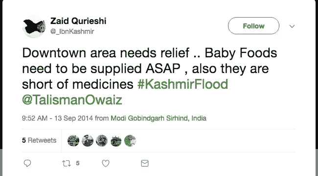
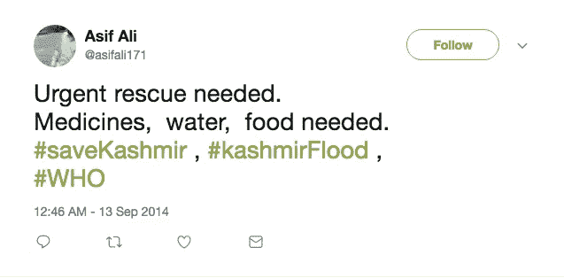
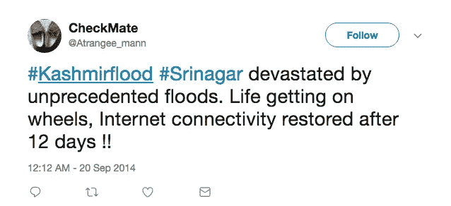
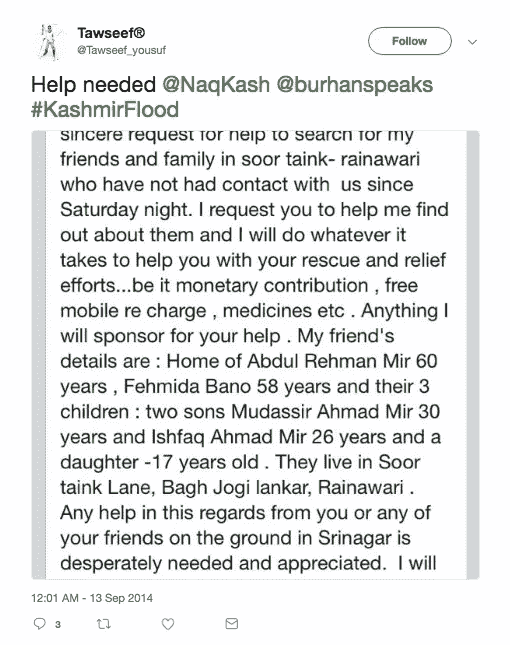

# ML 和 AI 合作拯救灾难受害者:援助组织如何利用它的力量

> 原文：<https://towardsdatascience.com/ml-and-ai-partner-to-save-disaster-victims-how-aid-organizations-can-tap-into-its-power-b8de67e92a09?source=collection_archive---------10----------------------->

2014 年 9 月 5 日，季风暴雨在几分钟内吞噬了印度、中国和巴基斯坦控制的克什米尔村庄，掩埋了 80%的领土。惊慌失措的市民逃到屋顶，许多人将在没有食物和水的情况下等待救援长达一周。#KashmirFlood 标签成为许多人的生命线，因为受害者在推特上发布他们的位置、需求和失踪的亲人，希望得到救助。

其他人就没那么幸运了。对他们来说，几乎两周过去了，互联网连接才恢复。

一旦恢复，人们通过社交媒体向亲人报告他们的状态。

一些人通过推特和脸书寻求失踪人员的信息，希望他们的努力能被分享，亲人能被找到或获救。

在世界的另一端，2014 年 8 月 14 日，在加利福尼亚州的纳帕县，当 6.0 级地震袭击该地区时，受害者拨打了数千个 911 电话。尽管如此，由于电力和通讯线路受损，求救电话无法发出，整个地区都无法获得帮助。问题是:人们的服务是基于先到先得的原则。能够使用必要的电力和通信线路拨打 911 的受害者首先得到服务，剩下那些生存资源较少的人自己照顾自己。

**AI 和 ML Power 拯救生命的自然灾害管理**
与此同时，斯坦福大学工程系学生 Ahmad Wani，[分享他的经验:](http://www.govtech.com/em/disaster/One-Concern-Applying-Artificial-Intelligence-Emergency-Management.html)

> 在研究生院的一次休息期间，我去克什米尔看望我的父母，当时一场大洪水席卷了这个邦。80%的克什米尔在几分钟内就沦陷了。大多数人在没有食物和水的情况下，在屋顶上呆了长达七天……大部分救援都是随机的，应急重点也是临时的。

但这还不是全部。在他位于第三世界的家园遭受破坏后，他回到了他位于第一世界的母校，发现了具有讽刺意味的类似场景:在受灾严重的海湾地区(尽管是第一世界)，FCFS 的灾难管理方法意味着援助工作也是随机进行的，没有优先考虑那些最危险或最需要的人。

在此之前、期间和之后，曼梯·里和艾把灾难受害者变成幸存者
认识到对更好的灾难管理系统的普遍需要，[瓦尼的“关注一个问题”的愿景](https://www.oneconcern.com/about)诞生了。作为一种机器学习(ML)和人工智能(AI)驱动的自然响应解决方案，One Concern 为响应者提供了工具和见解，以便在灾难事件之前、期间和之后采取拯救生命和有效的步骤进行全面恢复。几乎实时的甚至是预测性的损害和受灾地区报告有助于急救人员了解哪些需要优先处理，以及在哪里首先分配救生资源、信息和人员。

依赖人工智能和人工智能与灾难受害者同行，这并不是唯一的担忧。其他科技公司，如 IBM Watson 和 WorkFusion，以及政府组织正在依靠 ML 和 AI 解决方案，在灾害管理的每个阶段将受害者转化为幸存者。

**ML 和 AI 提供预防性见解，为预防措施铺平道路**
甚至在自然灾害来袭之前，ML 和 AI 解决方案，如 One Concern 的电力预测模拟模型，从而培训和准备特定区域的响应团队，以减轻灾害的端到端影响。

例如，美国疾病控制中心(CDC)报告说，全球每年有 5 万人死于流感和流感相关并发症，这种现象尤其影响第三世界国家。为了减少死亡人数并告知市民预防措施，[中国深圳 CDC 汇总了有关空气质量、地理布局、经济状况、人口密度和人口流动性的实时数据](https://www.ibm.com/watson/advantage-reports/ai-social-good-public-safety.html)。然后，他们通过 ML an AI 自动生成洞察，预测哪些地区风险最大，并以基于位置的资源为目标，以准备和控制灾难影响。

**人工智能和人工智能在灾难发生时阻止灾难蔓延**
在灾难发生时，人工智能和人工智能相结合，可以帮助响应者:

-跟踪和预测灾害轨迹；
-确定基于位置的紧急需求和受影响最大的地区；
-获得对哪些资源需要首先分配以及在哪里分配的预测洞察力；
-收集和揭示用户生成的关于需求、影响、死亡人数和失踪人员的社交媒体报告的趋势；
-向受影响最大或处于危险中的地区发送救生援助；
-向潜在受害者发送有针对性的危险警告；
-发送基于位置的及时安全信息；和
-定位受害者以协调他们的救援。

回到我们的纳帕县地震现场，由 IBM Watson 最近与公共安全通信官员协会的合作伙伴关系提供支持，应急人员本可以取消 FCFS 政策，代之以最紧急、最先响应的政策，从而拯救生命。

通过这种合作，IBM Watson 使用 ML 来分析最紧急的呼叫是如何展开的，然后将这种洞察力传递给调度员和调度培训员。最终结果是:调度员可以识别最紧急的呼叫，区分它们的优先级，并了解呼叫者的位置和可能的需求。反过来，他们可以提供及时的安全信息、资源和响应人员来拯救更多的生命。

**人工智能和人工智能加速恢复以减轻创伤**
人工智能和人工智能技术品牌还与保险和筹款公司合作，以加速恢复，从而缩短痛苦和创伤的后果。

例如，保险公司 Metlife Japan 致力于为路透社 14 次最致命地震之一[和美国过去十年 10 次最致命海啸之一](https://www.reuters.com/article/us-iran-quake-global/timeline-worlds-14-deadliest-earthquakes-of-last-decade-idUSKBN1DD257)的社区提供服务。为了更好地服务高危人群，[大都会人寿与 WorkFusion](https://www.workfusion.com/news-metlife-asia-awards-workfusion-contract-for-insurance-innovation?utm_source=other&utm_medium=toward-data-science&utm_name=alana-rudder&utm_term=ml-and-ai-partner-to-save-disaster-victims:-how-aid-organizations-can-tap-into-its-power) 合作。

WorkFusion 带来了 AI 和 ML 支持的产品，以实现无人数据库挖掘、索赔政策的自动验证、索赔与政策的事实匹配、自动化决策以及向下游支付的记录系统(SOR)的数据转换。这意味着保险索赔处理时间减少了 80%。翻译:减少受害者的痛苦时间。

位于野火和地震多发的硅谷的 RevUp 使用 ML 和人工智能支持的 WorkFusion 产品，以创纪录的速度和速度将可能的捐赠者与非营利组织进行匹配。然后，他们的组合解决方案激发捐赠者通过社交媒体共享创建相似的捐赠者，从而产生自动化、有针对性和可盈利的效率的连锁反应。最后，他们自动跟踪捐赠，以确保财务目标，从而满足受害者的需求。

**人工智能和人工智能帮助人类更好地帮助人类**
在灾害管理的每个阶段，人工智能和人工智能解决方案都为灾害响应者提供必要的实时洞察和自动化决策，以更高效、规模更大、影响最大、最先服务的方法取代 FCFS 救灾管理。

作为一个救灾组织，你可能无法跟随像中国深圳疾控中心这样的大型政府实体的脚步，来增强内部的 ML 和 AI 能力。但是像 RevUp 和 Metlife Japan 这样的品牌提供了一条前进的道路:伙伴关系。WorkFusion、IBM Watson 和无数新兴的人工智能和人工智能公司渴望在灾难管理之旅的每个阶段帮助您更有效地拯救和重建生命。

**你的作业:**简单地联系他们。共同开发商业案例，在人工智能和人工智能的支持下，可以减少自然灾害的死亡人数和创伤影响。