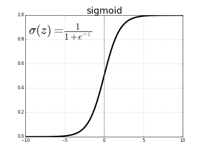
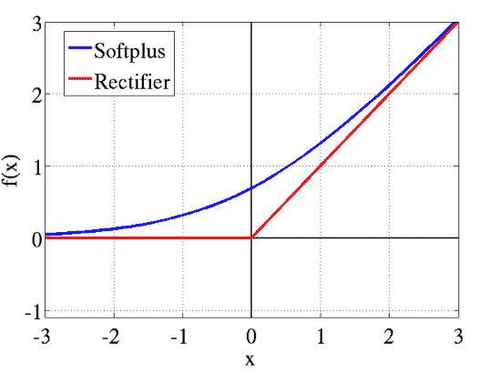
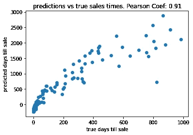

# ML 简介 3:物流和定制输出单元

> 原文：<https://towardsdatascience.com/ml-intro-3-logistic-output-units-ec42cc576634?source=collection_archive---------10----------------------->

本帖跟随[机器学习入门 2](https://medium.com/@leetandata/ml-preface-2-355b1775723e) 。我们将把机器学习应用于房屋销售评估。我们将把注意力转向房屋销售建模，让我们探索自定义目标。在机器学习中，我们将探索我们可以通过同一数据集的不同表示来定义的不同目标。这是数据科学家在处理每一个新的机器学习问题时必须做出的共同决定，在这篇文章中，我们探索了一些选项。

此内容旨在介绍关于深度学习的第二次讲座，实现我们在许多情况下都需要的基于非回归的 ML 讨论。

# 学习目标

这篇文章给出了线性、逻辑和自定义回归目标的真实例子。

听完这堂课后，你应该能熟练使用现成的回归模型以及设计你自己的定制回归目标。

# 问题设置

假设我们在预测房子需要多长时间才能卖出去。目前，为了激励模型，让我们假设房屋销售市场可以快速卖出一栋房子，以响应低价公告。

在这个模拟的环境中，如果一栋房子的标价非常高，比它的价值低得多，房子几乎会立刻卖出。如果一栋房子以公平价格挂牌出售，它可能会在几周或几个月内卖出，这取决于交易的好坏。如果房子定价过高，房子可能需要几年时间或者永远卖不出去。

## 数据

在这个问题中，我们输入了关于房屋列表的数据:

*   房子的平方英尺
*   位于大城市？(是或否)
*   离最近城市的距离(英里)
*   卧室数量
*   浴室数量
*   翻新后的年数
*   索价

这些特征中的每一个看起来都非常简单，我们可以使用我们在之前的会议中学到的知识，从我们的输入中运行回归，以预测房子将出售的时间。

# 机器学习选项

在这里，我们将讨论不同的机器学习目标，我们可以选择使用来解决这个问题。

## 经典回归

线性回归学习每个输入要素的乘数。为了进行预测，它将输入乘以乘数，然后将结果相加。我们也可以使用学习特征的线性回归，例如神经网络。

## 引入逻辑转换

在上一节中，我们讨论了基于元素的非线性转换。它们的工作方式是将单个值作为输入来创建单个输出。一个非常流行的变换是 sigmoid 变换，或逻辑变换。

逻辑单元将从负无穷大到正无穷大的数字映射为输入，将 0–1 映射为输出，如左图所示。

如果我们想要预测 0 和 1 之间的真实概率，或者特别是如果我们想要预测二元(2 级)定性响应变量，这是有价值的。

## 逻辑回归动机

如果我们只关心预测房子在第一个月会不会卖出去呢？这样，我们的模型应该预测一个介于 0 或 1 之间的数字，0 代表房子没有卖出，1 代表房子在第一周卖出。

我们可以要求我们的预测被解释为置信度或概率。如果它对自己的产出更有信心，那么它的预测应该更接近极限。这样，我们可以将模型的输出解释为房子卖(1)或不卖(0)的概率或信心。

那么如果我们在一个房子里喂食，模型线性输出 3 呢？好吧，看看上面的 sigmoid 曲线，x = 3，曲线的 y 值是 0.95，所以模型有 95%的信心这套房子会在第一周卖出。

所以这就是逻辑回归！它的概念是采用线性回归模型(神经网络或简单的线性回归)并在末尾附加一个逻辑单元。或者像另一个人所说的那样:“逻辑回归不是直接模拟这个响应 Y，而是模拟 Y 属于特定类别的概率”([链接](https://www-bcf.usc.edu/~gareth/ISL/ISLR%20First%20Printing.pdf))。

## 最后一个细节:优化

我骗了你。输出函数并不是逻辑回归不同于线性回归的唯一细节。关于如何实际训练模型，还有第二个区别。

还记得之前的线性回归吗，我们训练模型使其预测的平方误差最小化。但是如果我们对逻辑回归做同样的事情呢？

假设房子挂牌价格低，卖得快，那么它的价值就是一个‘1’。但是让我们假设模型预测。1，估计房子不会在时间框架内出售。那就是 1 - .1 = .9 的线性误差。所以平方误差是 0.81。让我们把它作为参考。

后来，让我们说，模型估计。0001 相同的房子，表明它几乎肯定房子不会出售。在这种情况下，误差仍约为 1，因此误差的平方也是 1。这与. 81 没有太大的不同，即使这个模型现在因为对错误结果的不可思议的信心而可怕地偏离了！

因此，随着模型对错误答案的预测越来越有把握，我们希望对模型进行更多的惩罚。如果正确的值是 1，如果我们的预测接近 0，我们希望我们的损失接近无穷大，反之亦然。这就是逻辑损失的动机，它是预测的对数。当输入接近 0 时，对数接近无穷大，因此我们使用
(Y==1) * log(预测)+(Y = = 0)* log(1-预测)
以便当我们接近关于错误答案的置信度时，我们的损失接近无穷大。

(这个公式也是从最大似然估计中数学推导出来的。有兴趣就去看看吧)

通过我们的 sigmoid 输出函数和对数损失，我们已经详细说明了线性回归和逻辑回归之间的所有差异。

## 逻辑回归的优点/缺点

逻辑回归的动机是做出是/否的预测。如果我们想在**月**搬进去，而我们所关心的只是**是否达到当月销售日期**会怎么样？逻辑回归会告诉我们需要知道的一切！

人们经常选择逻辑回归的另一个原因是更容易看到好的结果。例如，所有多年来从未卖出的房子，模型估计它们在第一个月都卖不出去。而且所有在第一天卖出的房子，模型估计他们确实在第一个月卖出！它能准确地估计一切！

这就像接受一个人的图像，并预测这个人的名字。最初，你的准确性很差，所以你改为预测他们的性别，并获得了很高的准确性。

但是我们在那里做了什么？我们并没有更好地解决这些复杂的问题，我们只是建立了一个忽略了其环境的一些细节的模型，通过忽略一些重要的任务就可以得到很高的准确率分数。

## 线性回归的优点/缺点

对于这个问题，线性回归比逻辑回归更有优势，它可以估计房子出售的日期，而不仅仅是估计是否符合截止日期。它区分了两天和一周，一个月和一年和三年。

另一方面，线性回归解决了具体估计房子何时出售的问题，但它对于这种环境也有重大问题。线性回归的一个问题是，它对 1 天与 11 天之间的差异的影响就像 100 天与 110 天之间的差异一样大。这似乎不合理，因为第一个估计值相差 10 倍，而第二个估计值只相差 10%。对于这个问题，这些应该有不同的损失值。

# 多类分类

如果我们想预测购房者是年轻的专业人士、中年夫妇还是其他人呢？

现在有三个类需要我们选择，而不是两个，所以我们不能执行逻辑回归！我们如何在一个三选项空间中做决策？我们可以点他们 1，2，3 吗？但是 2 需要在 1 和 3 之间，这在我们的场景中没有意义！

## 概念检查:多类分类的约束

如果这是课堂设置，请与你的邻座交谈。
你会对模型施加什么约束，使其可以解释为在三个或更多选项之间做出决定？
我们的渐变应该是什么样子，才能帮助我们训练学习分类？它们什么时候最大，什么时候最小？

## 解决方案:使用交叉熵训练 Softmax 输出层

从统计角度来看，模型需要为每个输出类分配投票的概率质量，每个投票都是非负的，并且概率总和为 1。

我们需要一个损失函数，如果它将一个非常低的概率分配给正确的分类标签，它将严重地惩罚模型(具有大的梯度)。

对于 3 类分类问题，我们使用 3 个输出单元，我们通过 softmax 层。softmax 层通过指数函数映射所有单元，然后除以三个输出的总和，使它们为非负，总和为 1。

例如，对于模型输出 H1，H2，H3，softmax 层计算
o1，o2，o3 = e^(H1，H2，H3)

o '都是正的，但是我们需要它们加到一起，所以我们计算
S1，s2，s3 = [o1，o2，o3]/ (o1 + o2 + o3)将每个单独的值除以三个值的和。

然后，我们用交叉熵损失函数来训练网络，如果我们对一个例子进行了严重的错误分类，该函数会以接近 0 的对数来增加我们的损失。

看看我们如何通过使用 yi(值为 1 的真实 Y 标签)来计算相应的损失-log(yhat_i)来计算上述损失。这样，如果我们的模型预测真实标签的概率 yi 非常小，那么 Loss = log(yi)将非常大。

最后，我们预测具有最大值的输出单元，例如，如果 s2 大于 s1 和 s3，我们将预测 Yhat = S2 的内容，这可能意味着“一对中年夫妇可能会购买这栋房子”

# 自定义回归

有时我们将线性回归扩展到逻辑回归。但是，通常有更好的定制解决方案。当我们设计一个回归解时，我们需要考虑输出函数和损失函数。

## 选择输出函数

对于这个房屋销售示例，我们的房子永远不会在负天数内售出，所以让我们选择一个永远不会为负的函数。Softplus 函数怎么样，如果线性回归输出为负，它接近 0，对于正值，它只跟踪回归值。

## 选择损失函数

也许我们可以用来表示损失的最有意义的方法是估计的百分比误差。这样 1 周 vs 2 周和 1 个月 vs 2 个月的损失是一样的。

## 总结我们的自定义回归

将上述定制放在一起，我们可以通过使用带有 Softplus 输出函数和估计百分比误差损失函数的回归来预测房子需要多长时间才能卖出。

利用这些新的预测，我们可以确信方向是准确的。具体来说，它们应该在短时间内精确到粒度，在长时间内精确到方向，但不精确到天。

# 超越传统回归的定制

让我们后退一步，看看我们一直在讨论的内容。我们已经尝试灵活处理我们很聪明的事实，我们可以在我们的回归输出中定制一个损失函数，但是这仍然把我们自己限制在一个回归输出中。

如果你被要求估计，个人而言，房子需要多长时间才能卖出去？有时候你会看着一套房子说*“这是一套非常标准的房子，价格合理，肯定会在一周到一个月内卖出去”*。其他时候，你可能会看着一栋房子说*“这是一栋非常不寻常的房子。我不太确定，它可能会在一周内售出，也可能需要几年才能售出。”*

有时你对一个狭隘的预测很有信心，有时则不然。因此，如果我们真的想要一个**有意义的可解释模型**，让它**估计其预测的可信度，就像人类会做的那样**。

## 置信估计的实现

我们刚才说什么了？我们刚刚完全改变了这里的游戏。现在，模型不是预测一个输出，而是用一个数字来表示它的估计值，现在模型预测两个数字，预测值和置信水平。

这听起来应该很疯狂！但是不要大惊小怪，我们理解它，所以我们可以实施它。

比方说，对于一栋房子，模型估计销售前的时间为 **T** 并且置信度为 **C** 。对于置信度，我们只表示预测的标准差。我们的信心是我们允许我们的误差有多大。

我们在估算房子销量的时候，尽量估算准确，尽量用一个小的置信区间来表达自信的答案。但是我们也不想表现出自信和不自信。

所以我们的失落代表了上述欲望。我们有一个损失函数，它是我们的置信区间的平方，表示“我们想要更自信”。我们有另一个损失函数，这是我们的误差，取决于我们的信心，它说“我们不能比我们的信心更不正确”。

所以损耗= ((Y-T)/C) + C

我们的产量预测和置信度都必须大于 0，所以:

t，C = Softplus(回归(特征))

## 用置信估计结束回归

所以我们完了！我们接受输入并计算两个回归输出，一个用于预测，一个用于置信区间。我们知道这些必须是正数，所以我们首先通过 Softplus 函数传递我们的回归输出，如上图所示。

我们用一个损失函数来训练它，这个损失函数表示“我们想要信心，但是我们也不想过度表示我们的信心”。

最后，我们通过读取一个输出作为模型的预测来解释输出，另一个预测给我们关于模型的置信度的见解。例如，如果模型输出(21，7)，我们将解释房子在大约 3 周内出售，加上或减去一周。

# 回归解决方案的总结比较

所以我们提出了一个评估房屋销售的问题。

我们可以进行标准回归，这有利于估计我们的输出，标准，如果我们使用纯线性回归，我们可以单独解释参数，如前几篇文章所述。

运行时，我们的模型会生成以下图表:

我们可以做逻辑回归，让我们设定一个模型截止阈值，并解释我们是否会在截止日期前卖掉房子。

我们可以通过定制回归损失函数来强制我们的模型在方向上精确。

我们还可以进一步定制我们的问题，以解决预测销售时间的问题，以及定制估计我们自己的信心，让我们学会尽可能准确地预测房屋销售，并在我们无法建立自信的销售估计时进行有意义的表示。

太棒了。我们做到了。我们学习了逻辑回归，这是一个非常流行的工具，认识到它是一个超越逻辑回归的定制，并学习了如何定制我们自己的回归问题。

## 展望未来

即使到了最后，我们实际上仍然在轻微地限制自己。我们学会了预测一个分布，但只是一个高斯分布。如果我们想预测任意的多模态、非高斯分布会怎样？在未来的一节课中，我们将讨论能量建模，这将使我们学会预测任意分布。

**这个问题展开:** [ML 前言 2](https://medium.com/@leetandata/ml-preface-2-355b1775723e) 。

**本系列的预期跟进**:[https://towardsdatascience . com/ml-intro-4-performance-measuring-and-regulatory-c 1973d 96 C5 b 9](/ml-intro-4-performance-measuring-and-regularization-c1973d96c5b9)

**对这一条完全理解的人打算跟进的帖子:**[https://medium . com/@ leetandata/machine-learning-engineering-1-custom-loss-function-for-house-sales-estimation-95 eec6b 12457](https://medium.com/@leetandata/machine-learning-engineering-1-custom-loss-function-for-house-sales-estimation-95eec6b12457)

**对于苦于代码或理解的人可选后续:** 本帖代码详细分析:[https://medium . com/@ leetandata/machine-learning-python-programming-introduction-for-business-people-10588 e 13 ce 9d](https://medium.com/@leetandata/machine-learning-python-programming-introduction-for-business-people-10588e13ce9d)

关于 Python 编程的免费综合课程。确保注册，但选择免费的可选项目。所有课堂内容免费提供:
[https://www . coursera . org/learn/python-programming-introduction/](https://www.coursera.org/learn/python-programming-introduction/)

一个比这个更复杂的机器学习教程，但比下面的(不是我写的)更容易[https://www . ka ggle . com/rochelle Silva/simple-tutorial-for-初学者](https://www.kaggle.com/rochellesilva/simple-tutorial-for-beginners)

**软件工程师可选后续岗位:** 重数学、重 CS 的详解(上):[https://medium . com/@ leetandata/neural-network-introduction-for-Software-Engineers-1611d 382 C6 aa](https://medium.com/@leetandata/neural-network-introduction-for-software-engineers-1611d382c6aa)

重数学、重 CS 的详解(下):[https://medium . com/@ leetandata/neural-network-for-software-engineers-2-mini-batch-training-and-validation-46ee 0a 1269 a 0](https://medium.com/@leetandata/neural-network-for-software-engineers-2-mini-batch-training-and-validation-46ee0a1269a0)

**Cho 教授可选数学笔记:**
[https://github . com/NYU-dl/Intro _ to _ ML _ Lecture _ Note/raw/master/Lecture _ Note . pdf](https://github.com/nyu-dl/Intro_to_ML_Lecture_Note/raw/master/lecture_note.pdf)