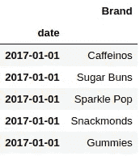
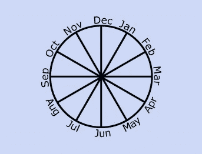
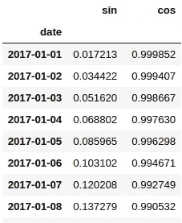
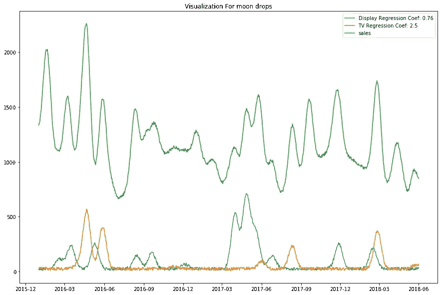

# ML Intro 5:一个热编码、循环表示和规范化

> 原文：<https://towardsdatascience.com/ml-intro-5-one-hot-encoding-cyclic-representations-normalization-6f6e2f4ec001?source=collection_archive---------10----------------------->

本帖跟随[机器学习入门 4](https://medium.com/@leetandata/ml-intro-4-performance-measuring-and-regularization-c1973d96c5b9) 。在之前的帖子中，我们描述了用于营销归因的机器学习。在本帖中，我们将阐明我们在该部分中忽略的一些细节。我们将检查一个关于营销属性的数据集，对我们的品牌进行一次性编码，操纵我们的一次性编码来学习定制的业务洞察力，标准化我们的功能，检查我们的模型输入，并详细解释我们的输出。

本次会议的代码将被张贴在[这里](https://github.com/leedtan/LeeTanData/tree/master/ML_Intro_4_Regularization)，但是是杂乱无章的，因为这个职位不是以编码为重点

# 学习目标

这篇文章给出了一个真实世界的例子，说明如何表示数据来推动特定的见解，以及如何消除噪声来提高业务见解的准确性。

听完这个讲座后，你应该明白

*   分类变量热编码之一
*   时间变量的循环编码
*   自定义可解释性的特征表示的自由(理解这种自由可以说是帮助商业用户与机器学习工程师合作的最重要的技能)
*   数学稳定性的数据标准化
*   如何解释特定操作的一些模型输出，以及检查您是否信任该模型的其他输出。

# 问题是

在本帖中，我们将再次查看各种模拟品牌的营销支出和销售数据集。我们的目标是优化我们公司的销售。在此之前，我们需要讨论要问什么问题，以及如何对我们的信息建模

## 数据

我们有每个品牌的销售和支出数据。

我们的核心数据表如下所示:

Data about spend and sales over time

这些数据总结了我们的历史销售和营销活动。

# 品牌建模

在这篇文章中，我们直接进入细节。参见[机器学习介绍 4](https://medium.com/@leetandata/ml-intro-4-performance-measuring-and-regularization-c1973d96c5b9) 获得更慢的解释。

让我们塑造品牌。在这个介绍系列中，品牌是我们的第一个非数字特征，所以我们不应该真正知道如何对它建模。我们怎么告诉模特第一排是品牌 Caffeinos，第二排是品牌糖包子？

## 介绍一种热门编码

为了对分类变量建模，我们使用一键编码。由于我们有 8 个品牌，我们创建了 8 个“虚拟”变量，它们被设置为 0 或 1。每个虚拟列被分配 8 个类别中的一个，并为该类别的行赋予值“1”，否则为“0”。

这可以通过转换来可视化:

Initial Representation

变成以下内容:

One-hot representation

这种类型的分类变量二进制表示法称为 one-hot，因为每一行都有一个值为 1 的要素，而其他要素的值为 0。当我说这是一种分类变量二进制表示时，它是分类的，因为我们正在编码的变量是分类的，并且每个特征都是二进制的，这意味着它们采用两个值中的一个，0 或 1。在其他上下文中，我们有其他方法来表示分类变量，比如向量表示，但是这种一键表示对我们的应用程序很有用。

## 包装品牌建模

现在我们有了一个热门的表现，我们可以学习对特定品牌的偏见。如果我们使用这些功能以及营销支出来预测销售，该模型可以学习每个品牌的线性回归系数(one hot 矩阵的列)。该系数将乘以品牌指标来预测销售额。因此，这些系数将了解每个品牌的偏差(由于特定品牌，您的销售预测应该高出多少)。

# 时间编码

## 问题是

让我们假设销售随着季节而变化，基线销售在返校季节最高。如果我们不对此进行建模，模型会认为我们在返校季开展的任何促销活动都是超级有效的，而其他季节则是无效的。

我们可以通过给模型一年中的某一天来告诉模型现在是一年中的什么时候。但是从这个角度来看，12 月 31 日和 1 月 1 日是对立的，尽管我们认为它们非常相似。我们希望附近的日期有相似的表示，即使是在端点。

## 循环时间建模

一种方法是通过循环表示。这是为了将一年中的每一天建模为它们在一个年轮上的点。

通过使用上述圆圈上的 X，Y 位置作为我们模型的输入，我们的模型可以了解一年中销售额高的时间和销售额低的相反时间，这样它就不会错误地将季节性销售趋势归因于促销。

Cyclical Representation For Seasonality

然后，我们可以使用三角学来检查这些特征的回归系数，以了解什么时候是旺季，季节性对销售的影响有多大。这对于检查模型是否像我们预测的那样合理地学习特别有价值。

# 目标表征操纵

现在我们有了一个热编码和其他特征，我们可以使用回归来学习品牌水平偏差，使用支出特征来学习支出 ROI，使用周期性时间特征来学习季节性。

但是，如果我们想要了解特定品牌的投资回报率和季节性，这是鼓励类似于全球趋势，但也允许根据需要对每个品牌有所不同？

对于每个特征，我们可以使用该特征作为其全局表示，然后我们可以通过将该特征乘以品牌一热变量来构建品牌变化特征。对于营销支出，这将是一个像“显示品牌口香糖的营销支出”的功能。当我们从该特征以及全球“展示营销支出”特征中学习回归系数时，我们正在学习“展示”营销的全球 ROI，以及来自全球 ROI 的巨美变化。作为一种正规化的形式，我们使特定品牌的变化接近于 0。

现在，我们扩展的数据集看起来像这样:

我们有显示、广播和搜索支出等聚合功能，我们有品牌虚拟功能，我们也有组合术语，如“moon drops”的电视广告。请注意，对于除活动品牌之外的所有品牌，所有特定于品牌的功能在一行中均为 0。

## 目标陈述总结

想想我们上面做的有多酷！我们现在迫使我们的模型学习全局参数，这迫使不同品牌级别的表示相似，同时允许每个品牌在某种程度上学习他们自己的 ROI 参数。我们可以把同样的推理进行得更深入。

## 暂停，思考，并陶醉于我们的赋权。

请停下来，花些时间想想你希望模型告诉你什么。请随意阅读以下内容，寻找灵感。

也许你想了解产品的具体参数。你只需要把你的特征和产品的一个重要变量相乘，就可以强迫产品的表现和品牌相似。

也许你不想知道某类支出的投资回报率，而是想知道特定支出地区的投资回报率。如果你假设每个产品的“搜索”花费都应该有一个投资回报率，直到某个日常花费，然后在那个点之后显著降低投资回报率会怎么样？你可以让模型告诉你到某个点的投资回报率，告诉你投资回报率下降的截止点，然后学习该点之后的投资回报率。如果我们认为这就是世界的运行方式，并希望了解不同区域 ROI 的数学细节，以及模型切换的位置，我们可以通过组合二元指标变量和适当的支出特征来构建这些特征(尽管这一具体建议还涉及学习分界点，这需要进行额外的讨论才能实现)。

那不觉得**授权**了吗？

如果我们想知道**产品价格**是如何影响销售的，但是我们认为下面这个“一旦价格变得太低，人们会认为它非常便宜，再降低也没有任何帮助。超过这一点，价格波动会显著影响销售，直到销售过高，这时用户会认为太贵，价格效应就会饱和”。我们想知道这些不同行为的分界点是什么，以及不同地区的价格波动有多大影响。

如果我们可以基于这些类型的见解采取**业务行动**，那么我们肯定可以花费精力对它们进行建模，因为它只是结合了线性和二进制特征！

我们说过，在这篇文章的结尾，你应该理解自定义可解释性的特征表示的自由。这是设计我们模型的功能的力量，因为我们已经以我们期望的有商业意义的方式解释了结果。请尝试理解我们描述的定制，并思考如果模型告诉您一些事情，您将能够采取行动的其他见解，并思考模型将如何向您传递这些见解。

# 正常化

我们已经准备好了所有的数据，现在我们几乎可以训练一个模型了。然而，一个问题是，数学家们并没有像我让你们相信的那样设计出数学最优化。

假设我们为模型提供数据，其中一个输入值在 0-1 之间变化，另一个输入值在 1，000 到 10，000 之间变化。模型需要为每个要素学习一个乘数，乘数是正则化的，因此不允许它们非常大。模型使用小乘数来听大特征，而完全忽略小特征要容易得多。但是也许这个小特性有意义，我们怎么能允许模型包含它呢？

## 高斯归一化

为了帮助我们的数学算法工作，我们只是执行一个非常简单的技巧，它足够重要和简单，你们都应该理解它。

我们获取每个特征，并计算平均值和标准差(该特征变化了多少)。在训练之前，我们取每个数据点，减去平均值，然后除以训练之前的标准偏差。这迫使我们的模型的均值为 0，标准差为 1，这非常便于数学家构建算法，因为它具有高斯分布的均值和标准差。

我们也对我们的目标(Y)变量执行同样的转换，因为我们的输出常常难以处理大的或小的目标变量。

## 反规格化

当模型给我们洞察力时，我们需要记住逆转这种正常化。

假设 X 的标准差是 3，Y 的标准差是 7。我们将它们归一化为偏差为 1，然后学习回归系数为. 6。我们真正的投资回报率是多少？

在标准化空间中，我们的投资回报率为 0.6。但是，如果我们的标准化 X 增加了 1，我们的真实 X 增加了 3，所以要产生这种影响，我们需要花费 3 倍的时间。所以投资回报率应该是 0.6/3 = 0.2

但是. 2 是归一化 Y 的 ROI，实际上，归一化 Y 增加 1，真实 Y 增加 7。所以我们的投资回报率真的是. 2 * 7 = 1.4。

所以为了反规格化，我们只需要计算

real_ROI =归一化 _ROI * std(Y) / std(X)

# 总结特性和可解释性

总结一下，我们的特性和以前一样，除了标准化:

然后，我们可以运行回归，就像我们在之前的课程中了解到的那样。每个特征都有特定的解释。对于支出列，学习系数是累计的平均 ROI。对于品牌栏，这些是每个品牌销售的偏差。对于周期日期列，这些系数应该通过三角函数来告诉我们模型认为该品牌何时销售最好或最差。

应将品牌/特征组合特征添加到共享特征中，以从全球统计数据中了解特定于品牌的变化。

查看我们的模型输出，我们看到:

这为我们提供了消费类型的投资回报率，并建议每个品牌的高峰月份是什么时候。我们可能知道品牌的旺季是什么时候，并使用这些建议来检查我们是否相信这个模型。

没有业务可操作的季节性洞察，因为我们只模拟了季节性销售，而不是季节性支出的投资回报率(在本文中，我们当然可以模拟季节性支出的投资回报率)。

从上面看，我们可能只是想在一些品牌内转移资金。看看月落广告，由于相应的投资回报率(0.76 比 2.5)，我们可能希望在展示广告上花更少的钱，在电视广告上花更多的钱

然而，在我们采取行动之前，我们检查了实际曲线，看看我们是否认为该品牌的销售似乎更受电视支出的影响，以确保我们作为人类信任这些疯狂的 ML 系统建议，我们看到了如下图像:

当然，我们看到销售额可能会因为电视消费的小幅增长而大幅上升，所以也许我们应该尝试一下。实际上，我们将对单个产品参数进行建模，我们将看到一个品牌中每个最有影响力的产品的曲线，如上图所示，以了解为什么模型会提出建议。

# 概述

在本次会议中，我们讨论了三个主题:

## 独热向量表示法

我们可以用一键向量来表示分类变量。

## 循环表示

我们可以使用循环表示来捕捉时间周期，如每年或每天的模式。

## 组合独热矢量和特征

我们可以结合热点向量、特征和其他概念来设计定制模型，以使我们的机器学习系统更加准确，同时还提供定制的可解释性。

**这个问题展开:** [机器学习入门 4](https://medium.com/@leetandata/ml-intro-4-performance-measuring-and-regularization-c1973d96c5b9) 。

**对于完全理解这一条的有意跟进帖子:**[https://medium . com/@ leetandata/machine-learning-engineering-1-custom-loss-function-for-house-sales-estimating-95 eec6b 12457](https://medium.com/@leetandata/machine-learning-engineering-1-custom-loss-function-for-house-sales-estimation-95eec6b12457)

**对于苦于代码或理解的人可选后续:** 本帖代码详细分析:[https://medium . com/@ leetandata/machine-learning-python-programming-introduction-for-business-people-10588 e 13 ce 9d](https://medium.com/@leetandata/machine-learning-python-programming-introduction-for-business-people-10588e13ce9d)

关于 Python 编程的免费综合课程。确保注册，但选择免费的可选项目。所有课堂内容免费提供:
[https://www . coursera . org/learn/python-programming-introduction/](https://www.coursera.org/learn/python-programming-introduction/)

一个比这个更复杂的机器学习教程，但比下面这个(不是我写的)简单:[https://www . ka ggle . com/rochelle Silva/simple-tutorial-for-初学者](https://www.kaggle.com/rochellesilva/simple-tutorial-for-beginners)

**软件工程师可选后续岗位:** 重数学、重 CS 的详解(上):[https://medium . com/@ leetandata/neural-network-introduction-for-Software-Engineers-1611d 382 C6 aa](https://medium.com/@leetandata/neural-network-introduction-for-software-engineers-1611d382c6aa)

重数学、重 CS 的详解(下):[https://medium . com/@ leetandata/neural-network-for-software-engineers-2-mini-batch-training-and-validation-46ee 0a 1269 a 0](https://medium.com/@leetandata/neural-network-for-software-engineers-2-mini-batch-training-and-validation-46ee0a1269a0)

**Cho 教授可选数学笔记:**
[https://github . com/NYU-dl/Intro _ to _ ML _ Lecture _ Note/raw/master/Lecture _ Note . pdf](https://github.com/nyu-dl/Intro_to_ML_Lecture_Note/raw/master/lecture_note.pdf)