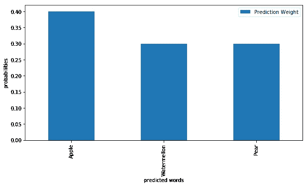
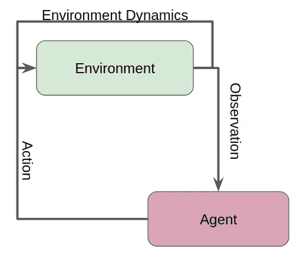
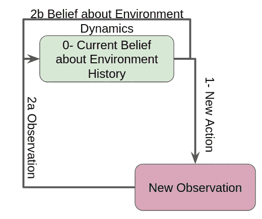

# ML 简介 6:不可微函数的强化学习

> 原文：<https://towardsdatascience.com/ml-intro-6-reinforcement-learning-for-non-differentiable-functions-c75e1464c6b9?source=collection_archive---------10----------------------->

这篇文章将在系列的[之后发表，但是代表了一个重要的转折点。我们现在已经解决了教授监督学习基础知识的问题，并且正在扩展以处理不可微的问题(激发深度强化学习)。](/ml-intro-5-one-hot-encoding-cyclic-representations-normalization-6f6e2f4ec001)

转变的原因有三:

1.  我们已经总结了前一部分的所有重要细节；如何设计定制的神经网络来使用网络架构、定制的损失函数和学习潜在的共享表示来解决特定的问题。
2.  我们已经非常关注营销归因的问题，但是营销的概念会强烈地激发行动的需要，这需要强化学习(RL)来建模。
3.  我正在 NYU 大学给达维·盖格教授的课程*视觉遇见机器学习*做讲座(也是我将为百事公司内部做的标准企业讲座)，因为我以前教过 RL。这将为在课程项目中使用 RL 提供工具。

我应该指出，现在你已经有了 ML 的基本工具，RL 只是继续学习的许多途径之一。学习机器学习的未来步骤可能是学习现有工具集的[复杂的实际应用](/machine-learning-engineering-1-custom-loss-function-for-house-sales-estimation-95eec6b12457)，[更深入地理解 ML 的编码/数学](/neural-network-introduction-for-software-engineers-1611d382c6aa)，或者通过斯坦福大学在线发布的一些免费讲座/家庭作业学习参数共享(CS231N 用于图像处理，CS224N 用于语言建模)。

# 强化学习(RL)学习目标

这篇文章介绍了术语、问题类型和可用于解决不可微 ML 问题的 RL 工具。

听完这个讲座后，你应该明白:

*   术语:环境、状态、主体、行动、模仿学习、匕首、价值函数、政策和奖励
*   ML 在存在不可区分的报酬、学习行动和模拟非确定性环境时的问题。
*   如何利用专家帮助通过匕首学习？
*   用政策梯度对不可微报酬建模。
*   用值函数估计状态值。
*   通过概率抽样、政策梯度和延迟回报模型学习行动。
*   q-学习同时对状态和价值建模(以及在连续行动空间中这样做的行动者-批评家算法，如营销行动问题)
*   通过对观测值进行调节来模拟非完全观测的环境。

# 监督学习不足 0: ML 无数据

对于**监督的**机器学习，我们需要一个数据集来建模。所以这在一些没有数据的环境中是站不住脚的。

## 模仿学习:抄袭专家

在学习行动的领域(例如，机器人、游戏或其他交互式决策)，我们可以通过模仿专家来学习。如果我们有传感器**可以捕捉输入和相应的人类/专家动作**，我们可以收集一个数据集，并应用监督学习方法来复制专家的动作。

模仿学习只是模仿专家动作的监督学习。你观察一个代理人在不同的州是如何行动的，然后训练一个模型来复制它。监督学习。

## DAgger:交替生成和使用数据

假设我们有一个算法，让人类在模拟环境中行走。我们可以从控制我们行走代理的专家那里训练这个算法，然后训练一个模型来复制专家。但专家永远会走得很完美，我们永远看不到如何改正错误。所以当我们运行我们训练过的模型时，它正确地向前运行，然后一旦偏离正常轨道它不知道该怎么办，所以它很快就崩溃了。

太可怕了！人类/专家知道如何纠正错误。所以我们所做的是让我们的模型控制模拟，并在每一步要求人类采取正确的行动。我们通过训练我们的模型复制新收集的数据来重复，然后向专家寻求更多建议。

那就是 DAgger，只是让你的模型决定如何行动，并从它探索的所有情况中问一个专家如何行动。训练您的模型复制专家的决策，然后使用您更智能的模型运行模拟。

# 监督学习不足 1:不可区分的奖励

监督学习的工作方式如下:

1.  预测产量
2.  计算输出的损失/误差
3.  更新你的预测系统

如果算法是看到一个物体，然后猜这个物体是什么。例如，你可以看到一个水果，你的输出可能是单词“苹果”。

‘What Fruit is This?’ ‘Apple.’ ‘Wrong!’

如果你猜对了，就给你一个 cookie(或者给定的算法+1)。如果你猜错了，你会被扣分(或者算法给 0 或-1)。

我们未能将此框架为监督学习问题，因为当我们出错时，我们不知道正确的值是什么。我们所能做的就是“当我们把事情做对的时候，多做这类事情”，以及“当我们把事情搞砸的时候，少做这类事情”。

例如，在上面的图片中，假设我们的模型预测了“苹果”，并被惩罚告诉它这是错误的。在监督学习中，我们应该告诉它“在这种情况下，你应该预测到‘西瓜’”，但在这种环境下，我们没有这种监督。我们如何训练模型做得更好？

## 引入政策梯度

策略梯度让我们在没有可微分损失函数的情况下分配梯度。例如，当我们预测西瓜的标签时，我们实际上预测了可能的单词/标签的概率分布。我们随机抽取了“苹果”这个词，这是错误的。

对于策略梯度，我们为预测“苹果”分配一个负梯度，这使得所有其他预测更有可能。然后，我们执行正常的反向传播，并根据这一损失更新我们的参数。相反，如果我们对“西瓜”取样，并得到正确的预测，我们会给我们的预测分配一个正梯度。

我们可以使用策略梯度来教一个模型去尝试一些事情(随机抽样)，并且学会做更多正确的事情，更少的错误。

这是简单的不可微分奖励政策梯度的概念。我们还引入了奖励的概念，即我们从猜测中得到的饼干(+1)或惩罚(-1)。

## 预算/营销分配的确定性政策梯度(即持续行动的政策梯度)

如果您不想预测一个 Softmax 和样本来执行操作，该怎么办？如果你只想要一个*确定性的单个数*作为决策呢？政策梯度不能真正做到这一点，因为你不知道在这种情况下，为了获得更好的回报，应该朝哪个方向努力。

我们来提出一个简化的预算分配问题。作为一个州，你有一年中的时间。作为一项行动，你选择了一笔预算支出，作为奖励，你得到了利润(收入减去预算支出)。

对于我们的行动空间，我们不能像在正常政策梯度中那样枚举行动并预测每个行动的 Softmax 概率，但我们可以估计高斯样本的参数。通过这种方式，我们可以预测连续值，因为我们可以从高斯样本中对连续值进行采样，而不需要对每个值进行唯一的概率估计。我们可以学习优化我们的分销以获得更大的利润。这包括首先学习一个估计动作值的函数 f(state，action ),然后我们对该函数进行微分以优化我们的动作生成器。

特别是预算/营销分配的问题是一个持续行动的问题，在我们介绍 Q-Learning 之后，我们将用一个更一般的行动者/批评家算法对此进行进一步的扩展。

# 监督学习不足 2:行动顺序

现在，我们将通过概率抽样、政策梯度和延迟奖励模型来探索学习行动的概念。

我们来想想象棋和 ML 的博弈。游戏通过开始位置、交替动作和棋盘更新进行，直到僵持或胜利。国际象棋是一种完全可观察的游戏，游戏的所有相关信息都显示在当前的棋盘状态上。

游戏结束时，玩家要么赢(+1)，要么输(-1)，要么平手(0)。

在 ML 中，我们希望学习最佳的行动策略，以确保无论对手如何打法，我们都能赢得比赛。我们称这种学习为行动的策略，而不是学习一种特定的行动，因为我们不想学习在国际象棋中获胜的最佳行动。例如，要采取的最佳行动取决于当前的棋盘状态，在任何情况下都不存在全局最佳行动。

这就是为什么我们学习*策略*，这是 RL 中的一个核心概念。策略是根据当前状态选择动作的功能。你可以想象，最好的策略总是在下棋时获胜，因为他们在任何情况下都玩得很完美。在 RL 中，我们经常学习最优策略，这与监督学习不同，在监督学习中，我们试图建立一个观察分布的统计模型。

具体来说，我们将如何编码策略？幸运的是，国际象棋是一个有组织的网格，所以我们可以接受棋盘上的每个位置作为模型的输入，用一个独热向量值表示每个单元格中的棋子(如果有的话)。我们将计算移动哪个棋子的软最大概率，并计算它应该在棋盘上移动的位置的软最大概率，并过滤以仅允许它选择允许的棋子/移动。

但是应该如何训练这个策略呢？在每个序列中我们采取了很多行动，我们的对手也采取了很多行动，然后游戏以+1，-1，或者 0 结束。

让我们具体点。我们的政策是一个函数 f(董事会状态)=行动的概率。然后，如果序列以赢结束，我们可以用正梯度奖励我们的每个行为，如果序列以输结束，我们可以惩罚我们的行为。

## 折扣延迟奖励

然而，给我们所有的行为分配一个全局的+1 或-1 应该感觉很奇怪。由于动作序列的空间是巨大的，你得到的奖励会很嘈杂，用这样稀疏的奖励训练一般来说是很辛苦的。所以，我们想让奖励更有意义。最直接的方法是避免迅速导致失败的行为(例如，避免接近将死的局面)，奖励迅速导致胜利的行为。

我们提出，分配给一个行为的奖励的积极或消极的数量应该随时间呈指数衰减。所以奖励前的最后一个动作应该得到奖励。而在给予奖励前 n 步的行动应该得到较少的奖励，ɣ^n 那里每前一步只得到(0

## 替代方法:价值函数

我们上面讨论的叫做策略函数优化。我们有一个接收状态并产生动作的函数，我们优化这个函数。

另一种方法是预测每个状态的值，要么通过该状态是否会导致奖励，要么通过它是否会导致良好的未来状态。这个系统特别适合当我们知道一个系统的全部动态时，我们可以从任何状态备份找到精确的最优解。

这是由[贝尔曼后备方程式](https://en.wikipedia.org/wiki/Bellman_equation)定义的，我们不需要为了这篇文章的目的完全理解它。该等式规定每个状态的值应计算如下:

1.  迭代每个状态的每个可用动作。
2.  每个行动的价值是产生的回报加上先前对后续状态的估计值之和。

为了使用这个系统采取行动，我们查看所有我们可能转换到的未来状态，并选择产生最佳未来状态的行动。

## 考虑行动的价值函数:Q 学习

我们可以结合两个世界的优点，而不是政策函数或价值函数。

Q 函数是评估状态-动作对的函数。Q 函数学习状态-动作对的值，并估计它是报酬加上对未来状态值的估计。在这种情况下，未来状态的值的估计是通过取从该状态可以采取的所有动作的最大值来估计的。

Q-Learning Update Formula

阿尔法可以被视为一个学习率，其余如下。假设 Q 有一个赋值函数 F(s，a) =状态/动作对的值。然后，我们可以根据值的概率软最大值对动作进行采样。

然后我们优化我们的 Q 函数，使其更接近上面的函数值。

## 深度 Q 学习

深度 Q 学习允许我们将 Q 学习与通用函数逼近器相结合。我们不是更新每个动作的 Q(s，a)值，而是优化神经网络 Q(s，a ),该神经网络使每个状态动作对的值接近所产生的奖励加上未来状态的冻结估计值(以最佳未来动作为条件)。

可惜上面的算法没有一招会不稳定。我们正在优化一个网络，使之等于一个奖励加上它本身。我们可以很容易地优化这两个网络，使它们彼此相等，由奖励抵消，但这似乎产生不太稳定的结果。

取而代之的是，我们冻结我们用来近似我们的回报的内部 Q 函数，并训练外部 Q 函数来近似它。

然后，我们可以定期冻结我们的更新 Q 函数，并将其代入内部 Q 网络，从而允许深度 Q 学习更可靠地训练。

## 检查点:复制和可计数操作

到目前为止，在 RL 中，我们已经介绍了将衍生工具应用于不可微损失的政策梯度，以及将延迟回报贴现以将损失应用于之前的行动。

我们可以模仿专家，就我们陷入的糟糕情况向专家寻求建议。我们已经讨论了政策(决策过程)、奖励(获胜的 cookies)、价值函数(使国家的价值函数化)和行动(决策)。

我们扩展了价值函数和策略梯度，以建立状态、动作对的 Q 函数。

这些是 RL 的核心构件。剩下的就需要我们理解上面的内容了。

## 我们如何为不同的 RL 问题建立数据集和训练？

在监督学习中，我们有一个数据集，我们学会了对数据生成分布进行建模。

## 数据集:模仿学习/匕首

在匕首，我们正在学习复制一个专家。因此，我们收集专家如何决策的数据集。数据集由观察到的状态和专家的行动组成。

## 数据集:Q 学习

在 Q-Learning 中，我们基于以下奖励和新状态对状态动作对的值进行建模。所以在 Q 学习中，我们的数据集跟踪每个数据点的细节。我们有状态、行动、奖励、在数据收集期间收集的跟随状态组，因为那是我们需要用来训练的。

## 数据集:策略梯度

在上述强化学习场景中，我们有策略梯度，它可以应用于任何随机监督学习数据集或其他学习问题。

在可行的情况下，我们更喜欢使用我们的监督学习工具，而不是策略梯度，并且我们只在监督学习无法对我们的数据建模时使用策略梯度。我们还可以使用策略梯度来增强监督学习系统，作为辅助奖励。

## 没有额外数据:我们如何使用策略梯度来增强监督学习系统

想象一下学习生成句子。也许我们有一个监督学习系统，它可以像数据集一样学习生成句子，但起初它会不断生成常见的停用词，如“it it it it it it it it”或“the the the the”。我不会详细解释为什么会经常发生这种情况，但是通过政策梯度，我们可以解决这个问题。我们可以基于真实数据进行训练以建立数据集模型，我们也可以生成完整的句子，并使用策略梯度来惩罚我们自己的重复。例如，如果一个句子在推理过程中重复使用同一个单词(当模型试图自己造句时)，我们可以很容易地使用策略梯度来惩罚生成的句子中过度使用的单词的生成。

然后，我们用 actor-critic 算法推广了连续或高维动作空间的 Q 学习。

## 像预算/营销分配这样的持续行动的学习:行动者-批评家学习

让我们更深入地看看预算分配问题。我们希望在广告上投资，以使我们公司的利润最大化，但现在我们有多种产品销售，多种投资方式，我们希望使全球收入最大化。

*   状态是每种产品的一年中的某一天、最近的销售和最近的花费。
*   该活动是每个预算的连续值。
*   回报是利润的总和。

通过这种方式，我们希望对营销支出如何在不同的状态下产生不同的影响进行建模。

我们知道我们想要更大的回报，但是没有导数告诉我们如何改变我们的行为，所以我们仍然需要用一个批判函数来近似回报曲线。

让我们重申一下 Q 学习更新公式:

Q-Learning Update Formula

上面的 Q 学习算法非常有效，在适当的时候，它是最先进的算法。但是在每一个更新步骤中，它迭代未来状态的所有可能的动作，这在计算上可能是昂贵的。在预测在各种营销活动中投资多少钱的连续值时，从未来状态可以采取无限多的行动，因此我们如何列举所有可能的行动呢？

所以我们想用 Q-learning 的概念，但是不想枚举所有可能的动作。

在不迭代所有可能动作的情况下近似 Q 学习是 actor critic 算法的动机。

Actor Critic Algorithm Visualization

演员评论家算法允许一个函数根据当前状态、未来状态和未来折扣奖励来估计一个连续的动作。该算法通过训练一个单独的 critic 函数来实现这一点，该函数被训练来估计奖励加上贴现的未来奖励(Q 值)。然后我们训练演员最大化评论家的期望值。

# 监督学习不足 3:部分观察，嘈杂的环境

我们之前提供的工具在部分可观察的环境中仍然会失效。让我们通过假装我们是 FinTech 的黑客来激发这个算法。

假设我们在股票市场上交易股票，我们入侵了一个金融科技数据源以获得关于股票的高频信息，但你的免费交流源并不完美，你错过了所有信息的百分之几(30%)，我们获得的信息有一些随机噪声。

在每一个时间点，你可能想根据现有的数据学习交易。你假设你的交易正在影响市场，而且你还模拟了一些一般特征，比如一些股票一起上下波动。

这与 SL 有另一个不同之处，因为我们不能预测市场的运动，我们要选择如何行动。例如，如果我们想成为做市商并避免交易费用，进入和退出市场并不总是成功的。因此，我们需要学会明智地采取行动，这不同于仅仅根据我们预测的市场走势进行交易。

*基于模型的 RL 帮助我们在这种环境中行动*。我们先建立一个环境的*模型*，而不是从我们收到的嘈杂数据中进行交易。我们的模型学习什么是最有可能引起我们观察的真实数据，以先前的观察和我们的行动为条件。

## 观察、状态和环境

在基于模型的 RL 中，我们可以完全定义观察、环境和状态，我们在整个课程中反复使用过。

Forward Propagation Environment Dynamics

观察是我们所感知的。它们可能不准确，但它是我们得到的关于我们环境的任何信息。在股票的例子中，观察值将是我们接入的噪声信号。

状态不同于观察。状态是我们建模的东西，它(希望)给我们做决定所需的所有重要信息。一个简单、全面的状态可以是整个轨迹中所有观察和动作的序列。这种状态是全面的，但是昂贵的。另一个简单的状态是当前观察值，它计算量小，但可能不包括所有相关信息。

Backward looking Environment Dynamics

环境不是观察结果，而是世界上与我们的问题相关的所有事情的综合细节。我们的环境目前可能有一个特定的表示，但我们通常永远不会知道真实的环境状态。通常，有一些控制系统动态的隐藏因素，这些因素控制着系统在旧状态的基础上改变到新状态的可能性(例如，速度继续移动，状态因速度而改变)。我们还可以尝试模拟不同环境状态产生特定观察结果的可能性，或者换句话说，“当环境处于这种状态时，我们将看到什么类型的观察结果”。

## 包装噪音库存示例:基于模型的 RL:

对于有噪声的股票示例，我们建议基于基于模型的 RL 进行决策。这将涉及建立一个模型，以确定每个环境状态产生不同观察结果的可能性。我们还需要一个模型，来说明我们期望真实的环境在当前状态和我们行动的条件下如何发展。最后，有了定义的模型，我们需要一个模型来接受估计的状态，并选择要采取的行动。这些模型可以是神经网络、高斯模型或我们环境的任何其他概率模型，并且可以是硬编码的或学习的。

## 基于模型的 RL 如何应用于 Vision Meets ML 项目(使用姿势估计视频进行动作估计)

这个课程项目是关于根据提取的姿势运动来估计视频的内容。我们将此建模为一个代理试图采取什么行动来生成观察结果。把这看作一个 RL 问题，我们有几个选择。

**选项 0:**

有这样一个环境，它具有规则 P(S+1/S，A ),用于以代理正在采取的动作为条件的状态转移概率。

s 是高维对象，或者可选地，我们可以在三维空间中直接将具有 25 个关节的代理建模为(关节数* (xyz)) = 25*3 =人的 75 维状态，加上额外的 150 来表示当前的速度和加速度。

所以我们模型 P(St+1/St，A)的速度和位置正好等于之前的状态+导数。对于加速度，我们将转移概率作为神经网络(或线性矩阵)(225+1 个输入，75 个输出)来学习，并最小化数据的对数概率，以便尝试我们的连续动作生成功能。我们还可以学习一个残差函数来预测我们的位置和速度的偏差，作为对预测值的调整

我们假设我们的视频/观察是从一些噪声加上我们的状态中采样的，并且我们试图最小化那个(高斯)噪声。

我们还将应用一个损失，该损失着眼于单个动作(环境空间中的预测加速度)，以及这些动作作为一个序列发生的状态，并预测损失。它越早预测出正确的损失越好。每个状态预测一个损失，并从正确预测序列的末端获得指数衰减的奖励。

这是专门设计来表示最受物理激励的/简单的方法，用于学习具有 RL 的通用函数逼近器，以解决根据视频的姿态估计来估计动作的问题。

使用这种或类似的方法，我们可以使用 RL 来基于视频中的姿态生成实时动作估计。

# 总结我们所学的内容，并补充阅读:

在整个会议期间，我们

*   开始用**模仿学习**和**匕首**来模仿专家
*   扩展到**策略梯度**以学习从离散选项中选择动作，并显示连续动作的变体
*   讨论了评估状态而非动作的**值函数**
*   将我们的策略和价值函数组合成状态和动作的 Q 函数
*   将 Q 函数推广到连续状态空间的 **Actor-Critic 算法**中，这样我们就可以在不枚举所有可能行为的情况下获得对未来回报的估计。注意到这恰当地模拟了**预算分配问题**
*   讨论了**基于模型的 RL** ，其中我们构建了一个部分模糊或嘈杂环境的预期模型。我们注意到这种算法的两个版本，它们是**视觉与人工智能课程项目**的合适模型
*   讨论了**数据收集**，并注意到一些 RL 风格如何明确地需要数据收集(如 DAgger)，而其他风格(如 policy gradients)可以在现有的监督学习数据集上使用。

我们遗漏了几个核心主题，如果您有兴趣，可以跟进:

*   有时，我们想故意采取不同于最优的行动，以探索我们可能错误地低估了的新行动。这叫做 [**勘探/开采权衡**](http://www.cs.cmu.edu/~rsalakhu/10703/Lecture_Exploration.pdf)
*   在 RL 有很多新的研究。加州大学伯克利分校慷慨地在网上上传他们的课程视频和家庭作业，最近的是 2017 年的版本，因为他们跳过了 2018 年的版本，这些都可以在[T5【这里】T6](http://rail.eecs.berkeley.edu/deeprlcourse/)找到

**同系列推荐随访:**

[https://medium . com/@ leetandata/ml-intro-7-local-connections-and-spatial-parameter-sharing-abstract-convolatile-layers-b 419 e 629 d2d 0](https://medium.com/@leetandata/ml-intro-7-local-connections-and-spatial-parameter-sharing-abbreviated-convolutional-layers-b419e629d2d0)

**软件工程师可选后续岗位:** 重数学、重 CS 的详解(上):[https://medium . com/@ leetandata/neural-network-introduction-for-Software-Engineers-1611d 382 C6 aa](https://medium.com/@leetandata/neural-network-introduction-for-software-engineers-1611d382c6aa)

重数学、重 CS 的详解(下):[https://medium . com/@ leetandata/neural-network-for-software-engineers-2-mini-batch-training-and-validation-46ee 0a 1269 a 0](https://medium.com/@leetandata/neural-network-for-software-engineers-2-mini-batch-training-and-validation-46ee0a1269a0)

**Cho 教授可选数学笔记:**
[https://github . com/NYU-dl/Intro _ to _ ML _ Lecture _ Note/raw/master/Lecture _ Note . pdf](https://github.com/nyu-dl/Intro_to_ML_Lecture_Note/raw/master/lecture_note.pdf)