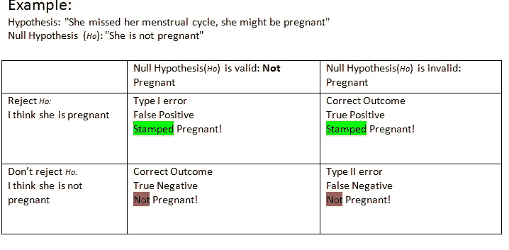
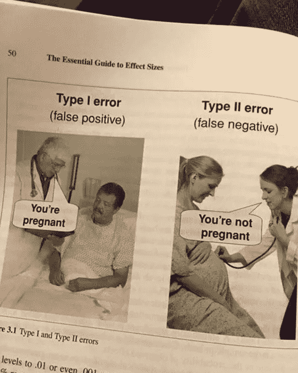

# 模型评估 I:精度和召回率

> 原文：<https://towardsdatascience.com/model-evaluation-i-precision-and-recall-166ddb257c7b?source=collection_archive---------0----------------------->


source - pexels.com

为了测试像支持向量机这样的分类系统的质量，需要执行一些评估指标。支持向量机是我在[内核](https://medium.com/@tejumadeafonja/kernel-function-6f1d2be6091#.aya90wkoe)中简单解释过的分类算法。

# 一点背景

精确和回忆在信息抽取中都有广泛的应用。Precision 是检索到的*的 ***文档的编号，Recall 是检索到的*的 ***相关文档的编号。********

> *相关性是指所呈现的信息对此刻正在讨论的主题有多有用。*

*让我们来看一个约翰和乔希之间对话的例子:*

> *如果约翰说“我喜欢冰淇淋”，而乔希回答“我有一个朋友叫约翰·多伊”，那么乔希刚才说的与约翰暗示的毫无关系，但是如果乔希说“我有一个朋友叫约翰·多伊，他也喜欢冰淇淋”，那么乔希的陈述就变得相关，因为它现在与约翰的陈述相关。*

**精确度和召回率*都非常*有助于理解呈现了哪组文档或信息，以及这些文档中有多少对于所提问题是**实际上**有用的。**

*尽管精确度和召回率有时会被混淆为同义词，但它们不是。*

*精确度和召回率彼此成反比，因此理解它们的差异对于建立有效的分类系统是重要的。*

*让我们考虑另一个例子*

*假设我在谷歌上搜索“什么是精确和召回？”不到一分钟，我就有大约 1560 万个结果。*

*假设在这 1560 万个结果中，与我的问题相关的链接大约有 200 万个。假设还有大约 600 多万个相关但没有被谷歌返回的结果，对于这样的系统，我们可以说它的精度是 2M/1560 万，召回率是 2M/8 万。*

*这意味着谷歌的算法*检索* e 所有 ***相关* *链接*** 的概率是 0.25 ( *召回*)，所有 ***检索到的链接*** *是* *相关*的概率是 0.13 ( *精度*)。*

*思考*精度和回忆*的另一种方式是这样的:*

> *如果有人让你列出你去年圣诞节收到的 5 件礼物的名字，但你记不清这 5 件礼物的名字，所以你随机猜了 7 次。在你记得的 7 个名字中，有 5 个被正确回忆起来，而 2 个是你生日时收到的礼物。即使你有 100%的召回率(5/5)，你的准确率也只有 71.4% (5/7)。*

*现在，我已经让您对精确和回忆有了初步的了解，让我们再深入一点。*

# *第一类和第二类错误*

*谈精度和回忆而不提[*I 型& II 型错误*](https://en.wikipedia.org/wiki/Type_I_and_type_II_errors) *就像叙述穆罕默德·阿里的历史而跳过“拳击”——我**

**

*ouch! that punch was precise :) — source [here](https://www.google.com/url?sa=i&rct=j&q=&esrc=s&source=images&cd=&cad=rja&uact=8&ved=0ahUKEwj3sobt6bfRAhXJO1AKHcCOBroQjRwIBw&url=http%3A%2F%2Fpiximus.net%2Fcelebrities%2Fmohammed-ali&psig=AFQjCNFQ37PwjWLZUlG0zV7MrIoH5XGvsg&ust=1484146264449681)*

## *第一类错误*

*这是一个**真** *零假设(Ho)的**不正确拒绝**。**

> ****零假设是一个默认为真的陈述，除非被证明是相反的。****

*I 型错误导致**假阳性** (FP) *。*例如，当一个文件被搜索引擎返回为“相关”时，结果却是“不相关”。*

*一个例子是，实际上并没有发生火灾，但火警却响了。这种错误等同于“相信谎言”或“虚惊一场”。*

## *第二类错误*

*这是一个**假** *零假设(Ho)的**不正确保留**。**

*这相当于系统忽略了可能没有检索到相关文档的可能性。*

*这种错误会导致**假阴性** (FN)。即没有检索到本应检索到的相关文档。*

*这种情况的一个例子是发生了火灾，但火警没有响。这种错误等同于“不相信真理”或“失误”。*

*考虑下表:*

**

*Table 1.0 (confusion matrix)*

*误报和漏报分别是精确度和召回率的两个独特特征。*

**

*Source [here](http://faxo.com/pregnant-or-not-false-positive-vs-false-negative-70351)*

*减少一个意味着增加另一个*

> *P α 1/R*

# *一些数学公式*

*在分类任务中，*

```
*Precision P = TP/(TP+ FP)*
```

*即{真阳性(正确检索的文档)数)}/{(检索的文档总数)}*

```
*Recall R = TP/(TP + FN)*
```

*即{真阳性(正确检索的文档)数)}/{(检索的相关文档总数)}*

*从 Google 搜索的例子来看， **perfect Precision** 得分为 1.0 意味着搜索引擎检索到的每个结果都是相关的(但没有说明是否检索到了所有相关的文档)*

*而**完美回忆**得分为 1.0 意味着所有相关文档都从搜索引擎中检索到了(但没有说明检索到的结果中有多少是不相关的)。*

*这不是一个非此即彼的问题，因为就一个问题作出的决定会自动影响另一个问题。因此，对于每个系统，通常都有一个基准，它被认为是“可接受的”,而不会失去太多的特性。*

> *对于能够实现最大精确度(无假阳性)和最大召回率(无假阴性)的任何系统，需要没有类型 I 和类型 II 错误。*

*精确度和召回分数不是孤立讨论的。取而代之的是，将一个度量的值与另一个度量的固定水平进行比较(例如，召回水平为 0.75 的精度)，或者将两者合并为一个度量。*

*结合了精确度和召回率的度量的例子是 ***F-measure****

```
*F = 2 * ((Precision * Recall)/(Precision + Recall))*
```

*这个指标通常被称为 **F1 得分**，它是精确度和召回率接近时的平均值。这是调和平均数。*

*其他相关指标有**准确度**、**混淆矩阵**和**列联表**。*

*继续探索吧！*

**感谢*[*Pelumi*](https://medium.com/u/db00622f19c5?source=post_page-----166ddb257c7b--------------------------------)*和*[*Hamza*](https://medium.com/u/6adf4944f581?source=post_page-----166ddb257c7b--------------------------------)*阅读本稿。**

*相关链接*

1.  *[https://en.wikipedia.org/wiki/Null_hypothesis](https://en.wikipedia.org/wiki/Null_hypothesis)*
2.  *[https://en . Wikipedia . org/wiki/Precision _ and _ recall # F-measure](https://en.wikipedia.org/wiki/Precision_and_recall#F-measure)*
3.  *[https://en . Wikipedia . org/wiki/Accuracy _ and _ precision # In _ binary _ class ification](https://en.wikipedia.org/wiki/Accuracy_and_precision#In_binary_classification)*
4.  *[https://en.wikipedia.org/wiki/Confusion_matrix](https://en.wikipedia.org/wiki/Confusion_matrix)*
5.  *[https://en.wikipedia.org/wiki/Contingency_table](https://en.wikipedia.org/wiki/Contingency_table)*