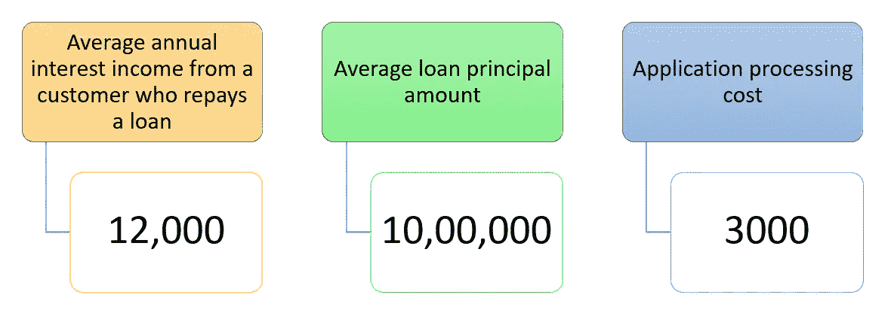
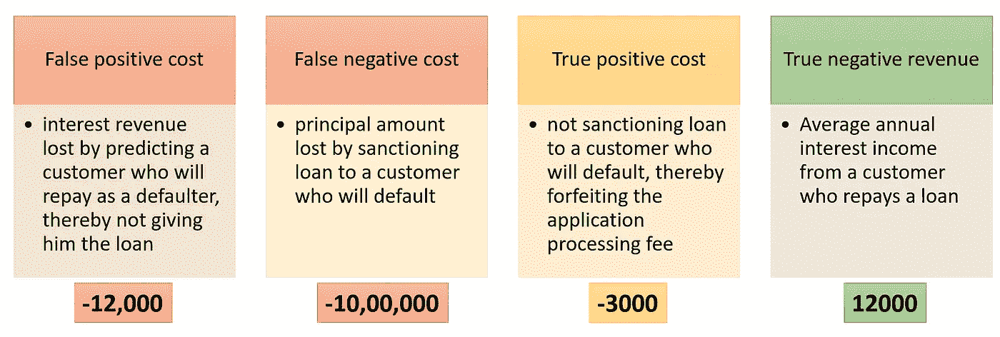
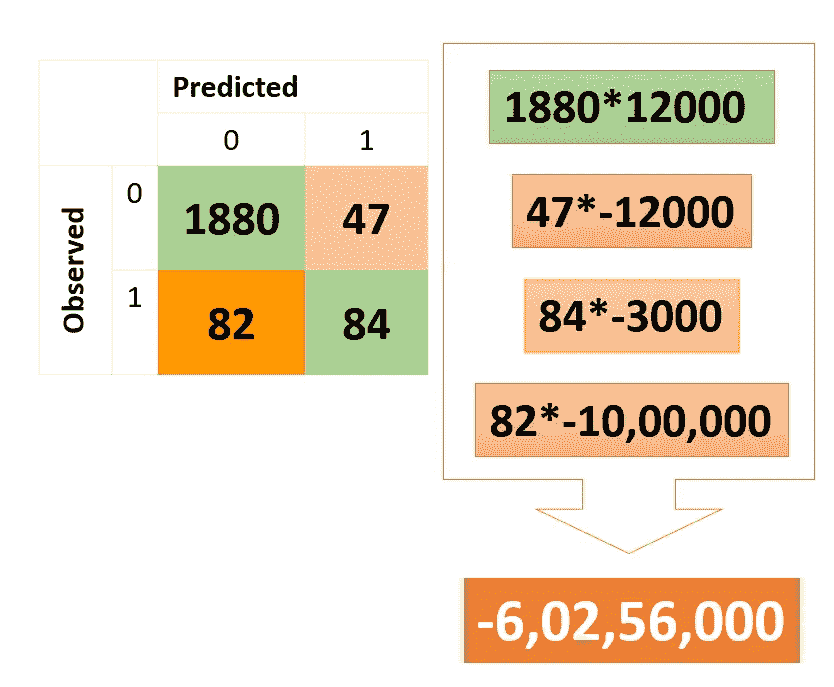
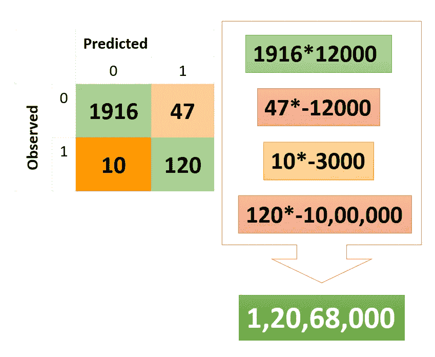

# 分类模型的模型性能和成本函数

> 原文：<https://towardsdatascience.com/model-performance-cost-functions-for-classification-models-a7b1b00ba60?source=collection_archive---------3----------------------->

分类模型是预测分类的 Y 变量的机器学习模型:

1.  雇主会离开还是留下来？
2.  病人到底有没有癌症？
3.  该客户属于高风险、中等风险还是低风险？
4.  客户会支付贷款还是违约？

Y 变量只能取 2 个值的分类模型称为二元分类器。

分类模型的模型性能通常在哪个模型性能最相关方面存在争议，尤其是当数据集不平衡时。用于评估分类模型的通常模型性能测量是准确度、灵敏度或召回率、特异性、精确度、KS 统计和曲线下面积(AUC)。

让我们基于一个预测贷款违约的例子来理解一些模型性能测量。贷款违约数据集是不平衡数据集的一个典型例子，其中两个类是贷款违约 Y 和贷款违约 n。贷款违约者的数量通常只占整个数据集的很小一部分，不超过 7–8%。这提供了一个经典的不平衡数据集来理解为什么成本函数在决定使用哪个模型时至关重要。

在我们深入研究如何制定成本函数之前，让我们看看混淆矩阵、假阳性、假阴性和各种模型性能测量的定义的基本概念。

# 什么是混淆矩阵？

混淆矩阵是包含二进制分类器输出的表格。让我们看看预测贷款违约的二元分类器的混淆矩阵——0 表示客户将支付贷款，1 表示客户将违约。我们进一步讨论的积极类是 1(将违约的客户)。

矩阵的行表示观察到的或实际的类别，列表示预测的类别。

Confusion matrix

Definition of TP, FP, TN, FN

现在，让我们试着理解每个模型性能度量在混淆矩阵的组成部分方面转化为什么。

# 准确(性)

准确性是模型通过记录总数做出的正确预测的数量。最好的准确度是 100%,表明所有的预测都是正确的。

对于不平衡的数据集，精确度不是模型性能的有效衡量标准。对于默认比率为 5%的数据集，即使所有记录都被预测为 0，该模型仍将具有 95%的准确性。但是这种模式会忽略所有的默认值，对业务非常不利。因此，在这种情况下，准确性不是衡量模型性能的正确标准。

# 敏感性或回忆

灵敏度(回忆或真阳性率)的计算方法是正确的阳性预测数除以阳性总数。它也被称为回忆(REC)或真阳性率(TPR)。

Sensitivity

# 特征

特异性(真阴性率)计算为正确阴性预测数除以阴性总数。

Specificity

# 精确

精度(阳性预测值)的计算方法是正确的阳性预测数除以阳性预测总数。

Precision

# KS 统计

KS 统计量是正分布和负分布之间分离程度的度量。KS 值为 100 表示分数对记录进行了精确的划分，一个组包含所有的正数，另一个组包含所有的负数。在实际情况下，高于 50%的 KS 值是理想的。

# ROC 图和曲线下面积(AUC)

ROC 图是 X 轴表示特异性，Y 轴表示灵敏度的图。ROC 曲线下的面积是模型性能的度量。随机分类器的 AUC 是 50%,而完美分类器的 AUC 是 100%。对于实际情况，超过 70%的 AUC 是理想的。

# 精确度与召回率

回忆或敏感度为我们提供了关于模型在假阴性(对将违约的客户的不正确预测)上的表现的信息，而精确度为我们提供了模型在假阳性上的表现的信息。基于预测的结果，精确度或召回率对模型来说可能更重要。

成本函数在决定哪个不正确的预测可能更有害(假阳性或假阴性)时发挥作用(换句话说，哪个性能测量更重要——精确度或召回率)。

# 净收入函数

净收入或成本函数是通过为每个假阳性和假阴性分配成本并基于正确和不正确的预测得出总收入而得到的。让我们假设此贷款默认数据集的成本和收入如下:

Cost components of a loan default prediction model

Allocation of FP, FN & TP cost

Net revenue

由于假阴性成本最高，最 ***的最优模型将是假阴性*** 最小的模型。换句话说，与其他模型相比，具有更高敏感度的模型将获得更高的净收入。

现在我们有了计算净收入的方法，让我们根据混淆矩阵来比较两个模型:

# 混淆矩阵 A

# 混淆矩阵 B

模型 B 由于其较低的假阴性被证明是一个更好的模型，因此可以被选择用于预测违约。

总之，在各种成本成分的相当近似的估计可用的商业场景中，基于成本函数的模型性能度量与传统的模型性能度量(如灵敏度、特异性等)相比，将给出对模型选择的更好的洞察。与给出统计术语相比，如果用成本和收入来解释模型，对客户来说也更有意义。