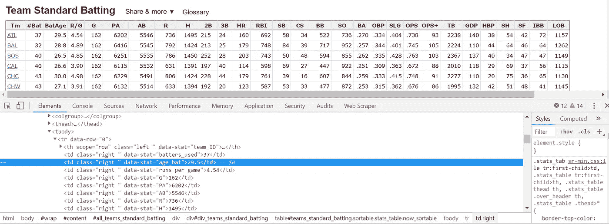
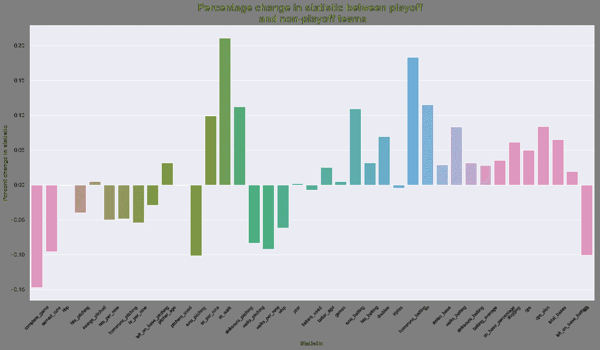
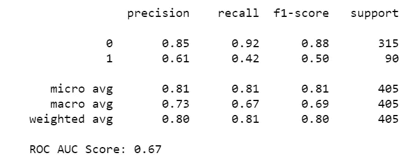
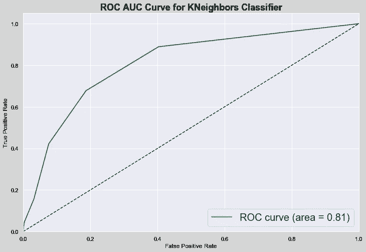
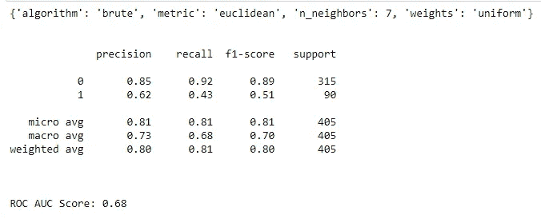
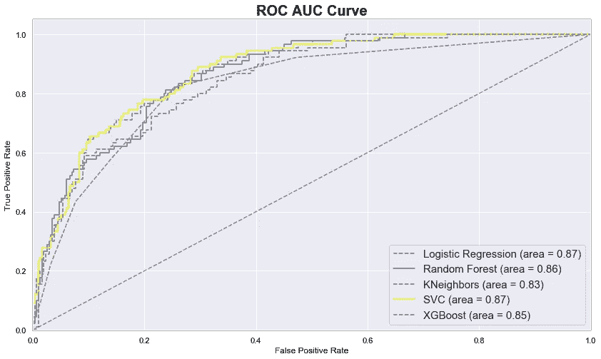
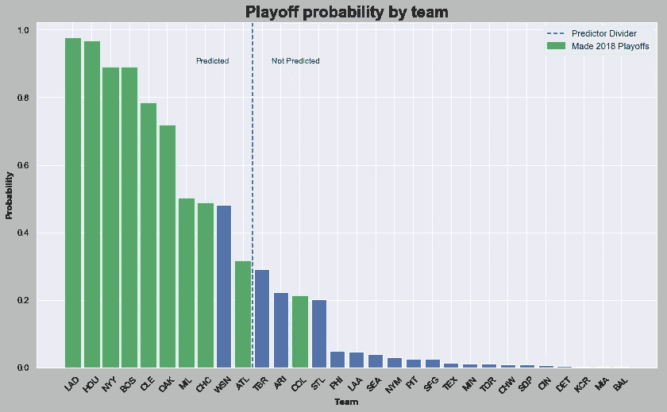

# 为 MLB 2018 年季后赛球队建模

> 原文：<https://towardsdatascience.com/modeling-mlbs-2018-playoff-teams-b3c67481edb2?source=collection_archive---------15----------------------->


[Source](https://www.maxpixel.net/Major-League-Baseball-Baseball-Stadium-Park-Game-566193)

随着十月的到来，季后赛终于开始了。在 162 场棒球赛季的整个过程中，球队会生成数据，而且是大量的数据，因为他们努力进入季后赛，有机会赢得世界职业棒球大赛。越来越多的这种数据被逐场使用，以优化防守排列、场地选择和情况调整。

对于这个项目，我想收集更多的宏观赛季数据，看看我们是否可以预测——以合理的准确度——哪些球队将根据他们的年终统计数据进入季后赛。在建立了截至 2017 年的数据模型后，我们可以引入未经测试的 2018 年数据，看看模型的表现如何。

我们的高级流程是:

*   数据收集和清理
*   数据准备
*   模型测试和调整
*   2018 年季后赛球队预测

*所有网页抓取和建模的项目代码都可以在* [*我的 GitHub 这里*](https://github.com/jordanbean/MLB_Playoff_Classifying) *找到。*

**数据收集和清理**

我想要一个项目，将工作在网络抓取，棒球统计提供了充分的机会，与来自网络的数据工作。经过一番搜索，我发现 baseball-reference.com 有一套强大的可废弃的数据，并使用该网站收集信息。

为了从击球和投球的角度来处理这个问题，我决定收集每一个方面的代表性数据。Baseball-reference 有非常有用的汇总详细统计数据的表格:


Example of annual batting statistics


Example of annual pitching statistics

在检查他们的 robots.txt 页面时，我发现我想访问的页面被允许抓取，并且要求 3 秒钟的延迟，以免服务器过载。

下一步是确定分析中包括多少年。事实证明，1969 年是在网站上包含更详细的团队统计数据的转折点，因此这成为选择的自然年份，以便使用的数据既全面又一致。

击球和投球数据的 URL 格式也被证明是有益的，年份是唯一可以改变的变量。这允许我们用每个目标年份编写一个简单的`for`循环来捕获每个页面上的 HTML。


```
for i in range(1969, 2019):

    site = requests.get('[https://www.baseball-reference.com/leagues/MLB/{}.shtml'.format(i))](https://www.baseball-reference.com/leagues/MLB/{}.shtml'.format(i))) soup = BeautifulSoup(site.text, 'html.parser')
    .
    .
    .
    # Rest of code
```

实际的数据抓取需要检查 HTML 代码，以找到在我们的抓取中调用的正确标签。同样，数据结构很有帮助，因为它在我们的目标特性中是标准化的:



很明显，我们想要捕获的大部分数据都包含在 data-stat 属性下的一个标记中。因此，我们可以定义一个函数，它接收 class 和 data-stat 并返回该标签的内容。对于任何不遵循这种模式的，我们可以只写一次性代码。

```
def get_attribute(class_side, data_stat):

   all_instances = soup.find_all('td', attrs = {'class': 
   class_side , 'data-stat' : data_stat})

   all_instances = [i.text for i in all_instances][:-2] 
   # [:-2] eliminates league total and average return all_instances# Example call to the function:batters_used = get_attribute('right', 'batters_used')
```

一旦获得各个数据点的正确代码就绪，每年的数据就会迭代地添加到 for 循环之外的数据框中，这样，到刮擦结束时，数据框中就有了 1969 年至 2018 年的所有联盟信息。

在这一点上，数据没有丢失值，并且相当干净。最后一步是简单地合并击球和投球数据集，为每支球队每年创建一个单独的观察。

```
df_all = df_pitching.merge(df_batting, on=['year','team'], how='left', suffixes=('_pitching', '_batting'))
```

最后，球队进入季后赛的年份取自维基百科。

**数据准备**

作为准备数据的第一步，我们将通过查看季后赛球队与非季后赛球队在数字列平均值方面的不同来给出变量的上下文:



我们看到季后赛球队在三振出局和跑垒(以及与全垒打和三垒打相关的变量)方面的出色表现，更少的得分/更低的 ERA，以及更稳定的投手阵容(使用更少的投手)——这不是革命性的，但对上下文有帮助。

接下来，数据准备需要两个主要步骤:标准化和缩放数据。

标准化是指变量中的某些幅度差异可能是由于所玩游戏数量的轻微变化(即 163 比 161)造成的。同样地，对于投球统计，有些是每九局报告一次，而有些则是全部。

因此，任何不在预定义范围内的变量(例如，每九局)，我们将标准化为每场比赛的统计数据。


Are differences in variables a result of different number of games played? Or actual differences?


Per-game standardization allows for valid comparisons across teams.

在这个项目中，缩放数据有一个有趣的变化。因为每个赛季都会重置一个球队的统计数据，而季后赛是由单个赛季的表现决定的，所以简单地从整体上缩放数据是行不通的。相反，我们必须在每个季节内单独扩展。

我选择的定标器是[最小最大定标器](http://scikit-learn.org/stable/modules/generated/sklearn.preprocessing.MinMaxScaler.html)。这将获取数据，并根据每列的最大值和最小值将其放在 0 到 1 的范围内。选择这一比例的原因是这种方法很容易解释——可以看出谁在某一年表现最好，并比较不同年份的相对表现。

为了实现逐季缩放的变量，我们可以创建一个空的数据框，遍历每一年，将 MinMaxScaler 应用于该年的数据，并将其附加到新创建的数据框。

```
df_scaled = pd.DataFrame()for yr in list(set(df_all.year)):

    df = df_all[df_all.year == yr]

    df = df.select_dtypes(include=['float','int'])

    scaler = MinMaxScaler()

    df_transformed = scaler.fit_transform(df)

    df_scaled = df_scaled.append(pd.DataFrame(df_transformed))
```


A sample of the MinMaxScaler transformed data. 0 indicates bottom of the league for a given year while 1 indicates the best performing team in that category.

**型号选择和测试**

这个项目很好地解决了分类问题——如果球队在某一年进入了季后赛，那么季后赛一栏标记为 1，否则标记为 0。因此，我们可以测试一系列分类模型，看看结果如何比较。

为了评估我们模型的成功，我们将查看几个不同的指标:[精度、回忆](http://scikit-learn.org/stable/auto_examples/model_selection/plot_precision_recall.html)、 [F-1 分数](http://scikit-learn.org/stable/modules/generated/sklearn.metrics.f1_score.html)，以及[曲线下接收器操作特征面积](https://stats.stackexchange.com/questions/132777/what-does-auc-stand-for-and-what-is-it) (ROC AUC)。要更深入地阅读分类指标，[这是一篇由](/beyond-accuracy-precision-and-recall-3da06bea9f6c)[威廉·科尔森](https://medium.com/u/e2f299e30cb9?source=post_page-----b3c67481edb2--------------------------------)撰写的好文章。

我们的数据是不平衡的，因为我们的样本中只有约 22%被标记为进入了季后赛，这意味着(1)当我们分成训练集和测试集时，我们应该对样本进行分层，以及(2) 22%是我们希望改进的原始基线值，如果随机选择，预计会被猜到。

分层是一种确保我们的测试集有足够的目标变量表示的方法，通过在 sklearn `train_test_split`函数中指定分层选项来实现。

```
X_train, X_test, y_train, y_test = train_test_split(df_features, df_targets, random_state = 60, stratify=df_targets, train_size = 0.7, test_size=0.3)
```

*车型*

我们将测试五种不同的分类模型，每种模型都采用不同的方法来预测数据(我还尝试了一种带有[投票分类器](http://scikit-learn.org/stable/modules/generated/sklearn.ensemble.VotingClassifier.html)的元估计器，但这并没有改善结果)。

我们将经历两次模型测试迭代——首先是开箱即用的模型，然后是[网格搜索](http://scikit-learn.org/stable/modules/generated/sklearn.model_selection.GridSearchCV.html)以优化超参数。

我们将测试的模型是逻辑回归、随机森林、KNeighbors 分类器、支持向量分类器(SVC)和 XGBoost 分类器(XGB)。

逻辑回归使用误差最小化[来创建分隔数据的线性边界](https://codesachin.wordpress.com/2015/08/16/logistic-regression-for-dummies/)，随机森林构建一系列决策树来进行预测，KNeighbors 计算一个点与其“n”个邻居之间的距离，然后汇总邻居的预测。

[SVC 使用超平面](http://blog.aylien.com/support-vector-machines-for-dummies-a-simple/)划分数据，并根据点相对于超平面的位置进行预测，XGBoost 使用迭代残差调整来改善预测。

既然已经收集、清理和准备好了数据(包括分成训练集和测试集)，运行和测试开箱即用模型的实际操作就只有几行代码:

```
from sklearn.neighbors import KNeighborsClassifierknc = KNeighborsClassifier()knc.fit(X_train, y_train)print(classification_report(y_test, knc.predict(X_test)))
print(roc_auc_score(y_test, knc.predict(X_test)))
```



解释精确度的方法是，对于这个模型，在预测进入季后赛的球队中，61%是准确的(精确度)。在应该被标记为进入季后赛的球队中，42%被正确识别(回忆)。F-1 分数是两者的混合平均值。ROC 绘制假阳性率对真阳性率，然后 AUC 使用微积分和积分来确定曲线下的面积(越高=越好)。



对于这五个模型中的每一个，我首先拟合和预测现成模型的概率。SVC 和逻辑回归模型实现了测试数据的最高精度(0.65)，最高的召回率和 ROC AUC 分数是 XGBoost 分类器(分别为 0.57 和 0.74)。

*提高车型性能*

接下来，我们将看看是否可以通过调整超参数来改进模型。因为总的数据集不是太大，我们可以用一系列不同的超参数选项进行全面的网格搜索。

网格搜索的基本前提是，它用参数的每种排列来拟合模型，然后返回得分最高的那个。我们通过传入超参数选项的字典来初始化和拟合模型，然后使用标准的 sklearn `fit`方法。

```
params_knc = {'n_neighbors':[3, 5, 7, 9, 11], 'weights':['uniform', 'distance'], 'metric':['euclidean','minkowski']}gs_knc = GridSearchCV(KNeighborsClassifier(), params_knc, cv = 5)gs_knc.fit(X_train, y_train)
```

为了得到最佳参数，我们可以简单地在我们拟合的模型上调用`.best_estimator_`，我们可以用与前面模型相同的调用得到分类报告和 ROC AUC 得分。

```
print(gs_knc.best_params_)

print(classification_report(y_test, gs_knc.predict(X_test)))

print(gs_knc.best_params_)print(classification_report(y_test, gs_knc.best_estimator_.predict(X_test)))print('ROC AUC Score: %.2f' % roc_auc_score(y_test, gs_knc.best_estimator_.predict(X_test)))
```



KNeighbors Classifier Grid Search Results

最终，超参数调整略微改进了模型，最高精度提高了 0.05 到 0.70(随机森林)，而召回没有看到任何改进。

调整后的 SVC 和逻辑回归在曲线下面积上得分最高:



**预测 2018 年 MLB 季后赛球队**

该项目的目标是根据年终统计数据预测哪些球队将进入 2018 年季后赛。由于季后赛正在进行，我们可以在这个看不见的数据上测试数据的表现(2018 年的数据没有在任何模型测试中使用)。

我们可以从两个角度来处理这个问题。首先，我们将让模型预测现状，看看哪些球队通过了季后赛预测的门槛。接下来，使用我们的领域知识，即 10 支球队将进入季后赛(包括外卡)，我们可以选择预测概率最高的 10 支球队，看看其中有多少是正确的。

*模型预测*

使用我们优化的模型，最好的结果来自 XGBoost Classsifier，其精度为 1.00(所有预测都进入了季后赛)，召回率为 0.80(在进入季后赛的 10 支球队中，模型正确识别了 8 支)。

XGB 分类器错误识别的球队是密尔沃基队和科罗拉多队，其中一支球队——科罗拉多队——是 NL 的外卡参与者，这意味着他们不会在模型适用的一些过去季后赛球队的结构下进入季后赛。

*用概率预测*

在模型上使用`predict_proba`方法，我们可以利用我们对 10 支季后赛球队的领域知识，来看看预测的前 10 支球队与进入季后赛的 10 支球队相比如何。

事实上，这种方法为优化的 SVC 模型产生了 10 个正确预测球队中的 9 个的结果，唯一的错误是模型预测华盛顿将进入季后赛，而科罗拉多不会。



**最终想法**

一个简单的模型在大约 22%的情况下随机做出了正确的预测，而我们最好的模型在这个数字上提高了近 160%,预测准确率为大约 57%。

此外，当将模型应用于看不见的数据时，在领域知识的帮助下，我们将正确预测的百分比提高到了 90%。

虽然调整并没有显著改善模型，但使用不同的模型确实改变了预测能力和最终结果的准确性。在性能最差和最好的分类模型之间，召回率提高了 40%以上。

改善结果的后续步骤可能包括:

*   将数据分成不同的时间段，并优化每个独特时间段的超参数，以查看季后赛因素是否变化
*   将预测概率方法应用于每年，并观察它捕捉季后赛球队的准确性
*   整合其他数据源(成功率可能是一个很高的预测值，但我想在本次分析中排除它)
*   测试神经网络或更复杂的模型
*   当前数据集中更深层次的特征工程

对我来说，这一点的一个有趣的未来应用将在明年投入生产，在整个赛季中实时跟踪球队的预测季后赛概率，并查看从开始到结束的赛季如何利用这一模型改变季后赛预测。

*如果您有任何反馈或想法要分享，可以通过 jordan@jordanbean.com 联系我或在* [*LinkedIn*](http://www.linkedin.com/in/jordanbean) *上给我发消息。*