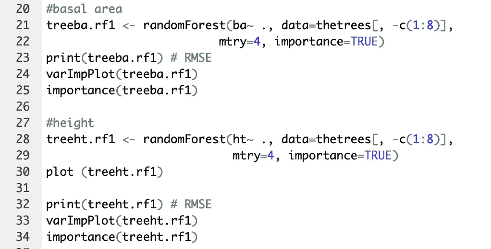
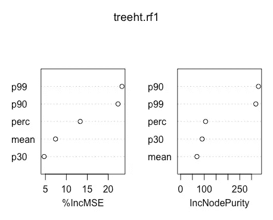

# 模拟纽约芬格湖国家森林的树高和断面积

> 原文：<https://towardsdatascience.com/modeling-tree-height-and-basal-area-in-the-finger-lakes-national-forest-ny-567b763615c6?source=collection_archive---------19----------------------->

## 我尝试使用 R 包 randomForest 来创建两个树高和断面积的回归模型，这两个模型是基于一些激光雷达和在纽约手指湖国家森林中实地收集的数据。

声明:这个项目是我对 R 的第一次真正体验。在这个学期的早些时候，我对 R 如何工作，如何上传数据做了一些简单的学习，试图熟悉 R 的行话，等等。我还有很多东西要学，有时也非常依赖我那位出色的 GIS 教授，但我认为我对使用 R 的感觉肯定比几个月前要好。

下面我将试着概述一下我是如何完成这个项目的。关于背景和上下文，我将简单介绍一下我在 arcGIS 和 FUSION 中所做的工作，但这篇文章的重点将是使用 R 包 randomForest 来测试变量的重要性并建立回归模型。

开始了。

## 我开始用的数据(这部分和我在 R 里做的无关):

因此，我最初用的是一个 Excel 文件，其中包含实地收集的数据变量，其中包括每个地块的测量平均树高和断面积(这两个变量我决定用 R 建模)。对于激光雷达数据，我有一堆 LAS 格式的激光雷达文件，覆盖了整个手指湖国家森林。为了从激光雷达数据中获取我需要的度量值以用于在 randomForest 中创建模型，我必须使用激光雷达查看/处理软件工具 FUSION。通过使用 FUSION 的 grid metrics 功能，我获得了整个激光雷达数据集输出的一系列大约 60 个描述性统计数据，这些数据以栅格(grid)的形式存储在一个巨大的 CSV 文件中。我不打算尝试在我的模型中使用所有这些统计值。对于这个项目，我正在研究一些已经发表的关于该主题的科学论文的方法，这些论文的共同主题是只选择几个网格度量变量用于随机森林模型生成过程。所以，我最终保留了 Brubaker 等人论文中的五个变量的值。al 2018 使用:每个单元的平均值(每个单元是一个 15 x 15m 米的区域)，每个单元的第 30、90 和 99 百分位值，以及每个单元的覆盖百分比。这被保存为 CSV 文件，下面谈到的“grid.csv”。

然后，我将“grid.csv”加载到 arcGIS 中，将其转换为所有像元的 shapefile，然后在空间上将它连接到我收集的关于地块的野外数据，这就生成了下面将要讨论的文件“FieldandLidarData.csv”。

## 我实际上最终在 R 中使用的数据(R 代码中出现的文件的名称在引号中):

*   “grid . csv”-一个 CSV 文件，其值超过 900，000(！！)15 x 15m 米激光雷达像元。关键值包括:每个 15 x 15m 米激光雷达像元的 UTM 坐标，以及我选择用于我的模型的 5 个格网度量统计数据:每个像元的平均值、每个像元的第 30、90 和 99 百分位值，以及每个像元的覆盖百分比。来源:我在 FUSION 中基于最初为 Brubaker 等人 2018 年的研究收集的激光雷达数据创建了这个文件。
*   “fieldandlidardata . csv”-一个 CSV 文件，其中包含手指湖国家森林中约 100 个场地地块的值。关键值包括:田间收集的每块地的平均树高和断面积，以及与“grid.csv”文件中相同的 5 个网格度量统计的每块地的值。来源:这是我通过将“grid.csv”中的信息与 arcGIS 中的绘图数据进行空间连接而生成的文件。

因此，基本上这两个文件包含几乎完全相同的属性，除了覆盖不同区域的值:“grid.csv”具有整个国家森林的值，而“FieldandLidarData.csv”仅覆盖整个森林中随机放置的 100 个小研究地块的区域。这两个文件之间的另一个关键区别是,“FieldandLidarData.csv”文件包含野外采集的每个地块的平均树高和断面积值，而“grid.csv”文件不包含整个研究区域的这些值……这些是我试图使用 randomForest 获得的值！

## 我试图回答的关键问题是:

整个手指湖国家森林的树高和断面积是什么样的？

## R 中的角色进展如何:

我把上面提到的两个文件保存到我电脑上的一个文件夹中，所以我只是在那里设置了目录，安装了 randomForest 包，然后去了镇上。注意:我将只显示断面积或树高中的一个的代码和图表，因为我实际上对它们两个都做了完全相同的步骤。

我做的第一件事是查看我用来计算断面积和树高的 5 个变量的重要性。我一次运行一个模型。我首先用我的第 21 行代码*种植森林*，见下文。数据“thetrees”是“FieldandLidarData.csv”文件的列，其中包含我的 5 个网格度量变量的值。然后我打印了结果，显示我种植了 500 棵树的回归森林，模型解释的变异百分比是树高 48.02%，断面积 26.61%，百分比不是很大，但也不错。然后，我用我的第 23-25 行代码生成了一个变量重要性图，以查看 5 个变量中哪个比其他变量更重要，下面显示了树高变量的图片。

Code for the variable importance bit for both basal area and height.

The variable importance plot I got for tree height. Clearly the 30th percentile variable didn’t matter…

接下来的议程是查看一些模拟值与每个地块的基础面积和高度的实际值的快速图。肯定有很多分散的情况，但是直观地看到模型中的东西与实际收集到的东西相比有多好是很好的。

The plot I made for tree height (it looks better than the basal area one did so I’m using it).

The code I used to generate my modeled vs. actual height plot.

最后，我进去把我的树高和断面积模型应用到整个手指湖国家森林！因此，我调用了一个巨大的“grid.csv”文件，其中包含整个森林的 UTM 坐标和网格度量数据，然后使用我之前生成的模型来预测研究区域中每个 15 x 15 m 地块的高度和断面积值。然后我将这些数据保存在一个 CSV 文件中，耶！我说完了。

My code for making my height model for the entire study area. I used the head function a few times just to see how things were going before I generated another massive CSV file.

**在能够查看我的模型后，我的一些模式和想法:**

如果你好奇的话，下面是一些在 arcGIS 中制作的小面积森林的地图。我想调查手指湖国家森林周围的树高和断面积值，通过显示我在 R 中得到的预测值，我能够做到这一点，看起来真的很酷。

a) is satellite imagery, b) shows how old the forest is in the area, c) shows the predicted tree height values per cell and d) shows basal area.

一般来说，树高不会超过 25 米，而断面积在 2 米/公顷以下。总的来说，模型似乎与我们在卫星图像中看到的高大/古老的树木非常匹配，而且看起来高度和断面积彼此之间以及与林龄呈正相关——我最终也研究了断面积和高度如何随林龄变化，因为手指湖国家森林的一些部分比其他部分的森林覆盖时间更长。

如果我有更多的时间，我想我会更深入地研究树高和断面积是否真的与林龄有关。我还会更多地考虑我使用了哪些变量以及使用了多少变量，以便尝试在数据中获得更多的解释变量，特别是对于基底面积，因为我们看到的变量中只有四分之一多一点被模型解释。

## 参考资料:

布鲁贝克，K. M .，Q. K .约翰逊和 M.W .凯耶。(2018)."用离叶和开叶激光雷达研究落叶林中乔木和灌木生物量的空间格局."*加拿大森林研究杂志*。48(9): 1020–1033.

墨菲，P. W. (2018)。*未公布数据。*