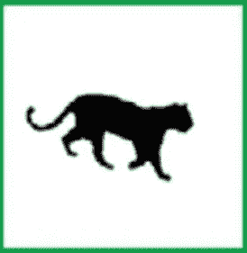
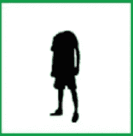
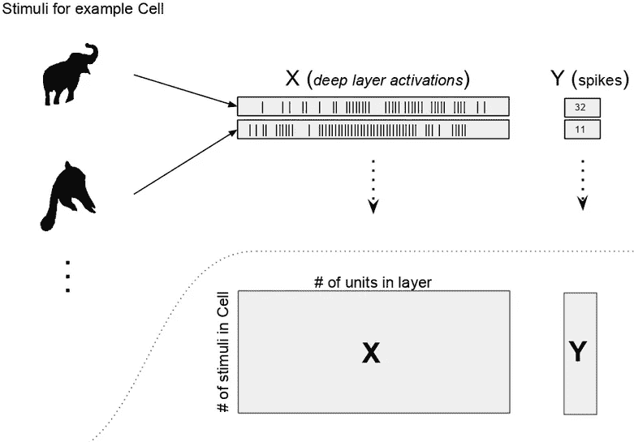

# 用卷积神经网络建模视觉神经元

> 原文：<https://towardsdatascience.com/modeling-visual-neurons-with-convolutional-neural-networks-e9c01ddfdfa7?source=collection_archive---------11----------------------->

## (针对非技术人员)

我们的大脑很奇怪。这个奇怪的器官已经进化了数百万年，不断变化和调整，以处理他们会遇到的新刺激和条件，看起来像一袋黏糊糊的物质，以各种方式折叠在我们的大脑中。然而，这个器官和由它组成的数十亿个神经元是我们理解什么是智能以及它是如何出现的最佳赌注。另一个很好的赌注是我们自己创造(人工)智能，然后解释我们自己的创造。

近年来，我们离创造智能机器又近了一步。至少在视觉方面，我们现在拥有可以从数千个类别中准确分类图像的系统。这要归功于**卷积神经网络**(**CNN**)和用于训练它们的图形处理单元的效率。给定每个类别足够数量的图像来训练这些网络，CNN 可以学习调整它们的人工神经元的连接强度(“权重”)，这样，在训练后，它们能够对它们从未见过的图像进行分类。

Fig1\. How a typical CNN looks ([source](https://en.wikipedia.org/wiki/Convolutional_neural_network#/media/File:Typical_cnn.png))

有趣的是，为了做到这一点，CNN 受到了我们大脑视觉系统的松散启发。视觉信息通过我们的眼睛进入我们的大脑，通过大脑区域的神经元传播，并在越来越复杂的阶段被消费，从简单的视觉表示如边缘、线条、曲线等开始。并且继续更复杂的表示，例如面部或全身。这导致一个人理解关于被观察物体的越来越复杂的信息。事实上，这种在日益复杂的阶段中对信息的解构似乎也是 CNN 所复制的。这个概念对于旧的视觉计算方法来说并不陌生。在更古老的、受生物学启发的 [HMAX](https://www.google.com/url?sa=t&rct=j&q=&esrc=s&source=web&cd=1&cad=rja&uact=8&ved=0ahUKEwiG8aq-0YPcAhVFNOwKHWr6DpkQFggpMAA&url=http%3A%2F%2Fcbcl.mit.edu%2Fpublications%2Fps%2Fnn99.pdf&usg=AOvVaw0ce8VOk9BcAa_gvLeQOg1i) 模型中也可以看到这一点，该模型试图将大脑皮层中的视觉处理解释为“越来越复杂的表示层次”(更多信息请参见这里的、[这里的](https://www.ncbi.nlm.nih.gov/pubmed/28532370)和[这里的](http://www.cell.com/neuron/abstract/S0896-6273%2817%2930509-3))。

我们如何使用 CNN 层中的人工神经元来创建大脑视觉区域神经元的模型？“模型”是一个数学函数，给定与生物神经元相同的输入，可以产生类似的输出。为了创建它，首先需要理解和定义输入。

在这里，我们来看看我和我的同事在鲁汶大学神经生理学小组进行的一项研究。这项研究专门研究了**下颞叶皮层**，这是我们视觉系统的“晚期”处理阶段之一([腹侧流](https://en.wikipedia.org/wiki/Two-streams_hypothesis#Ventral_stream))，更具体地说，是从一部分细胞中进行的，这些细胞对包含身体的图像比对其他类别的图像(如面部)更敏感。当图像中出现一具尸体时，即使是无头的，他们也会很兴奋！

示例输入是空白背景上的轮廓图像(见下文)

Fig2\. Example image shown to biological neurons (without the green frame) ([source](http://www.eneuro.org/content/4/3/ENEURO.0113-17.2017)).

生物神经元对图像的反应是这样的(图 2)，科学家可以通过**电生理学**实验收集神经元的反应。在这样的实验中，一只猴子在监视器上看到图像，一个插入大脑的电极记录神经元对图像的活动或反应。
一些形状是随机的，一些形状像动物或人体，而其他形状像其他类别的轮廓。这项研究的目标是什么？为了找出 1)我们是否可以使用 CNN 层的人工神经元来预测该神经元对剪影图像的实际生物反应，以及 2)发现 CNN 的哪一层(早期、中期或晚期)对这些反应的建模最好。

Fig3\. Body patch neurons would be excited looking at this…

## 卷积神经网络

CNN 的作用是接收输入图像，并为其训练识别的每个类别返回多个概率。

常见的 CNN 架构通常在早期层中包括数百个特征地图，并且该数字在接下来的更深层中逐渐减少。这些特征图(如示例 CNN 架构图所示)是整个层的切片，每个都由数千个神经元组成。

在谈论 CNN 时，“功能”这个词经常出现，要准确理解它的意思可能会令人困惑。所谓“特征”，我们指的是我们神经元的输出；术语“激活”也可以与特征互换使用，因为从神经科学的角度来看，t 更容易理解，因为它指的是在给定输入刺激的情况下神经元“激活”的程度。对于那些感兴趣的人来说，网上有很好的资源，它们很好地解释了 CNN 如何更详细地工作(例如[卡帕西的课程](http://cs231n.github.io/convolutional-networks/)， [C .奥拉的博客](http://colah.github.io/posts/2014-07-Conv-Nets-Modular/)，[阿迪特·德什潘德的博客](https://adeshpande3.github.io/A-Beginner%27s-Guide-To-Understanding-Convolutional-Neural-Networks/)，[这篇黑客文章](https://hackernoon.com/visualizing-parts-of-convolutional-neural-networks-using-keras-and-cats-5cc01b214e59)等)。).让我们看看我们的神经元在做什么。

特征图中的每个神经元只能“窥视”输入的一小部分区域。因此，特征图左上角的神经元可以看到输入图像左上角的小窗口。同一个特征图中紧邻它的相邻神经元可以看到与第一个神经元的窗口相邻的小窗口。这意味着特征图可以通过用它的神经元“扫描”它来看到整个输入图像。那么为什么我们需要这么多的特征地图呢？所有这些神经元实际上是做什么的？

每个神经元根据其所属的层被分配一个数学运算来执行。这个操作涉及神经元的权重(连接强度)和它能看到的小窗口。

你可能想知道如何在权重和图像之间执行任何种类的数学运算。这是可能的，因为在数字世界里，一切都是数字。权重是指示神经元与构成图像(或该图像的小窗口)的像素的连接强度的数字。像素也是数字，在黑白图像中，黑色像素用数字 0 表示，白色像素用数字 1 表示。在灰度图像中，一个像素可以取一个范围内的值(我们通常定义为 0–255；见[为什么](https://homepages.inf.ed.ac.uk/rbf/HIPR2/value.htm)表示其亮度。范围的一端是黑色(最暗)，另一端是白色(最亮)。彩色图像有点复杂，因为它们的每个像素都有三个值来表示其在颜色通道中的亮度。我们使用红色、绿色和蓝色通道进行显示，因此我们将彩色图像称为 RGB 图像。

正如我们前面所说的，每个神经元根据其所属的层被分配一个数学运算作为其任务。例如，第一卷积层中的神经元在其权重和输入图像中的小窗口之间执行卷积运算。该卷积运算是权重和像素值之间的逐元素乘法，然后是结果的总和。这个想法是，如果神经元检测到一个看起来像它的权重模式的模式，它将输出一个很大的数字。通过训练网络，这些权重实际上会发生变化，看起来像输入的模式。因此，你可以把一个神经元想象成一个模式检测器，检查它正在观察的区域是否包含一些熟悉其权重模式的东西，并输出这种熟悉程度的“分数”。有趣的是，相同特征图的神经元被设置为具有相同的权重，因此每个特征图基本上扫描整个输入图像以寻找特定的模式。因此，我们拥有的特征地图越多，我们检测到的模式就越多。

任何子采样层或池层中的神经元取前一层中的小窗口的单个值。因此，最大池层的神经元简单地取那个小窗口的最大值。这里的想法是，即使你将输入图像移动到一边，甚至旋转，或缩放，池层中的神经元仍然会检测到类似的模式。这使得 CNN 能够容忍这些图像变换。

卷积和子采样层通过收集关于图像的信息并输出他们发现的重要点的更压缩的摘要，尺寸逐渐变小。请注意，在经典的 CNN 架构中，这些层接收来自它们之前的层的输入信息。还有更多体系结构，信息“跳过”各层，创建循环连接，但这里不讨论这些。

图像内容信息将最终出现在完全连接的图层中，这有助于我们进行最终分类。全连接层中的神经元连接到前一层的所有神经元。完全连接图层的作用是创建先前图层收集的关于输入图像的所有信息的展平表示。它是扁平的，因为这些层中的神经元的结构不像特征图，人们可以将它们视为一维数字阵列。这种扁平化的表示比以前的层包含更少的神经元，这有助于达到我们正在训练 CNN 识别的类别数量的最终目标。最终，我们将得到每个类的分数列表作为输出，最高分将指示最可能的类。

## 数学建模

研究中使用的网络是“预先训练的”。这意味着他们已经接受了使用一个非常大的[数据集](http://www.image-net.org/)对图像进行分类的训练，然后他们的网络权重被保存下来，供[下载](http://www.vlfeat.org/matconvnet/pretrained/)公开使用。因此，为了获得每一层的激活，向这个预先训练的网络提供输入图像，然后获取每一层的输出。人们可以想象图像在网络中“流动”，就像信息在我们的大脑中流动一样，然后我们可以在每个处理阶段(层)捕捉它。这些捕获的信息是我们用来创建模型的。

这里的数学建模任务是测量生物神经元的响应与相应的人工神经元激活值之间的关系。这项任务被统计学家称为“回归分析”，即在给定其他变量(人工神经元激活)的值的情况下，试图预测一个变量(生物神经元的反应)的值。

在每一个回归分析中，都涉及到两个数值矩阵:预测变量的 X 矩阵和目标变量的 Y 矩阵。在目前的场景中，人们可以考虑整个 CNN 的神经元，并建立一个巨大的 X 矩阵作为预测器，但即使对于现代的计算机来说，这也是非常计算密集型的，并且它不会给我们任何关于层内差异的想法。因此，我们为每个 CNN 图层建立了一个单独的回归设置，下图显示了一个示例。

Fig4\. X and Y matrices for our Regression problem. Note that the images are black-n-white (binary), but to pass them as input to a CNN, we replicate them twice to end up with a 3D volume (the bnw image 3 times). The trained weights are also 3D volumes and to understand how they interact with the input, check [this](https://cs231n.github.io/assets/conv-demo/index.html) incredible visualization from Karpathy’s CS231n course (and also read the rest of the blog for more details).

通过建立这些回归分析设置，我们本质上是试图用 CNN 层中存在的所有人工神经元来取代猴子的生物神经元( **X** )。最终，这项研究发现，较深的 CNN 层被证明是身体贴片神经元的强大模型，这些神经元在我们大脑的视觉处理阶段也更深。虽然预训练网络是使用自然图像训练的，但这并不妨碍使用剪影图像的研究结果。因此，深层 CNN 层可以接收图像作为输入，并产生非常接近实际神经元产生的响应。更重要的是，来自这些深层之一的最佳模型，平均可以解释真实神经元对轮廓反应的 80%的可变性。

为了建立一种人工方法来表示与神经元 C65b 相同的功能，我们需要使用一种有效的数学方法来获得给定 x 的 Y。我们将在更多**技术部分**(即将推出)中介绍这一点。在那里，我们将回顾我们的建模选项，以及为什么它不是一个可以用简单的线性多元回归解决的简单问题。

## 剧终

*(更多关于数学建模的技术部分将在后面介绍)*

> *声明:我是 eNeuro 的出版物* [*这里*](http://www.eneuro.org/content/4/3/ENEURO.0113-17.2017) *的作者。此处展示的所有数据(示例图片)均属于鲁汶大学，有关该主题的更多详细信息，您可以参考 eNeuro journal 或鲁汶大学。*

扬尼斯