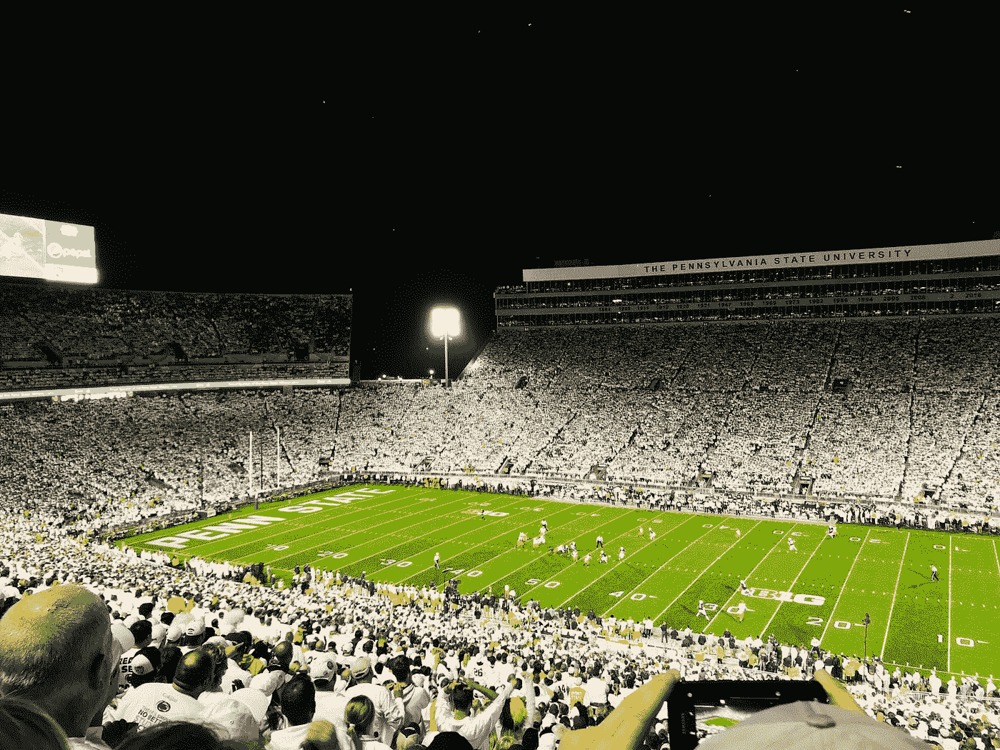

# 使大学橄榄球决赛现代化

> 原文：<https://towardsdatascience.com/modernize-the-college-football-playoff-d24d690f1435?source=collection_archive---------10----------------------->

在一个由分析驱动的时代，大学足球使用数字而不是意见来选择季后赛球队。

Photo by [Alex Korolkoff](https://unsplash.com/@koff?utm_source=medium&utm_medium=referral) on [Unsplash](https://unsplash.com?utm_source=medium&utm_medium=referral)

随着大学橄榄球赛季最后一周(通常称为竞争周)的临近，大学橄榄球季后赛的 4 支球队似乎一如既往地清晰可见。尽管我们认为我们知道最好的 4 支球队，但由大学橄榄球季后赛委员会提供的第 13 周排名再次令人惊讶。5 队 4 负排名，创历史新高。UCF 的排名高于俄亥俄州。路易斯安那州立大学，尽管输了两场(包括一场 29-0 的井喷)，仍然排在第 7 位。也许这些决定都有可取之处，但是没有委员会的解释或透明度，目前的系统对许多人来说是不完善的。要了解大学足球季后赛的目的，以及如何修复这个系统，我们必须看看大学足球排名系统的历史。

# 排名简史

## 1936-1997:投票时代

大学足球(CFB)冠军是由预先确定的一组选民组成的不同投票选出的。引用最多的两项民意调查是美联社民意调查，由媒体成员投票选出，以及《今日美国》教练民意调查，由 62 名精选的 CFB 教练投票选出。在这个时代，这些民意调查偶尔会发生冲突，在赛季结束时产生两个不同的冠军。最好的两个队也不能保证互相比赛，这导致了关于谁将在第一和第二队之间赢得比赛的假设。随着其他投票开始流行(CNN 投票等)，很明显最好的球队应该在球场上解决争论。

## 1998 年至 2013 年:波士顿咨询公司

BCS 旨在通过在赛季末选择最好的两支球队争夺冠军来解决投票时代的问题。使用计算机化的分数，BCS 考虑了几个因素来对团队进行排名。该分数由 3 个因素组成，所有因素的权重相等:教练投票、哈里斯投票和 6 个计算机排名的平均值，去掉最高和最低的排名以说明异常值。哈里斯民意调查是由专门从事互联网研究的市场调查公司进行的，在美联社决定他们不想被纳入 BCS 公式后，该公司取代了美联社的民意调查。哈里斯民意调查在 2013 年赛季结束后结束。提到的 6 个计算机排名是:

*   [**萨加林:**](https://www.usatoday.com/sports/ncaaf/sagarin/) 各队使用国际象棋常用的 ELO 评分系统进行排名。输赢是主要标准，获胜的队伍比他们的对手得分高。每个团队最初是根据他们的预期获胜次数来评分的，如果一个团队的获胜次数超过了他们的预期值，他们的评分就会提高。该模型还考虑了游戏地点的因素，以说明难度。
*   [**Wolfe:**](http://prwolfe.bol.ucla.edu/cfootball/ratings.htm) 每支队伍都使用最大似然估计量(MLE)进行评分，A 队击败 B 队的概率简单描述为(ARating)/(ARating + BRating)。这被描述为布拉德利·特里模型。
*   [**梅西:**](https://www.masseyratings.com/cbase/ncaa-d1/ratings) 根据他的网站:每场比赛都通过一个等式“连接”两支球队。随着游戏越来越多，最终每个团队都通过某种游戏链与其他团队联系在一起。当这种情况发生时，方程组是耦合的，需要用计算机来同时求解。收视率是完全相互依赖的，所以一个球队的收视率会受到它没有参加的比赛的影响。因此，解决方案实际上依赖于对手、对手的对手、对手的对手的对手等等的无限链条。最终评级代表一种平衡状态，在这种状态下，每个团队的评级与其良好和不良表现完全平衡。
*   科利: 赛程和胜率的强弱最重要，比分差距或对手胜率则无关紧要。没有任何修正的简单统计模型。
*   安德森:再次强调，赛程的强度至关重要。各队因安排优质对手并获胜而获得奖励，分数差异无关紧要。球队会进一步受到对手的对手和整个赛季中联盟整体表现的影响。
*   [**比林斯利:**](http://cfrc.com/ranking/billingsley-report-87/) 季前赛投票开始的唯一投票，根据比赛时各队的快照来奖励各队。例如，如果华盛顿队与第五名俄勒冈队比赛，并且华盛顿队赢了，而俄勒冈队在本赛季剩余的比赛中打了坦克，则华盛顿队仍然被认为赢了第五名队。亏损会受到重罚，因此在这个模型中保持不败会得到很多奖励。

BCS 排名选出赛季末的前 2 名球队，1 号打 2 号争夺全国冠军。虽然排名比投票时代更准确地代表了球队的表现，但许多大学足球社区的人认为两队太少了。许多年来，非常有资格的球队落后于第二名仅仅十分之几的分数，然而却被淘汰出冠军争夺。是时候扩展领域了。

## 2014 年至今:大学橄榄球决赛

NCAA 通过在 2014 年成立 CFP 委员会解决了 BCS 问题，该委员会由来自 CFB 社群的 13 名轮流成员组成。这个委员会选出最好的 4 支队伍参加冠军决赛。尽管该领域从 2 个团队扩大到 4 个团队，但委员会的决策在其存在的 4 年中不断受到质疑，2018 年的任何混乱都将提供另一个具有挑战性的选择。总结委员会以前有问题的决定:

*   2014 年:俄亥俄州对 TCU 和贝勒。OSU 赢得了 10 大冠军，而 TCU 和贝勒被排除在外，因为一个感知“较弱”的时间表。
*   **2016:** 俄亥俄州对宾州。PSU 以 27 比 24 的比分击败了 OSU，宾夕法尼亚州立大学赢得了十大冠军。然而，OSU 被选中是因为一个被认为“更强大”的时间表。
*   **2017:** 阿拉巴马州对俄亥俄州。阿拉巴马州是第二支进入季后赛的 SEC 球队(排名第一的是佐治亚州)。只有 1 次失败，但没有分区或联盟冠军，阿拉巴马州被选中超过 10 大冠军 OSU，因为人们认为失败的质量较低。

在委员会存在的 4 年中的 3 年里，围绕所做的决定存在严重的争议。这场季后赛的内在结构是排除至少一个 5 强冠军。如果在选择全国锦标赛的最佳球队时不考虑联盟锦标赛，那么目前的选择过程是有缺陷的，并且充满了委员会成员影响的可能性。在每个主要运动都接受数据和分析的时代，大学足球应该接受基于优点的排名模型，并致力于消除 13 人董事会可能带来的偏见，特别是在决策没有任何透明度的情况下。BCS 投票成功了，只需要扩展到 4 个团队就可以解决 BCS 的紧迫问题。

然而，要修复这个系统，需要解决两个问题:意见和数据应该如何平衡？而我们是否应该每年至少排除 1 次 Power 5 大会？

## 现代化的碗季后赛(MBP)

在一个理想的系统中，排名将捕捉到大学足球世界的完整画面。这个新系统，我们称之为现代化的碗季后赛(MBP)，建立在 BCS 模型之上。首先，AP 调查和教练调查将各占 1/6 的分数，或总分数的 1/3。这确保了人类的感知影响排名，但不是驱动力。第二，平均 7 次民调会占 2/3 的分数，同时保留每个队的最高分和最低分。这将确保没有单一模型比另一个模型具有更大的权重，并且如上所述，将允许包括诸如快照胜利(击败当时排名第二的团队等)的因素。随着更新、更先进的计算机模型的出现，MBP 将 [**、ESPN FPI**](http://www.espn.com/college-football/statistics/teamratings) 作为第七个计算机排名加入到它的等式中。FPI 衡量团队实力，以最佳方式预测团队在本赛季剩余时间的表现，基于本赛季剩余时间的 10，000 次模拟。

为了解决是否应该排除 5 强联盟冠军，或者是否应该从一个给定的联盟中选择几个球队，季后赛必须扩大到 8 个球队。前 5 名大会的大会冠军将自动获得一个席位，排名前 3 位的未参加大会的团队将获得大额投标。这确保了 5 个团队或来自 Power 5 会议的第二个团队有机会竞争，如果他们值得的话。这 8 支队伍将根据他们的排名被列为种子队。这个新的 MBP 排名系统将在第 13 周产生前 25 名…

在我的 [**网站**](https://abhigupta.me/words/cfb/mbp/) 查看新的排名和假设的 8 支球队季后赛。也可以在 [Twitter](https://twitter.com/realAbhiGupta) 关注我。