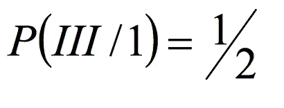
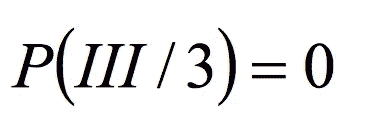
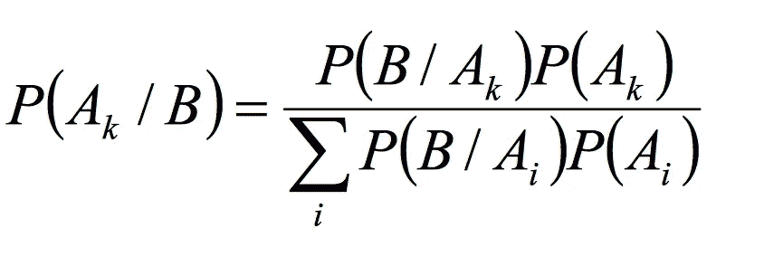
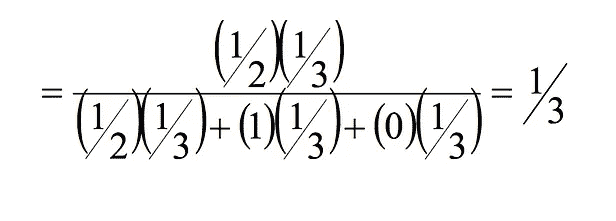
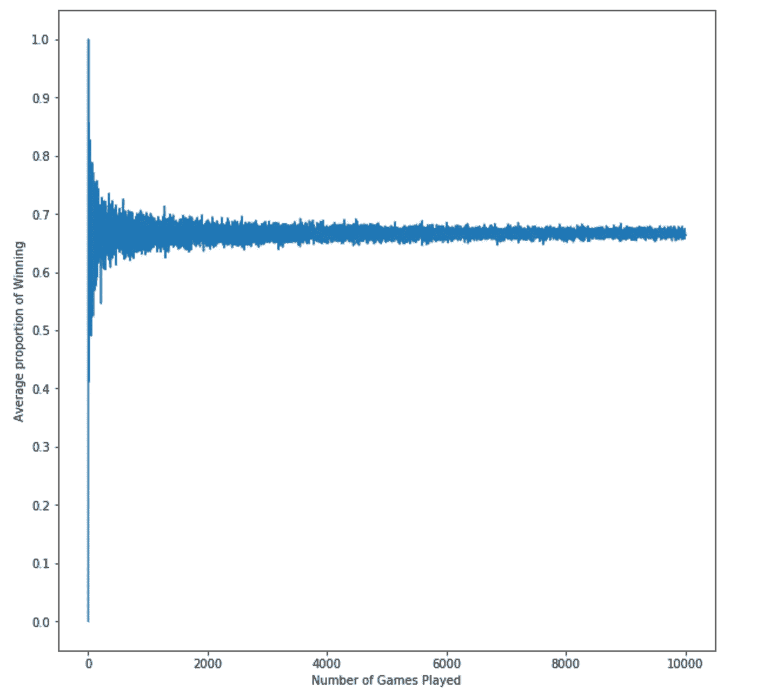

# 使用 Python 的 Monty Hall 问题

> 原文：<https://towardsdatascience.com/monty-hall-problem-using-python-ccd5aadc5921?source=collection_archive---------8----------------------->

## 借助编程理解数学证明

我们都听说过三门游戏节目的概率脑筋急转弯。每位参赛者猜猜门后是什么，节目主持人会展示三扇门中没有奖品的一扇门，并给参赛者一个换门的机会。假设并且事实上使用条件概率证明，换门会将你的机会增加到惊人的 66%。但是等等，当我进入游戏，不知道哪扇门有奖品时，我有 33%的机会获胜，当主持人揭示其中一扇门没有奖品时，这难道不意味着还有两扇门，有 50%的机会获胜吗？我为什么要换？如果你是那种不相信你在电视上听到的或者你在杂志有趣的事实专栏中读到的，但是对数学证明有好奇心的人，这里有你的答案。

## 证明来源:[https://www3.nd.edu/~jstiver/Exec_Micro/Monty%20Hall.pdf](https://www3.nd.edu/~jstiver/Exec_Micro/Monty%20Hall.pdf)

以下是你走进游戏节目时的最初概率。


现在到了棘手的部分，这是数学开始变得非常混乱的地方。假设参赛者选择了第一扇门，现在假设奖品在第一、第二或第三扇门后，主人打开第三扇门的概率是多少？这是一个需要理解的重要概念，因为稍后会使用它来推导概率。



from left 1)Probability of choosing door 3 given the prize is in 1 and your initial choice was 1\. 2)Probability of choosing door 3 given 2 has the prize and you start with 1\. 3) Probability of choosing door 3 given door 3 has the prize and your initial choice was 1.

第一个概率(左)回答问题:如果你选了 1 号门，奖品在 1 后面，主持人露出 3 号门的概率是多少？答案是 50%，主持人可以打开 3 号门或 2 号门，因为他们都没有奖品。但这里的关键概念是，概率是存在的，因为你从 1 号门开始。

如果你选择 1 号门，而奖品在 2 号门(中间)，主持人很可能会打开 3 号门，因为 1 号门已经被参赛者选中，2 号门有奖品，所以主持人只能打开剩下的没有奖品的 3 号门。

现在，如果奖品在 3 号门，在参赛者选择 1 号门后，主持人没有机会打开 3 号门。像前面的场景一样，在这种情况下，主机将总是打开门 2。假设我们从 1 号门开始，如果 3 号门有奖，打开 3 号门的概率是 0。

现在我们已经理解了原因，让我们假设在这个例子中，主人打开门 3。3 号门没有奖品，现在我们怎么能确定 2 号门有奖品呢？



概率基于贝叶斯定理。到目前为止，我们的逻辑和推理已经创造了信息，我们将插入到这个等式中，以获得条件事件的概率。


这里要理解的主要概念是最左边的概率陈述。假设门 3 显示为没有奖品，我们最初的选择是门 1，它计算门 2 成功的概率。所以我们切换的时候成功的几率是 2/3！另一种选择；如果我们在这种情况下仍然选择 1 号门，获胜的机会将如下。



不管你从哪个门开始，同样的概率应该随之而来。条件是以这样一种方式创造的，即总是产生给定的结果。

现在是有趣的部分。让我们看看这是不是真的！

```
%matplotlib inline
import matplotlib
import numpy as np
import matplotlib.pyplot as plt
from time import time as TT
from random import choice as ch
import numpy as npac = []
tc = []
N = []
st = TT()
for M in range(1,10000): #Outer loop from 1 to 10000
    st1 = TT()
    score = []
    runs = 0
    cards = [1,2,3]
    for K in range(1,M): # sub loop that simulates 1 to M(outerloop) games
        aset = []
        host = cards.copy()
        hbk = ch(host) #Randomly choose as answer which host knows
        aset.append(hbk)
        #print("The host knows the answer",hbk)
        player = cards.copy()
        px = ch(player) # Contestanrs random guess
        aset.append(px)
        #print ("Players first choice",px)
        chance = 0
        for i in host: # The computation....host will eliminate P(X|DOOR) = 0
            if i not in aset:
                chance = i
        #print ("The elimination",chance)
        #print (player)
        player.pop(player.index(chance))
        player.pop(player.index(px))
        #print ("final answe",player)
        if player[0] == hbk:
            score.append(1)
        else:
            score.append(0)
        runs = K
        #print ("\n\n")
    ac.append(np.mean(score))
    N.append(M)
    en1 = TT()
    tc.append(en1-st1)
en = TT()    
print ("Total time for Loop  ", en - st )
```

上面的代码模拟游戏 10，000 次，其中每一次重复都是游戏数量增加的循环。这个过程可以用不同的方式来完成，但是结果应该是相同的，但是使用上面描述的循环来获得正在玩的游戏的数量的变化是很有趣的，这确实会影响最终的结果。

这个节目中的主要逻辑是，在参赛者选择第一扇门后，主持人将消除参赛者没有选择的门或正确答案的门。如果参赛者的第一个猜测是正确的，选择显示的门是一个随机过程。但是我的计算方法是，如果元素不是正确答案，它将是列表(1，2，3)的最后一个元素。 ***这样做之后，出于模拟的目的，参赛者在揭示之后总是会改变他的答案。*** 所以这样通过这个模拟我们就有了下面的结果。



X 轴是玩的子游戏的数量。Y 轴是赢得的子游戏的平均数。在 0-100 个子游戏之间，你可以看到有很大的变化，但在 2000 个标记和接近 10，000 个标记之后，子游戏的平均获胜数集中在 64%-68%左右(最多 70)。这支持了我们最初通过贝叶斯定理得出的推论。

如果我们有 3 个以上或更少的选项，这个理论可能会有不同的规模。

code:[https://github . com/siddharthapachhai/python samples/blob/master/monty hall . py](https://github.com/siddharthapachhai/PythonSamples/blob/master/MontyHall.py)

领英:[https://www.linkedin.com/in/siddhartha-pachhai-0a1889b9/](https://www.linkedin.com/in/siddhartha-pachhai-0a1889b9/)