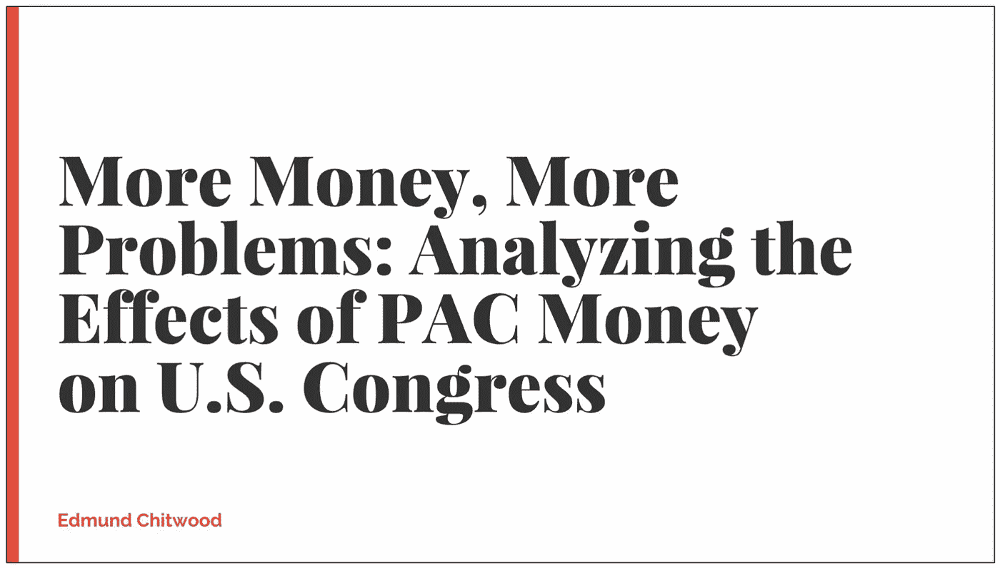
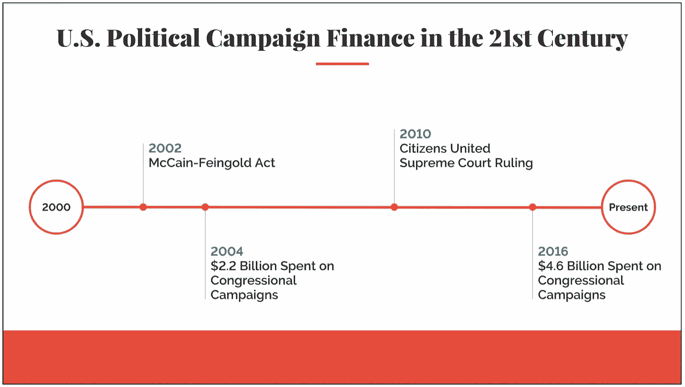
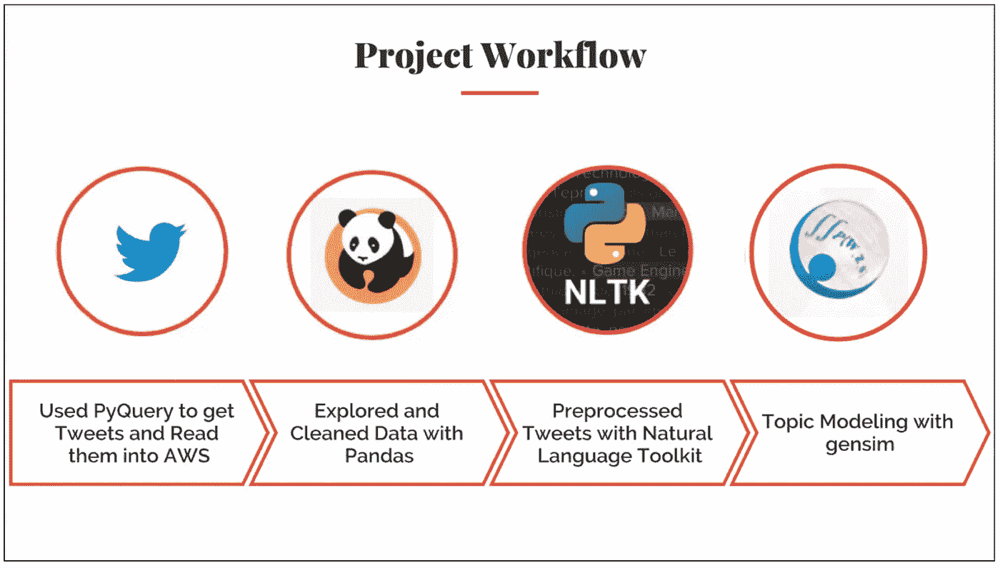
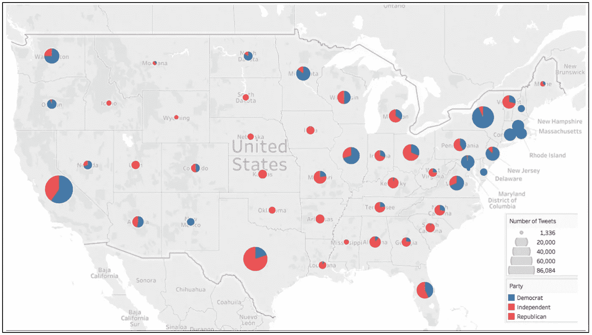
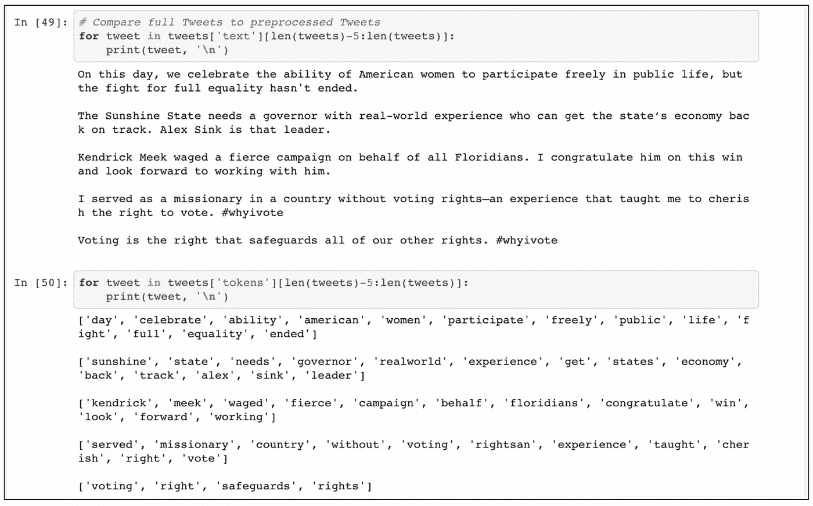
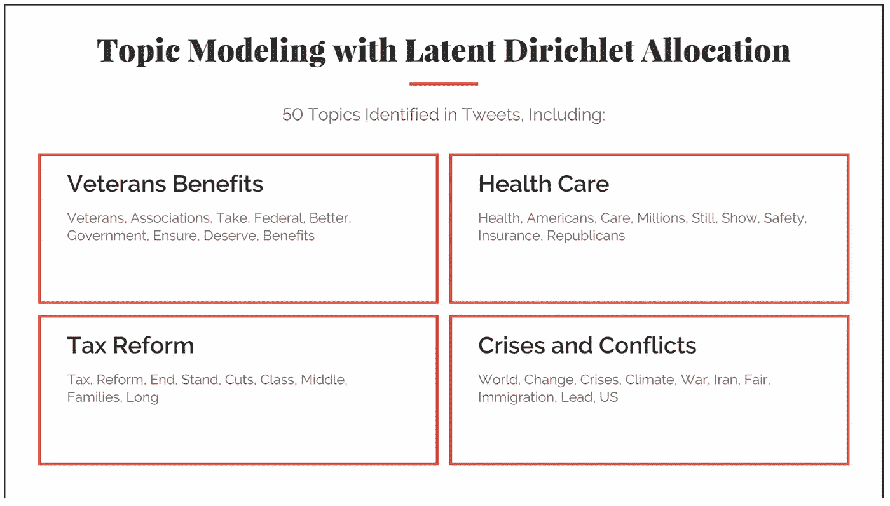
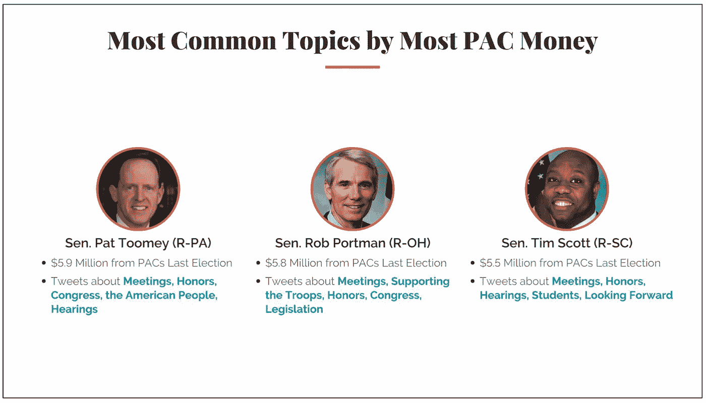
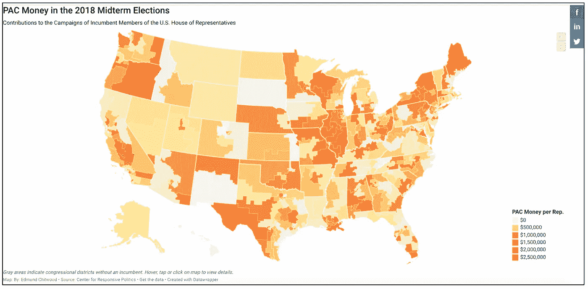

# 更多的钱，更多的问题:分析 PAC 资金对美国国会的影响

> 原文：<https://towardsdatascience.com/more-money-more-problems-analyzing-the-effects-of-pac-money-on-u-s-congress-74843bef12a8?source=collection_archive---------9----------------------->

# **总结**

2010 年，美国最高法院裁定，宪法不能禁止公司和工会宣传一名候选人胜于另一名候选人，这实际上解除了对竞选资金的管制。[公民联盟诉联邦选举委员会案中的这一决定备受争议，不得人心；80%接受民意调查的美国人反对这项裁决。公民联盟的结果和 2014 年麦卡琴诉联邦选举委员会案的裁决](https://www.law.cornell.edu/supct/cert/08-205)导致了美国目前的状况，越来越多的资金涌入国会选举。[**2018 年中期选举的预计总成本**](https://www.opensecrets.org/overview/cost.php) **近 52 亿美元，成为有史以来最昂贵的** [**。**](https://www.cnn.com/2018/10/30/politics/midterm-spending-smashes-records/index.html)

这种情况激发了一个项目，在这个项目中，我使用自然语言处理和机器学习技术对美国国会现任成员的推文主题进行建模，然后分析他们收到的 PAC(政治行动委员会)资金数额如何影响他们的推文内容。我发现，国会议员从政治行动委员会获得的竞选资金越多，他们就越不可能在推特上谈论有争议的政治问题。下面这篇博客文章介绍了这一努力的背景，提供了该项目的概述，并指出了选民可以用来在 11 月 6 日投票日之前了解现任国会议员的资源。

# **快速事实**

*   即将到来的中期选举预计总成本为 52 亿美元。
*   2018 年，一小部分美国人(0.42%)贡献了大部分竞选捐款(70.8%)。
*   2015 年，76%的美国人认为金钱对政治的影响比以前更大。
*   [国会议员花 50%的时间筹款。](https://www.c-span.org/video/?c4706765/time-spent-fundraising-congress)
*   [盖洛普民意调查](https://news.gallup.com/poll/1675/most-important-problem.aspx)显示，美国人目前认为美国面临的最重要的问题是对政府的不满和糟糕的领导。

# [**重点项目调查结果**](https://github.com/edmundooo/more-money-more-problems)

*   在最后一次竞选活动中，美国参议员平均从政治行动委员会获得 250 万美元。
*   在 2018 年中期选举中，美国众议院的普通成员从政治行动委员会手中接管了$600,000⁴。
*   从 2007 年开始，Congress⁵的现有成员已经发了超过 180 万条 times⁶微博。
*   **在最近的竞选活动中，推特上没有政治争议的国会议员平均从政治行动委员会多拿了 8 万美元。**

# **项目链接**

*   [GitHub 库](https://github.com/edmundooo/more-money-more-problems/blob/master/README.md)
*   [互动地图](https://datawrapper.dwcdn.net/h4cuM/4/)显示 PAC 在 2018 年中期选举活动期间对众议院现任议员的贡献

# 推特上的国会

鉴于越来越多的钱被用于政治竞选，以及美国人对金钱在政治中的影响力的担忧，国会不受欢迎也就不足为奇了；只有 21%的美国人赞同国会正在做的工作。国会议员有什么要为自己辩护的？他们越来越多地使用 twitter 与他们的基地直接沟通。参议员[卡玛拉·哈里斯](https://twitter.com/KamalaHarris?ref_src=twsrc%5Egoogle%7Ctwcamp%5Eserp%7Ctwgr%5Eauthor)、[马尔科·卢比奥](https://twitter.com/marcorubio?ref_src=twsrc%5Egoogle%7Ctwcamp%5Eserp%7Ctwgr%5Eauthor)和[伊丽莎白·沃伦](https://twitter.com/elizabethforma?ref_src=twsrc%5Egoogle%7Ctwcamp%5Eserp%7Ctwgr%5Eauthor)每个人在推特上都有数百万粉丝，并且已经发了数千次推特。像许多其他国会议员一样，他们使用自己的 Twitter 账户作为媒介来展示自己的个性和政策立场。

社交媒体在阿拉伯之春和黑人的命也是命的跟风运动中所扮演的角色，提供了大量证据，证明社交媒体上的政治话语具有真实的、切实的影响。此外，越来越多的学术界关注美国政客的推文。这些努力包括分析州政府成员在推特上的政策议程；国会在推特上做什么；以及[政治家讨论的话题和其追随者讨论的话题之间的关系](http://pablobarbera.com/static/barbera_twitter_responsiveness.pdf)。这些努力为我的分析提供了部分信息和灵感。

# **分析国会的推文**

为了开始这项工作，我使用 Jefferson Henrique 的 GitHub 知识库[“获取旧推文”](https://github.com/Jefferson-Henrique/GetOldTweets-python)来收集来自第 115 届国会所有活跃成员的官方推特账户[⁷](https://gwu-libraries.github.io/sfm-ui/posts/2017-05-23-congress-seed-list)的所有推文。Henrique 用 Python 编写了“获取旧推文”项目，它使我能够绕过 Twitter API 的一些限制。**我总共从第 115 届国会的 522 名议员那里收集了超过 180 万条推文。⁸** 然后，我使用[熊猫](https://pandas.pydata.org/)进行探索性数据分析并清理数据，采取的措施包括调查国会议员的推文数量以及这些推文的参与度(如转发、点赞)，并删除太短而没有太多意义的推文。

(The Tweet in the Dataset with the Most Likes and Retweets)

下图显示了各州和高音喇叭所属党派的数据概况。圆圈的大小反映了推文的数量，颜色代表了推文者的政党。圆圈的大小与每个州的人口数量大致相关。例如，加利福尼亚州、纽约州和得克萨斯州的国会议员的推文数量相对较多。然而，这种相关性也有例外。佛蒙特州参议员伯尼·桑德斯发送了相对较多的推文，因此他的家乡被过度代表。

在清理和探索数据之后，我使用一个名为[自然语言工具包](https://www.nltk.org/)的 Python 库对数据进行了预处理。我对文本进行预处理的步骤包括删除标点符号和格式(例如，单词的首字母大写)，对每条推文进行标记(即，将每条推文的文本分成单个单词的列表)，删除停用词(即，像**这样的单词，这些**和**只有**出现频率高，语义意义不大)，以及词干。此外，我使用自定义函数来删除链接、标签和提及。

(Example Tweets Before and After Preprocessing)

在对 Tweets 执行主题建模之前的最后一步是转换预处理文本语料库的形状。为此，我使用了 [scikit-learn 的](http://scikit-learn.org/stable/)计数矢量器，它输出一个矩阵，其列对应于文本语料库中的唯一单词，其行对应于每个单独的 Tweet。这个过程可以将每条推文与整组推文进行比较。然后我转置了矩阵，使其成为术语文档格式，并为主题建模做好了准备。

主题建模是一种机器学习/自然语言处理方法，它依赖于统计手段，基于文档和语料库级别的单词出现频率，从文本中获取含义。有多种方法对文本的主题进行建模，包括机器学习的监督和非监督方法。

为了对国会推文的主题进行建模，我使用了一个名为 [gensim](https://radimrehurek.com/gensim/) 的 Python 包来执行潜在的狄利克雷分配(LDA)。LDA 是一种无监督学习方法，由[大卫·比尔、安德鲁·乔丹和吴恩达](http://www.jmlr.org/papers/volume3/blei03a/blei03a.pdf)(前谷歌员工，现任百度首席科学家)创建。 **LDA 是一种生成概率模型，其假设文本语料库可以由给定数量的主题来表示，并且其中的每个文档可以由全部主题的子集来表示。**LDA 识别的主题由大量在文档中频繁出现的单词表示(在本例中为 Tweet)。

在我上面提到的努力中，LDA 是为美国政治官员的推文主题建模的首选方法。Gensim 的 LDA 允许轻松调整模型超参数，包括它应该从文本中提取的主题数量以及模型应该对文本进行学习的次数。国会推文最明智的表现包括 50 个主题，我调整了模型，对文本进行了 20 遍学习；训练时间大约花了八个小时。然后，为了便于解释，我缩写了每个主题的原始组成词。

(View the full list of topics in [this GitHub repository](https://github.com/edmundooo))

# **介绍活动财务信息**

接下来，我从响应政治中心(Center for Responsive Politics)的网站[opensecrets.org](https://www.opensecrets.org/)上收集了竞选财务数据，该网站被描述为**“联邦竞选捐款、游说数据和分析的最全面资源。”**响应政治中心(Center for Responsive Politics)的数据来自联邦选举委员会(Federal Election Commission)，我使用公开秘密应用编程接口(Open Secrets API)收集了所有现任国会议员的竞选财务信息，并观察了他们在推特上谈论的话题如何随着他们在上次竞选活动中接受了多少 PAC 资金而变化。

最初，我把分析的重点放在相关主题和部门之间的关系上。我的假设是，某个国会议员从某个部门拿走的越多，他们就越会(或者可能更少)在推特上谈论它。然而，这种类型的分析证明是不确定的，因为没有出现明确的趋势。

但是当我看着从政治行动委员会拿钱最多和最少的国会议员时，我注意到一些有趣的事情。例如，参议员 Pat Toomey、Rob Portman 和 Tim Scott 在他们最近的竞选中分别从政治行动委员会获得了近 600 万美元，他们推特上最常见的话题完全没有政治争议。

(Common Topics Include Meetings, Receiving Honors, and Congress itself)

另一方面，在上次选举中没有从政治行动委员会拿任何钱的国会议员的**推文的主题表明了明显的差异。虽然这两个群体之间最常见的话题有所重叠，但**众议员 Jared Polis、John Sarbanes 和 Francis Rooney 更多地在推特上谈论政治上有争议的问题。他们在推特上最常谈论的话题是医疗保健、罗伯特·穆勒的特别调查和经济。这种实质性的话题在前一组中是缺乏的。****

我进一步探究了这种关系，发现不幸的是，这些国会议员代表了一种模式。为了得出这个结论，我根据推文是否涉及政治争议话题对推文作者进行了分类，并计算了每个群体成员收到的 PAC 资金的平均金额，我发现国会议员拿的钱越多，他们就越少在推文中谈论政治争议问题。平均而言，在推特上谈论非政治争议话题的国会议员每次竞选都会从政治行动委员会多拿走 8 万美元。我推测这是由于有意识或无意识的努力，使他们看起来更适合他们的捐助者。

# 结论

这项努力是为了调查政治行动委员会的资金对美国国会的影响。不幸的是，PAC 资金似乎与国会议员谈论(或至少在推特上)重要政治问题的倾向负相关，这些问题对他们的选民最重要。

这一结论加入了声称我们的当选官员过于依赖竞选捐款的声音。例如，[剑桥大学的一项分析](o%09https:/www.cambridge.org/core/journals/perspectives-on-politics/article/testing-theories-of-american-politics-elites-interest-groups-and-average-citizens/62327F513959D0A304D4893B382B992B)“表明代表商业利益的经济精英和有组织的团体对美国政府政策有实质性的独立影响，而普通公民和基于大众的利益团体则很少或没有独立影响。”此外，[最近的媒体报道](https://www.nytimes.com/2018/08/12/us/money-politics-dean-phillips.html)都集中在那些公开拒绝接受 PAC 资金的国会候选人身上。

11 月 6 日是中期选举，还有两天就要举行了，美国人能够影响国会言行的一个可靠方法是批判性地思考对他们来说重要的问题，并投票给那些不依赖政治行动委员会捐赠者，而是关心美国人民的候选人。

# **后记**

非常感谢 Jefferson Henrique，他写了一个如此优秀、强大的仓库来获取旧推文。没有他，这一努力是不可能的。

虽然我在分析中关注的是政治行动委员会的捐款，但我并不是说个人竞选捐款不重要。在这次中期选举周期中，个人捐款超过 16 亿美元。

作为这项工作的补充，我创建了一个[互动地图](https://datawrapper.dwcdn.net/h4cuM/4/)，显示了众议院每位现任议员在 2018 年中期选举前的竞选活动中收到的 PAC 资金数额。

([Link](https://datawrapper.dwcdn.net/h4cuM/4/) to Interactive Map)

# **脚注**

1.  这个总数包括政治行动委员会和个人直接捐赠给国会竞选活动的资金，以及支持候选人但与候选人无关的支出。
2.  政治上有争议的话题在这里被定义为有共同的，也许是党派的政治分歧。有争议的话题包括“人权”和“共和党废除奥巴马医改”没有政治争议的话题包括“竞选途中的停留”和“参观景点”。
3.  考虑的竞选周期包括 2014 年、2016 年和 2018 年结束的竞选周期——取决于参议院的级别。美国参议员任期 6 年，其中三分之一每两年开始
4.  竞选资金总额截至 2018 年 10 月；最终数字可能会更高。
5.  由于辞职，死亡，特别选举和其他情有可原的情况，第 115 届国会的完整名单是一个移动的目标。在可能的情况下，我使用最新的在职人员名单。
6.  推文总数截至 2018 年 9 月。
7.  在可能的情况下，我使用国会议员的官方推特账户。一些国会议员(如伯尼·桑德斯、科里·布克)有多个 Twitter 账户。
8.  并非所有国会议员都发了推特。

# 作者联系信息

如果你想谈论数据科学或政治，请在 LinkedIn[上添加我，或者在 edmunchitwood@gmail.com 给我发电子邮件。](https://www.linkedin.com/in/edmund-chitwood/)