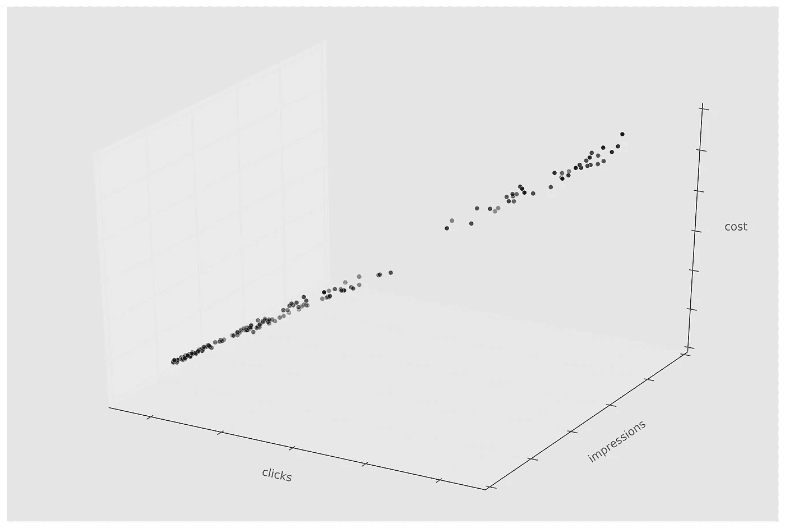
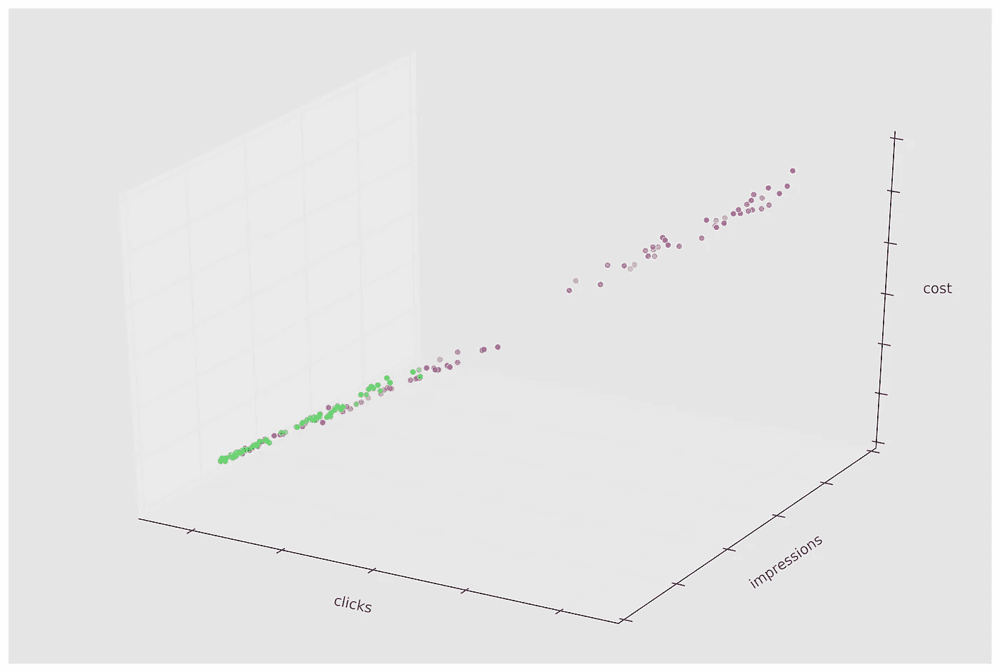
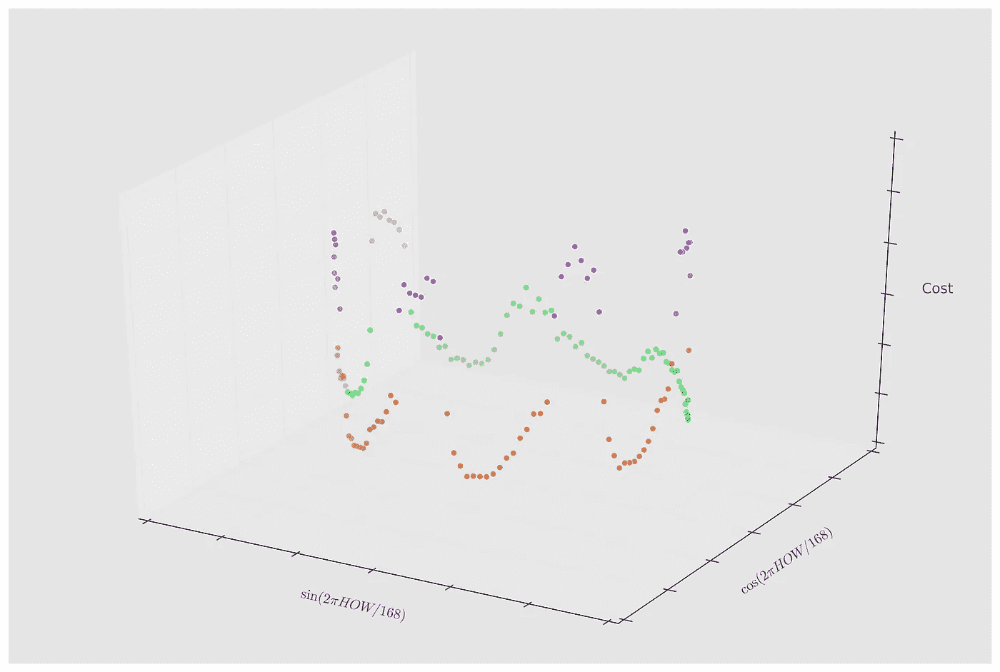

# 早上，下午，还是晚上？使用数据驱动方法对一周中的时间进行聚类。

> 原文：<https://towardsdatascience.com/morning-afternoon-or-night-clustering-hours-of-the-week-using-a-data-driven-approach-6cb5404d4f3a?source=collection_archive---------2----------------------->

在律师事务所，我们的主要目标是利用我们广告预算的最佳分配，将相关案例导向我们的合作律师事务所。数据科学团队通过优化我们的 Adwords 竞价，在不超出预算的情况下最大限度地增加我们收到的查询数量，从而为这项任务做出了贡献。在这篇文章中，我将简要介绍这个问题，并详细讨论解决方案的一部分:为什么我们使用历史数据对一天/一周的时间进行聚类。

数据科学团队的中心项目之一是构建最佳模型，以预测广告支出作为出价的函数。出价是我们在这个模型中可以控制的最重要的自变量之一。出价定得太高，我们会很快花光我们的月度预算，错过本月晚些时候的潜在商机。出价定得太低，我们的广告可能无法充分展示，从而无法获得足够多的询盘发送给我们的合作伙伴公司。

当设置出价，我们这样做在每周每小时的水平。因此，在构建模型时，模型中将有额外的 168 个分类变量来解释一周中的每个小时。由于多种原因，这是不希望的。在一个模型中有这么多的变量使得它更难解释。在一个模型中有这么多分类变量意味着训练的设计矩阵将有大量的零，这些零必须用于计算。此外，每个类别中必须有足够的数据来训练和验证模型。当我在 USF 大学学习时，我有一位教授，他在建立回归模型时更喜欢“简约”而不是复杂。在这一点上，让我们讨论一下 Lawfty 的数据科学团队为降低我们的投标模型的复杂性所采取的方法。

我将首先概述我们用来训练和验证模型的数据格式。然后我将讨论我们如何使用 [KMeans](https://en.wikipedia.org/wiki/K-means_clustering) 聚类算法来减少我们在模型中使用的分类变量的数量。作为这篇文章的总结，我将展示一些聚类前后的标准化数据图，以直观地说明为什么这样做。

我们训练模型的主要数字特征是成本、点击和印象。数据的粒度是每小时一次。我们获取这些原始数据，并使用公式*day _ of _ week * 24+hour _ of _ day*为一周中的 168 个小时之一添加一个标签。现在把时间组合在一起，为什么不按照“早上”、“下午”、“晚上”来组合呢？这似乎是一个自然的分组，但是基于[的分析](https://en.wikipedia.org/wiki/Exploratory_data_analysis)，我们知道一周中的某些时间在成本、点击和印象方面有相似的行为。因此，我们使用 [KMeans](https://en.wikipedia.org/wiki/K-means_clustering) 聚类算法来寻找将一周中的小时分组的最佳方式，这样我们就可以将分类变量的数量从 168 减少到更小的数字 *k* 。注意，为了确定聚类数 *k* ，我们对照实际发生的每周成本交叉验证一组 *k* 值的每周预测成本，并选择给出最小平均绝对误差的 *k* 。我们使用这种方法，而不是理论方法，如[肘](https://en.wikipedia.org/wiki/Determining_the_number_of_clusters_in_a_data_set)和[差距](https://web.stanford.edu/~hastie/Papers/gap.pdf)，因为这为我们提供了一种更加以业务为中心的方法来衡量模型的成功。

现在，我们已经介绍了如何使用 KMeans 通过对一周中表现相似的时间进行分组来减少模型中的分类变量的数量，让我们来看看这种方法的一些实际应用，以直观地了解正在发生的事情。

考虑以下情节。

这是我们按一周中的小时汇总的数字数据，总共 168 个数据点。使用上面提到的方法，我们发现对于这个特定的市场，12 个聚类给出了最小的平均绝对预测成本误差。

现在，一周中的每一个小时都有潜在的周期性。可以说，它们是环绕的。周日中午 12 点和周六晚上 11 点“接近”。因此，假设我们也在单位圆中加入一周中的小时的映射。参见[本](http://datascience.stackexchange.com/questions/8799/boundary-conditions-for-clustering)或[本](http://stats.stackexchange.com/questions/13237/som-clustering-for-nominal-circular-variables)帖子。结果给了我们下面的情节。

我们可以看到，一周中有几个小时的成本较高，同样，一周中有几个小时的成本较低。用 z 轴上的点击和印象产生类似的图给出类似的结果。一周中有几个小时的行为与其他时间不同。这就是我们希望通过时间的聚类来捕捉的内容。

现在我们有了小时的聚类，然后我们可以使用这些小时聚类作为模型中的分类变量来生成回归模型。我们已经将特征空间的维度从 167+(一周中的小时加上包括的任何其他数字/分类特征)减少到 3+(小时聚类标签和其他特征)。这为我们提供了更强大的模型，因为当聚合到 3 个小时的聚类时，我们现在有了更多的数据点，而不是将一周中的每个小时都放在自己的类别中。

目前，我们仍在运行基于上述基于容量的指标的算法。但是，我们进行的分析让我们相信，添加更多基于价值的指标。当我们实现了这些新的添加时，请继续关注更新的帖子。

与此同时，请随时在[脸书](https://www.facebook.com/lawfty/)、 [LinkedIn](https://www.linkedin.com/company-beta/6463891/) 和我们的[主页](https://www.lawfty.com/)上找到我们。

Lawfty 开发技术，将律师和律师事务所的数字广告变成一门科学。使用搜索引擎营销和社交媒体，我们的技术平台为下一代成功的人身伤害和大规模侵权律师铺平了道路。