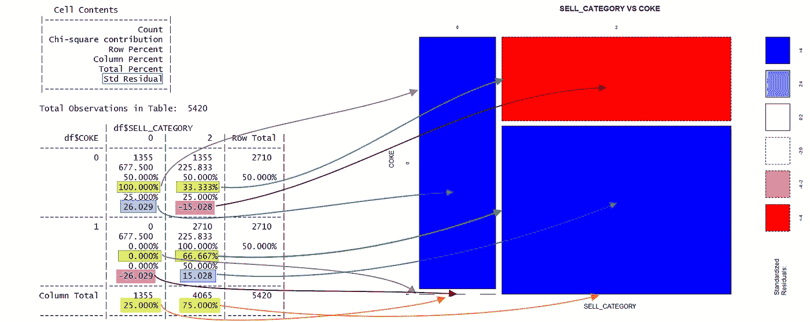
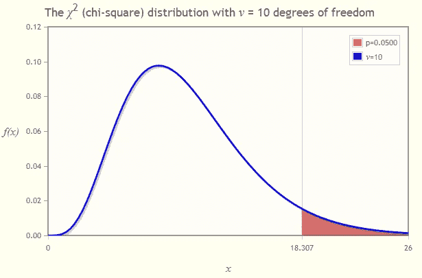
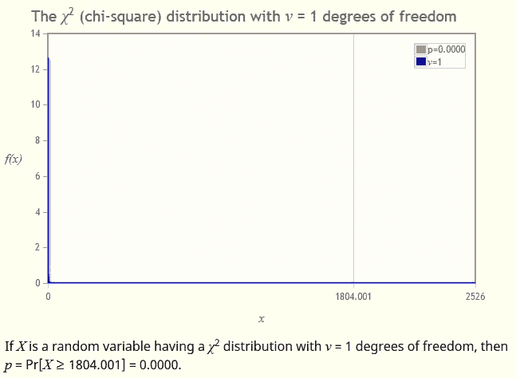

# 镶嵌图和卡方检验

> 原文：<https://towardsdatascience.com/mosaic-plot-and-chi-square-test-c41b1a527ce4?source=collection_archive---------8----------------------->

在数据科学项目中，从数据中获得更多见解非常重要。有一个特定的阶段，即项目的第一个阶段，以数据分析为目标:数据探索阶段。在其他种类的分析中，最有趣的是双变量分析，它找出两个变量之间的关系。如果这两个变量是*分类*，那么用于分析它们之间关系的最常见的图是*镶嵌图*。乍一看，它可能会显得有点混乱。不了解一些统计概念的人可能会错过这个图能给我们的重要信息。因此，在这篇文章中，我们将会更深入地探讨这些概念。

# 马赛克图

本帖中使用的数据集可以从[这里](https://1drv.ms/u/s!AtgrmeCPhKh7kP5EjOgd-EhXbdSlwA)下载。每一行都是在汉堡店完成的交易。正在分析的两个变量如下:

*   **SELL_CATEGORY** :分类变量，标识所售产品的类别。类别“0”标识单一产品；类别“2”标识组合的
*   **COKE** :一个分类变量，标识销售的组合产品中是否存在 COKE。因此值“1”标识焦炭的存在；“0”表示缺席

以下简单的 R 代码将为变量 SELL_CATEGORY 和 COKE 生成镶嵌图。打开 *RStudio* (或 *R Tools for Visual Studio* )并运行它:

下面是由此产生的情节:

fig. 1 — Mosaic plot for SELL_CATEGORY vs COKE

镶嵌图基于[条件概率](https://www.mathsisfun.com/data/probability-events-conditional.html)。为了得到前面图背后的数字，需要一个*列联表*。它也被称为*交叉表*或*双向*表，用于总结几个分类变量之间的关系。只需运行下面的代码来获取我们案例的列联表:

结果就是这张漂亮的桌子:

fig. 2 — Contingency table for SELL_CATEGORY vs COKE

镶嵌图从行开始递归计算边际比例。在我们的例子中，我们从销售类别开始。单元的**宽度**分别与单一产品和组合产品的百分比(焦炭中的*总百分比，在图 2 中以深蓝色表示)成比例。事实上,“0”和“2”的 SELL_CATEGORY 的总数是 1355 和 4065(总观察值),所以 25%的产品是单品，75%是组合品。*

现在在销售类别中(绿色)，它计算属于每个可乐类别的比例(“0”、“1”)。所以盒子的高度与销售类别中可乐的百分比成正比。事实上，如果卖出类别是“0”，则不包含可乐(COKE =“0”)的交易是 1355；含焦炭(COKE = "1 ")的为 0。因此，对于单一产品，100%的交易不包含可乐，0%的交易包含可乐。相反，如果卖出类别是“2”，1355 交易不包含可乐；2710 交易包含它。因此，对于组合产品，33.3%的交易不包含可乐，其中 66.7%包含可乐。

为了理解颜色是如何分配的，我们需要引入*标准化残差*，如图 1 中的图例所示。

# 关于人口的推论

镶嵌图按原样表示数据，并不试图概括全部人口。为了对总体进行推断，我们需要提供统计显著性的度量来证明发现的结果不是偶然的。

## *皮尔逊标准化残差*

关系的强度可以被认为是观察值偏离独立情况下的值的程度(独立=变量之间任何类型关系的完全缺失)。 *Pearson 标准化残差*测量每个细胞偏离独立性的程度，它们可以计算如下:

其中 O *ij* 是*观察到的*频率(在我们的样本中找到的), E *ij* 是*期望的*频率( *i* = *i* 行； *j* = *j* 列列联表)。后者是在独立变量的情况下，我们根据理论概率预测事件将发生的次数。在我们的例子中，独立情况下的期望频率计算如下:

在哪里

*   E *ij* =第 *i* 行/ *j* 列的预期频率。
*   T *i* =第 *i* 行合计
*   T *j* =第 *j* 列的合计
*   T *tot* =表格总计(实验中的项目总数)

更简单的把前面的等式想成*(行合计*列合计)/总计。*皮尔逊残差显示了**协会的实力和方向**。强度由残差的绝对值给出；通过它的标志来辨别方向。在我们的例子中，皮尔逊标准化残差可以在 R 中计算如下:

单位在[标准差](https://www.robertniles.com/stats/stdev.shtml)中，因此大于 2 或小于-2 的残差代表显著偏离独立性。

现在，回到我们的镶嵌图，我们可以轻松地将标准化残差(下图中以绿色突出显示)映射到像元，记住正号表示蓝色阴影，负号表示红色阴影。

fig. 3 — Mapping of standardized residuals to colors and percent values to sizes of the mosaic plot

蓝色表示单元格中的观察值比零模型(独立性)下的预期值多。红色表示观测值比预期的要少。

换句话说，可以很自信地说，combo 产品(SELL_CATEGORY = 2)将几乎总是包含可乐(COKE = 1)。事实上，不含可乐(可乐= 0)的组合产品(SELL_CATEGORY = 2)与它们之间独立的情况(红色)相比，较少出现在交易中。与此同时，可以肯定地说，单一产品(SELL_CATEGORY = 0)不含可乐。

有关镶嵌图的更多信息，请参考[此链接](https://ncss-wpengine.netdna-ssl.com/wp-content/themes/ncss/pdf/Procedures/NCSS/Mosaic_Plots.pdf)。

在图 2 中可以看到，桌子底部还有其他符号: *χ* (卡方)、 *df* (自由度)和 *φ* (克莱姆氏φ，也称克莱姆氏 V)。让我们看看他们是什么意思。

## 卡方检验

χ的值由所有标准化残差的总和给出:

该值是所谓的*卡方检验的结果。*它测试样本中的证据是否足够强，足以概括更大人群的关联。卡方独立性检验的 [*零假设*](http://www.statisticshowto.com/probability-and-statistics/hypothesis-testing/) 是两个分类变量在某个总体中是独立的。

在我们的例子中，χ的值是 1804.001。这个数字总结了我们的数据和我们的独立性假设之间的差异。但这意味着什么呢？我们可以从[它的采样分布](http://www.statisticshowto.com/probability-and-statistics/chi-square/#chisquaredist)开始了解它的价值。

在[某些假设](https://www.ncbi.nlm.nih.gov/pmc/articles/PMC3900058/)下，我们可以说我们的χ检验统计量遵循χ分布。在这种情况下，我们可以确定χ检验值对应的*p*-值。为了确定我们分布的确切形状，我们需要[自由度](http://www.jerrydallal.com/LHSP/dof.htm) ( *df* )。一旦我们有了这两个值，就很容易计算相应的*p*-值，这要感谢这个[在线计算器](https://www.di-mgt.com.au/chisquare-calculator.html)。

一般情况下，*p*-值由χ检验值后右尾下的面积给出:

fig. 4 — Value of χ² corresponding to a p-value of 0.05

在我们的例子中，图形结果如下:

fig. 5 — The p-value corresponding to χ²=1804.001

说*p*-值为 0.0000，是指在变量独立(关联强度= 0)的情况下，有 0.0000 的概率偶然发现这个关联。换句话说，似乎 SELL_CATEGORY 和可乐**在我们的人群中是相关的**。通常，如果*p*-值< 0.01(有时*p*-值< 0.05 也被认为具有统计显著性)，我们可以说两个变量是相关的(我们拒绝独立性的零假设)。*p*-值越低，结果越有意义，因为不太可能是噪声造成的。

有可能有一个对应于弱关联的*p*-值= 0.0000。如果我们处理大样本，就会发生这种情况。那么，我们如何确定这种关系的*强度*？我们可以通过*效应的大小*来测量它。因为在我们的例子中，我们有两个[标称变量](http://www.statisticshowto.com/nominal-variable/)，所以可以使用*克拉默 V* (图 2 中的 *φ* )。对于两个顺序变量，Spearman 相关性或 Kendall 的 tau 是更好的测量方法。对于定量变量，皮尔逊相关是最好的选择。请注意，即使克莱姆的 V 有时用 *φ* 表示，相同的 *φ* 也可以用于另一种统计测量(更多细节[此处为](http://www.people.vcu.edu/~pdattalo/702SuppRead/MeasAssoc/NominalAssoc.html))。在我们的例子中， *φ = 0.577。*根据[这些指南](http://web.archive.org/web/20180920053707/http://www.fort.usgs.gov/sites/landsat-imagery-unique-resource/statistical-interpretation)，克莱姆的 V 取 0 到 1 之间的值，所以值 0.577 表示非常好的关联。那么我们确信我们的变量是紧密相关的。

# 结论

通常，数据探索中使用的图很容易理解。有时他们中很少有人需要了解一些统计学的概念。一旦这些得到澄清，这些图会给每个分析师带来第一眼就很强的洞察力。