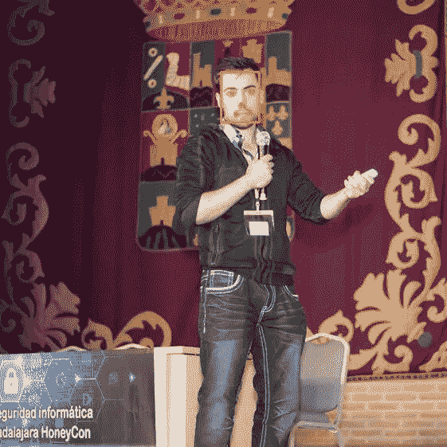

# 我实现了一个人脸检测模型。我是这样做的。

> 原文：<https://towardsdatascience.com/mtcnn-face-detection-cdcb20448ce0?source=collection_archive---------1----------------------->

上周，我开始在 Augentix Inc .实习，旨在了解更多关于神经网络的知识。在那里，我遇到了一个面部检测模型，它在保持实时性能的同时实现了高精度(链接[此处](https://arxiv.org/abs/1604.02878))。该模型使用多任务级联卷积网络(MTCNN)，它本质上是几个卷积网络串在一起，给出几条信息。

从 github(链接[这里](https://github.com/ipazc/mtcnn))下载模型后，我打开并运行 example.py，它生成了这个图像:



Image 1: Output image from example.py // [Source](https://github.com/ipazc/mtcnn)

如上图所示，神经网络检测各个面部，定位面部标志(即两只眼睛、鼻子和嘴的端点)，并在面部周围绘制一个边界框。example.py 中的代码支持这一点。

首先，他们导入 OpenCV(打开、读取、写入和显示图像)和 MTCNN。正在检查。/mtcnn/mtcnn.py 显示了执行面部检测的 mtcnn 类。

```
#!/usr/bin/env python3
# -*- coding: utf-8 -*-import cv2
from mtcnn.mtcnn import MTCNN
```

然后，创建一个 MTCNN 类的检测器，用 cv2.imread 读入图像。调用 MTCNN 类中的 detect_faces 函数，在我们传入的图像中“检测人脸”，并在“结果”中输出人脸。

```
detector = MTCNN()image = cv2.imread("ivan.jpg")
result = detector.detect_faces(image)
```

为了检查“结果”中有什么，我打印出来得到:

```
[{'box': [277, 90, 48, 63], 'confidence': 0.9985162615776062, 'keypoints': {'left_eye': (291, 117), 'right_eye': (314, 114), 'nose': (303, 131), 'mouth_left': (296, 143), 'mouth_right': (313, 141)}}]
```

结果似乎是一个字典，其中包括边界框和面部标志的坐标，以及网络将该区域分类为面部的信心。

我们现在可以分离坐标，将边界框坐标传递给 bounding_box，将面部标志坐标传递给关键点。

```
bounding_box = result[0]['box']
keypoints = result[0]['keypoints']
```

现在，我们通过传入坐标、颜色(RGB)和边框轮廓的厚度来绘制边框的矩形。这里，bounding_box[0]和 bounding_box[1]表示左上角的 x 和 y 坐标，bounding_box[2]和 bounding_box[3]分别表示框的宽度和高度。

类似地，我们可以通过传递坐标、圆的半径和线条的粗细来绘制面部标志的点。

```
cv2.rectangle(image,
              (bounding_box[0], bounding_box[1]),
              (bounding_box[0]+bounding_box[2], bounding_box[1] + bounding_box[3]),
              (0,155,255),
              2)cv2.circle(image,(keypoints['left_eye']), 2, (0,155,255), 2)
cv2.circle(image,(keypoints['right_eye']), 2, (0,155,255), 2)
cv2.circle(image,(keypoints['nose']), 2, (0,155,255), 2)
cv2.circle(image,(keypoints['mouth_left']), 2, (0,155,255), 2)
cv2.circle(image,(keypoints['mouth_right']), 2, (0,155,255), 2)
```

最后，我们创建另一个名为“ivan_drawn.jpg”的文件并显示图像。

```
cv2.imwrite("ivan_drawn.jpg", image)
cv2.namedWindow("image")
cv2.imshow("image",image)
cv2.waitKey(0)
```

这很好，但如果我们只能通过图像，面部检测是一个很大的用处。我想修改它，这样我就可以用我的网络摄像头。通过这样做，我还可以测试该报声称的能够实时定位人脸的说法。

我再次导入了 OpenCV 和 MTCNN，然后创建了一个检测器:

```
import cv2
from mtcnn.mtcnn import MTCNN
detector = MTCNN()
```

为了使用我的网络摄像头，我创建了一个视频捕捉对象。由于我只有 1 个摄像头，所以我传入了 0 个。

cap.read()返回一个布尔值(True/False ),该值表明帧是否被正确读入。如果一个错误发生并且一个帧没有被读取，它将返回 False 并且 while 循环将被中断。

然后，类似于 example.py，我在每一帧上调用 detect_faces。由于有时一张脸可能不在帧中(结果将是空的)，我添加了“如果结果！= []"使程序即使在帧中没有人脸时也能继续运行。

此外，帧中可能有不止一个面。在这种情况下，result 将返回多组坐标，每个面一组。因此，我在 result 中运行了一个 for 循环来遍历每个单独的面。对于每一张脸，我画出边界框，并点上 5 个面部标志。

最后，我展示了每一个单独的画面。每一帧将为键“q”等待 1 毫秒，然后移动到下一帧。要关闭窗口，我只要按“q”就行了。一旦我这样做了，我就释放视频捕获并关闭窗口。

```
cap = cv2.VideoCapture(0)
while True: 
    #Capture frame-by-frame
    __, frame = cap.read()

    #Use MTCNN to detect faces
    result = detector.detect_faces(frame)
    if result != []:
        for person in result:
            bounding_box = person['box']
            keypoints = person['keypoints']

            cv2.rectangle(frame,
                          (bounding_box[0], bounding_box[1]),
                          (bounding_box[0]+bounding_box[2], bounding_box[1] + bounding_box[3]),
                          (0,155,255),
                          2)

            cv2.circle(frame,(keypoints['left_eye']), 2, (0,155,255), 2)
            cv2.circle(frame,(keypoints['right_eye']), 2, (0,155,255), 2)
            cv2.circle(frame,(keypoints['nose']), 2, (0,155,255), 2)
            cv2.circle(frame,(keypoints['mouth_left']), 2, (0,155,255), 2)
            cv2.circle(frame,(keypoints['mouth_right']), 2, (0,155,255), 2)
    #display resulting frame
    cv2.imshow('frame',frame)
    if cv2.waitKey(1) &0xFF == ord('q'):
        break#When everything's done, release capture
cap.release()
cv2.destroyAllWindows()
```

运行这个新文件，我看到 MTCNN 网络确实可以实时运行。拳击我的脸，标出我的特征。如果我把脸移出相框，网络摄像头也会继续运行。

点击[这里](https://medium.com/@reina.wang/face-detection-neural-network-structure-257b8f6f85d1)阅读 MTCNN 模型的结构！

点击[这里](https://medium.com/@reina.wang/how-does-a-face-detection-program-work-using-neural-networks-17896df8e6ff)阅读 MTCNN 如何做人脸检测！

点击此处下载 MTCNN 论文和资源:

*   Github 下载:【https://github.com/ipazc/mtcnn 
*   研究文章:[http://arxiv.org/abs/1604.02878](http://arxiv.org/abs/1604.02878)