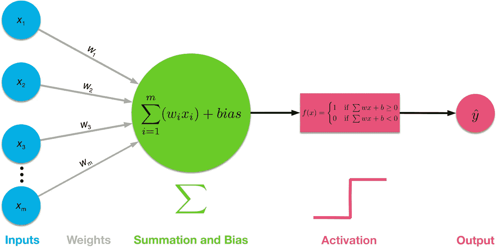
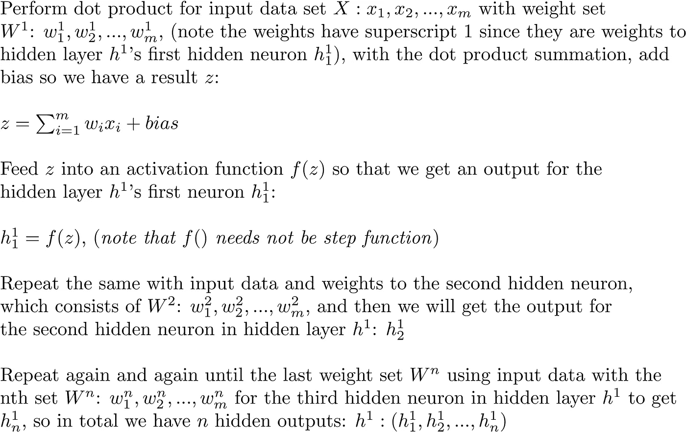
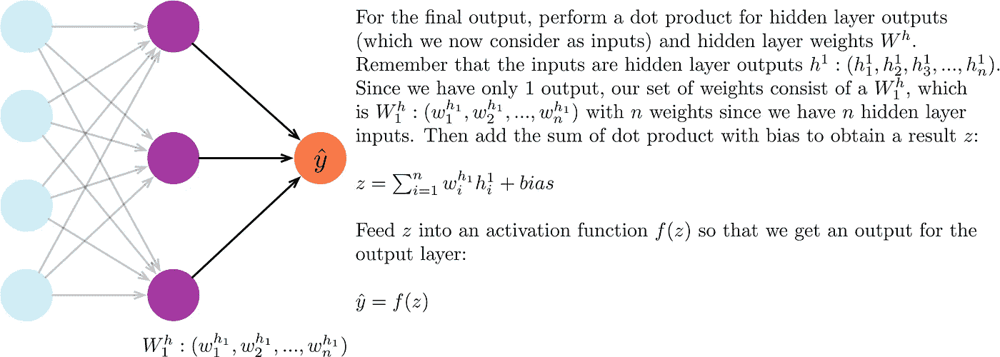
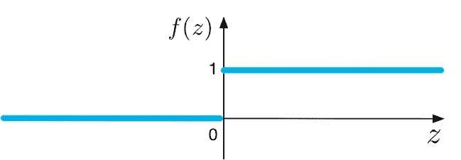
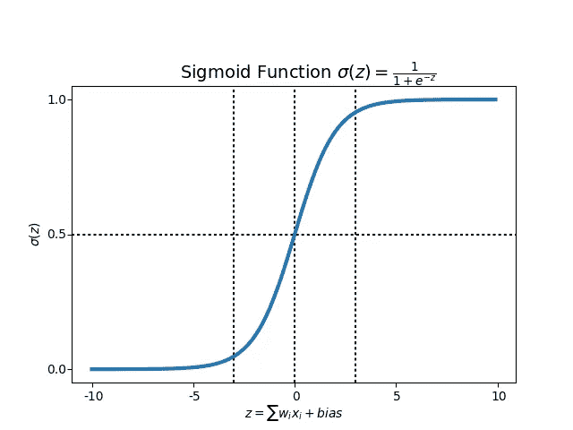
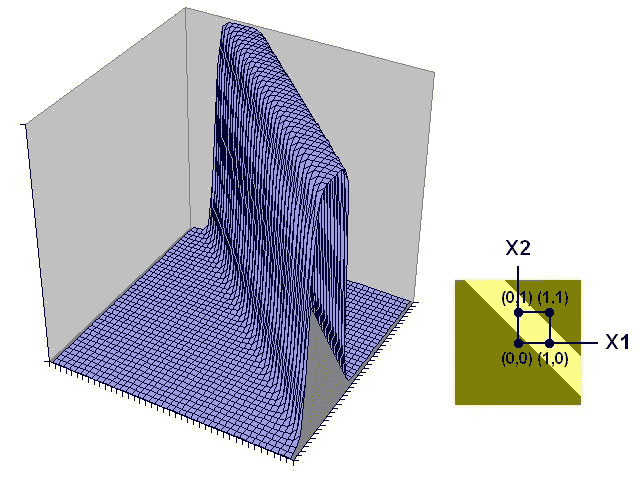
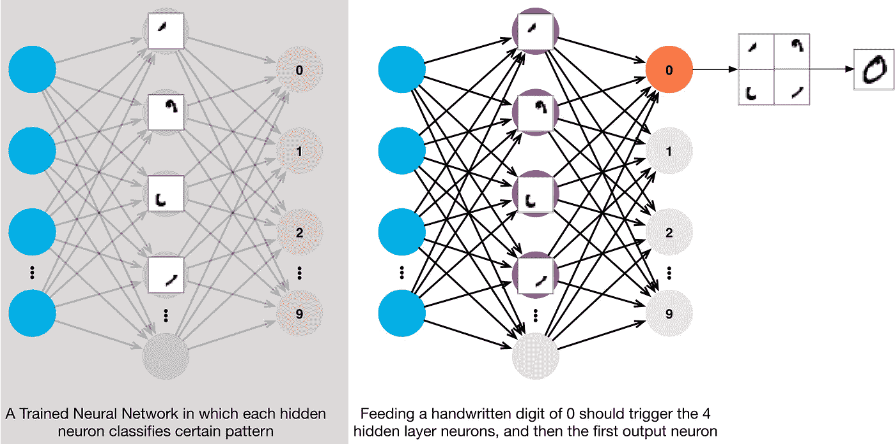
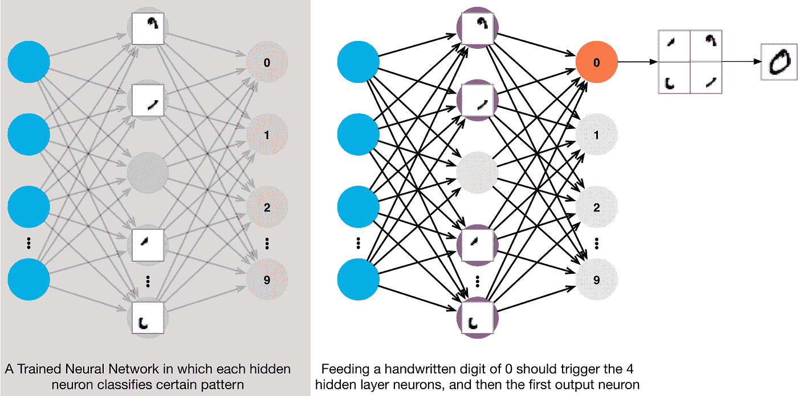
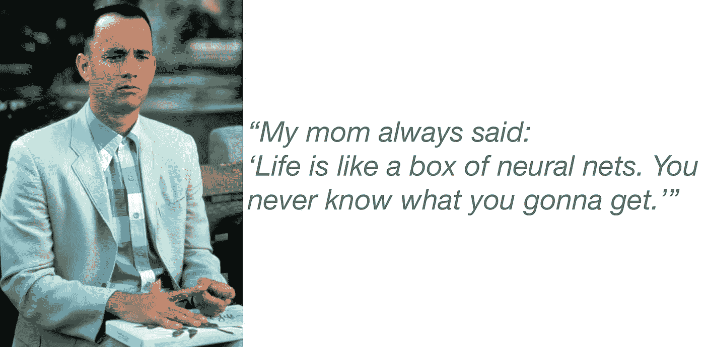

# 具有 Sigmoid 函数的多层神经网络——新手的深度学习(2)

> 原文：<https://towardsdatascience.com/multi-layer-neural-networks-with-sigmoid-function-deep-learning-for-rookies-2-bf464f09eb7f?source=collection_archive---------0----------------------->

第 1 章:[介绍深度学习和神经网络](https://medium.com/towards-data-science/introducing-deep-learning-and-neural-networks-deep-learning-for-rookies-1-bd68f9cf5883)

第二章:具有 Sigmoid 函数的多层神经网络

*关注我的* [*推特*](https://twitter.com/nahuakang) *了解更多关于深度学习创业公司的生活。*

大家好。欢迎回到我的第二篇系列文章**菜鸟深度学习(DLFR)** ，作者是你忠实的菜鸟；)如果你觉得难以理解的话，请随意参考我在这里的第一篇文章。或者在本页用备注高亮显示或者在下方留下评论！我们也非常感谢您的反馈。

这次我们将更深入地研究神经网络，这篇文章将比上一次更具技术性。但是不用担心，我会让你在没有 CS/数学背景的情况下，尽可能简单直观地学习基础知识。你很快就能吹嘘你的理解了；)

# 来自 DLFR 1 的评论

上次，我们介绍了深度学习领域，并检查了一个简单的神经网络——感知器……或恐龙……好吧，说真的，单层感知器。我们还研究了感知器网络如何处理我们输入的输入数据并返回输出。

关键概念:输入数据，权重，求和加偏，激活函数(具体是阶跃函数)，然后输出。厌倦了吗？别担心:)我保证会有……更多的术语出现！但是你很快就会习惯的。我保证。

**Graph 1:** Procedures of a Single-layer Perceptron Network

回到 20 世纪 50 年代和 60 年代，人们没有单层感知器的有效学习算法来学习和识别非线性模式(还记得 XOR 门问题吗？).公众对感知器失去了兴趣。毕竟，现实世界中的大多数问题都是非线性的，作为个体人类，你和我都非常擅长线性或二元问题的决策，如 ***我是否应该研究深度学习*** 而不需要感知机。好吧，“好”在这里是一个棘手的词，因为我们的大脑真的不是那么理性。但我会把这个问题留给行为经济学家和心理学家。

# 突破:多层感知器

快进近 20 年，到 1986 年，Geoffrey Hinton、David Rumelhart 和 Ronald Williams 发表了一篇论文“*通过反向传播错误*学习表征”，其中介绍了:

1.  **反向传播**，**到*的一个过程，反复调整权重*到**以使实际输出和期望输出之间的差异最小化
2.  **隐藏层**，是堆叠在输入和输出 之间的 ***神经元节点，允许神经网络学习更复杂的特性(如异或逻辑)***

如果你对 DL 完全陌生，你应该还记得杰弗里·辛顿(Geoffrey Hinton)，他在 DL 的发展过程中起着举足轻重的作用。这是一些重大新闻:我们 20 年来一直认为神经网络没有解决现实世界问题的前景。现在我们看到岸上灯塔发出的光了！让我们来看看这两个新的介绍。

嗯，第一个，**反向传播**，上一篇帖子提到过。还记得我们反复强调设计神经网络的重要性，以便网络可以从 ***期望输出*** (事实是什么)和 ***实际输出*** (网络返回什么)之间的差异中学习，然后向权重发回信号并要求权重进行自我调整吗？这将使网络的输出在下次运行时更接近于期望的输出。

第二个呢，隐藏层？什么是隐藏层？一个隐藏层就把单层感知器变成了多层感知器！计划是这样的，由于技术原因， ***我将在这篇文章中重点讨论隐藏层，然后在下一篇文章*** 中讨论反向传播。

这里只是一个随机的有趣事实:我怀疑 Geoffrey Hinton 保持着谷歌:D 最年长实习生的记录。不管怎样，如果你已经熟悉机器学习，我相信他在 Coursera 上的课程会很适合你。

Geoffrey Hinton, one of the most important figures in Deep Learning. Source: thestar.com

# **具有隐藏层的神经网络**

神经网络的隐藏层实际上就是在输入和输出层之间增加更多的神经元。

**Graph 2:** Left: Single-Layer Perceptron; Right: Perceptron with Hidden Layer

输入层中的数据用下标 ***1，2，3，…，m*** 标记为 ***x*** 。隐藏层中的神经元用下标 ***1，2，3，…，n*** 标记为 ***h*** 。注意隐藏层**是 *n* 而不是 *m*** ，因为隐藏层神经元的数量可能与输入数据中的数量不同。并且如下图所示，隐藏层神经元也标有上标 ***1*** 。这是为了当你有几个隐藏层时，你可以识别它是哪个隐藏层:*第一个隐藏层有上标 1，第二个隐藏层有上标 2，以此类推，像在* ***图 3*** 中。输出用一个 ***帽子*** 标注为 ***y*** 。

**Graph 3:** We label input layer as x with subscripts 1, 2, …, m; hidden layer as h with subscripts 1, 2, …, n; output layer with a hat

为了使生活更容易，我们将使用一些术语来使事情变得清晰一些。我知道，术语可能很烦人但是你会习惯的:)首先，如果我们有 ***m*** 输入数据( ***x1，x2，…，xm*** )，我们称这个 ***m 特性*** 。特征只是我们认为对特定结果有影响的一个变量。就像我们关于 ***结果的例子如果你决定学不学 DL，*** 我们有 3 个特点:1。学了 DL，2 以后会赚更多的钱吗？数学/编程难吗，3。你需要一个 GPU 来开始吗？

其次，当我们将 m 个特征中的每一个乘以一个权重( ***w1，w2，…，wm*** )并将它们加在一起时，这就是一个**点积**:

Definition of a Dot Product

所以现在我们来看看几点:

1.  用 ***m 特性*** 在输入*X 时，需要用*m 权重来执行点积**
2.  **用 ***n*** 隐层中的隐神经元，你需要 ***n*** 套权值( ***W1，W2，… Wn*** )来进行点积**
3.  **有了 1 个隐藏层，你执行 ***n*** 点积得到隐藏输出***h:****(***h1，h2，…，hn*** )***
4.  **然后就像单层感知器一样，我们用隐藏输出 ***h:*** ( ***h1，h2，…，hn*** )作为具有 **n 个特征的输入数据，**用 1 组*权重( ***w1，w2，…，wn*** )执行点积，得到你的最终输出***

****输入值如何*前向传播*到隐含层，然后从隐含层到输出的过程与**图 1** 相同。下面我提供了如何做到这一点的描述，在图 4 中使用了下面的神经网络。****

********

****Graph 4: Example****

****************

****Graph 5: Procedure to Hidden Layer Outputs****

****现在隐藏层的输出被计算出来了，我们用它们作为输入来计算最终的输出。****

********

****Graph 6: Procedure to Final Output****

****耶！现在你完全理解多层感知器是如何工作的了:)它就像一个单层感知器，除了在这个过程中你有更多的权重。当你在具有更多更多特征的大型数据集上训练神经网络时(比如自然语言处理中的 word2vec)，这个过程会耗尽你计算机中的大量内存。这就是为什么深度学习直到过去几年才起飞的一个原因，当时我们开始生产更好的硬件，可以处理消耗内存的深度神经网络。****

# ****乙状结肠神经元:介绍****

****所以现在我们有了一个更复杂的带有隐藏层的神经网络。但是我们还没有用阶跃函数解决激活问题。****

****在上一篇文章中，我们谈到了阶跃函数线性的局限性。需要记住的一点是:**如果激活函数是线性的，那么你可以在神经网络中任意堆叠多个隐层，最终输出的仍然是原始输入数据**的一个 [**线性组合**](https://stats.stackexchange.com/a/192073/166513) **。如果概念难以理解，请 [**务必阅读此链接**](https://www.quora.com/Why-does-deep-learning-architectures-use-only-non-linear-activation-function-in-the-hidden-layers/answer/David-Kobilnyk?srid=Lfu1) 以获得的解释。这种线性意味着它不能真正掌握非线性问题的复杂性，如 XOR 逻辑或由曲线或圆分隔的模式。******

****同时，阶跃函数也没有有用的导数(它的导数在 x 轴上的 0 点处处处为 0 或未定义)。对于**反向传播**不起作用，这个我们在下一篇帖子里一定会讲到！****

********

****Graph 7: Step Function****

****好吧，这里有另一个问题:具有阶跃函数的感知器作为神经网络的“关系候选者”不是很“稳定”。想想看:这个女孩(或男孩)有严重的躁郁症！有一天(对于 *z* *< 0* )，(s)他都是“安静”“下来”，给你零反应。然后又过了一天(对于 *z* *≥ 0* )，他突然“健谈”“活泼”，跟你说个不停。巨大的变化！她/他的心情是没有过渡的，你不知道什么时候是下降还是上升。是的…那是阶梯函数。****

****因此，基本上，我们感知机网络输入层中任何权重的微小变化都可能导致一个神经元突然从 0 翻转到 1，这可能再次影响隐藏层的行为，然后影响最终结果。就像我们已经说过的，我们想要一种学习算法，它可以通过逐渐改变权重来改善我们的神经网络，而不是通过平坦的无响应或突然的跳跃。如果我们不能使用阶跃函数来逐渐改变权重，那么它就不应该是选择。****

********

****Graph 8: We Want Gradual Change in Weights to Gradually Change Outputs****

****现在告别带阶跃函数的感知器。我们正在为我们的神经网络寻找一个新的合作伙伴， **sigmoid 神经元**，它具有 sigmoid 功能(duh)。但是不要担心:唯一会改变的是激活函数，到目前为止我们所了解的关于神经网络的一切仍然适用于这种新型神经元！****

********

****Sigmoid Function****

********

****Graph 9: Sigmoid Function using Matplotlib****

****如果函数对你来说看起来很抽象或者很奇怪，那么不要太在意像欧拉数 ***e*** 之类的细节或者最初是怎么有人想出这个疯狂的函数的。对于那些不精通数学的人来说，关于图 9 中的 sigmoid 函数，唯一重要的事情首先是它的曲线，其次是它的导数。以下是一些更多的细节:****

1.  ****Sigmoid 函数产生与阶跃函数相似的结果，输出介于 0 和 1 之间。曲线在 ***z=0*** 处过 0.5，我们可以为激活函数设置规则，比如:如果乙状结肠神经元的输出大于等于 0.5，则输出 1；如果输出小于 0.5，则输出 0。****
2.  ****Sigmoid 函数的曲线上没有加加速度。它是光滑的，它有一个非常好的简单的导数***【σ(z)*(1-σ(z)】,****，在曲线上处处可微。导数的微积分推导可以在栈溢出[这里](https://math.stackexchange.com/a/1225116/425514)找到如果你想看的话。但是不一定要知道怎么推导。这里没有压力。*****
3.  *****如果 ***z*** 非常负，那么输出大约为 0；如果 ***z*** 非常正，则输出约为 1；但在 ***z=0*** 左右，其中 ***z*** 既不太大也不太小(在**图 9** 中两条外侧垂直网格虚线之间)，随着*的变化，我们会有相对更多的偏差。******

*****现在，这似乎是我们神经网络的测年材料:)Sigmoid 函数，不同于阶跃函数，将非线性引入到我们的神经网络模型中。非线性只是指我们从神经元得到的输出，是一些输入 ***x (x1，x2，…，xm)*** 和权重 ***w (w1，w2，…，wm)*** 加偏置然后放入一个 sigmoid 函数的点积，不能用输入***【x(x1，x2，…，XM)**的一个[线性组合来表示](https://stats.stackexchange.com/a/192073/166513)********

****当被多层神经网络中的每个神经元使用时，该非线性激活函数产生原始数据的新的“[表示](http://colah.github.io/posts/2014-03-NN-Manifolds-Topology/)，并且最终允许非线性判定边界，例如 XOR。因此，在 XOR 的情况下，如果我们在隐藏层中添加两个 sigmoid 神经元，我们可以在另一个空间中，将原始 2D 图重塑为类似下面图 10 左侧的 3D 图像。因此，该脊允许对异或门进行分类，它代表了**图 10** 右侧 2D 异或门的浅黄色区域。所以如果我们的输出值在山脊较高的区域上，那么应该是真或者 1(就像天气冷但不热，或者天气热但不冷)；如果我们的输出值在两个角上较低的平坦区域，那么它为假或 0，因为说天气既热又冷或既不热也不冷是不对的(好吧，我想天气可能既不热也不冷…你明白我的意思吧…对吗？).****

********

****Graph 10\. Representation of Neural Networks with Hidden Layers to Classify XOR Gate. Source: [http://colinfahey.com/](http://colinfahey.com/)****

****我知道这些关于非线性的谈话可能会令人困惑，所以请在这里阅读更多关于线性和非线性的内容(Christopher Olah 的一个很棒的博客中的动画直观的帖子)，在这里阅读(由 [Vivek Yadav](https://medium.com/u/b783495cc56b?source=post_page-----bf464f09eb7f--------------------------------) 带 ReLU 激活功能)，在这里阅读(由 Sebastian Raschka)。希望你已经意识到为什么非线性激活函数是重要的，如果没有，放轻松，给自己一些时间来消化它。****

****问题解决了……暂时的；)我们将在不久的将来看到一些不同类型的激活函数，因为 sigmoid 函数也有自己的问题！比较流行的有 ***tanh*** 和 ***ReLU*** 。然而，这是另一篇文章。****

# ****多层神经网络:直观的方法****

****好吧。因此，我们在神经网络中引入了隐藏层，并用 sigmoid 神经元取代了感知器。我们还介绍了非线性激活函数允许对我们的数据中的非线性决策边界或模式进行分类的思想。你可以记住这些要点，因为它们是事实，但我鼓励你在互联网上搜索一下，看看你是否能更好地理解这个概念(我们自然需要一些时间来理解这些概念)。****

****现在，我们从未讨论过一个非常重要的问题:首先，我们究竟为什么要在神经网络中设置隐藏层？隐藏层如何神奇地帮助我们解决单层神经元无法解决的复杂问题？****

****从上面的 XOR 示例中，您已经看到了在 1 个隐藏层中添加两个隐藏神经元可以将我们的问题重新塑造到一个不同的空间中，这神奇地为我们创建了一种用脊对 XOR 进行分类的方法。因此，隐藏层以某种方式扭曲了问题，使神经网络很容易对问题或模式进行分类。现在，我们将使用一个经典的教科书示例:手写数字的识别，来帮助您直观地理解隐藏层的作用。****

********

****Graph 11\. MNIST dataset of Hand-written Digits. Source: [http://neuralnetworksanddeeplearning.com/](http://neuralnetworksanddeeplearning.com/)****

****图 11 中的数字**属于一个名为 [MNIST](http://yann.lecun.com/exdb/mnist/) 的数据集。它包含了 70，000 个人手书写的数字的例子。这些数字中的每一个都是 28x28 像素的图片。所以一个数字的每个图像总共有 28*28=784 个像素。每个像素取 0 到 255 之间的值(RGB 颜色代码)。0 表示颜色是白色，255 表示颜色是黑色。******

********

****Graph 12\. MNIST digit 5, which consist of 28x28 pixel values between 0 and 255\. Source: [http://neuralnetworksanddeeplearning.com/](http://neuralnetworksanddeeplearning.com/)****

****现在，计算机无法像我们人类一样真正“看到”一个数字，但如果我们将图像分解为一个由 784 个数字组成的数组，如[0，0，180，16，230，…，4，77，0，0，0，0]，那么我们可以将这个数组输入到我们的神经网络中。计算机不能通过“看”来理解图像，但它可以理解和分析代表图像的像素数量。****

********

****Graph 13: Multi-Layer Sigmoid Neural Network with 784 input neurons, 16 hidden neurons, and 10 output neurons****

****所以，让我们建立一个类似上面**图 13** 中的神经网络。它有 784 个 28×28 像素值的输入神经元。假设它有 16 个隐藏神经元和 10 个输出神经元。10 个输出神经元以数组的形式返回给我们，每个神经元负责对一个数字从 0 到 9 进行分类。所以如果神经网络认为手写数字是零，那么我们应该得到一个输出数组[1，0，0，0，0，0，0，0，0，0]，这个数组中第一个感觉数字是零的输出被我们的神经网络“激发”为 1，其余的都是 0。如果神经网络认为手写数字是 5，那么我们应该得到[0，0，0，0，0，1，0，0，0，0，0，0]。负责分类 5 的第 6 个元素被触发，而其他元素没有被触发。如此等等。****

****还记得我们提到过，神经网络通过对数据进行重复训练来变得更好，这样它们就可以调整网络每一层的权重，以使最终结果/实际输出更接近所需输出吗？因此，当我们实际上用 MNIST 数据集中的所有训练样本训练这个神经网络时，我们不知道应该给每一层分配什么权重。所以我们只是随机要求计算机在每一层分配权重。(我们不希望所有的权重都是 0，如果空间允许，我会在下一篇文章中解释)。****

****这种随机初始化权重的概念很重要，因为每次训练深度学习神经网络时，你都在为权重初始化不同的数字。所以本质上，在网络被训练之前，你和我都不知道神经网络中发生了什么。一个经过训练的神经网络具有在特定值优化的权重，这些权重对我们的问题做出最佳预测或分类。从字面上看，这是一个黑匣子。并且每次经过训练的网络将具有不同的权重集。****

****为了便于论证，让我们想象一下**图 14** 中的以下情况，这是我从迈克尔·尼尔森的[在线书籍](http://neuralnetworksanddeeplearning.com/chap1.html)中借来的:****

********

****Graph 14\. An Intuitive Example to Understand Hidden Layers****

****在监督学习中用一轮又一轮的标记数据训练神经网络后，假设前 4 个隐藏神经元学会识别上面**图 14** 左侧的模式。然后，如果我们向神经网络输入一个手写数字 0 的数组，网络应该正确地触发隐藏层中的前 4 个隐藏神经元，而其他隐藏神经元保持沉默，然后再次触发第一个输出神经元，而其余的神经元保持沉默。****

********

****Graph 15\. Neural Networks are Black Boxes. Each Time is Different.****

****如果你用一组新的随机权重来训练神经网络，它可能会产生下面的网络(**比较图 15 和图 14** )，因为权重是随机的，我们永远不知道哪个会学习哪个或什么模式。但是，如果训练得当，网络仍然应该触发正确的隐藏神经元，然后产生正确的输出。****

********

****Our quote this week ;)****

****最后要提一点:在多层神经网络中，第一个隐藏层将能够学习一些非常简单的模式。每增加一层隐藏层，就能逐渐学习更复杂的模式。请看来自《科学美国人》的**图 16** 中的人脸识别示例:)****

********

****Graph 16: Each Hidden Layer Learns More Complex Features. Source: Scientific American****

****一些很棒的人制作了下面的网站，让你玩玩神经网络，看看隐藏层是如何工作的。试试看。真的很好玩！****

**** [## 张量流-神经网络游乐场

### 这是一种构建从数据中学习的计算机程序的技术。它非常松散地基于我们如何思考…

playground.tensorflow.org](http://playground.tensorflow.org/) 

Ophir Samson 写了一篇很好的文章[，也解释了什么是神经网络](https://medium.com/towards-data-science/deep-learning-weekly-piece-whats-a-neural-network-aa0df888d8a2)，有很好的可视化效果，而且很简洁！

 [## 深度学习周刊:什么是神经网络？

### 对于本周的文章，我想通过我收集的一个简单的例子来阐明什么是神经网络…

medium.com](https://medium.com/towards-data-science/deep-learning-weekly-piece-whats-a-neural-network-aa0df888d8a2) 

# 概述

在这篇文章中，我们回顾了感知器的局限性，介绍了具有新激活函数的 sigmoid 神经元，称为 sigmoid function。我们还讨论了多层神经网络如何工作，以及神经网络中隐藏层背后的直觉。

我们现在几乎完成了理解基本神经网络的全部课程；)呵呵，还没完呢！在下一篇文章中，我将会谈到一种叫做损失函数的东西，以及这种神秘的反向传播，我们只提到过，但从来没有访问过！如果你等得不耐烦，请查看以下链接:

 [## 用于视觉识别的 CS231n 卷积神经网络

### 斯坦福 CS231n 课程材料和笔记:视觉识别的卷积神经网络。

cs231n.github.io](http://cs231n.github.io/optimization-2/)  [## 一个逐步反向传播的例子

### 背景技术反向传播是训练神经网络的常用方法。网上不缺论文说…

mattmazur.com](https://mattmazur.com/2015/03/17/a-step-by-step-backpropagation-example/) 

敬请关注，最重要的是，享受学习:D 的乐趣

你喜欢这次阅读吗？别忘了关注我的 [*推特*](https://twitter.com/nahuakang) *！*****