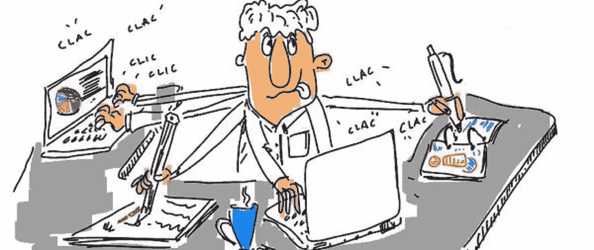
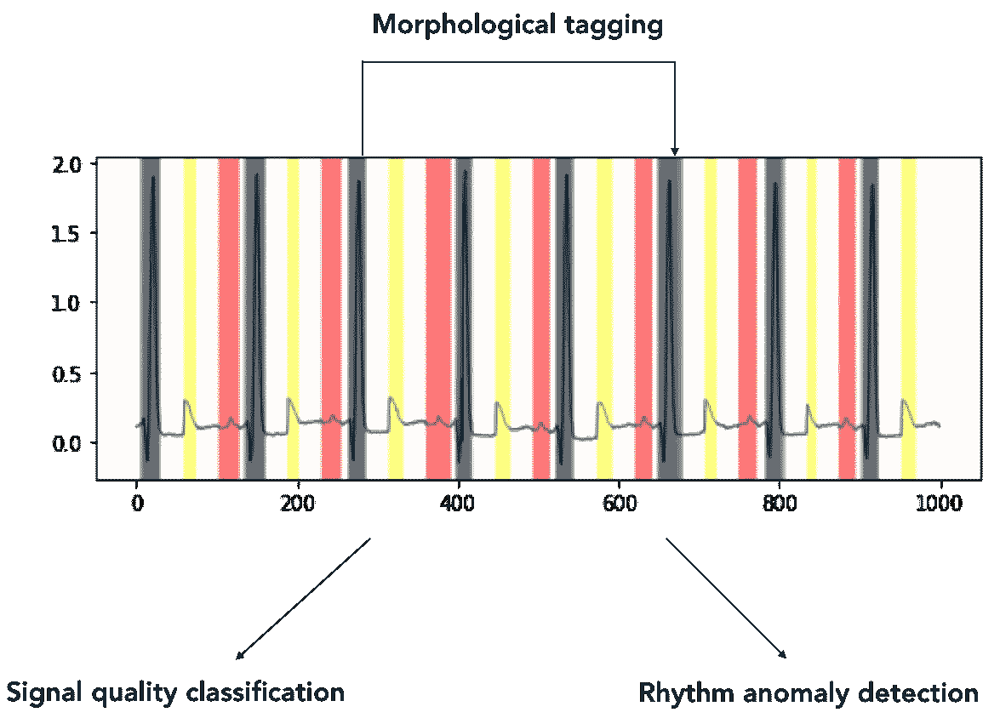
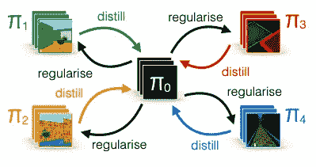

# 多任务学习:教你的人工智能更多，使之更好

> 原文：<https://towardsdatascience.com/multitask-learning-teach-your-ai-more-to-make-it-better-dde116c2cd40?source=collection_archive---------4----------------------->



[https://bitesizebio.com/27766/multitasking-lab-not-multitasking/](https://bitesizebio.com/27766/multitasking-lab-not-multitasking/)

大家好！今天，我想告诉你关于机器学习的话题，一方面，这是非常面向研究的，应该把机器学习算法带到更像人类的推理中，另一方面，这是我们从机器学习的基础中非常熟悉的，但很少被解释为我今天想要展示的。这被称为**多任务学习**，它(几乎)与上图中的多任务无关。在这篇文章中，我将展示什么是人类和算法的多任务学习，今天的研究人员如何应用这一概念，你如何用它来解决你的任何问题以提高你的模型的性能。最重要的是，我将为您提供源代码和 4 个用例的解释(从照片中识别情感，用加速度计数据识别运动，暹罗网络助推和解决[数字](http://numer.ai)挑战:全部使用多任务学习！)，你可以用它作为你自己项目的模板(我希望是灵感)!

这篇文章的灵感来自于 Sebastian Ruder 和丰富的卡鲁阿纳资料。

如果想直接跳转到 Keras 中的代码，这里的[就是对应的 GitHub repo。我也在](https://github.com/rachnog/education/tree/master/multitask_dsua_2018)[数据科学 UA](https://www.facebook.com/events/318066168729170/) 会议上做了一个关于这个话题的演讲，幻灯片也即将上传。

# 我们的多任务处理

“一心多用”这个词本身通常意味着一些负面的东西——一个人试图做很多事情，但没有一件成功就是最好的例子。但在这里我想谈谈有点不同的“多任务处理”。我想想象一下，我们生物大脑的所有功能都是某种深度神经网络，它也经过反向传播训练，并给出一些标签作为输出。如果我这样想我的视觉系统，当我看东西时，它会输出什么？我不仅能识别物体，分割它们，还能理解场景。我还可以估计街上人们的情绪，他们的穿着，根据他们的穿着判断天气，我可以估计这是哪个国家甚至是哪个城市，以及许多其他重要的细节，这些都让我从视觉渠道获得了非常丰富的理解。

好吧，那**听**呢？如果我听到任何人的声音，我会立即理解一个人的性别、音调，我理解单词、整个句子和意思，我知道语言，我理解所有的实体，甚至能够回答我听到的。

我可以用我的任何感觉系统做同样的练习——我总是从一个单一的“测试”例子中感受到很多东西，不管它是什么——一张图片、一个声音、一段文字甚至一种感觉。

# 机器的多任务处理

另一方面，现代神经网络(和其他机器学习算法)通常从单个例子中解决单个问题——它可以是分类、回归、结构化预测、异常检测甚至是对象生成，但通常，我们期望最终是单个事情。在这篇博客中，我想谈谈并展示我们如何让我们的模型学习更多的东西，我将从一个我们已经知道多年的多任务学习的例子开始:


Well-known L2 regularization for a loss function

你说得对，我们都知道这个著名的 L2 正则化公式。为什么我说是多任务学习的例子？因为我们同时解决了两个优化问题:损失函数最小化和使我们的参数 *w* 的范数更小。我们通常不会深入思考这个问题，但选择这个特定的第二优化函数背后有很多理论:


Different explanations of a regularization effect

例如，**安德烈** **吉洪诺夫**主要对解决逆不适定问题感兴趣，通过参数范数添加正则化帮助他实现问题的平滑和良好调节。波兰数学家 **Zaremba** 将它引入统计学习理论，因为模型的复杂性非常小，因此我们将其最小化。从 **Bayes 的**的观点来看，这样我们就把我们的权重设定为某种特定的分布——这些是我们对参数的先验。当然，我们大多数人在一些课程中学习过它，我们并不真正担心它，但我们知道它可以防止我们的模型过度拟合:)

如你所见，在这些解释中，我们只考虑模型本身的参数。但是从我的直觉角度(以及我大脑中的神经网络)我想从**推理**的角度更具体地解释它。我可以添加一些考虑到问题的“真实的”、“类似人类的”背景的“正则化”吗？如果我想从照片中识别情绪，我应该限制权重以“知道”鼻子和嘴唇的运动吗？很可能是的。如果我想翻译一篇文章，知道给定单词的词性能对我的参数有帮助吗？我想会的。如果我正在处理信号处理问题，我是否希望我的模型能够对给定时间序列的过去和未来有一些直觉？可能会很有帮助！


[http://ruder.io/multi-task/](http://ruder.io/multi-task/)

所有这些“知道”，“调节”我可以作为一个额外的输入纳入机器学习算法，但自从我在这里开始谈论多任务学习…你现在明白我在领导什么了。如果算法参数的正则化这样的额外损失有助于更好的性能，为什么我们不尝试从人类逻辑的角度来看应该有助于性能的**额外损失**？然后，我们的算法将看起来像上面的图片:一个单一的输入，几个层(在神经网络的情况下)和许多输出，可以发挥一些超参数*λ*的正则化作用，或一个独立的目标，也希望优化和解决。

是的，除了多任务学习的“正规化”动机之外，我们只能承认，学习一个神经网络来同时解决 X 个问题，而不是拥有 X 个独立的神经网络，从简单的工程角度来看，这要酷得多。更好的性能、规范化和通用化是额外的收获。

# 动机用例

在开始深入细节之前，我想展示一些激励人心的例子。第一个是计算机视觉方面的惊人研究，他们不仅展示了单个神经网络如何同时解决 20 多项任务，而且还自动建立了 2D 和 3D 空间中不同任务的层次结构(这就是为什么它被称为 Taskonomy ),并显示了与将一项任务的学习转移到另一项任务相比，性能有所提高。这项工作是一个惊人的灵感，关于如何把一个单一图像的复杂理解纳入一个单一的算法。

[](http://taskonomy.stanford.edu/) [## 斯坦福大学

### Taskonomy:解开任务迁移学习，CVPR 2018(最佳论文)。斯坦福大学伯克利分校。我们提议完全…

taskonomy.stanford.edu](http://taskonomy.stanford.edu/) 

第二个很好的例子是自然语言处理:为什么我们不使用一个神经网络来解决情感分析、语义解析、翻译、回答问题、翻译单个句子呢？Salesforce 的研究人员也这么认为，并开发了他们自己的创造性解决方案。

 [## decaNLP

### 深度学习显著提高了自然语言处理(NLP)任务的最新性能，但…

decanlp.com](http://decanlp.com) 

在我负责机器学习的 [Mawi Solutions](http://mawi.band) 中，我们还将多任务学习的概念应用于实时心电图分析。在测量 ECG 期间，我们需要标记其形态结构以供进一步分析，估计信号质量，并在每秒相同的时间解决异常检测任务。我们可以在一部手机上同时运行三种不同的算法(不一定是机器学习算法)，但我们成功地用一个单一的神经网络解决了它们，与不同方法的组合相比，这个神经网络明显更快、更准确。



Multitask learning for live ECG analysis in Mawi Solutions

作为“类人”行为的一个重要概念，多任务学习对于强化学习也非常重要。一个很好的例子可以是 DeepMind 的工作[发狂](https://deepmind.com/research/publications/distral-robust-multitask-reinforcement-learning/):我们建议共享一个“提炼”的策略，捕捉跨任务的共同行为，而不是共享不同损失之间的参数。



Distral: Robust Multitask Reinforcement Learning

# 工作的理由

好吧，这一切都很酷，但仍然不太清楚它为什么工作。为什么添加不同的，甚至相近的任务可以帮助学习主要任务，或者为什么他们可以一起学习？

1.  **正则化:**附加损失原则上与不同研究者从正则化中得到的结果是一样的:它平滑了损失函数，最小化了模型的复杂性，并为模型提供了非常有用的先验信息。
2.  **表示偏差:**当你在几个任务的交集上训练你的模型时，你推动你的学习算法在交集上的较小表示区域而不是单个任务的较大区域上寻找解决方案。它导致更快更好的收敛。
3.  **特性选择仔细检查:**如果一个特性对于不止一个任务是重要的，那么很可能这个特性对于您的数据来说确实是非常重要和有代表性的
4.  **迁移学习:**机器学习已经从学习几项任务中受益，但顺序使用迁移学习:在一项任务的大型数据集上预先训练一个模型，然后使用获得的模型在其上训练另一项任务。经验结果表明，联合学习这些任务会更有益处，而且肯定会更快。
5.  **不能成为输入的输出:**这一刻对我个人来说是最有趣的。有一些特殊类型的数据，由于它们的顺序性质，受到过去观察的制约，通常我们需要处理它们:句子中的单词(必须预测下一个单词、帧和视频，必须预测下一帧，等等)。我们希望这些过去时刻的表示能够模拟未来的时刻——在这里，辅助任务如此自然地出现——过去的帧必须预测下一帧，而我们*不能将这些帧用作输入*！其他很好的例子是那些在测试/生产阶段很难或者很长而无法计算的特性，但是我们可以使用它们作为辅助损失函数来规范我们的模型，以便“了解”它们。


Predicting next frame in a video cant be a very informative prior: [https://coxlab.github.io/prednet/](https://coxlab.github.io/prednet/)

# 每个人的辅助任务

好吧，也许现在你或多或少地相信多任务学习很酷，对研究人员有用，背后有一些理论和经验动机。但是你可能会回答我，在你的项目中你并不真的需要它，因为你不需要同时解决几个任务，或者你只是没有数据集的额外标签，或者没有可能得到它们。在这一部分，我想展示一些辅助损失的例子，*你们中的每一个人*都可以在*任何*项目中使用，作为一个额外的正则项，这将提高你们的绩效。

1.  **自然语言处理**您可以预测句子中的下一个单词，作为您希望模型拥有的先验知识。
    - NLTK:词性、句子树、NER——你确定你的深度学习不会从它们那里受益？如前所述，尝试来自 [NLTK](https://www.nltk.org/) 或 [spacy](https://spacy.io/) 的基本 NLP 功能。
    -[de clalp](http://decanlp.com):清晰的灵感:)
2.  **计算机视觉**你在 [OpenCV](https://opencv.org/) 、 [scikit-image](https://scikit-image.org/) 或者 [dlib](http://dlib.net/) 里都有。
    - [任务经济](http://taskonomy.stanford.edu):清晰灵感:)
3.  **信号处理**
4.  **一般建议**
    -自动编码器/生成式建模，因为模型推动任何表示尽可能最有用和最具描述性
    -提示(预测重要特征，如计算机视觉中的 HOG、NLP 中的 NER 和 DSP 中的熵)

# 关于可重复性研究的一个注记

在展示如何实现多任务学习之前，我想展示我必须做些什么来使我在 Keras 中的代码至少在某种程度上可以在另一台计算机上重现(但这仍然不够，正如我在基辅的工作室所展示的那样)。首先，我必须修复所有随机种子:

```
random.seed(42)
np.random.seed(42)
tf.set_random_seed(42)
```

修复神经网络层的初始化器并运行会话:

```
my_init = initializers.glorot_uniform(seed=42)session_conf = tf.ConfigProto(intra_op_parallelism_threads=1,
                              inter_op_parallelism_threads=1)
sess = tf.Session(graph=tf.get_default_graph(), config=session_conf)
K.set_session(sess)
```

并在创建数据集时修复随机种子:

```
train_test_split(X, Y1, Y2, Y3, random_state = 42)
```

甚至在训练一个模型时设置“shuffle = False”。此外，我将模型和训练条件的所有超参数固定为时期数、优化器和批量大小。但是这还不够。在某些电脑上(我在 MacBook Air 上运行我的代码),结果与我的略有不同。我只能这样解释(感谢听觉的提示):不同的硬件导致不同的浮点数错误，从而导致不同 CPU 上的优化过程略有不同。我想知道是否有办法克服这一点(我正在考虑在每个训练过程之前重新初始化随机种子)，并非常感谢任何提示。

# 练习 1:情绪识别

正如我所承诺的，本文将有几个代码示例，因此您可以尝试自己进行多任务学习(主要集中在使用附加任务作为正则项)。第一个例子与计算机视觉有关，特别是与数据集有关(数据集不是免费分发的，但您可以出于研究目的请求访问):

[](http://www.pitt.edu/~emotion/ck-spread.htm) [## 匹兹堡的情感分析小组

### 编辑描述

www.pitt.edu](http://www.pitt.edu/~emotion/ck-spread.htm) 

我的完整代码在这里:

[](https://github.com/Rachnog/education/tree/master/multitask_dsua_2018/emotion_detection) [## 拉赫诺格/教育

### 我的讲座和机器学习自学材料- Rachnog/education

github.com](https://github.com/Rachnog/education/tree/master/multitask_dsua_2018/emotion_detection) 

该数据集由不同人的图像和相应的标签组成:

*   他们脸上表达的情感
*   面部动作单元(后来的 FAU，见更多信息[这里](https://en.wikipedia.org/wiki/Facial_Action_Coding_System)
*   面部关键点

我们将使用一个非常简单的神经网络(与最先进的网络相比)作为主要任务的情感识别，并将尝试调整 FAU 和关键点检测作为正则化。这是一个我们将尝试用多任务学习来增强的神经网络。如你所见，2018 深度学习时代我们很容易称之为“浅”:

```
visible = Input(shape=input_shape)
x = Conv2D(10, kernel_size=3, activation='elu', padding='same', kernel_initializer=my_init)(visible)
x = MaxPooling2D(pool_size=(2, 2))(x)
x = Conv2D(20, kernel_size=3, activation='elu', padding='same', kernel_initializer=my_init)(x)
x = MaxPooling2D(pool_size=(2, 2))(x)
x = Conv2D(30, kernel_size=3, activation='elu', padding='same', kernel_initializer=my_init)(x)
x = GlobalMaxPooling2D()(x)
output = Dense(Y_train.shape[1], activation='softmax', kernel_initializer=my_init)(x)
model = Model(inputs=visible, outputs=output)
```

它显示了以下结果(当然这并不令人满意):

```
precision    recall  f1-score   support

          0       0.39      0.56      0.46       149
          1       0.00      0.00      0.00        10
          2       0.00      0.00      0.00        71
          3       0.32      0.11      0.16        74
          4       0.47      0.64      0.54       163
          5       0.44      0.11      0.17        64
          6       0.38      0.54      0.44       130

avg / total       0.36      0.41      0.36       661
```

接下来，我为一个必须预测**面部动作单元**和情绪的模型添加了第二个输出:

```
output2 = Dense(Y_train2.shape[1], activation='sigmoid', name = 'facs', kernel_initializer=my_init)(x)
```

而且成绩变得稍微好一点！

```
precision    recall  f1-score   support

          0       0.58      0.36      0.44       149
          1       0.00      0.00      0.00        10
          2       0.47      0.27      0.34        71
          3       0.36      0.65      0.46        74
          4       0.56      0.83      0.67       163
          5       0.56      0.08      0.14        64
          6       0.62      0.68      0.65       130

avg / total       0.53      0.53      0.49       661
```

好吧，如果这个辅助损失有帮助，也许预测**关键点**也可以很好？至少它的表现也比基线要好:

```
precision    recall  f1-score   support

          0       0.69      0.34      0.45       149
          1       0.00      0.00      0.00        10
          2       0.71      0.07      0.13        71
          3       0.38      0.65      0.48        74
          4       0.52      0.88      0.65       163
          5       0.50      0.05      0.09        64
          6       0.53      0.72      0.61       130

avg / total       0.56      0.52      0.46       661
```

好的，看起来现在我有两个辅助损失，它们都很好地规范了我的基线解，所以我想把它们结合起来，我希望得到更好的结果。我会用一种“聪明”的方式来做这件事。我知道，当我(作为一个人)分解我自己的情绪识别时，我首先看到关键点，在我将它们组合成行动单元之后，只有在最后，我才能从这个特征层次中理解情绪。就神经网络而言，这可能意味着我应该将 FAU 损失附加到第一卷积层，将关键点损失附加到第二卷积层，并将主要损失留在最后:

```
visible = Input(shape=input_shape)
x1 = Conv2D(10, kernel_size=3, activation='elu', padding='same', kernel_initializer=my_init)(visible)
x1 = MaxPooling2D(pool_size=(2, 2))(x1)
x2 = Conv2D(20, kernel_size=3, activation='elu', padding='same', kernel_initializer=my_init)(x1)
x2 = MaxPooling2D(pool_size=(2, 2))(x2)
x3 = Conv2D(30, kernel_size=3, activation='elu', padding='same', kernel_initializer=my_init)(x2)
x = GlobalMaxPooling2D()(x3)output = Dense(Y_train.shape[1], activation='softmax', name = 'emotion', kernel_initializer=my_init)(x)
output2 = Dense(Y_train2.shape[1], activation='sigmoid', kernel_initializer=my_init)(GlobalMaxPooling2D()(x2))
output3 = Dense(Y_train3.shape[1], activation='linear', kernel_initializer=my_init)(GlobalMaxPooling2D()(x1))model = Model(inputs=visible, outputs=[output, output2, output3])
```

为了避免“杀死”较低层主损失函数的梯度，我为第二层和第一层的损失 0.1 添加了*λs*:

```
model.compile(loss=['categorical_crossentropy', 'binary_crossentropy', 'mse'],
              optimizer=Adam(clipnorm = 1.), metrics = {'emotion': 'accuracy'}, loss_weights = [1, 1e-1, 1e-1])
```

我们为同样的 10 个纪元训练…然后…瞧！

```
precision    recall  f1-score   support

          0       0.75      0.56      0.64       149
          1       0.00      0.00      0.00        10
          2       0.79      0.27      0.40        71
          3       0.45      0.80      0.58        74
          4       0.67      0.88      0.76       163
          5       0.64      0.14      0.23        64
          6       0.61      0.78      0.68       130

avg / total       0.65      0.63      0.60       661
```

我们可以将我们的结果**从 0.36 F1 分提高到 0.60 F1 分**，只需以一种巧妙的方式使用额外的损失函数。同样的简单 convnet，同样的初始化器，同样的数据，同样的训练过程。看起来像魔术？那么让我们检查下一个例子。

# 练习 2:加速度计运动分析

你可以告诉我，通常情况下，除了主要损失之外，你没有像面部动作单位这样好的附加功能。没关系，现在我给你看一个任务的例子，你可以自己创造这些损失。该数据集是关于通过腕戴式加速度计对活动进行分类的:

[https://archive . ics . UCI . edu/ml/datasets/Dataset+for+ADL+Recognition+with+腕式+加速度计](https://archive.ics.uci.edu/ml/datasets/Dataset+for+ADL+Recognition+with+Wrist-worn+Accelerometer)

这是我解决这个问题的完整代码:

[](https://github.com/Rachnog/education/tree/master/multitask_dsua_2018/accelerometer) [## 拉赫诺格/教育

### 我的讲座和机器学习自学材料- Rachnog/education

github.com](https://github.com/Rachnog/education/tree/master/multitask_dsua_2018/accelerometer) 

我的输入是加速度计的三个轴的多元时间序列，输出是 21 个活动类之一。没有附加额外的损失。我现在该怎么办？当然，创造一些！我选择了我认为合理的损失:

*   给定时间序列的标准偏差
*   时间序列的绝对变化之和
*   傅立叶系数。

我有一个假设，如果我的神经网络知道这些特征中的一个，它会比没有表现得更好。我首先用一个简单的 1D 卷积神经网络检查基线解决方案:

```
inn = Input(shape = (X_train.shape[1], X_train.shape[2], ))

x = Conv1D(16, 5, activation='relu', kernel_initializer=my_init)(inn)
x = MaxPooling1D(5)(x)
x = Conv1D(32, 5, activation='relu', kernel_initializer=my_init)(x)
x = MaxPooling1D(5)(x)
x = Conv1D(64, 5, activation='relu', kernel_initializer=my_init)(x)
x = GlobalMaxPooling1D()(x)
out = Dense(Y_test.shape[1], activation = 'softmax', kernel_initializer=my_init)(x)

model = Model(inputs=[inn], outputs=[out])

model.compile(loss='categorical_crossentropy',
              metrics = ['accuracy'], optimizer = Adam(clipnorm = 1.))
```

并得到如下精确回忆 F1:

```
avg / total       0.61      0.57      0.54       245
```

加上**标准差损失**怎么样？

```
avg / total       0.61      0.60      0.57       245
```

又用了一个**的变化总和**？

```
avg / total       0.57      0.60      0.57       245
```

好吧，他们都没多大帮助，但是**傅立叶**肯定是一个强有力的镜头…

```
avg / total       0.60      0.62      0.59       245
```

似乎我们可以将基线**提高 5%** ，但这也是一个不错的结果！我们经常使用不同的巧妙方法来争取这 5%的份额，所以现在你又多了一个

# 练习 3:加强暹罗网络

[暹罗神经网络](http://www.cs.utoronto.ca/~gkoch/files/msc-thesis.pdf)是一类特殊的模型，旨在在一个新的嵌入空间中比较对象:相似的对象必须彼此靠近(距离小)并且不同——远离(距离大)。为两幅 64x64 的图像计算欧几里德距离(在 MNIST 数据集的情况下)并不是一个明智的想法，但是我们可以将这些图像嵌入到一些向量空间中，这样做是有意义的。这一系列模型的主要特点是具有两个输入和在这些输入之间共享的层权重，以允许交换性(因为我们基本上计算两个对象之间的距离)。在本例中，我将展示向这些图层“袖子”中的每一个添加额外损失将如何提高 MNIST 数据集的性能。完整代码在这里:

[](https://github.com/Rachnog/education/tree/master/multitask_dsua_2018/siamese_mt) [## 拉赫诺格/教育

### 我的讲座和机器学习自学材料- Rachnog/education

github.com](https://github.com/Rachnog/education/tree/master/multitask_dsua_2018/siamese_mt) 

首先，我们为每个输入设置了一个编码器，如下所示:

```
input = Input(shape=input_shape)
x = Flatten()(input)
x = Dense(64, activation='relu')(x)
x = Dropout(0.1)(x)
m = Model(input, x)
```

如您所见，我们将输入图像嵌入某个 64 维空间，在那里我们可以比较它们，损失旨在最小化相同数量图像之间的距离，最大化不同数量图像之间的距离:

```
def contrastive_loss(y_true, y_pred):
    margin = 1
    sqaure_pred = K.square(y_pred)
    margin_square = K.square(K.maximum(margin - y_pred, 0))
    return K.mean(y_true * sqaure_pred + (1 - y_true) * margin_square)
```

我有一个假设，在这个 64 维嵌入空间中，我不仅可以比较图像，还可以对它们进行分类。**所以我的第二个损失将被简单分类成 10 位数的类别。**训练基线暹罗网络并将其作为分类器进行测试，结果如下:

```
* Accuracy on training set: 85.47%
* Accuracy on test set: 85.61%
```

伴随着一个附加损失:

```
* Accuracy on training set: 88.49%
* Accuracy on test set: 88.54%
```

就是这样。:)

# 练习 4:数字财务预测

我觉得这个博客已经太长了，但是不加上最后一个和财务预测有关的例子太有诱惑力了。[numeri](http://numer.ai)是一项关于加密金融数据的数据科学挑战，你已经为自己准备好了一切，剩下的就是——预测**五个独立变量**的 0 或 1，并且不要过度拟合训练数据。因为这里有几个目标是从数据中自然产生的(我知道多任务学习可以防止过度适应)，所以我决定尝试一下多任务。你可以在这里查看全部代码:

[](https://github.com/Rachnog/education/tree/master/multitask_dsua_2018/numerai) [## 拉赫诺格/教育

### 我的讲座和机器学习自学材料- Rachnog/education

github.com](https://github.com/Rachnog/education/tree/master/multitask_dsua_2018/numerai) 

在这种情况下，我的额外损失不是辅助的，但它们都是重要的。所以，我像下面这样建立我的神经网络:

```
inputs = Input(shape=(50,))
c = Dense(100, activation='relu')(inputs)
c = Dropout(0.1)(c) predictions_target_bernie = Dense(1, activation='sigmoid', name = 'target_bernie')(c)
predictions_target_charles = Dense(1, activation='sigmoid', name = 'target_charles')(c)
predictions_target_elizabeth = Dense(1, activation='sigmoid', name = 'target_elizabeth')(c)
predictions_target_jordan = Dense(1, activation='sigmoid', name = 'target_jordan')(c)
predictions_target_ken = Dense(1, activation='sigmoid', name = 'target_ken')(c)
```

用相等的*λs*:

```
model.compile(loss='binary_crossentropy',               optimizer=Adam(lr = 0.0001), 
loss_weights = [0.2, 0.2, 0.2, 0.2, 0.2])
```

这种模型允许在实时财务数据上超过基准**15 次，并且仍在计算**。我认为这是一个不错的结果，我很高兴与你们分享。


9/15 on Numerai with multitask learning

# 结论

我知道所有这些材料可能有点让人不知所措，但别担心。我试图展示的一切可以被压缩成三个主要结论:

1.  多任务学习对人类来说是正常的
2.  多任务学习对于机器学习来说是正常的，而且，我们已经做了几十年了
3.  下次你看到你过度拟合或没有从你的机器学习模型中获得最大收益，是时候思考了——也许你不需要更多的数据，但**你需要更多的损失？**

此外，我们回顾了一些关于多任务学习的实际用例，并学习了如何在 Keras 中对其进行编码，如何使用辅助损失并为其选择权重(至少在某些情况下)。我希望这篇博文对你有用，并且你会使用多任务学习的概念在你当前的项目中获得更好的结果！

附言
如果你觉得这个内容很有用，很有观点，你可以[在 Bitclout](https://bitclout.com/u/alexrachnog) 上支持我。关注我还可以在[脸书](https://www.facebook.com/rachnogstyle.blog)上看到太短的人工智能文章，在 [Instagram](http://instagram.com/rachnogstyle) 上看到个人资料，在 [Linkedin](https://www.linkedin.com/in/alexandr-honchar-4423b962/) 上看到！