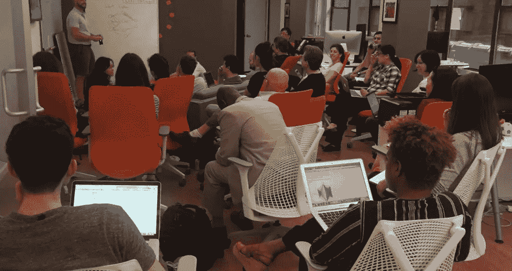

# 我的深度学习求职面试经验分享(二)

> 原文：<https://towardsdatascience.com/my-deep-learning-job-interview-experience-sharing-part-2-d8ea1cb4861e?source=collection_archive---------4----------------------->

面试了 6 家公司之后，我拿到了第 6 家公司的 offer(你可以在这里回顾我的面试经历[)，之后就再也没有其他面试了。实际上我应该在 2 周前发表这篇文章，但是我想在正式接受邀请之前分享更多的细节。](https://medium.com/towards-data-science/my-deep-learning-job-interview-experience-sharing-4f47dd77f57d)

这次我不打算谈论我的面试经历，因为我没有更多的面试机会。但是我要分享一些其他人的经验，因为上一篇文章引起了一些讨论，有人在 fast.ai 论坛上分享了他们的经验(可以查看[原帖](http://forums.fast.ai/t/confused-in-finding-a-dl-job-my-interview-experience-sharing/2827))，我觉得真的很有帮助，我们来看看吧。

Benedikt S:

*   我觉得工作要求比他们找的要高。有 5 年工作经验的博士生没那么多。他们可能会查看脸书、亚马逊、谷歌等公司的职位描述。并且抄袭了要求。
*   在我的面试中，有人问我不知道的机器学习算法。我的回答是“我不知道——有这么多算法，如果你给我定义，我可以向你解释它是如何工作的”。和/或提出了另一种算法，它解决了同样的问题(有许多分类算法)。当然你应该知道像 k-means 这样的基本方法，但是我相信诚实比猜测要好。就我而言，我得到了这次面试的工作
*   如果他们没有深度学习团队/没有这方面的知识——我向他们解释了巨大的优势。谷歌在两年内从大约 10 个项目发展到超过 2000 个深度学习项目。优势在于，全世界都在谈论深度学习。我向他们展示了我的兴趣+关于社区的额外知识。我向他们解释了如何使用深度学习来解决他们的问题，例如基于隐藏层的图像相似性。
*   我知道，我的简历只包括项目/主题。我尽量把对话保持在我擅长的这些领域，而不是让他们问任何关于机器学习/计算机科学的问题。我试图向他们解释，这项工作是将理论应用于现实世界的问题，而不是重新发明轮子……许多问题可以用当前的框架解决，而不必从头开始实现一切。

我的回答是:

“我特别同意你的最后一点，我们应该把话题控制在我们擅长或熟悉的领域，你知道吗，我只是回答他们问的问题，所以他们总是找到更多不同的话题，因此我被困在我不太熟悉的领域。”

刘志军:

谢谢大家分享经验。我看了你的博客文章，想分享一些见解。我经营一家小型数据智能公司，最近我在中国上海为一家物联网公司部署了一个深度学习原型。

看了你的博文，我觉得这不是一个“框架”与“无框架”的问题。中国的招聘人员自然对千篇一律的投资组合项目持怀疑和警惕态度。尤其是因为深度学习仍然非常新，没有多少公司拥有成熟的基础设施和流程。

如果有的话，你的招聘人员可能会惊讶于你能从 fast.ai 中学到多少东西！

我的回答是:

“的确，fast.ai 拥有我们在深度学习中需要知道的一切！”

其实我从 fast.ai 学到的知识，对我现在的工作真的很有帮助。例如，我的一个新项目是检测照片中是否有人，这是一个经典的图像检测问题(或分类问题，1 代表是，0 代表否)，我可以使用 keras 进行快速建模来测试这个想法，你可以简单地微调 VGG\ inceptionV3\resnet 模型来获得一个不错的结果，然后你可以尝试不同的方法来获得更好的结果。

fast.ai 课程还教会了我们在文本分类问题中使用 CNN，这样我就可以用 CNN 来解决我的第二个任务——邮件分类。我不得不说 fast.ai 在我的新工作中帮了我很多，这是一个很好的“深度学习在行动”课程，如果你感兴趣，你可以查看 [fast.ai 网站](http://course.fast.ai)。