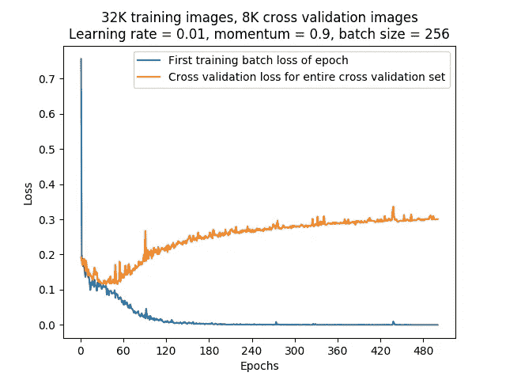
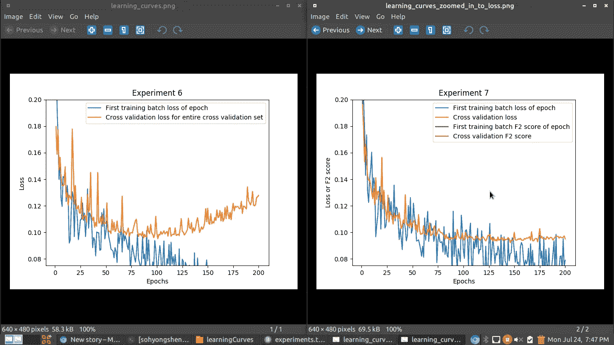
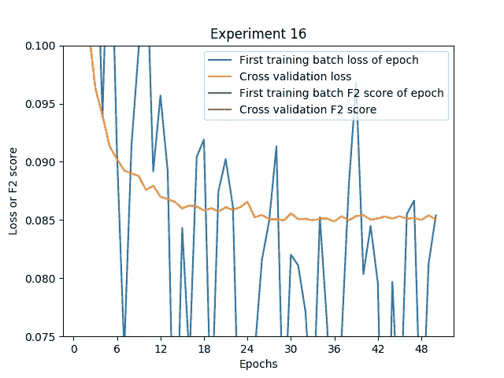
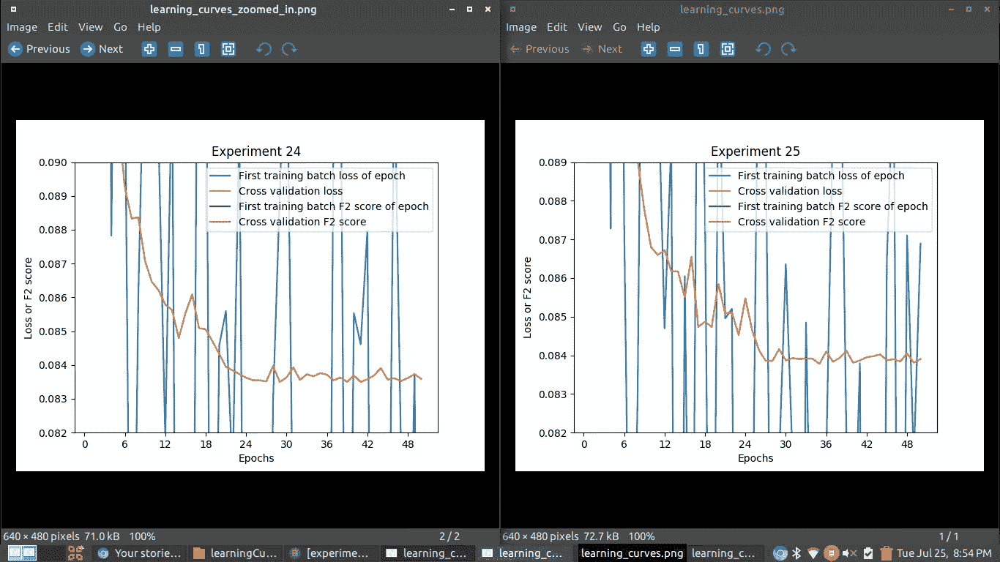

# 我的第一次卡格尔比赛

> 原文：<https://towardsdatascience.com/my-first-kaggle-competition-9d56d4773607?source=collection_archive---------6----------------------->

因此，我参加了我的第一个 Kaggle 比赛— [星球:从太空了解亚马逊](https://www.kaggle.com/c/planet-understanding-the-amazon-from-space)。我的目标是:
——找出我作为深度学习实践者所缺少的东西。
-从技术和战略上吸取经验教训。
——给我的简历/作品集加点东西。

实际上，在比赛截止日期前的一个月，我是一名全职 Kaggler。第一周是学习 PyTorch，让自己熟悉 Python。第一周结束时，我提交了第一份材料。

Learning curves for first submission.

我用非常标准的多标签交叉熵损失从零开始训练 ResNet18。从上图中可以看出，在 30 个时期后出现了经典的过度拟合。从学习曲线来看，我的训练似乎是正确的。在损失值为 0.35 时似乎也有一条渐近线，这大致相当于正面例子的概率解释为 0.75(基本事实是 1)。粗略地说，这给出了训练和交叉验证分布之间的差异的估计，即训练和交叉验证集之间由我们的神经网络感知的最大差异是这样的，即训练阳性将被赋予 1 的高概率，而交叉验证阳性被赋予平均 0.75 的概率。我认为这种解释提供了独特的视角，即神经网络可以用来测量两种不同分布中数据的内在差异。

在第一周，我只用 Python 解释器和 Ubuntu 中默认的 Gedit 编辑器编写了我的 PyTorch 程序/脚本。整个想法是利用这些初级工具的低效率，在 Python 中建立一个强大的工作流/透视图。没有调试器迫使我频繁地测试我的代码(尽管有单元测试会更好)。多频繁？就像你不想调试一样频繁，也就是说，从表面上看，如果你认为你不能快速调试超过 10 行代码，那么你应该每 10 行代码测试一次。我还遵循了“如果不理解就不要输入命令”的原则，并结合了最少的工作示例。使用这个解释器，我会花几个小时玩某些库函数，理解各种数据结构。这一切都很怀旧，因为我在大学里学到的软件工程的一切都回来了。最终，这种低效率会影响到我未来更大的项目，在这个阶段之后，我最好使用高效的 IDE。

第二周，我做了增强的实验。这种增强会对训练产生巨大的影响。

左边的图是基本增强，这意味着标准的 8 倍增强(水平和垂直翻转，旋转 90，180 和 270 度，以及关于图像的主对角线和次对角线的反射)。右图包括基本增强之上的高级增强，如任意旋转、缩放、平移。旋转后的正方形图像的空白区域被原始图像的倒影填充，如下所示:

Note reflected cap and hair at top left and bottom of the image.

这两个图之间的主要区别是:

*   交叉验证损失不会随着增强而快速增加。
*   交叉验证损失更稳定(波动更小)。
*   列车之间的间隔更小，交叉验证损失更少。

这意味着更强的增强会减少过度拟合。虽然交叉验证损失的最低点对于两个图表来说是相同的，但是我仍然继续对我的模型的其余部分使用更强的增强。随着网络越来越深，过度拟合将变得越来越严重，保持对过度拟合的控制应该是更明智的。

一个两难的问题是，是用 OpenCV 还是用 PIL 来编写增强代码。似乎每个人都在使用 OpenCV，如果我遇到问题，寻求帮助更容易。然而，我决定使用 PIL，因为 PyTorch 明确支持它而不是 OpenCV，而且 PIL 更 Pythonic 化。我认为我也有更好的机会向 PyTorch 的当前不足的(我认为是)vision 库(也称为 TorchVision)提交一个 pull 请求。为开源项目做贡献也是我提升简历的策略之一；如果别人接受了你的拉请求，这表明你的代码有一定的水准，你能够写出有用的东西。

我还尝试对学习率进行退火，每当我的交叉验证损失达到稳定水平时，就把它降低 10 倍。在此之前，我想使用更强大的自动优化算法，如共轭梯度下降。有人建议我不要这样做，显然是因为损失曲面是非凸的；手动改变学习率以找到足够好的局部最小值就足够了，并且稍微简单一些。我接受了他的建议，我想通过手动操作来感受一下损失面。下图显示了当 ResNet34 的学习率降低时，交叉验证损失突然降低的程度(直到第三周左右，我才编写程序来继续绘制来自早期快照的学习曲线)。

Learning rate reduced by 10 times at epochs 25 and 29\. Graph shown is for ResNet34.

诚然，下降似乎微不足道，但在这样的比赛中，每一个微小的进步都很重要。

此外，我试验了不同的阈值，用于将我的神经网络的概率输出转换为二元预测(无论它是否属于这一类)。这场比赛的衡量标准是所有样本的平均 F2 分数，这有利于回忆。当然，[找到每个类别的阈值](https://www.kaggle.com/c/planet-understanding-the-amazon-from-space/discussion/32475)优于固定阈值，但是为了直观起见，这里是所有类别的 F2 分数相对于固定阈值的图表:

F2 score vs fixed threshold for ResNet18.

正如预期的那样，最佳阈值预测图像是正面的(对于一个类别),即使它不是非常有把握。虽然这以牺牲精度为代价增加了误报的数量，但会捕捉到更多的真阳性，降低误报的比例，从而提高召回率。

在确定每个类的阈值时，我面临两个问题。首先，我的交叉验证集(8K 交叉验证图像、32K 训练图像、60K 测试图像)可能太小，无法确定阈值。使用训练集将导致过度拟合，因为训练集的概率输出与交叉验证或测试集明显不同(当然更好分离)。在使用训练集时，应对这种过度拟合的一些策略是使用具有稍高训练损失的模型的较早快照(以模仿交叉验证和测试集中正负样本的不完全分离)，或者不同于训练时间地增加训练样本。我决定使用的策略是 5 重交叉验证，这意味着基于非重叠交叉验证集训练 5 个不同的模型。每个模型将在其自己的交叉验证集上进行预测，并且 5 个不重叠的交叉验证集被连接以重建所有 40K 标记的示例，这些示例又被用于找到每类阈值。这个标准相当标准和保守，因为它应该防止过度拟合。然而，我只是在后来才实现了这种 5 重交叉验证。第二个问题是，我必须假设测试集，尤其是私有排行榜，具有与训练集和交叉验证集相似的分布。我不认为仅仅使用 0.5 的简单阈值对于 F2 度量来说是最佳的，我也没有忘记我通过直接在标记的例子上优化阈值而进行的赌博。然而，我决定这是一个我必须做出的假设，我将通过其他方法减少过度拟合。

在第三周，我尝试了测试时间增加(TTA)。TTA 对我来说很有趣也很新鲜，因为我一直认为增强只适用于训练图像。人类做 TTA 的直观等价物是我们拍摄图像，旋转它，从我们眼睛的不同距离检查，等等。对于那些怀疑 TTA 对人类有多大影响的人来说，看看这个视错觉吧。(这个男孩实际上是皱着眉头，但我们不知何故倾向于觉得他在微笑。)

类似的事情正在我们的神经网络中发生。简而言之，我们的神经网络不是旋转和镜像不变的。如果是的话，高级增强在训练中不会有任何效果。我对 TTA 使用了基本的 8 倍扩增，从我的神经网络中获得了 8 个不同的概率输出，然后在 8 个不同的扩增中平均这些概率。然后，平均概率将通过一组预先确定的阈值，以形成提交的最终预测。我不知道这是如何工作的，但我的直觉是，TTA 通过与其他观点进行平均来降低异常预测，从而减少了方差。不太反常的预测意味着更好的准确性。

此外，我开始使用预先训练好的模型。预训练模型的交叉验证损失曲线更平滑。

Left graph is trained from scratch; right graph is fine-tune from pre-trained model. Both graphs are for ResNet18.

从上面两个图中可以看出，左图(从头开始训练)的交叉验证损失波动较小，而右图(预训练)的训练损失波动较大，更接近交叉验证损失。后一种观察结果可能归因于微调所涉及的较低的学习率(小 10 倍，从零开始训练为 0.01，微调为 0.001)。正如预期的那样，交叉验证损失下降得更快，并稳定在预训练模型的较低值。

我还转移到 ResNet34 架构，并着手实现前面提到的 5 重交叉验证。下面是详细流程:

1.  选择前 8K 个图像用于交叉验证，其余 32K 个图像用于训练。
2.  通过首先选择 8 倍基本增强中的一个来增强训练图像，然后应用高级增强(随机旋转、缩放、平移)。将增强扩展到各个时期，即，在下一个时期中增强它们之前，遍历所有 32K 训练图像。
3.  基于交叉验证损失最低的快照选择模型。
4.  使用所选模型对 8 折 TTA 的交叉验证集进行预测。通过在增强中求平均来组合 TTA。保存交叉验证预测。
5.  选择接下来的 8K 图像用于交叉验证，并选择其他图像用于训练，并重复步骤 2 至 4，直到获得对应于 5 个非重叠交叉验证集的所有 5 个模型。
6.  堆叠来自步骤 4 的 5 个不同的交叉验证预测，以重建所有 40K 图像的交叉验证，然后优化阈值(17 个类别的 17 个阈值)以获得最大 F2 分数。
7.  对于从步骤 3 中选择的 5 个模型中的每一个，使用 TTA 在测试集上进行预测，这意味着 5 个模型乘以 8 倍 TTA。如前所述，通过平均来组合每个模型的 TTA，并且 5 个模型的预测最终被平均以形成 60K 测试图像的概率输出。
8.  使用步骤 6 中找到的阈值，将概率输出转换为二元预测，并生成提交文件。

所有这些实现起来都很乏味，我不得不不断地测试和检查错误。我认识一些人，他们为一个提交模型投入了所有的 40K 图像，并根据他们的 32K-8K 训练验证分割来决定在哪里停止。与这样的策略相比，5 重交叉验证方法更难实现，并且需要长得多的时间来训练(对于 5 个模型，时间长 5 倍)。然而，五重交叉验证方法在防止过度拟合方面更安全，因为我们总是有交叉验证曲线来指导我们。此外，打包 5 个模型几乎总是比单个模型更准确。

上周，我面临着另一个困境。与竞争论坛上分享的一些结果相比，我在 ResNet34 上的 5 个型号的包在公共排行榜(LB)上没有返回足够高的 F2。别人好像得了 0.930，而我只能得 0.927。我可以用最后一周的时间来尝试找出哪里出了问题，或者继续训练不同的模型，通过组装来提高 F2。如果我选择前者，我可以学习如何更有效地训练单个神经网络。发现哪里出了问题，并因此学习交易的技巧，将对无法负担集成的实时应用程序(在我未来的工作中)更有益。然而，细节决定成败，发现这些技巧需要时间。重新训练模型需要更多的时间。阅读其他人在论坛上做的事情，在最后一周全职合奏会给我一个更高的分数。此外，许多人会在比赛后公开他们的代码，我可以花所有时间逐行比较我们的代码，并找到魔术。

我决定妥协。我从[这个讨论帖](https://www.kaggle.com/c/planet-understanding-the-amazon-from-space/discussion/33559)快速看了一下恒的代码，他的代码和我的代码最明显的区别就是他的增强方法。这个变化对我的代码来说很简单，真正的瓶颈是训练时间。由于我可以使用 4 个 GPU，重新训练的成本不会太低，我决定继续探索训练增强的细微差别。然后，我将在一个简单的投票集合中回收我从这次探索中生成的任何模型。

恒的和我的增强术的主要区别是我一直在使用高级增强术。在选择(随机且一致地)应用 8 倍增强中的哪一个后，我将一直应用第二个，高级增强*。恒有这些特殊的概率值来决定是否增加，我的直觉是这些值是故意选择的。所以我改变了我的第二次增强，只应用了一半的时间:*

Left graph applies 0.5 probability advanced augmentation, right graph applies advanced augmentation all the time.

正如你从上面的图表中所看到的，一旦我减少了增强，或者更确切地说，应用了一半的高级增强，就有了巨大的改进。下面增加太少，

Left graph has 0.5 chance of advanced augmentation, right graph has 0.25 chance.

或者这里放大太多，

Left graph has 0.5 chance of advanced augmentation, right graph has 0.75 chance.

导致次优损失。增加太少会导致过度拟合，而增加太多会导致拟合不足，所以我选择了 0.5 的高级增加几率。我仍然保留了基本的、潜在的 8 倍增强，因为我相信与高级增强相比，8 倍增强是非破坏性的。通过镜像来填充空白空间会给增强图像带来一种虚假感，更糟糕的是，缩放可能会排除图像边界处的地标/特征，例如，如果我们放大太多，图像边缘可能会被移除一条河流。我相信高级增强的破坏性引入了太多的噪音，使我的神经网络无法有效学习。因此，在破坏性与非破坏性增强的框架中，我只关注降低应用高级但破坏性增强的可能性。经过进一步考虑，这可能是一个更简单的问题，即过度拟合或欠拟合正则化增强带来的数量。我也应该试着改变基本的 8 倍增加量。

最后，我通过投票将几个 ResNet34 和 ResNet50 模型随机组合在一起，结果很差。

总之，下面是我尝试过的方法以及它们对公众 LB 的 F2 分数的影响:

*   8K-32K 列车-验证分离，单 ResNet18 模型从零开始:0.90018
*   添加基本的 8 倍扩增:0.90530
*   将 0.5 固定阈值更改为多个阈值:0.91587
*   添加高级增强(对 ResNet18 的损失没有太大影响)和退火学习率:0.91879
*   微调预训练 ResNet18: 0.92443
*   TTA 地址:0.92619
*   切换到预先训练的 ResNet34: 0.927646
*   将高级增强减少到只有一半时间发生:0.92801
*   5 折交叉验证的 5 款包:0.92942
*   来自 6 个提交的集合:0.92983

然而，F2 从公共 LB 到私有 LB 有一个巨大的下降，我的最终提交从 0.92983 下降到 0.92685。其他人也有相当大的变动。我不知道为什么，因为我一直相当保守；连我 5 款的包包也从 0.92942 降到了 0.92676。我只能推测:

1.  我对私有 LB、公共 LB 和训练验证分布相似的假设是无效的，这使得我的每类阈值搜索是致命的。
2.  我的套装不够大，不能防止过度合身。我必须更彻底地调查是什么导致了公共 LB 的过度适应。

这个比赛最令人满意的部分是我可以做我喜欢做的事情(深度学习废话)，以及我的公共 LB 分数的稳步增长。当然，一路上也有失败的实验，但我认为我的旅程相比其他人是顺利的。感谢那些在论坛上分享他们的方法和源代码的人的慷慨，我决定尝试的方法在很大程度上经过了测试并被证明是可行的，它们确实可行。

我会做些不同的事情吗？大概不会。我不断地制定策略，优先考虑下一步要做的事情，并最大限度地利用我的时间。然而，如果我有更多的时间，还有许多事情要做，在这次比赛之后，我将继续做这些事情:

1.  我的单一模型仍然是次优的，其他人可以在公共 LB 上使用单一模型而不装袋达到 0.93。我将不得不一行一行地把我的代码和其他代码进行比较，以找出我的训练出了什么问题。
2.  训练不同的更深层次的架构。我还必须在不同层之间采用不同的学习速率。我没有冻结更接近输入的层，也没有减慢它们的学习速度，因为我觉得 ResNet34 是一个相当浅的网络。不必过分依赖保留初始权重来达到良好的局部最优。深层网络更难训练，因为损失面是非凸的，更难找到一个好的最优值。
3.  尝试不同的输入图像大小。从论坛来看，似乎很多人都使用了这样的策略，而且对他们有效，特别是减少了他们的私有和公有 LBs 之间的差异..这相当于人类为了更好地检查而将某物拉近或远离眼睛。
4.  使用从第 2 点和第 3 点生成的模型以获得更好的整体效果。此外，尝试除了投票以外的其他集合方法。也许看一下 StackNet 会给我一些线索，加速我的学习。
5.  更加熟悉 PyTorch。我觉得掌握一个流行的深度学习框架很重要。这样，任何新想法的实施都可以很快完成。效率是关键；你越快验证你的想法，你学得越快，你的进步就越快。顺便对 D 开头的粉丝说一句，这就是藤原拓海所说的拥有一个家庭课程的重要性，以及为什么他仍然坚持在阿基纳山上送豆腐。
6.  少写代码，充分利用库，同样是为了效率。对于我要写的代码，看看对别人有没有用，对深度学习框架有没有贡献。修改 Git 以提交 pull 请求。此外，手动改变学习速度是一件痛苦的事情。我会尝试使用更先进的自动优化器。
7.  训练效率更高。我在这次比赛中错过的一件事是通过观察前几个时期的学习曲线来学习如何拒绝失败的实验。这部分是因为我滥用了对多个 GPU 的访问，也部分是因为我在编写其他代码时让我的模型去训练。我相信这是区分熟练教练和初级教练的重要技能。我想我还可以进一步优化我的工作流程，例如，让打印输出不那么冗长，只留下相关信息，等等。

我观察和学到的主要经验是:

1.  知道的足够多和知道的太多之间的平衡。了解足够多，以便能够按照自己的方式修改他人的代码，但不要太多，以免完全陷入其中。对我来说，了解足够多很大程度上意味着从概念上知道一个函数做什么，以及输入和输出数据结构是什么。这也意味着知道在哪里可以找到更多关于如何操作所述数据结构的信息。有时候，理解一个概念需要时间，甚至可能需要一些先决知识。不要通过随意和过快地阅读这些知识来欺骗自己。花时间去阅读它们。通常情况下，15 分钟的阅读可以防止你犯一些奇怪的错误，从而挽救你的生命(除了重读你试图节省的 15 分钟之外，这可能还要花费几个小时)。
2.  保持代码整洁和过度重构之间的平衡。对我来说，保持代码重构让一切都更容易管理。干净的代码更容易操作，从而防止引入一些错误。更重要的是，干净的代码激励着我。我变得更愿意审视我的代码，做出激烈但必要的改变，例如，编写自动化我的工作流的代码。然而，过多的重构可能会浪费太多的时间，尤其是当你想尝试一种新的训练方法，花时间组织你的代码，却发现方法本身根本不起作用的时候。我遵循的经验法则是，编写新的实验代码要稍微混乱一些，一旦你发现它可以工作，就重构它。
3.  深度和广度的平衡。作为初学者，广度更重要。对我来说，更重要的是了解不同的技术在不同的场景下是如何工作的。这样我就能知道将来如何应用它们。例如，我了解到，如果你的神经网络不够深或不够复杂，高级增强就没有必要；高级增强只在训练 ResNet34 时生效，而不是 ResNet18。如果我没有离开 ResNet18，并坚持尝试获得最好的单一 ResNet18 型号，我可能会错过这样有价值的见解。继续调查情况，找到你的最佳策略。一旦你对如何做事情和你应该采取的总体方向有了感觉，专注于深度和执行好你的策略。
4.  过度拟合和欠拟合之间的平衡。这是我参加这个比赛时的感受；训练一个模特总是一场永无休止的斗争，不要过度训练或训练不足。是的，说起来容易做起来难，我相信许多深度学习从业者都知道，当你的数据有限时，这就是游戏。

特别感谢那些在论坛上慷慨分享他们的代码和方法的人。我站在巨人的肩膀上。