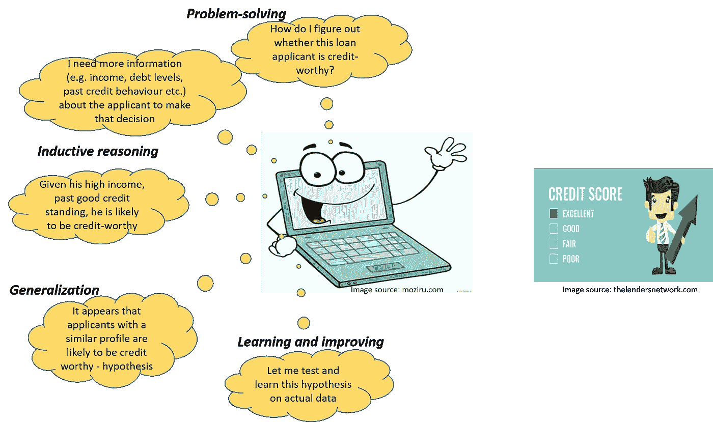
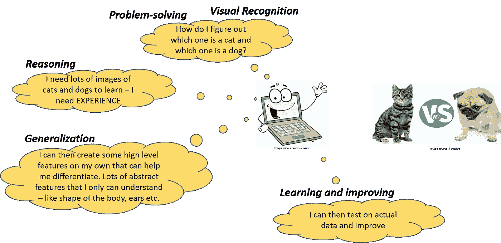
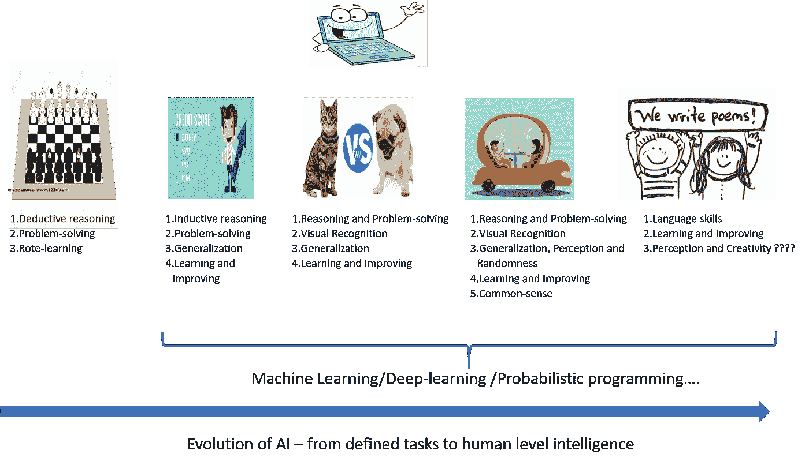

# 我对艾的解读

> 原文：<https://towardsdatascience.com/my-interpretation-of-ai-a6eed63e4cb9?source=collection_archive---------16----------------------->

人工智能是现在的热门词汇，作为一个对数据科学感兴趣的人，我已经做了很多实验。这些天来，这个词在许多上下文中被频繁使用，鉴于它在许多领域的应用潜力，我想后退一步，真正理解这个术语“人工智能”在直觉层面上的含义。这是我目前收集到的信息。

人工智能(AI)的普遍定义是计算机系统表现出来的类似于智能人类的智能。那么，什么是人类智能？以下是一些有助于定义智能的特征:

1.  推理和解决问题
2.  学习、改进和概括的能力
3.  语言
4.  视觉识别
5.  感知、随机性和创造性
6.  常识

现在，让我们在计算机可以被编程执行的几个任务的上下文中理解上述内容(当然，具有不同程度的成功):

1.**一盘棋:**计算机在国际象棋上取得了非常高的成功。众所周知，1997 年，IBM 的国际象棋计算机“深蓝”击败了世界冠军加里·卡斯帕罗夫。国际象棋是一种具有挑战性的游戏，但它可以用一组走法来描述，并且可以通过搜索所有可能的走法来玩。移动的次数可能真的很多，但它们仍然可以被定义，这就是具有强大处理能力的计算机如何战胜人类对手的原因。**那么，下棋的电脑能叫 AI 吗？是的，在推理、解决问题和学习能力等非常有限的方面。**

2.**预测贷款申请人是否有信用:**在这种情况下，计算机取得了很大的成功。使用机器学习算法，并通过提供许多特征(信息)，例如在这种情况下，申请人的收入、债务水平、过去的信贷行为，计算机可以被编程来预测贷款申请人拖欠贷款的可能性。在这个过程中，计算机程序显示出智能的迹象，如推理、寻找模式和解决问题。随着我们根据更多的数据和证据训练计算机，它将从错误中学习，并进一步提高其预测的准确性。此外，它还通过为新的贷款申请人生成高精度预测来学习归纳。所以，如你所见，**这个人工智能比下棋的人工智能更进化。与正式的、规则定义的任务(如国际象棋)相比，这个人工智能正在完成一项有点不正式和不确定的任务。**

3.视觉上区分猫和狗:识别狗和猫的图像对我们来说太容易了，我们甚至不需要花时间去思考。对于计算机来说，这就不那么简单了。人类从小就能看到狗和猫。在我们的大脑中，我们创造了一种机制，在这种机制中，我们定义了一套与狗和猫相关的特征。这些特征在我们的潜意识中根深蒂固，如果有人问这些特征是什么，我们可能无法拼写出来。换句话说，由于我们从小就在看很多猫狗，所以我们的大脑现在有了区分猫狗的“经验”。当我们想让计算机具有视觉智能时，我们必须为它提供这种体验，即在大量猫和狗的图像上训练它，并提供有助于它区分的功能。然而，我们自己无法在我们的脑海中拼写出区分猫和狗的特征，因此，我们很难创建并向计算机提供这些特征。深度学习算法是机器学习的一个特殊分支，它通过查看数百万张猫和狗的图像，帮助计算机程序自行创建那些抽象特征。**因此，深度学习算法正在使计算机获得更像人类的智能，包括视觉、随机性和归纳性。**

深度学习算法通过对大量数据进行训练，自行得出特征，这就是它们与传统机器学习算法不同的地方，传统机器学习算法必须预先定义特征。

4.自动驾驶汽车:这是人工智能的最新领域，人们对此有很多兴趣和研究。这些人工智能系统与上述系统的真正区别在于，它们需要更加**进化，具有应对不可预见的随机情况的能力。一个自动驾驶的人工智能必须理解前面汽车明显的左右信号，还必须解释其他司机不那么明显的意图。例如，如果前面的车正在减速，前面可能会有一些不可预见的障碍(事故，交通堵塞等。)而 AI 系统需要自己做好准备。**这要求机器拥有常识，就像人类利用常识与世界互动一样。**当然，人类从经验中获得这一点，但要设计具有这种常识性经验的算法，需要在所有可能的驾驶场景中训练这些算法，这是不可能的。这些是一些需要解决的严重问题，从一些自动驾驶汽车的致命事故中可以看出这一点。2016 年 5 月，特斯拉 Model S 撞上了一辆拖拉机拖车，因为它没有注意到拖车的白色一侧映衬着明亮的天空。深度学习模型(经过大量场景的训练)有助于自动驾驶人工智能理解物理世界，但它们需要与其他方法结合起来，通过注入人类水平的常识来处理现实世界中驾驶的不确定性和随机性。**

5.写一首诗:一个有能力写一首诗或一首歌的人工智能肯定拥有更进化的类似人类的智能，包括语言技能和创造力。当然，创造力的程度是有争议的，但是在这个领域取得的进步至少指出了这种创造性人工智能的开始。

**下图总结了上述观点:**

**强 AI 和弱 AI**

上述所有例子都是弱人工智能的例子，其中人工智能在任务的背景下进化。这些人工智能系统在完成特定任务方面已经进化到接近人类水平的智能。然而，我们在开发强大的人工智能方面仍有很长的路要走——这些系统可以在各种背景下学习和应用，例如，在美国的城市道路上学习驾驶汽车，并应用这些学习在中国的高速公路上驾驶卡车。强人工智能就像一个人类孩子，从不同的背景和经历中学习，进化成一个类似于完全形成的人类思维的系统，然后可以在没有人类干预的情况下执行任务。一旦发生这种情况，科幻电影的世界就有很大的可能性成为现实。嗯！这一天可能不远了。

***即将上线！！一门关于深度学习的课程，将深入讨论上述内容以及算法和应用。***