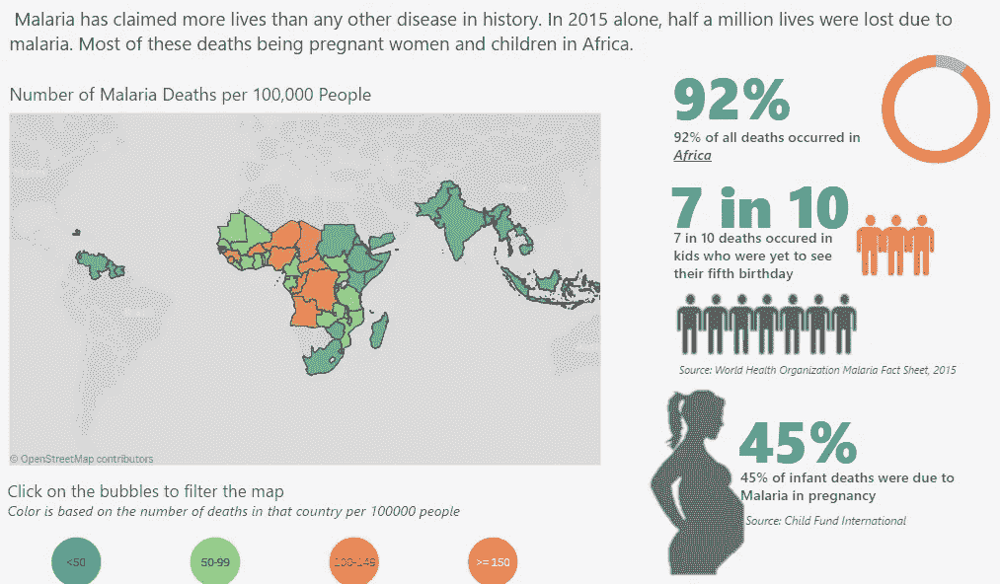

# 我的数据科学之旅

> 原文：<https://towardsdatascience.com/my-journey-into-data-science-39e9bbbbf452?source=collection_archive---------2----------------------->

很多人问我关于我从化学工程转到数据科学的问题。我是怎么做到的？我什么时候做的？我为什么要这么做？我觉得今天(2018 年 1 月 6 日)是回答这些问题的合适日子，因为这是我报名参加第一门编程课程以来的第三个年头。我希望分享我的故事会让我对成为一名数据科学家有所了解，并鼓励各地崭露头角的“任何事情”去强烈追求他们的激情。

# 我第一次接触数据科学是从一本与数据科学毫无关系的书中

2014 年 3 月，我偶然发现了一本名为《习惯的力量:为什么我们在生活和商业中做我们所做的事情》 的书，作者是 Charles Duhigg。在名为*组织的习惯*的书中，Charles 写道，一家大型零售连锁店利用女性顾客购买的数据来预测她怀孕的可能性。说得轻一点，我很震惊，我必须了解更多。

我到处寻找这个魔法的名字。几个月后，在朋友的帮助下，我偶然发现了一些与我在*习惯的力量中读到的非常相似的东西。*它被称为**商业分析。**

这个发现对我来说是一个转折点，因为那时，我正处于大学的最后一年，刚刚结束在一家石油和天然气公司的实习。我在那里的经历让我厌倦了把化学工程作为职业，因为我觉得它不适合我。这种认识也让我对新的挑战和职业方向持开放态度。商业分析似乎正好符合这一点。

# 我从 Quora 上的一个回答中创建了我的第一个数据科学学习路径

到了 2014 年，我已经毕业，开始了我的国家青年服务团。在我的 NYSC 期间，我在 Twitter 的推荐下偶然发现了 Quora，我很喜欢它。

*如果你想知道，理想情况下，NYSC 是尼日利亚为期一年的强制性项目，你被部署到一个你不隶属的州，以政府工作人员、教师或其他任何身份服务。*

在 Quora 上，我发现商业分析有很多名字，其中一个是数据科学。我还找到了一个非常有帮助的答案，我今天推荐给任何希望成为数据科学家的人: [*我如何才能成为一名数据科学家*](http://qr.ae/RbQYvX) *？*

这个答案帮助我在 2015 年 1 月走上了第一条数据科学的学习之路(请原谅我糟糕的书写)。

Written January 2015\. Other courses on the left side of the page are The Analytics Edge and Google Analytics

# 我在一年内完成了 15 门数据科学的 MOOCs 课程

我主要通过在线课程学习数据科学。我从来没用过书(我试过)。所有的课程都是免费的(因为我不在乎证书),在不像 Coursera 那样免费的地方，我得到了 100%的经济资助。

当谈到在线课程时，我吻了很多青蛙，所以如果你正在寻找一个关于如何开始数据科学的松散指南，我会帮你减轻压力，只关注有价值的课程。

## **1。学习编程**

这是我学习道路上的第一件事，也是最可怕的一件事。这很可怕，因为我没有计算机科学背景，我在大学唯一一次接触编程，我绝对讨厌它。然而，这一次我觉得我拥有世界上所有的时间，没有什么可失去的，所以我报名参加了 Codecademy 的 [*学习 Python*](https://www.codecademy.com/learn/learn-python) 课程。

这门课太难了，很多内容对我来说没有意义。我可能花了两周的时间试图让 while 循环工作，我不知道文件 I/O 是什么意思，但完全靠蛮力，我完成了课程。

这是我第一次完成一门在线课程，之前我已经尝试过无数次了。这给了我继续学习的信心。

## 2.学习核心数据科学

很多人问我为什么选择使用 R 而不是 Python。纯属巧合的是，我第一次接触数据科学是在 R 上 edX 上麻省理工学院的一门名为[*The Analytics Edge*](https://courses.edx.org/courses/MITx/15.071x_2/1T2015/course/)的课程。

为期 10 周的课程采用案例研究的方法来教授数据科学的不同部分，从机器学习到可视化，再到使用 r 进行优化。这非常费事，也非常值得。我在这门课程上的奇妙经历让我比 Python 更倾向于 R。这门课程给了我很好的基础，我有时仍会参考 2015 年的笔记。

## 3.其他有用的课程

我喜欢的另一门课是 2015 年底上的，是 Coursera 上杜克大学的 [*数据可视化与 Tableau*](https://www.coursera.org/learn/analytics-tableau) 沟通。这是一门为期五周的课程，为使用 Tableau 打下了良好的基础。导师很厉害，也是我目前接触过的最好的。

我名单上的下一个是杜克大学 Coursera 上的 [*用 MySQL*](https://www.coursera.org/learn/analytics-mysql) 管理大数据。这是一个为期四周的课程，与 Tableau 课程有着相同的令人惊叹的导师，教授 MySQL 和 Teradata。

其他值得一提的还有:UCBerkeley on edX 上的[*用 Apache Spark*T5【四门课程系列】介绍 BigData 以及微软 on edX 上的](https://courses.edx.org/courses/BerkeleyX/CS100.1x/1T2015/course/) [*Excel 进行数据分析和可视化*](https://courses.edx.org/courses/course-v1:Microsoft+DAT206x+2T2016/course/) 。

# 我如何开始我的博客——真正的学习从哪里开始

如果你读了很多 Quora 上关于如何成为更好的软件工程师/数据科学家/设计师之类的回答或文章，你会看到一个反复出现的建议:做个人项目来深化你的技能。2015 年，我曾几次试图这样做，但我没能做任何合理的事情，因为坦率地说，我还没有准备好。

到 2016 年，我已经放慢了在线课程的速度，因为 90%的课程都有相同的内容，并且假设你是初学者，所以它变得有点重复。这时，我觉得我已经准备好开始用博客做个人项目了。写作部分不是问题，因为我以前在高中时写作。然而，我的问题是关于一致性和创造性。我有足够的创造力来组织有趣的项目吗？我能坚持不懈地做下去吗？你不试就永远不知道，对吗？这就是我如何在 2016 年 6 月开始我的博客[数据的艺术和科学](http://theartandscienceofdata.wordpress.com/blog)。在为我的博客撰写内容的过程中，我的知识成倍增长。

# 我在一个月内写完了前两篇文章，然后中断了一年

我的第一篇帖子是 2016 年 9 月发布的 [*预测英超积分榜*](https://theartandscienceofdata.wordpress.com/2016/09/17/predicting-the-english-premier-league-standings/) 以及 2016 年 10 月发布的[*Twitter 对尼日利亚网络提供商的看法*](https://theartandscienceofdata.wordpress.com/2016/10/09/what-twitter-feels-about-network-providers-in-nigeria/)**。积极回应的数量绝对令我震惊。我在这两个帖子上得到了大约 1500 次浏览和无数回复，这是我第一次对自己的技能感到自信。**

**这段经历让我明白，创造力不是你要么有要么没有的天赋。创造力来源于经验和对技能的信心，因为你知道的越多，能做的事情的可能性就越大。**

**然后我在博客上停了一年。发生这种情况有很多原因。**

1.  **我曾试图在 2016 年 12 月写一篇博文，那是一片混乱。我后来清理了它，并在名为 [*数据科学的 ABC-XYZ*](http://rpubs.com/RosebudAnwuri/the_abc-xyz_of_data_science)的机器学习和数据科学研讨会上为我的女性使用。**
2.  **在那之后，我遇到了我称之为“数据科学家的障碍”。我真的没有想法，想不出任何有用或有趣的东西。**
3.  **我的博客与大多数数据科学博客有所不同，因为我的博客包含了大量的研究和迭代。也让我的出版周期比别人长很多。**
4.  **工作很累人，成年也在折磨着我，所以我成了一个电视迷。**

**2017 年 6 月，我终于有了一个关于亿万富翁的想法，在我朋友的帮助下，我于 2017 年 10 月出版了 [*，这是一个数据驱动的指南，旨在成为一个持续的亿万富翁*](https://theartandscienceofdata.wordpress.com/2017/06/01/the-billionaire-clusters/) (是的，我花了四个月才完成)。**

**发布三天之内，它就有了 **3 万的浏览量。到处都是。相当多的网站抄袭了这篇文章，但我不在乎。我的作品好到可以被抄袭！****

# **目前为止我的小胜利**

**除了我的帖子 [*(一个关于成为持续亿万富翁的数据驱动指南*](https://theartandscienceofdata.wordpress.com/2017/06/01/the-billionaire-clusters/) *，*到目前为止已经获得了 4 万次浏览，2017 年对我来说是有趣的一年。第一次，我过去三年的工作得到了认可。**

1.  **我赢得了一个联合国数据可视化竞赛，我的可视化表格是“可视化疟疾:黑仔病杀死非洲”，看起来像这样。**

****

**One of the dashboards from the visualization story**

**2.我受邀在 T21 举行的斯坦福大学数据科学女性大会上发言，主题与本文完全相同。**

**3.我在伦敦找到了一份工作，在安永(Ernst & Young)担任数据科学家，最近搬到了世界各地。**

**4.2017 年 11 月，我在机器学习和数据科学领域的女性组织了一场[研讨会](http://rpubs.com/RosebudAnwuri/the_abc-xyz_of_data_science)。**

**老实说，我有点惊讶我能走到这一步。我记得在我的记事本上写道“玫瑰花蕾，你永远都配不上这个”，但我现在在这里。我还有很多东西要学，但我也很感激我今天所处的位置。**

# **我给你的建议**

**我不是专家，我也不是约翰·麦克斯韦尔，他给了我一些自助建议，但这里有几件事真的帮了我。**

1.  **不要害怕放弃那些没有成功的事情。直到 2016 年，我才完全放弃了石油和天然气的梦想，尽管我知道自己并不热衷于此。**
2.  ****不要害怕被称为疯子**。我数不清有多少次人们微妙地或不那么微妙地告诉我，我离开化学工程是疯狂的，尤其是当数据科学在尼日利亚相对较新的时候。它曾经打动过我，但现在我微笑着对自己说“当我吹的时候，你会明白的”。**
3.  ****阅读。阅读。阅读。**给我打开这个领域的书，和数据科学一点关系都没有。阅读拓展了你的可能性领域。**
4.  ****爱学习。**每年都有学习目标，坚持一种最适合自己的媒介(书籍/音频/视频/教室)。**
5.  **永远，永远把你最好的一面展现出来。让你的工作成为最好的工作。它会替你说话。我今天得到的 99%的机会，部分是因为我的博客。**
6.  **最重要的是，**你不是一个孤岛**。拥有一个紧密团结的支持系统，即使受伤也会告诉你真相。你会更好的。**

**祝你好运:)**

***我要特别感谢我出色的支持系统和所有让我来到这里的人。不胜枚举，但我非常爱你们。我要特别感谢鸢、迪顿和奇迹，感谢他们的支持、严厉的爱、残酷的反馈，并告诉我应该在哪里加撇号。你从第一天起就在那里。你知道我所有的挣扎。你从一开始就看到了我，并且仍然相信我能做到。感谢你让我成为了一个更好的数据科学家，一个更好的人。我不会拿你来交换这个世界。***