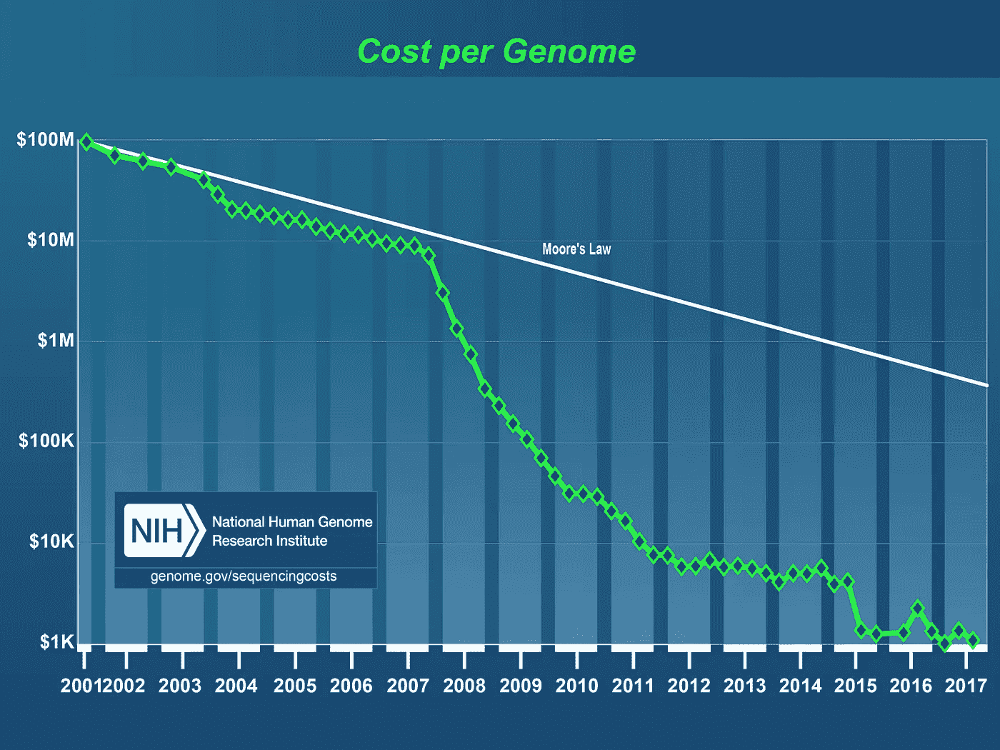
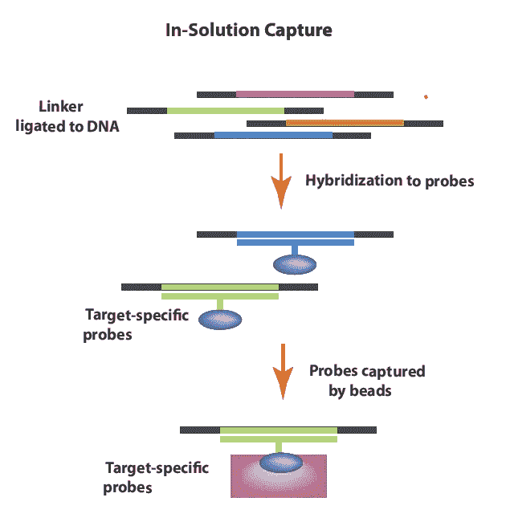
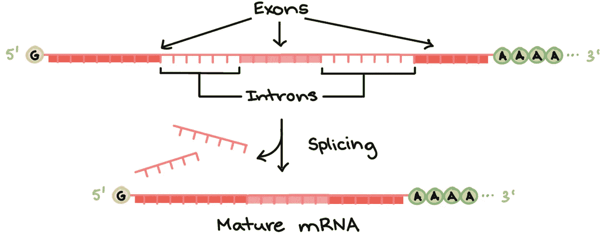
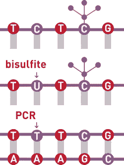

# 我的数据科学和生物信息学之旅:第 2 部分——测序速成班

> 原文：<https://towardsdatascience.com/my-journey-into-data-science-and-bioinformatics-part-2-34e55d8594d7?source=collection_archive---------2----------------------->

这部分需要一些分子生物学和遗传学的基础知识。这篇文章主要是关于测序技术的基础知识，面向具有生物医学背景的人，医学学生和临床医生。如果你对 DNA 知之甚少或者想更详细地了解基因组和 DNA 测序的历史，我推荐你阅读**[*悉达多慕克吉*](https://twitter.com/DrSidMukherjee) *。***

**人类基因组是一件非常不可思议的事情。想象走进一个巨大的图书馆。这里有成千上万个书柜，每个书柜总共可以容纳大约 130 本书。你打开一本书，你看到的只是四个字母:A、C、G 和 t。所有这些书中的信息足以建造一个最复杂的生物，一个人。**

**当这些书中的字母被弄混，或者当章节或书籍在书架中被打乱时，遗传病就开始了。有时只有一个或几个字母是错误的或丢失的，但这可以对那本书的故事产生重大影响。**

**要知道书柜中的错误在哪里，你可以将它与你认为没有错误的其他书柜(“参考基因组”)进行比较(这里有点棘手:什么被定义为“正常”？).用手找到这些字母是不可能的。幸运的是，我们发明的电脑在比较这两个书柜时要好得多。生物信息学处理与处理所有这些信息相关的一切，因此我们可以从中得出结论。**

**正如我在关于编程的[第一部分](/my-journey-into-data-science-and-bio-informatics-749ece4d8860)中解释的那样，我在做关于全基因组测序的硕士论文时了解了所有这些(就复杂性而言，我非常低估了这一点)。这篇文章将简要介绍不同的测序技术。下一部分将深入探究其背后的实际生物信息学。**

# **一点历史**

> **“实验进展缓慢，”孟德尔写道。“起初需要一定的耐心，但我很快发现，当我同时进行几个实验时，事情会变得更好。随着多个交叉并行，数据生产加速。”悉达多·慕克吉引用了孟德尔在 19 世纪关于植物的实验。**

**自从大规模并行测序(MPS，也称为下一代测序，NGS 或高通量测序，HTS)的出现，由于新的和指数级增长的需求，生物信息学领域发生了彻底的变革。**

**但是首先，先回顾一下测序的历史。我们如何阅读书中的字母？**

## **桑格测序**

**弗雷德·桑格和他的同事在 1977 年开发了一种 DNA 测序方法，后来被称为“桑格测序”或“链终止测序”。[这个视频](https://www.youtube.com/watch?v=FvHRio1yyhQ)把题目解释的非常清楚。**

**与书柜类似，桑格排序将是一页接一页地复制每本书。**

**Sanger 测序是 40 多年来最流行的测序方法，直到它被大规模平行测序(MPS)和本世纪初超越。Sanger 测序的缺点是速度慢(每次运行 96kb，而 MPS 每次运行 1–150 Gb 以上)且成本高。今天，它仍被用于某些领域，以验证多磺酸粘多糖或以非常高的精确度对非常小的 DNA 片段进行测序(遗传病中的基因)。**

## **大规模并行测序**

**然后，在 2003 年，人类基因组计划完成。这项艰巨的任务历时 15 年，耗资数十亿美元。今天，我们可以在一天多一点的时间内，花费不到 1000 美元，完成一个完整的人类基因组测序。[那么发生了什么？](https://www.ncbi.nlm.nih.gov/pmc/articles/PMC4727787/)**

****

**Cost per genome. The sharp decline around 2007 is due to the rise of massively parallel sequencing. Source: [genome.gov](https://www.genome.gov/sequencingcostsdata/)**

**2005 年，第一台用于“大规模并行测序”的机器由 454 推向市场，称为焦磷酸测序。我不会详细说明确切的机制，但主要思想是 DNA 被分裂成数百万个小片段。所有这些小片段同时被测序，这比一个接一个地对所有这些小片段进行测序*快得多*。**

**再把这个和我们的书柜比较一下。你很快就会意识到，一页一页地复制所有的书将会花费很长时间。于是你决定带几个朋友，把书分好，这样每个人都有自己的书架可以抄。大规模并行测序就是这样，但你带来的不是几个朋友，而是整个村庄。**

**焦磷酸测序法仍然没有足够的通量来进行常规的全基因组测序。如今，最广泛使用的测序技术是 Illumina 的“合成测序”(见下面的视频)。Illumina HiSeq 4000 可以在 3.5 天内对多达 12 个人类基因组进行测序！**

**Sequencing-by-synthesis by Illumina**

## **下一步是什么？**

**很难预测未来，但对我来说，最近的一项发展正接近科幻小说:**

****

**Picture by my colleague, [Celine Everaert on Twitter](https://twitter.com/celine_everaert/status/921024978056876032) (@celine_everaert)**

**这个设备被称为[小程序](https://nanoporetech.com/products/minion)。这是一个 1000 美元，比 u 盘大一点(它甚至可以通过 USB 连接到你的笔记本电脑)，可以[序列读取> 200 000 bp 长](https://www.nature.com/articles/nbt.4060)。相比之下:Illumina 测序仪的最大读取长度为 300 bp 长。Illumina MiSeq 是一台具有类似生产能力的笨重机器，而[的价格为 99 000 美元](http://nextgenseek.com/2014/01/what-is-the-price-of-nextseq-500-and-hiseq-x-ten/)。**

**有了 MinION，就有可能在没有 PCR 扩增的情况下，用一种称为“纳米孔测序”的技术实时对 DNA 和 RNA 进行测序([视频介绍其工作原理](https://nanoporetech.com/resource-centre/videos/nanopore-dna-sequencing))。实时长阅读测序也被称为“第三代测序”，大规模平行测序的继承者。**

**然而，这是一项早期技术，所以它不像 Illumina 系统那样得到广泛支持。我们目前正在实验室进行测试，结果看起来很有希望。床边基因组分析的路还很长，但这是一大进步！**

# **覆盖率和阅读深度**

**高通量测序中的一个重要术语是“覆盖”或“阅读深度”(有时也称为“深度”)。这是一个重要的术语，用来理解为什么有些实验是好的或坏的(永远不要在 30 倍覆盖率下进行全外显子组测序)，以及为什么有些技术比其他技术更贵或更便宜。**

## **DNA 测序**

**单个核苷酸的覆盖范围或阅读深度(例如 30X)是该核苷酸在测序运行中被有效调用的次数。人类基因组的平均覆盖率为 30 倍，这意味着平均每个核苷酸被测序了 30 次。为什么这很重要？假设你只调用每个核苷酸一次。这样，你将永远无法说出这个位点是纯合子还是杂合子。如果你调用每个核苷酸两次，你可能会偶然得到两次相同的核苷酸(例如一个 T)。你会认为这是一个纯合位点(T/T)，而实际上它是一个杂合位点(例如 T/C)。增加你调用该碱基的次数会增加以该碱基的真实频率结束的几率(在种系杂合子的情况下为 50–50%，在嵌合体或癌症中的较小亚克隆的情况下为< 1–99%)。**

**增加覆盖率需要测序仪进行更多的读取，因此增加了你实验的价格。一个 60 倍平均覆盖率的全基因组测序实验的测序成本大约是 30 倍覆盖率的两倍。**

## **RNA 测序**

**RNA 测序是不同的。在 RNA 测序中，通常使用总阅读深度(每个样品的阅读次数)来代替核苷酸水平的覆盖率。这是因为在 RNA 测序中，你最感兴趣的是基因表达。基因表达与该基因的阅读次数相关(RPKM，FPKM，TPM: [参见此处的解释](http://www.rna-seqblog.com/rpkm-fpkm-and-tpm-clearly-explained/))。**

**期望的读取深度取决于实验目标的 T2。对于高表达基因的快速快照，500-2500 万的总读取深度就足够了，而对于更全面的基因表达视图，需要 3000-6000 万次读取(高达 2 亿次读取)。**

# ****应用****

**大规模平行测序在全基因组测序后产生了一系列广泛的子技术，原因有两个:(1)降低实验成本和(2)不仅研究基因组，而且研究转录组、甲基组和其他“-组”。**

**2017 年是外显子组和靶向测序进入常规遗传诊断的一年。Wright 及其同事关于诊断罕见儿科遗传疾病的顶级综述可在此处获得，关于下一代测序的综述可在此处获得。两者都强烈推荐！**

## **外显子组测序**

**虽然“垃圾 DNA”的概念已经被放弃，但大多数已知的遗传疾病仍然与外显子突变有关。仅对这些“相关”部分进行排序，可以大幅降低成本，并简化数据解释。基因组长 3 Gb，外显子组仅占总基因组的约 1% (30Mb)。**

****

**Probe-based capture of DNA. Image s[ource](https://en.wikipedia.org/wiki/Exome_sequencing).**

****工作原理。**在 DNA 测序之前，它被分割成小段。市售试剂盒含有数千个捕获探针(在 Illumina Nextera 试剂盒中为 429，826 个)，它们是与外显子或其他感兴趣区域互补的寡核苷酸。这些探针可以连接到(磁性)珠上。**

**当您将含有未捕获的 DNA 和与磁性探针杂交的 DNA 的混合物的试管放入磁场中并进行清洗步骤时，所有未结合到珠子上的 DNA 都会被洗掉。这样，只有外显子 DNA 保留在样本中。**

**与全基因组测序(WGS)相比，这有一些缺点。DNA 的捕获并不是百分之百有效的。它在外显子边缘的效率特别低，这就是为什么需要更高的平均覆盖率来可靠地检测变体(100-150 倍覆盖率而不是 30 倍)。结构变体、监管变体等将被遗漏。**

**也就是说，根据你对实验的期望，全外显子组测序(WES)可能是 WGS 的一种经济有效的替代方法。**

## **靶向测序**

**靶向测序基本上是外显子组测序的精简版本(在 WES 中，你的外显子组是你的“目标”，在靶向测序中，目标是一个或几个基因)。它也是基于与你感兴趣的区域互补的探针的扩增或设计。**

**它允许以可承受的价格对基因组的小区域进行非常深入的测序(覆盖 1000-20000 倍)。**

**靶向测序在单基因疾病中可能是有用的(如罕见的[囊性纤维化](https://www.illumina.com/content/dam/illumina-marketing/documents/products/product_information_sheets/miseqdx-cf-system-product-info-sheet-1000000006355.pdf)突变)，但对于这种桑格测序，或其他技术仍然很受欢迎。**

## **RNA 测序**

**我在医学院上分子生物学的课是在 2010 年。那时候，很容易。有三种 RNA 以某种方式参与翻译:信使 RNA (mRNA)、核糖体 RNA (rRNA)和转移 RNA (tRNA)。如今，这个名单上有了更多的非编码 RNA(完整的名单[在这里](https://www.genenames.org/cgi-bin/genefamilies/set/475)和[在这里](https://humgenomics.biomedcentral.com/articles/10.1186/1479-7364-5-2-90))。**

****RNA 的富集。**大多数时候，你对占总 RNA 80%的核糖体 RNA 不感兴趣。为了富集您感兴趣的 RNA，已经开发了一系列方法。在翻译之前，通过在 mRNA 的起始处添加一个 5’帽，在 mRNA 的末端添加一个 3’聚腺苷酸尾，并通过剪切掉内含子，将前 mRNA 加工成 mRNA。**

****

**mRNA processing. Source: [Khan Academy.](https://www.khanacademy.org/science/biology/gene-expression-central-dogma/transcription-of-dna-into-rna/a/eukaryotic-pre-mrna-processing)**

**Poly(A) selection 用 Poly(A)尾捕获 mRNA，耗尽样品中你不感兴趣的其他 RNA。然而，这也去除了没有 poly(A)尾的其它非编码 RNA 或 mRNA。另一种方法是 rRNA 去除，即在样品中留下非编码 RNA。**

**RNA 测序是如何工作的。你不能直接测序 RNA(实际上[你可以](https://www.nature.com/articles/nmeth.4577)，但这还不是主流)。这就是为什么如果你想进行 RNA 测序(也称为转录组测序)，你首先必须用逆转录酶(rt)步骤将 RNA 转化为互补 DNA (cDNA)。一旦你有了 cDNA，文库制备和测序就可以开始了。RNA 测序方法的广泛概述(超过 110！)可在 [Illumina 网站上获得。](https://www.illumina.com/content/dam/illumina-marketing/documents/products/research_reviews/rna-sequencing-methods-review-web.pdf)**

****

**RNA-Seq. Two basic variations use either random primers or oligo(dT) primers for this reaction. Oligo(dT) primers are highly 3’ biased and mostly suitable for mRNA abundance (expression) analysis. [Source: Illumina.](https://www.illumina.com/content/dam/illumina-marketing/documents/products/research_reviews/rna-sequencing-methods-review-web.pdf)**

**逆转录酶步骤并不是 100%有效的(像探针捕获一样),可能会给结果带来假象和偏差。此外，寡(T)引发偏向 3’端，随机引发会导致引物偏向。**

**RNA 测序正稳步增加其临床相关性。韦斯和 WGS 只能在高达 50%的情况下识别出罕见的孟德尔遗传疾病，而 DNA 某处变异的影响很难评估。将 WES/WGS 与 RNA 测序结合[可以揭示异常剪接、表达减少和其他功能暗示](https://www.nature.com/articles/nrg.2017.39)甚至[遗传性疾病或癌症中的基因融合](https://www.nature.com/articles/nrg.2016.10)。**

## **甲基化测序**

**在过去的 10 年里，表观遗传学领域也有一个巨大的受欢迎程度激增。在基因启动子区域的胞嘧啶(5-甲基胞嘧啶)上添加甲基(CH3)基团可以导致 RNA 或蛋白质的表达减少，而不改变 DNA 的结构。如果 DNA 的结构没有改变，经典的 DNA 测序就不会发现。**

****

**Bisulfite sequencing. [Image source](https://www.diagenode.com/en/applications/dna-bisulfite-conversion).**

**一种解决方法是在测序前用亚硫酸氢钠处理 DNA。甲基化的胞嘧啶有一个“帽”来保护它们免受亚硫酸氢钠的伤害。未甲基化胞嘧啶缺少这个保护帽，被转化为尿嘧啶。所得产物的扩增将尿嘧啶转化为胸腺嘧啶。测序并与参考测序进行比较后，有可能鉴定哪些胞嘧啶最初是甲基化的，哪些不是。**

# **结论**

**这是对测序历史和目前正在使用的测序方法的一个温和的介绍(还有很多，但我把这篇文章限制在最流行的)。正如我自己所经历的，在没有对测序如何工作有非常基本的理解的情况下，钻研使用高通量测序的综述论文或研究文章可能是令人生畏的。我希望这篇文章能为你提供进一步钻研文献的基础。如果你想进一步阅读，我在正文和下面的参考资料中提供了一些关键的论文。如果你正在寻找一个非常具体的测序方法的信息，最好是寻找原始出版物，看看在 Illumina 网站上是否有任何关于它的信息(例如芯片测序:[这里](https://www.illumina.com/techniques/sequencing/dna-sequencing/chip-seq.html)和[这里](https://www.illumina.com/content/dam/illumina-marketing/documents/products/datasheets/datasheet_truseq_chip_sample_prep_kit.pdf))。**

***我想感谢我在这篇博文中提到的每一个人，以及以各种方式帮助我的导师、朋友、同事和其他人。我与我提到的任何公司都没有任何关系。***

**如果你喜欢读这本书，如果你把它推荐给你的朋友和同事，或者在脸书的推特上分享，那会很有帮助。**

***关于作者:***

***我的名字是 Ruben Van Paemel 博士，我于 2017 年从医学院毕业后开始在根特大学(医学遗传学中心)担任博士研究员，由弗兰德斯研究基金会资助。我也是根特大学医院的儿科住院医师。可以在 Twitter 关注我:*[*@ RubenVanPaemel*](http://www.twitter.com/RubenVanPaemel)**

**我从事神经母细胞瘤的研究，这是一种罕见但极具破坏性的肿瘤，最常见于非常年幼的儿童。我们的团队试图了解潜在的基因改变，以提高神经母细胞瘤儿童的诊断、治疗和最终存活率。大数据和现代测序技术让我对编程、生物信息学、统计学和人工智能产生了兴趣。**

# **进一步阅读**

## **一般**

**悉达多·慕克吉。基因:一段亲密的历史。在[亚马逊上有售。](https://www.amazon.com/Gene-Intimate-History-Siddhartha-Mukherjee/dp/147673352X)**

**希瑟·JM，链 B. [测序仪的序列:DNA 测序的历史](https://www.ncbi.nlm.nih.gov/pmc/articles/PMC4727787/)。*基因组学*。2016;107(1):1–8.doi:10.1016/j . ygeno . 2015 . 11 . 003**

**40 岁时的 DNA 测序:过去、现在和未来。 *天性*。2017.doi:10.1038/nature24286**

**桑格测序法。 [Youtube](https://www.youtube.com/watch?v=FvHRio1yyhQ) 。**

## **大规模并行测序**

**Illumina。合成测序。 [Youtube](https://www.youtube.com/watch?v=fCd6B5HRaZ8) 。**

**Goodwin S .等[时代来临:下一代测序技术的十年。](https://www.nature.com/articles/nrg.2016.49) *自然评论遗传学。* 2016 年。doi:10.1038/人民币 2016.49**

**Illumina。RNA 序列阅读长度和覆盖范围的考虑。在[Illumina.com](https://support.illumina.com/bulletins/2017/04/considerations-for-rna-seq-read-length-and-coverage-.html)有售**

**RNA-Seq 编码指南和最佳实践:2016 年 12 月修订。[可用此处](https://www.encodeproject.org/documents/cede0cbe-d324-4ce7-ace4-f0c3eddf5972/@@download/attachment/ENCODE%20Best%20Practices%20for%20RNA_v2.pdf)或[此处](https://www.encodeproject.org/about/experiment-guidelines/)。**

## **纳米孔**

**牛津纳米孔技术。纳米孔 DNA 测序。[视频](https://nanoporetech.com/resource-centre/videos/nanopore-dna-sequencing)。**

**Jain et al. [纳米孔测序和超长读数的人类基因组组装。](https://www.nature.com/articles/nbt.4060) *自然生物技术*。2018.doi:10.1038/nbt.4060**

**Garald DR 等人[在纳米孔阵列上进行高度平行的直接 RNA 测序。](https://www.nature.com/articles/nmeth.4577) *自然战法。* 2018。多元指数:10.1038**

## **临床翻译**

**Wright CF 等[儿科基因组学:诊断儿童罕见疾病。](https://www.nature.com/articles/nrg.2017.116) *《自然评论遗传学》。* 2018。doi:10.1038/nrg.2017.116**

**基因测试:RNA-seq 的诊断能力。 *《自然评论遗传学》*。2017.doi:10.1038/nrg.2017.39**

**邱，陈，高 Y，等.[通过母体血浆 DNA 大规模平行基因组测序对胎儿染色体非整倍体进行无创性产前诊断。](https://www.ncbi.nlm.nih.gov/pmc/articles/PMC2600580/) *美国国家科学院院刊*。2008;105(51):20458–20463.doi:10.1073/pnas**

## **RNA 测序**

**可汗学院。[真核前 mRNA 加工](https://www.khanacademy.org/science/biology/gene-expression-central-dogma/transcription-of-dna-into-rna/a/eukaryotic-pre-mrna-processing):5’帽和 poly-A 尾。剪接、内含子和外显子。**

**Illumina。RNA 序列阅读长度和覆盖范围的考虑。在[Illumina.com](https://support.illumina.com/bulletins/2017/04/considerations-for-rna-seq-read-length-and-coverage-.html)有售**

**RNA-Seq 编码指南和最佳实践:2016 年 12 月修订。[此处可用](https://www.encodeproject.org/documents/cede0cbe-d324-4ce7-ace4-f0c3eddf5972/@@download/attachment/ENCODE%20Best%20Practices%20for%20RNA_v2.pdf)或[此处可用](https://www.encodeproject.org/about/experiment-guidelines/)。**

**RNA-seq 博客。RPKM，FPKM 和 TPM，解释清楚。在[RNA-seqblog.com](http://www.rna-seqblog.com/rpkm-fpkm-and-tpm-clearly-explained/)上可用。**

**RNA-Seq:转录组学的革命性工具。 *自然评论遗传学*。2009;10(1):57–63.doi:10.1038/nrg2484。**

**将 RNA 测序转化为临床诊断:机遇与挑战。 *自然评论遗传学*。2017.doi:10.1038/nrg.2016.10**

**基因家族:非编码 RNA。在[GeneNames.org](https://www.genenames.org/cgi-bin/genefamilies/set/475)有售。**

**赖特兆瓦，布鲁福德 EA。[命名“垃圾”:人类非蛋白编码 RNA (ncRNA)基因命名法。](https://www.ncbi.nlm.nih.gov/pmc/articles/PMC3051107/) *人类基因组学*。2011;5(2):90–98.doi:10.1186/1479–7364–5–2–90**

**Illumina。RNA 测序方法集:以 Illumina 技术为特色的近期 RNA-Seq 出版物概述。可在[Illumina.com](https://www.illumina.com/content/dam/illumina-marketing/documents/products/research_reviews/rna-sequencing-methods-review-web.pdf)买到。**

**基因检测:RNA-seq 的诊断能力。 *《自然评论遗传学》*。2017.doi:10.1038/nrg.2017.39**