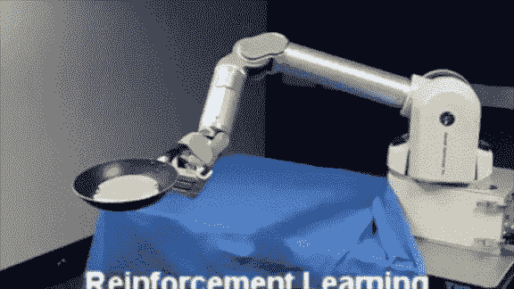
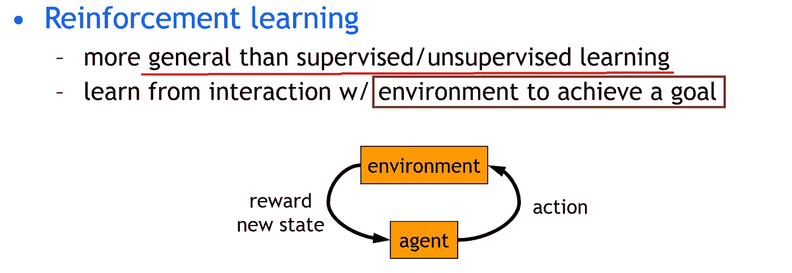
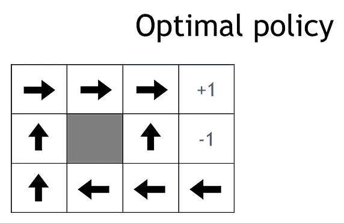
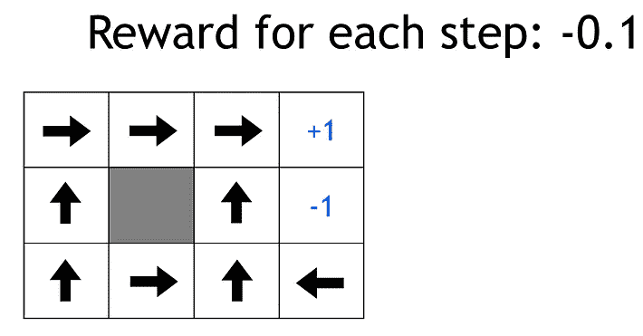
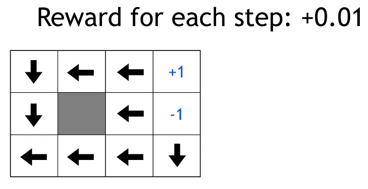
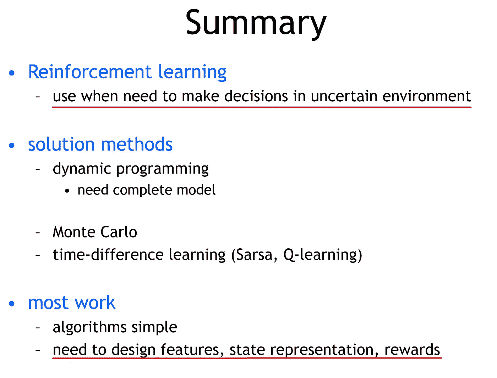
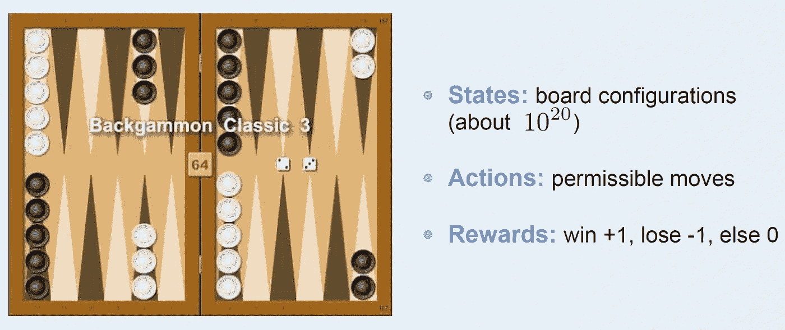
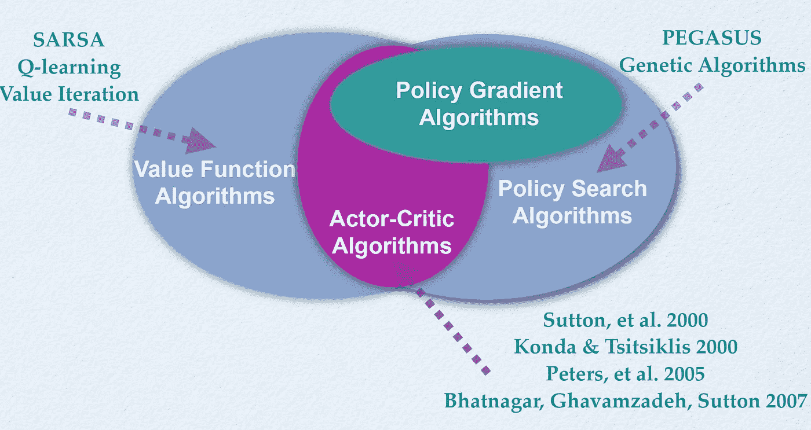
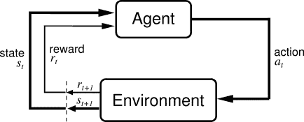
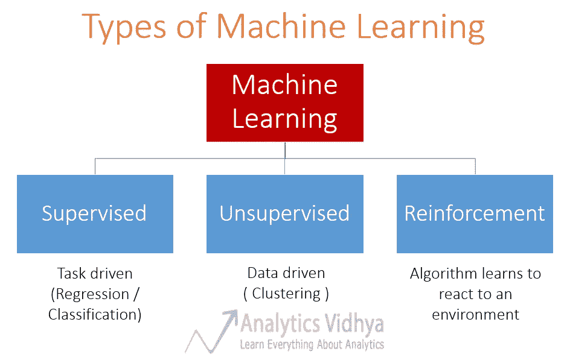

# 我的强化学习之旅——第 0 部分:简介

> 原文：<https://towardsdatascience.com/my-journey-to-reinforcement-learning-part-0-introduction-1e3aec1ee5bf?source=collection_archive---------3----------------------->

Gif from [website](https://giphy.com/gifs/pancake-flipper-bsBrYepOYSebe/download)

目前，我对强化学习知之甚少，我想改变这一点，所以这是我学习强化学习的第一步。作为第一步，我希望先介绍高层次的概述。

请注意，这篇文章是为我未来的自己写的，我的学习过程可能会很慢，或者与你的不同。

**加州大学伯克利分校彼得·博迪克的强化学习教程**

从这个讲座中，我了解到，强化学习相对于有监督或无监督来说，更具有一般性。然而，似乎仍然有一个目标的概念，因此我假设将有一个特定的成本函数来衡量我们离实现目标有多近。下面是对强化学习的一个很好的总结。

**右图** →最优解(每步无奖励)
**中图** →每步奖励为-0.1 时的解
**左图** →每步奖励为 0.01 时的解

上面，图片是一个完美的例子(对我来说),展示了强化学习是多么复杂。如果我们制造一个机器人，它的目标是得到最多的点，最优解将是最正确的图像。然而，根据不同的政策(这一次，每一步都有奖励)，机器人学习的解决方案是完全不同的。从这里开始，ppt 解释了相当多的数学，所以我不会把它作为一个高层次的概述，但是 ppt 有一个非常好的总结页面。

从上文中，我了解到当使用强化学习时，强化学习最具挑战性的部分实际上是设计特征、状态和奖励。

**机器学习国际会议(ICML 2007)教程**

从之前的演示中，我们已经了解到，具有挑战性的部分是设计状态和奖励。底部的缩写代表[马尔可夫决策过程](https://en.wikipedia.org/wiki/Markov_decision_process)和[部分可观测马尔可夫决策过程](https://en.wikipedia.org/wiki/Partially_observable_Markov_decision_process)。

上面显示了状态、行动和奖励的完美示例。我们可以看到，这个设置可以很容易地应用于任何游戏。(国际象棋，开始工艺甚至真实世界的设置。)

不同类型的学习算法，从这里我了解到有不同的类似于分类算法集的算法集，SVM，NN，或者 [k 近邻](https://en.wikipedia.org/wiki/K-nearest_neighbors_algorithm)。

[**强化学习简易入门&其实现**](https://www.analyticsvidhya.com/blog/2017/01/introduction-to-reinforcement-learning-implementation/)**(analyticsvidhya)**

Image from this [website](https://www.analyticsvidhya.com/blog/2017/01/introduction-to-reinforcement-learning-implementation/)

当我们谷歌强化学习时，我们可以一遍又一遍地看到如上图。因此，与其看到一个代理人或环境，不如把它想象成一个婴儿学习如何走路的过程。

Image from this [website](https://www.analyticsvidhya.com/blog/2017/01/introduction-to-reinforcement-learning-implementation/)

*这个例子的“问题陈述”是* ***行走*** *，其中* ***这个孩子是一个代理人*** *试图操纵* ***环境(它行走的表面)*** *通过* ***采取行动(即行走)*** *和他/她当他/她完成任务的一个*******子模块(即采取几个步骤)时，孩子得到一个* ***奖励**而当他/她完成任务的一个****子模块时，将不会得到任何巧克力* ***(也就是说这是一个强化学习问题的简化描述。*——[法赞·谢赫](https://www.analyticsvidhya.com/blog/author/jalfaizy/)*******

****

**Image from this [website](https://www.analyticsvidhya.com/blog/2017/01/introduction-to-reinforcement-learning-implementation/)**

**作者实际上对这些算法的不同之处做了很长的解释，如果你想看的话，请点击这里。不过短短的一/两句话。**

*****监督 vs RL*** :两者都映射了输入和输出之间的关系，但在 RL 中有一个奖励函数来衡量代理采取的行动，另外还有一个成本函数来衡量我们是否达到了最终目标。(例如赢得一盘棋→赢得比赛很重要，但赢得一盘棋有多种方式)
***无监督 vs RL*** :无监督学习(大多)是在底层数据中发现模式，并对其进行聚类。**

****最后的话****

**还有一个帖子，“[各种强化学习算法介绍。第一部分(Q-Learning，SARSA，DQN，DDPG)](/introduction-to-various-reinforcement-learning-algorithms-i-q-learning-sarsa-dqn-ddpg-72a5e0cb6287) ”是一篇了解不同类型学习算法的优秀文章。总的来说，互联网上有数以百万计的资源，所以任何想学习 RL 的人都不会有时间去寻找资源。**

****参考****

1.  **(2018).cs . uwaterloo . ca 2018 年 4 月 6 日检索，来自[https://cs . uwaterloo . ca/~ ppou part/ICML-07-tutorial-slides/icml 07-brl-tutorial-part 2-intro-ghavamzadeh . pdf](https://cs.uwaterloo.ca/~ppoupart/ICML-07-tutorial-slides/icml07-brl-tutorial-part2-intro-ghavamzadeh.pdf)**
2.  **2018 年*People.eecs.berkeley.edu*。【在线】。可用:[https://people . eecs . Berkeley . edu/~ Jordan/ml short course/reinforcement-learning . PPT .](https://people.eecs.berkeley.edu/~jordan/MLShortCourse/reinforcement-learning.ppt.)【访问时间:2018 年 4 月 6 日】。**
3.  **部分可观测马尔可夫决策过程。(2018).En.wikipedia.org。检索于 2018 年 4 月 6 日，来自[https://en . Wikipedia . org/wiki/Partially _ observable _ Markov _ decision _ process](https://en.wikipedia.org/wiki/Partially_observable_Markov_decision_process)**
4.  **马尔可夫决策过程。(2018).En.wikipedia.org。于 2018 年 4 月 6 日检索，来自[https://en.wikipedia.org/wiki/Markov_decision_process](https://en.wikipedia.org/wiki/Markov_decision_process)**
5.  **各种强化学习算法介绍。第一部分(Q-Learning，SARSA，DQN，DDPG)。(2018).走向数据科学。2018 年 4 月 6 日检索，来自[https://towards data science . com/introduction-to-variable-reinforcement-learning-algorithms-I-q-learning-sarsa-dqn-ddpg-72 a5 E0 CB 6287](/introduction-to-various-reinforcement-learning-algorithms-i-q-learning-sarsa-dqn-ddpg-72a5e0cb6287)**