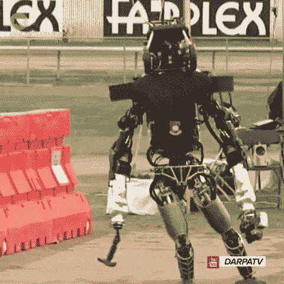
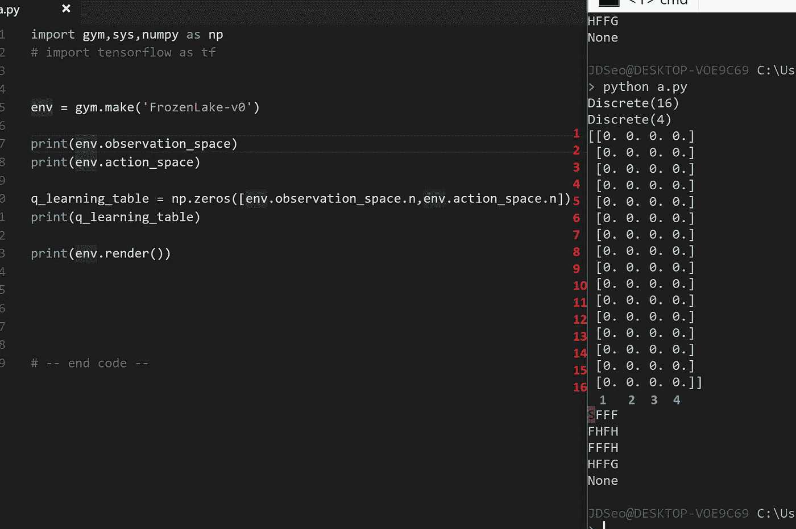
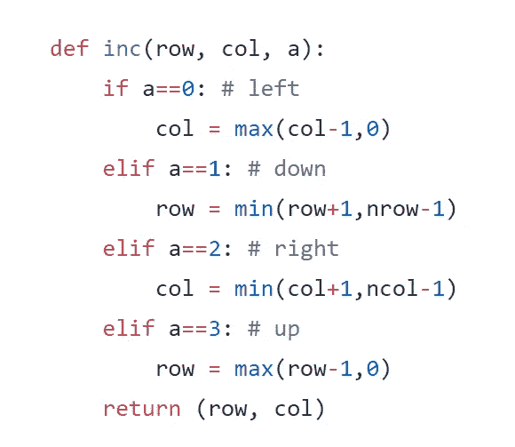
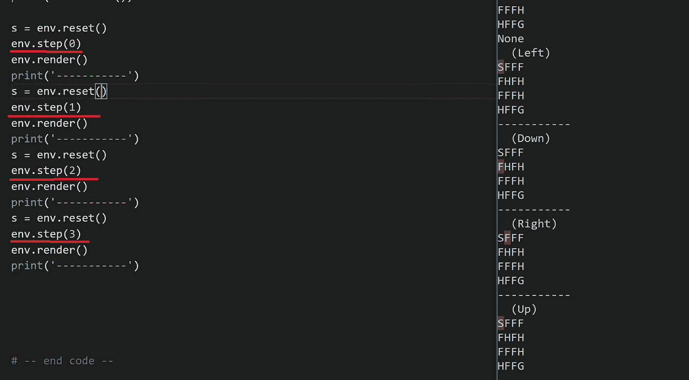
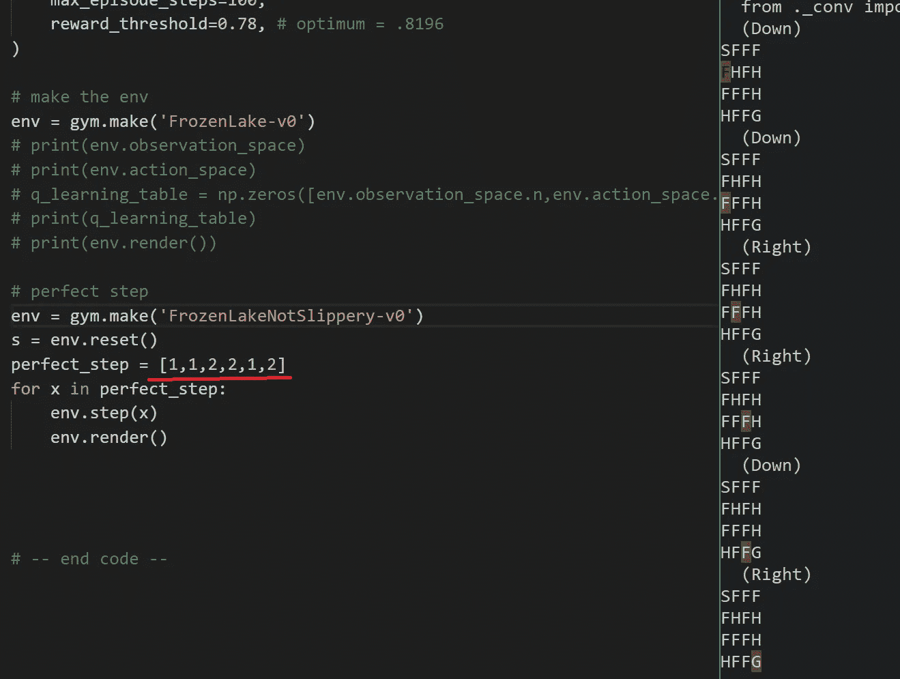
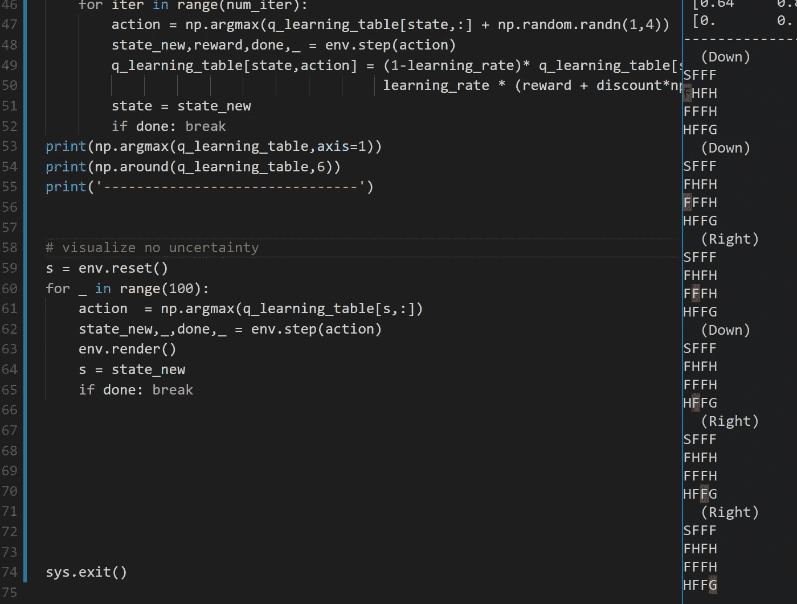
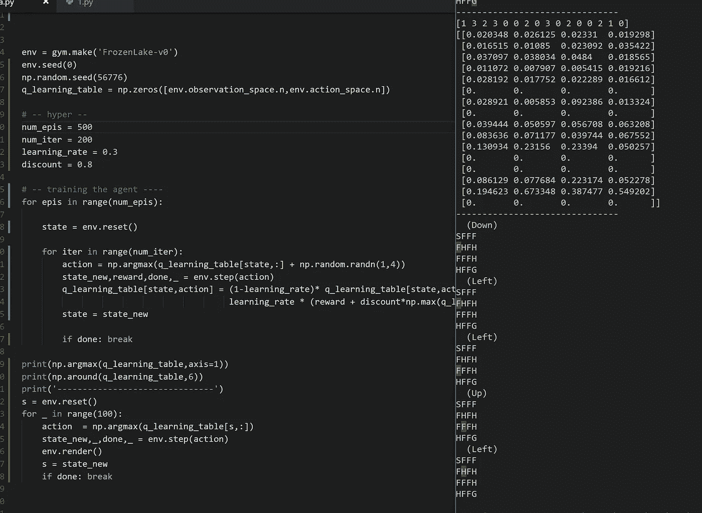
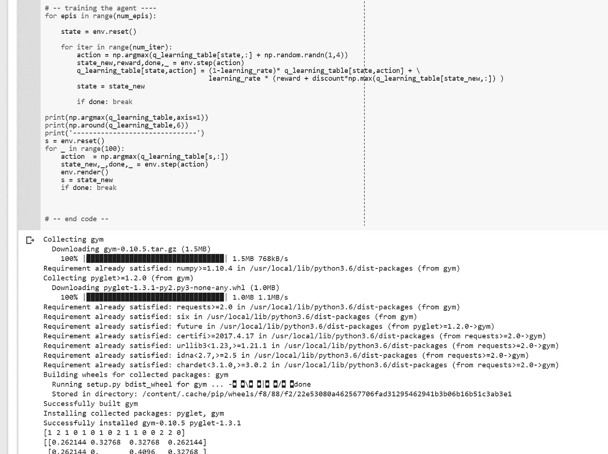

# 我的强化学习之旅——第 1 部分:Q-用表格学习

> 原文：<https://towardsdatascience.com/my-journey-to-reinforcement-learning-part-1-q-learning-with-table-35540020bcf9?source=collection_archive---------2----------------------->

Gif from this [website](https://giphy.com/gifs/robot-competition-department-N8wR1WZobKXaE/download)

目前，我对强化学习知之甚少，我想改变这一点，所以这是我学习强化学习的第二步。第二步，我想谈谈 Q——用表格学习。

请注意，这篇文章是为我未来的自己写的，我的学习过程可能会很慢，或者与你的不同。

> 我学习的方式是向自己解释概念，这篇文章就是这样。注意我还在学习这个话题，所以如果你来这里是为了学习 Q-Learning with table，我建议你不要看我的帖子，而是来自加州大学洛杉矶分校博士生的这篇帖子: [***深度强化学习揭秘(第 0 集)***](https://medium.com/@m.alzantot/deep-reinforcement-learning-demystified-episode-0-2198c05a6124)

**Q 学习理论**

Image from [wiki](https://en.wikipedia.org/wiki/Q-learning)

通过谷歌搜索，我了解到 Q-learning 是开始学习 RL 的一个很好的地方，因为我们让代理学习处于给定状态的价值以及从给定状态采取特定行动的回报，这个概念似乎很简单。

***与试图学习将观察直接映射到行动的函数的策略梯度方法不同，Q-Learning 试图学习处于给定状态并在那里采取特定行动的价值。***”——[亚瑟·朱利安尼](https://medium.com/@awjuliani?source=post_header_lockup)

**Q-学习方程**

**红框** →更新当前状态 St
**蓝框** →当前状态 St 的原始值

现在，让我们只关注这两件事。对于我来说，我喜欢用具体的例子来学习，所以让我们使用 OpenAI Gym 的“[*frozen lake-v 0*](https://gym.openai.com/envs/FrozenLake-v0/)”作为例子。(请注意，我不会深入解释这是什么，什么是 Open AI。)

就像上面一样，我们有 4*4 的矩形，在每个状态(或坐标)上，我们要么死，掉进一个洞，要么通过进入目标而获胜，或者只是在冰冻的湖中再走一步，现在让我们实际看看可用状态和动作的表格。

Printed out values

**红色数字** →每个状态
**蓝色数字** →每个状态下我们可以做的每个动作

现在我们可以看到我们制作的 Q-learning 表有 16 列 4 行。现在让我们回顾一下我们的环境。

**红色数字** →在 Q 学习表中代表相关的每个状态

现在，我不能 100%确定这些数字是水平增加还是垂直增加(意味着第一列的数字可能是 1 5 9 13)。我认为这取决于实现，但我们仍然可以得到大致的想法。在每个状态下，我们可以做四个动作，(上图中蓝色数字代表的是什么)，这些动作是上、下、左、右(同样，不确定这是否是准确的顺序，可以是右、左、下、上等等)。但是我们肯定能知道事情的大致方向。所以现在让我们回到 Q 学习方程。

从这里我们可以估计，上面的等式将更新每一行中的某个值(即状态)。选择采取什么行动。

**确认和实验**

**红线** →分排以便于观察
**蓝线** →洞内左、下、右、上动作
**紫线** →球门内左、下、右、上动作
**粉线/开始** →可疑值

我们可以看到，洞内或目标内的动作值都是零，这非常合理，因为游戏在该点结束，我们没有更多的动作可以采取。

> *****注***** ，有一些值值得商榷，比如粉色值。在这个坐标中，我们要么向上走，要么向下走，以求生存。但是在 Q 表中代理似乎向右走，这是自杀。这里我们需要解决不确定性的概念！

> 这意味着，我们会向右移动，但我们可能根本不会向右移动，我们可能会向上或向下移动一个百分比。我相信，这就是为什么我们的 Q 表已经学会了在粉红色坐标中向右走。

我们可以通过两种方式来确认这些动作的顺序。从源代码中，或者通过我们自己运行代码。

From the source [code](https://github.com/openai/gym/blob/master/gym/envs/toy_text/frozen_lake.py)

现在我们知道了，让我们给我们的代理一个完美的地图，来达到目标。我会用路径**【下，下，右，右，下，右】。**

此外，为了使这个实验具有确定性，我将关闭滑动设置。(请看这篇关于如何做到这一点的 [stackoverflow 帖子](https://stackoverflow.com/questions/43556245/openai-gym-setting-is-slippery-false-in-frozenlake-v0)。)

**红线** →上下左右的数组值。

很好，我们可以看到我们的代理完全按照我们想要的方式移动，现在让我们实际应用 Q-learning 来学习这个表，而不是手工绘制路径。通过使用下面的等式。

**红框** →实现方程
**蓝框** →由于我们是用全零初始化 Q-Learning 表，所以我们要添加一些噪声来得到 random max 自变量。

**实验结果(无不确定性)**

**红线** →每个数字代表每个状态
绿线 →每个状态下的左、下、右、上动作

通过学习到的 Q 表，我们可以清楚地看到我们的代理在每个状态下将采取什么行动，这是**【下右下右下右】。**

我们可以想象代理人采取的每一步，它完全按照我们的预期进行。

**实验结果(不确定度)**

在存在某种不确定性的情况下，代理人无法学习实现目标的正确路径。一旦我更深入地研究了这个话题，我将在以后回到这个问题上来。

**对于希望了解更多折扣系数的人**

以上，视频做得非常出色，我们为什么把折扣值。此外，它本身就是一个令人惊叹的视频系列。

**交互代码**

*对于 Google Colab，你需要一个 Google 帐户来查看代码，而且你不能在 Google Colab 中运行只读脚本，所以在你的操场上做一个副本。最后，我永远不会请求允许访问你在 Google Drive 上的文件，仅供参考。编码快乐！*

要获取这篇文章的代码，[请点击这里](https://colab.research.google.com/drive/1u0saGlFdhlBqgX7q1lh4bTNr3kv1bRK_)。

**最后的话**

强化学习是非常有趣但又很难的话题。我很高兴能了解更多！

如果发现任何错误，请发电子邮件到 jae.duk.seo@gmail.com 给我，如果你希望看到我所有写作的列表，请[在这里查看我的网站](https://jaedukseo.me/)。

与此同时，在我的 twitter 上关注我[这里](https://twitter.com/JaeDukSeo)，访问[我的网站](https://jaedukseo.me/)，或者我的 [Youtube 频道](https://www.youtube.com/c/JaeDukSeo)了解更多内容。如果你感兴趣，我还在这里做了解耦神经网络[的比较。](https://becominghuman.ai/only-numpy-implementing-and-comparing-combination-of-google-brains-decoupled-neural-interfaces-6712e758c1af)

**参考**

1.  使用 Tensorflow 的简单强化学习第 0 部分:使用表格和神经网络的 Q 学习。(2016).中等。检索于 2018 年 4 月 7 日，来自[https://medium . com/emergent-future/simple-reinforcement-learning-with-tensor flow-part-0-q-learning-with-tables-and-neural-networks-d 195264329d 0](https://medium.com/emergent-future/simple-reinforcement-learning-with-tensorflow-part-0-q-learning-with-tables-and-neural-networks-d195264329d0)
2.  q-学习。(2018).En.wikipedia.org。2018 年 4 月 7 日检索，来自 https://en.wikipedia.org/wiki/Q-learning
3.  开放/健身房。(2018).GitHub。2018 年 4 月 8 日检索，来自[https://github . com/open ai/gym/blob/master/gym/envs/toy _ text/frozen _ lake . py](https://github.com/openai/gym/blob/master/gym/envs/toy_text/frozen_lake.py)
4.  FrozenLake-v0，O. (2018)。open ai-gym:frozen lake-v 0 中设置 is _ slick = False。Stackoverflow.com。检索于 2018 年 4 月 8 日，来自[https://stack overflow . com/questions/43556245/open ai-gym-setting-is-slippy-false-in-frozen lake-v 0](https://stackoverflow.com/questions/43556245/openai-gym-setting-is-slippery-false-in-frozenlake-v0)
5.  奖励测试序列-佐治亚理工学院-机器学习。(2018).YouTube。2018 年 4 月 8 日检索，来自[https://www.youtube.com/watch?v=HhLsIxKq_1s&list = plawxtw 4 sypnidwo 9 e 2c 7 ixisu _ pdSNp&index = 17](https://www.youtube.com/watch?v=HhLsIxKq_1s&list=PLAwxTw4SYaPnidDwo9e2c7ixIsu_pdSNp&index=17)
6.  深度强化学习去神秘化(第 0 集)。(2017).中等。检索于 2018 年 4 月 8 日，来自[https://medium . com/@ m . alzantot/deep-reinforcement-learning-demystized-episode-0-2198 c05a 6124](https://medium.com/@m.alzantot/deep-reinforcement-learning-demystified-episode-0-2198c05a6124)