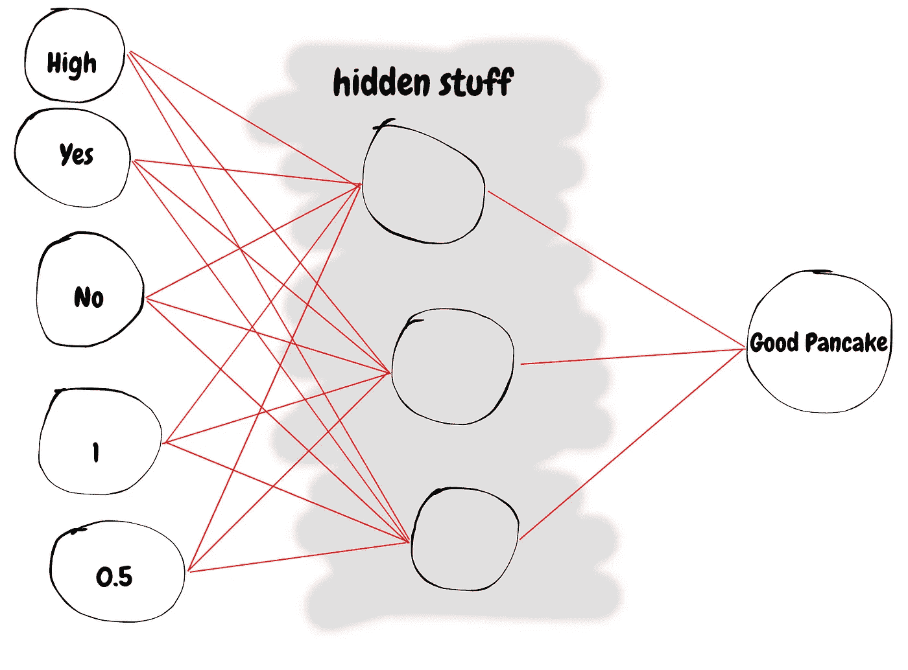
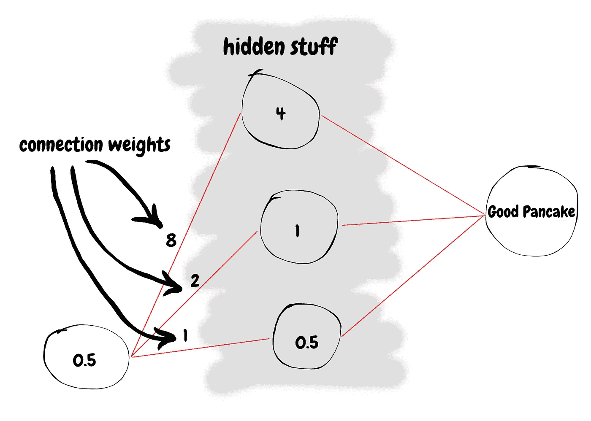
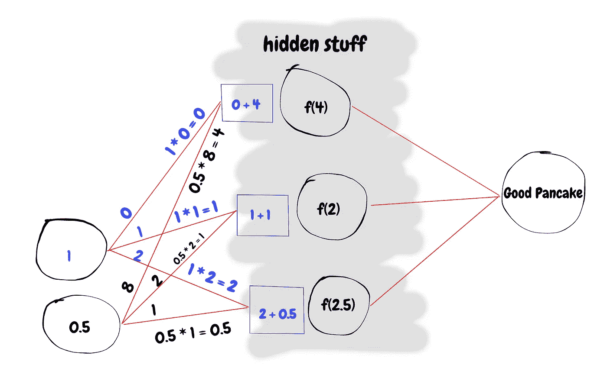

# 我的大脑只是一个神经网络

> 原文：<https://towardsdatascience.com/my-mind-is-just-a-neural-net-769fb82f39c1?source=collection_archive---------9----------------------->

Photo by [Drew Graham](https://unsplash.com/photos/cTKGZJTMJQU?utm_source=unsplash&utm_medium=referral&utm_content=creditCopyText) on [Unsplash](https://unsplash.com/search/photos/soul?utm_source=unsplash&utm_medium=referral&utm_content=creditCopyText)

## 但是什么是神经网络……我的思想是什么？

哲学应该和数据科学成为更好的朋友。需要明确的是，数据科学也应该更好地与哲学合作。当分析大数据引发的[伦理困境时，很明显，道德哲学对于改善数据科学至关重要。不过这是另一天的讨论。今天，是时候讨论相反的情况了；数据科学如何改善哲学？](/the-engineering-mindset-6b9d9368207e)

本文将解决的问题:

*   什么是神经网络？
*   人的心灵是什么，我的思想是什么？
*   自由意志存在吗？
*   我的思维可以分解成数学算法吗？
*   强 AI 真的可能吗？
*   看起来像人类的机器人能像我们一样感受情感吗？
*   明天的中奖号码是多少？

好吧，也许不是最后一个。但你的关注给了我一个+分。

为了讨论大脑与神经网络的关系，我想确保每个人都在同一页上。不需要成为专业的数据科学家或者哲学家国王才能参与。我将在高层次上解释神经网络和身心问题，这样概念就不会掩盖潜在的顿悟。系好安全带，打开你的思想，坚持你的倾向；我向你呈现:**身心问题**。

# 我是我的思想吗？我是我的身体吗？它们是一样的吗？

## 二元论对一元论

有两种选择。要么我们的身体和我们的思想是两个不同的实体[二元论]，要么它们是同一的[一元论]。自从宗教创立以来，哲学家们就一直在争论这个问题。如果思想和身体是分离的，那么有可能存在一个永恒的灵魂能够比腐朽的尘世自我活得更久。如果思想是身体，我们的思想、信仰和记忆将和我们的碳生命同时死亡。

## 你的一分钟心灵哲学速成班

*   二元论认为我们的头脑是由一个独立的东西组成的，而不是大脑。问问勒内·笛卡尔、基督徒或任何相信灵魂不朽的人。
*   消除主义是一种理论，认为任何精神状态实际上都是它的科学对应物。例如，如果我*感到疼痛*，消除师会说我只是在*体验我的 c 纤维燃烧*。
*   行为主义暗示精神状态=在特定环境下以特定方式行事的倾向。(又名:我们只不过是刺激和反应的生物)。
*   **功能主义**是行为主义和二元论的伪结合。功能主义者认为，人类的思想是刺激、反应和某种介于 [*和*](https://www.iep.utm.edu/functism/) 之间的东西。
*   大脑的计算理论(CTM) 是一种认为人类大脑是一台计算机的理论。想想[图灵机](https://plato.stanford.edu/entries/turing-machine/)。
*   连接主义认为 CTM 没有准确地捕捉到人类的思想。相反，连接主义者认为人类的大脑是一个神经网络。这将是一个重要的理论焦点。

## 你的神经网络速成课程

为了将神经网络从一个时髦词汇变成可理解的词汇，考虑一下这个煎饼比喻。假设我是一个假设的煎饼鉴赏家。每个星期天，我都会拿出酪乳和煎锅，试图做出完美的令人垂涎欲滴、黄油融化、感官超负荷的烙饼。但是，经过多年的练习，我似乎还是做不出比脆饼更好的东西。

我决定唯一合理的解决方案是外包我的煎饼制作能力；我要训练一个神经网络来帮我做这件事。我需要一些东西:

*   **训练数据集:**指定输入特征及其相关结果的表格。对于我的煎饼，桌子可能看起来像这样:

(Real training data usually consists of MANY more trials than this example)

*   **神经网络层**:神经网络由三层组成。输入层、隐藏层和输出层。对于我的第一个煎饼创作试验，它看起来像这样:

暂时不要过于关注隐藏的东西，我们会仔细研究的。注意红线的意义。一层中的每个单元都连接到下一层中的每个单元。

*   **重量:**每条红线都有一个相关的重量。首先，这些权重是任意的，通常只是随机数。这些将向前传播到隐藏层，给隐藏层中的每个单元一个权重。请看下面的视觉帮助:

The numbers in the hidden stuff aren’t exactly correct yet, but we’ll go over that next.

通常最简单的连接权重是介于-1 和 1 之间的数字，但是对于这个例子，连接权重被随机选择为 8、2 和 1。这是“第二面上的分钟”功能的首次试用输入。

*   激活函数:这个函数告诉我们可以在隐藏层中放置什么。对于上图，激活函数将是连接权重乘以单位权重的和。∑( *连接权重 x 单位权重)。让我们称之为 x。通常，激活函数只是使用 x 作为它的输入。*

例如，假设激活函数= f，那么 f(x)会告诉我们在“隐藏的东西”中放入什么数字(记住 x 是所有输入权重的总和)。文字令人困惑，所以看一下这个视频来澄清一下:

This is our pancake neural net with two input units. [f is our activation function]

神经网络各层的工作方式是，这个过程将贯穿所有隐藏层。这被称为**正向传播**。最后，输出单元的激活函数将导致神经网络吐出“好煎饼”。

为了让视觉效果更容易理解，我把“好煎饼”放在了输出单元的内部。实际上，输出单位看起来更像 f(5.4)。然后，基于一些算法( [ReLU 是常见的](https://arxiv.org/pdf/1803.08375.pdf))f(5.4)=‘好煎饼’。

请记住，可能有更多的输出单元。也许是 f(5.4)，f(1.2)，f(3)，等等…然后算法会考虑所有这些输出单位，并吐出“好煎饼”。为了简单起见，我们现在坚持使用一个输出单元。

*   **训练我的神经网络:**在第一个视觉中，神经网络猜测六个提供的输入导致“好煎饼”输出。但是如果它猜错了呢？神经网络最显著的特征之一是它能够*学习*。比方说，我的第一次煎饼试验实际上是一个可怕的，干燥的，烧焦的烙饼。然后神经网络猜错了。

那么我们如何解决这个问题呢？通过称为**反向传播**的过程，神经网络能够修改连接权重，以便它在未来更有可能猜出正确答案。理论上，随着我提供更多的训练数据，神经网络应该*从它的错误中学习*，直到它变得尽可能准确。

唷，那是许多技术术语。现在我们明白了我们的思维可能是什么，以及神经网络是如何工作的……但是我的思维是如何工作的呢？

# 连接主义

仔细想想上面的例子。基于许多试验，神经网络最终将能够非常准确地确定哪些因素导致了“好煎饼”，哪些因素导致了“坏煎饼”。

人类不就是这样学习的吗？如果我决定不把我的烹饪技能外包给神经网络会怎么样？下面是将会发生的情况:

根据我的第一次试验，我用锅上的黄油做一个薄饼，在第一面放一分钟，翻转一下，在另一面放 30 秒。我咬了一口。这煎饼不错。*正向传播。*

在第二次试验中，我感觉有点冒险。我锅里不加黄油，煎饼第一面放两分钟，翻面，另一面放一分钟，用锅铲压平，咬一口。不需要火箭科学家就能发现我咬了一口难吃的煎饼。焦了，平了，干了。

现在我知道了，从试验一到试验二，我至少改变了一件事，导致我的煎饼从好变坏。也许在我的第三次试验中，我会做和第一次试验一样的事情，但是我只会改变其中一个制作煎饼的属性。*反向传播。我又做了一个好吃的煎饼。*

最终，如果我做得足够多，理论上我会成为一名煎饼制作专家。我将创建一个非正式的心理算法，它能理解热量、每一面的烹饪时间和抹刀展平的哪一个可变性会带来好的煎饼；哪种组合会导致糟糕的煎饼。也许我的朋友会开始信任我的厨艺。看起来我的大脑就像神经网络一样工作。或者更确切地说，我的大脑像一个*联结主义网络*一样工作。

除了煎饼混合物，还有其他一些支持连接主义的引人注目的论点。其中一个最大的论点是**神经网络擅长我们擅长的事情，而不擅长我们不擅长的事情**。我说的是面部识别、心算、记忆等。神经网络和我们的大脑一样面临着同样的问题。他们也非常擅长从人群中识别熟悉的面孔。

在这一点上，连接主义者的论点看起来有点前途。但是，如果我的思想可以被演绎成一个算法…我甚至能对自己的决定负责吗？自由意志存在吗？

# 生命的意义

为了回答关于自由意志的问题，我们必须回到我们的老朋友笛卡尔那里。对于二元论的支持者来说，自由意志的存在是因为我们的思想(灵魂)与我们的大脑(身体)是分离的。对于几乎所有其他事物的支持者来说……我们的思维只是一种行为，一种计算，或者是加权特征的组合。

对一个联结主义者来说，如果我相信天空是蓝色的，我的思想可以被推导为一个输入的特征，它引导我去相信它。我对蓝色和天空的知识与我的视觉皮层相结合，通过我的神经递质(类似于上面的图表)并行发送，直到我达到 f(5.7)。或者说，f(5.7) =我对天空是蓝色的信念。

还有两个问题需要解决:

1.  强 AI 真的可能吗？
2.  看起来像人类的机器人能像我们一样感受情感吗？

理论上，随着神经网络变得越来越高效和精确，它们变得越来越像人脑。尽管联结主义似乎是逻辑上最有前途的身心理论，但上述问题只有在与心灵的计算理论(CTM)相关时才能得到回答。弱人工智能每天都围绕着我们，但强人工智能还没有被制造出来。

记住 CTM 类似于图灵机。它解释了人类的思维是如何缩小到 0 和 1 的微小集合的。有了 CTM，世界的**句法**(就像煎饼煎到一边的时间)与我们的神经递质结合，创造了世界的**语义**(我的烤焦的煎饼味道很差)。语法是可观察的信息，语义是这些信息对我们的实际意义。

过去，人类认为强人工智能和人工智能中的情感理解将源于语义理解。现在，机器人、聊天机器人和人工智能代理只能处理信息。没有任何迹象表明更高层次的理解正在形成。

为了进一步解释，想象一下这个思想实验(被称为[中文室](https://www.iep.utm.edu/chineser/))。在这个实验中，有一个人在一个堆满文件柜的房间里。从理论上讲，这些柜子里堆满了如何用中文回答问题的英文说明。当房间里的人得到一个塞在门下的中文短语时，他们会查找如何回答给定问题的说明，写下新的汉字，然后塞回门下。

在旁观者看来，这个房间里的人中文很流利。他们能够看到中文问题，并提供中文回答。这个人会通过图灵测试。但是，房间里的人真的懂中文吗？他们已经学会了如何根据书面汉字的语法做出反应，但他们对教室外的语言一无所知。这里不涉及任何语义。

同样的论点也适用于人工智能。即使机器人很可能会通过图灵测试，看起来好像它们能理解我们，但它们的机器人大脑真的能理解我们吗？如果人工智能是使用基于指令的解决方案创造的，那么机器人的理解能力将会和中国房间里的人一样差。虽然人工智能代理可能会告诉我它“感到悲伤”，但这种说法只是一种编码反应，还是它真的感到悲伤？真正的强人工智能似乎更适合像神经网络这样的东西。

在这一点上，消除主义者会认为语义学根本不存在。人类被我们自己的大脑欺骗了，就像我们在炎热的日子里在沙漠中看到海市蜃楼一样。我们认为我们在比语法更高的层次上理解世界，但是我们没有。我们的大脑实际上只不过是一组指令，或者说是一个连接网络。

# 等一下

哇…所以根据 CTM 和联结主义，心灵只是一些科学上可观察的实体。我的思想不存在形而上学的、神圣的维度。人生毫无意义。哲学和数据科学终于在沙盒里一起玩了，但我不知道我是否还想让它们玩下去！

别担心。现在还不到否认自由意志的存在并屈从于悲观的、决定论的人生观的时候。是的，神经网络正在变得更好，但这并不一定意味着连接主义是强人工智能的一站式商店。

## 反对连接主义的论点

首先，神经网络的学习时间比人类长得多。*长度*在这里不一定指时间，而是指*审判*。虽然网络通常需要数十万个样本才能有效学习，但人类可以在明显更少的试验中学习类似的任务；而且通常更准确。

二、神经网络纠结于 [*合理性、系统性、*和*结构*](https://onlinelibrary.wiley.com/doi/10.1002/9780470996287.ch27) *。基本上，这意味着人类在语言方面更擅长逻辑和结构。以这句话为例:*

> “如果丹尼尔剪了头发，约翰会哭的。丹尼尔剪头发。”

作为人类，我们可以从逻辑上推断出约翰现在会哭。然而有趣的是，神经网络与这个概念有冲突。同样，如果丹尼尔*不*理发，神经网络倾向于认为约翰会*而不是*哭。正如命题逻辑已经证明的那样，[不一定是真的](https://en.wikipedia.org/wiki/Denying_the_antecedent)。

# 现在怎么办？

这取决于你。哲学家们就这个问题争论了数百年是有原因的。神经网络和弱人工智能正在慢慢填补一些有前途的理论中的漏洞。这并不意味着它们是唯一的答案。

二元论和决定论将永远处于战争状态。不能被观察到的事物(比如:思想)提供了科学知识的空白(比如:“什么是思想？”).在历史上，宗教充当了一个“[神的缺口](https://en.wikipedia.org/wiki/God_of_the_gaps#Usage_in_referring_to_a_type_of_argument)”。它填补了科学知识的空白。随着科学的进步，越来越少需要宗教来解释。在人工智能领域，科学的空白在历史上一直被哲学填补。正如宗教的情况一样；似乎随着科学越来越好，某些哲学理论陷入了困境。

我的建议？尽量不要想太多。我们的语义就是我们对它们的理解。也许我的心灵是一个无意识的存在，可以自己做决定，有自己的信仰。也许我的脑子里只有 0 和 1。不管我的想法是真实的还是海市蜃楼，我要继续过我的生活；我只能做到这样了。