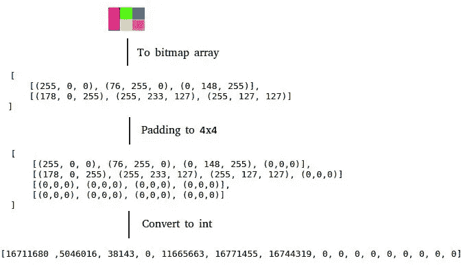
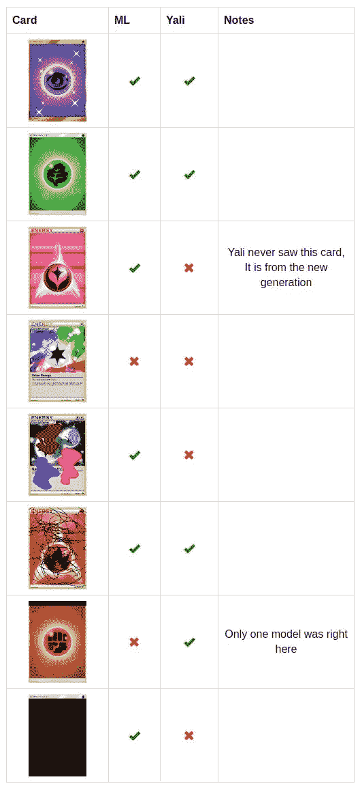
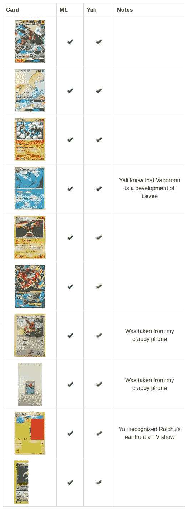
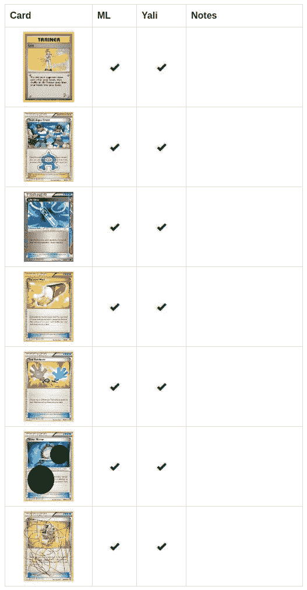

# 我的侄子 vs 曼梯·里

> 原文：<https://towardsdatascience.com/my-nephew-vs-ml-9e4519af499a?source=collection_archive---------1----------------------->

我 4 岁的侄子 Yali 现在非常喜欢口袋妖怪。他有多个口袋妖怪玩具和一些 TCG(训练卡游戏)卡。

前几天，亚力发现了我藏起来的恶心的 TCG 牌，现在他的牌多得数不清了。

问题是雅丽太小了，还不知道如何玩真正的游戏，所以现在他发明了自己的游戏。游戏的目的是根据卡片的类型(口袋妖怪、能量和教练卡)对卡片进行分类。

他没有问我怎么知道卡是什么类型的，他拿了几张卡，问我是什么类型的。在我回答了几个问题后，他能够根据卡片的类型(有多个错误)来区分它们。

那一刻我意识到，我的侄子基本上是一个机器学习算法，我作为叔叔的任务是为他标记数据。

作为一个极客大叔和机器学习爱好者，我开始编写一个将与 Yali 竞争的程序。

这是典型的口袋妖怪卡片的样子:

source: pkmncards

对于一个知道如何阅读的成年人来说，辨别卡片的类型是很容易的，因为它就写在卡片的顶部。但是亚力才 4 岁，他不知道怎么读书。简单的 OCR 会很快解决我的问题，但我不想做任何假设。所以我照原样拿着这张卡，用 MLP 算法把它扔给一个神经网络。

获取数据非常简单。多亏了 [pkmncards](https://pkmncards.com/) ，我可以下载多张卡片的图片，这些图片已经被分成了 Yali 的类别。

机器学习算法需要特征，而我的特征就是图像像素。使用 RGB 彩色图像，我将三种颜色转换成一个整数。

由于图像大小不同，我不得不将它们标准化。在找到数据的最大宽度和高度后，我给小图片添加了零填充。

真正交易前的快速质量保证周期。我随机抽取每种类型的两张卡片，然后进行预测。每一类只用了 100 张卡片，拟合速度惊人的快，预测也很糟糕。然后，我为每个类别抽取了 500 个样本(不包括能源类型，它只有 130 个样本)，并让拟合运行。

内存不足异常。在云中运行拟合代码应该可行，但我想找到一种使用更少空间的方法。最大的图像尺寸是 800x635，这太大了。调整图像大小解决了我的问题。

对于真正的测试，除了常规的卡片，我还添加了我在上面画画、剪成两半、画上形状、从我的手机(它的相机很差)上拍一张照片以及其他特殊效果的卡片。重要的是，我没有用这些卡片训练网络。

我试过一千多种型号(准确的说是 1533 种)。不同的图像尺寸、隐藏层数(最多 3 层)和层长度(最多 100 层)、图像颜色、读取类型(全图、上半部分、每隔一个像素等)。

在对所有模型进行了几个小时的拟合后，最好的分数是 25 张卡中的 2 个错误(少数模型有这个分数，但每个模型在不同的卡上都失败了。所有这些都是图像的灰度版本)。

1533 个模型中有 9 个出现了 2 个错误。

如果我将我的阈值设置为高于 44%的一致，模型的组合将给我 1 个错误的分数。对于测试，我将使用 50%的阈值。

让雅丽玩了一个月，我回来测试。

赢了！23 个给机器，21 个给人类。

如你所见，错误只发生在能量卡上。pkmncards 只有 130 张能量卡，而不是其他类型的数千张。可供学习的样本更少。

问雅丽他是怎么认出一些卡片的，他告诉我他在电视节目或书中看到过一些口袋妖怪。这就是他如何认出雷丘的耳朵或者知道蒸汽是水的原因。我的程序没有那种数据，我仅有的数据是卡片。

当我们的英雄在口袋妖怪挑战赛中击败雅丽并获得 ML 徽章时，他开始了他的下一次冒险。

