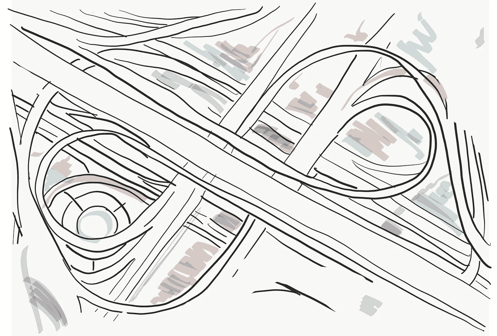
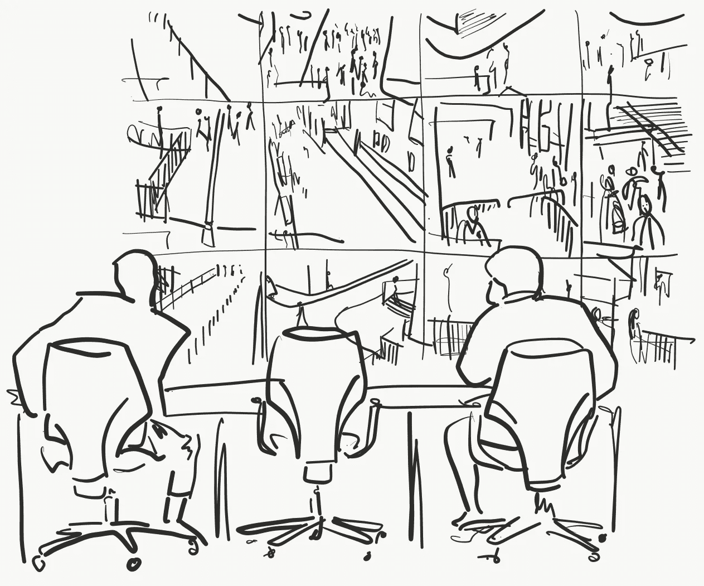
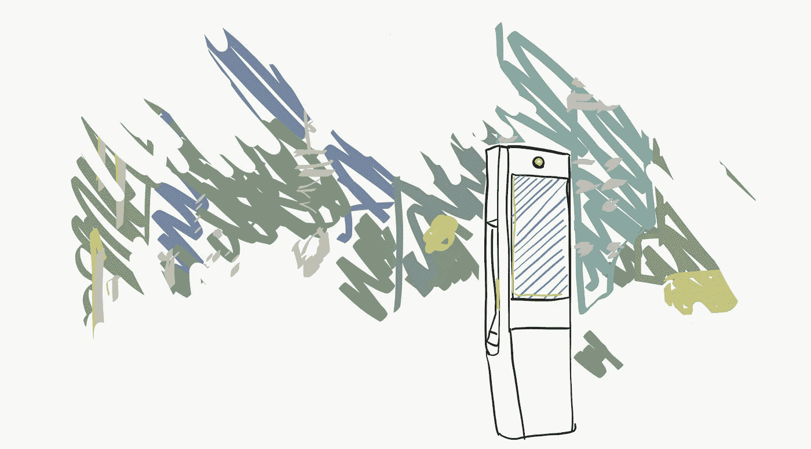

# 从 webdev 到计算机视觉和机器学习

> 原文：<https://towardsdatascience.com/my-next-two-years-de448d3141a?source=collection_archive---------6----------------------->

在过去的四年里，我一直有一个想法，那就是我要创办一家公司。潜在的感觉是，我想做一些我能热情地承担全部责任的事情。虽然这一直是我的愿望，但我还没有采取具体措施来实现它。相反，我开发了一个职业写作软件，并学习承包市场。我没有制定商业计划和试图筹集资金，而是建立并发布了许多副业项目。每个项目都让我对感兴趣的技术或领域有了更多的了解。

我已经积极地投入到任何摆在我面前的任务和机会中。因此，我能够在媒体、艺术、技术和社会公益领域遇到无数才华横溢、令人惊叹的人。

大约在移动开发变得重要的时候，我开始了 web 开发。我看到 JavaScript 从与 html 和 css 互补的技能组合，发展成为理解似乎永无止境的框架融合所需的主要语言。

我所听到的有趣的项目都与建立新的社交网络或建立现有的社交网络有关。移动定位技术风靡一时，但尚未完全成熟，照片共享服务的影响力也在不断增长。我甚至自己制作了一个基于照片的 iOS 应用程序，同时非常有意识地努力避免不必要的重新创建 Instagram。

# 下一步是什么

最近，我对地图技术和更多实时相关应用的出现感到非常兴奋。当我注意到 Hadoop 和 Spark 等“大数据”开源项目的流行时，我并不觉得自己有什么可以尝试的。我尝试创建一个在线市场平台网站。我看到了 X 月箱服务的兴起，并考虑到创建一个有价值的物流服务有多难，这种服务可能属于 X 月箱或更有吸引力的 uber-for-X。我甚至玩起了物联网设备的可能性，以及如果我验证了一个值得制造的想法，我可能会如何着手生产一些东西。我研究了蓝牙规范、能量传输机制，并想知道我能把哪些有趣的艺术导向的应用程序拼凑起来。总的来说，我从来没有投入足够的精力去充分看到我探索的成果。然而，所有的过程对我自己的成长都是有价值的。

现在，感觉好像有更多的东西需要探索，虽然我不知道如何探索，但我可以清楚地感觉到前进的道路将会更大。

我对区块链、机器学习和新的增强/虚拟现实感到兴奋。在所有新兴技术中，我花了最多的时间试图理解和利用机器学习的实际用途。虽然我在理论上理解区块链，但我对该产品没有任何深厚的感情。我没有被反体制/支持主权的意识形态所驱使，这些意识形态助长了加密文化。我也不觉得 AR 或 VR 领域像我认识的那些“全押”进去的人那样有趣。我喜欢用虚拟层补充物理空间的想法，但还没有任何“啊哈！”关于如何执行流程的时刻。

# 计算机视觉

图像分析和可以通过机器学习提取的看似有趣的数据继续激起我的兴趣。此外，交通领域的变化让我确信，实时位置相关图像分析数据将变得越来越重要。

## 学术界

我觉得学术界和私营部门在这两个领域都做了有趣的工作。在学术领域，我以前看到一些著名的大学做了很多形象导向的工作，但并没有立即引起人们的兴趣。围绕压缩、颜色等高度理论化的工作对我没有吸引力。围绕医学图像分析的工作似乎是一个很大的领域，但在我看来完全没有吸引力。我看到了许多围绕 2D 图像到 3D 空间转换领域的研究项目。在一项孤立的研究中，这些 image-to-X 项目并不有趣，但这些研究在现实世界中的应用似乎值得探索。

我想花大量的时间来充分了解正在进行的图像相关研究的学术前景。我认为回顾美国和世界各地的顶尖大学对我自己和我可能做的任何事情都有很大的启发。

我试图确定回学校继续深造攻读硕士学位是否值得。从我有限的接触来看，我还没有找到为什么这很重要的原因，但是我可以想象固定的时间专注于一个孤立的话题会非常有益。和志同道合的人在一起的机会似乎是值得的。

## 私营部门

我一直着迷于将相机用作多用途传感器的想法。现有的面向软件的计算机视觉任务似乎很少被探索。这是我想花更多时间为自己规划的事情。较新的有趣应用，如自动驾驶汽车，以及围绕物体识别的改进令人着迷。我知道还有很多其他领域的兴趣让这个领域值得探索。我想了解一切，从卫星到安全摄像头，从广告到房地产，从自动驾驶车队到增强现实摄像头。

从“看看 20 年后可能存在的东西，问问自己如何把它应用到今天”的角度来看，这似乎是我最感兴趣的领域。我希望投入大量时间来了解未来的机会、生态系统以及应用于现实世界问题时该领域的优势/劣势。

除了技术曝光，一个没有隐私的社会的哲学含义是可怕的。实际的商业价值感觉像是一个将继续发展到未来的领域，随着它，公众的理解。正如加里·周(Gary Chou)简明扼要地指出的那样，与其等待爱德华·斯诺登(Edward Snowden)相机技术的大数据时代，还不如消除社会理解和监管界限。也就是说，摄像头将不可避免地无处不在，来自摄像头的数据将被私营公司挖掘。我想站在决定这里能创造的积极价值的一边。

# 位置

测绘技术继续激起我的兴趣。当我在涂鸦时，我开始想了解更多，并想知道如何避免被抓住。“作家”会谈论警察如何使用地图技术来锁定艺术家。流传的笑话是，一个艺术家最大的粉丝是警察。他们有最多的照片和一个人所做的所有工作的最大记录。我记得城市是如何通过从一个人身上找到所有被报道的“标签”来抓住艺术家的。通过绘制位置图，通常可以推断出艺术家的家附近，整体调查范围明显缩小。这是 15 年前。我不知道这种数据分析的官方流程叫什么，但我肯定从那以后它有所改进。

我可以想象将同样的分析模式应用于任何其他数据集的价值，无论是社交媒体数据还是商业行为。我想加深对这一领域的了解。我想，围绕自然资源勘探中常用的地理空间分析，有很多东西需要学习。我想更多地了解如何利用卫星。这是一个在过去永远无法接触到的超级大国，除非你是一个民族国家。对冲基金现在通过分析世界各地的停车场和运输车辆，使用卫星图像来分析零售业的供求关系。这里与其他行业的相似之处似乎同样无穷无尽且尚未开发。随着地面上到处都采用摄像机，我想象随着时间的推移，同样的分析手段将非常有价值。

我想投入更多的时间来理解随着时间的推移围绕地理空间数据的整体问题。我想象，随着时间的推移，当这与实时图像分析相结合时，会有很多机会。我想进一步了解私营部门的应用和最适合实施这些技术的学术领域。

# 全部的

我滑入编程的时候，让我有可能比当时的在职者领先一步。我觉得现在，再一次，我在一个地方，我过去的经验给了我独特的见解，我可以进一步探索。特别感兴趣的领域，影像分析和地理空间数据，似乎值得理解，而且现在和以前一样容易接近。鉴于我的个人生活和事业在经济上有保障，我将在接下来的两年里亲自探索和了解这些领域。我的目标是加深我的能力，看看这些领域如何被用于商业收益。我将把我的视野深化到学术研究的前沿，私营部门的实践。理想情况下，通过这一探索过程，我可以为那些也发现自己感兴趣但不确定如何进一步探索这些领域的人记录我的发现。

感谢 [Gary Chou](https://medium.com/u/abada88de84e?source=post_page-----de448d3141a--------------------------------) 建议写这篇文章并帮助综合想法。感谢 [Jihii Jolly](https://medium.com/u/56d4eaa78f72?source=post_page-----de448d3141a--------------------------------) 修复了剪辑噩梦。

