# 我对带有交互式代码的奇异值分解的笔记(彼得·米尔斯)

> 原文：<https://towardsdatascience.com/my-notes-for-singular-value-decomposition-with-interactive-code-feat-peter-mills-7584f4f2930a?source=collection_archive---------2----------------------->

GIF from this [website](https://giphy.com/gifs/pca-Lyejb62QjQepG)

我想更深入地了解奇异值分解，它是如何完成的，以及我们如何用 python 来实现。

> **请注意，这篇帖子是为了帮助我理解机器学习背景下的线性代数。具体来说就是奇异值分解。**

**线性代数简单概述/Numpy/Scipy 用户警告**

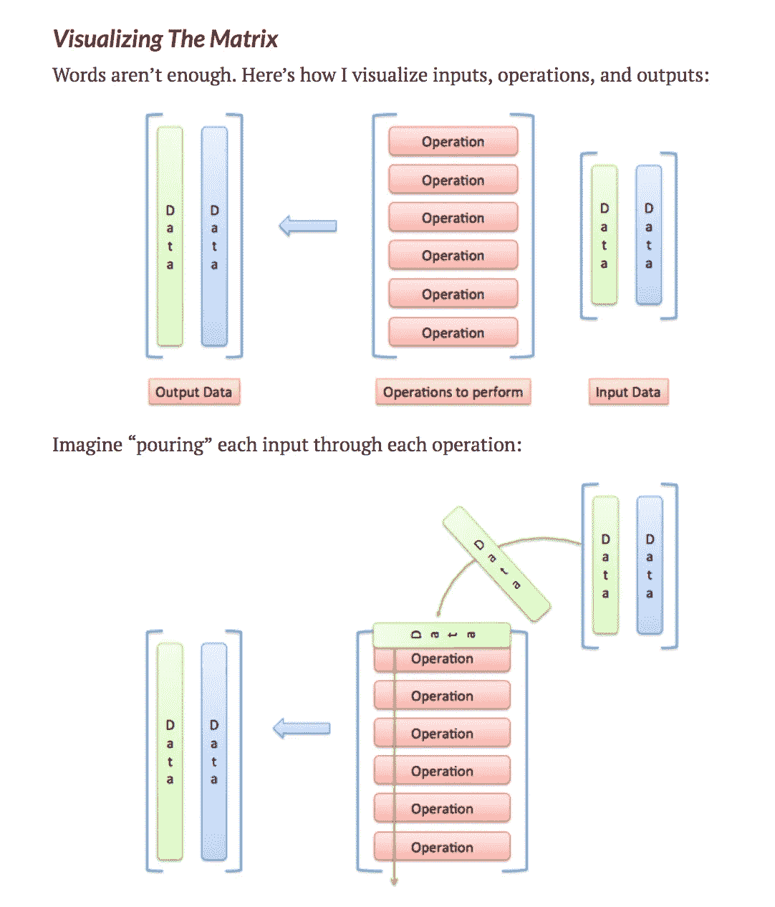

Image from this [website](https://betterexplained.com/articles/linear-algebra-guide/)

如果有人想重温线性代数的知识，请点击这里阅读一篇[的博文。这篇文章的作者在解释线性代数的基本机制方面做了大量工作。](https://betterexplained.com/articles/linear-algebra-guide/)

Paper from this [website](https://www.researchgate.net/publication/281455336_NumPy_SciPy_Recipes_for_Data_Science_EigenvaluesEigenvectors_of_Covariance_Matrices)

对于 Numpy / Scipy 用户，请注意我上面链接的 pdf。那篇论文的作者在为什么使用 Numpy 计算特征值可能不稳定的原因上做得很好。(我将在这篇文章的后面部分讨论这个问题，但是使用 Numpy 的结果可能不稳定。)

**奇异值分解理论综述**

Image from this [website](https://blog.statsbot.co/singular-value-decomposition-tutorial-52c695315254)

对于奇异值分解的理论解释，请查看这篇博文[的](https://blog.statsbot.co/singular-value-decomposition-tutorial-52c695315254)，它实际上是关于奇异值分解的最好的博文之一。在这些博客文章中，我想尝试解决一些彼得给我们例子。(但首先我们需要看一些给定的等式，彼得把 SVD 表示为 A = USV。t)

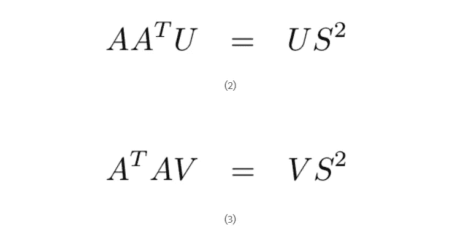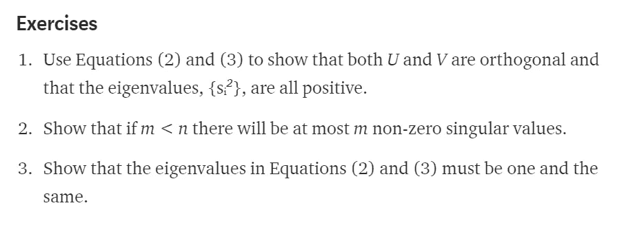

Image from this [website](https://blog.statsbot.co/singular-value-decomposition-tutorial-52c695315254)

虽然我不能 100 %确定这些答案是否正确，但下面是我解决给定问题的尝试。

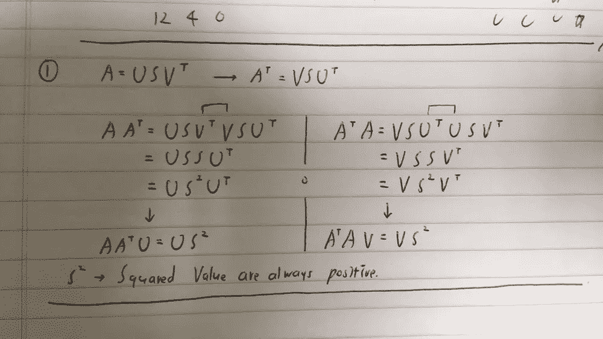

S 之所以是正数，是因为它是平方的。在继续之前，我想谈一谈一个领域。就是这个问题"*表明如果 m < n 最多会有 m 个非零奇异值。*”。在实践中，我发现情况并非总是如此，因为在 python 实现中，我能够获得比矩阵 a 中较小维数更多的非零特征值。(下面是一个例子。)

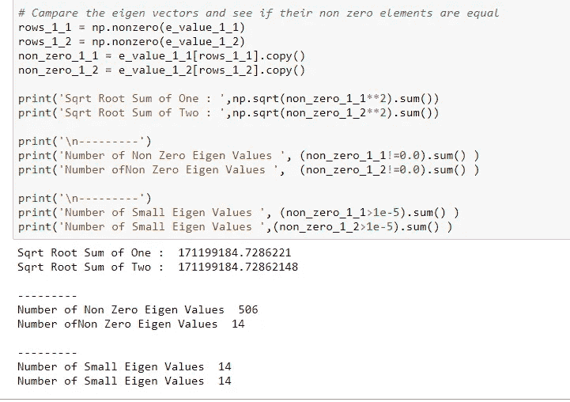

作为上面的例子，对于给定的数据，当我计算每个矩阵(dot(A.T，A)和 dot(A，A.T))的非零元素的数量时，我能够观察到在某些情况下非零特征值的数量并不完全匹配。然而，非常小的值确实匹配成相同的数字。我怀疑这是由于 numpy 如何计算特征值。目前，我将 SVD 理解为在一个坐标系中表示原始数据 A，其中 U 矩阵度量每一行如何与其他行相关，V 矩阵度量每一列如何与其他列相关，而 S 度量这种相关的强度。最后，我想提一个真正帮助我的额外材料。

Paper from this [website](https://datajobs.com/data-science-repo/SVD-Tutorial-[Kirk-Baker].pdf)

请注意，我将遵循上述论文以及 Peter 博客文章中介绍的方法。

**小矩阵奇异值分解**

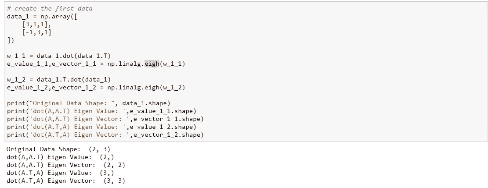

简单地说，我已经创建了一个(2，3)矩阵，如上所示，使用 numpy 线性代数库，我们可以很容易地计算矩阵 dot(A，A.T)和 dot(A.T，A)的特征向量。

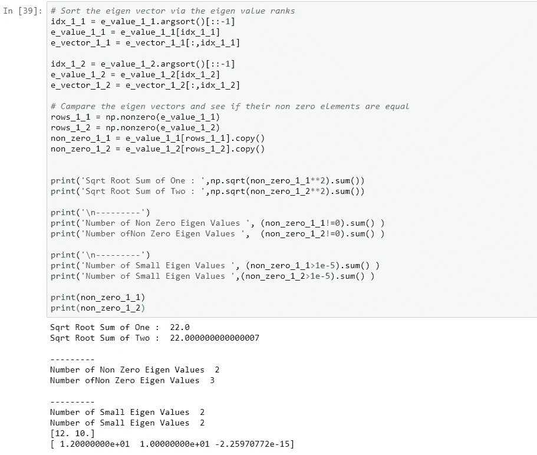

下一步是按降序排列特征值，并相应地改变特征向量矩阵。同样，我们可以注意到非零特征值的数量彼此不匹配。然而，-2e-15 是一个很小的数字，我们可以丢弃它。

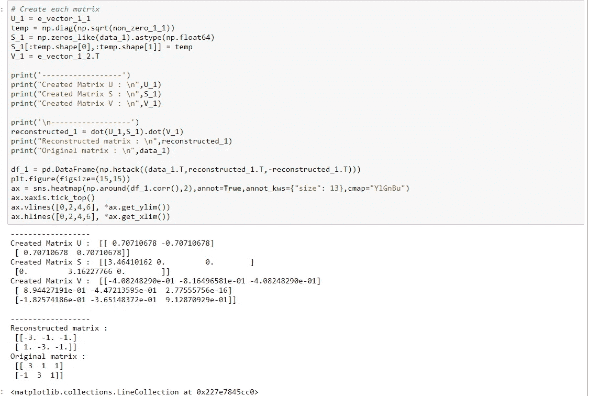

最后，使用创建的矩阵 U S 和 V，我们可以通过点积重建原始数据。我们可以将重构的矩阵缩放(减 1)以匹配原始数据，当我们创建一个相关矩阵时，我们可以看到如下所示。

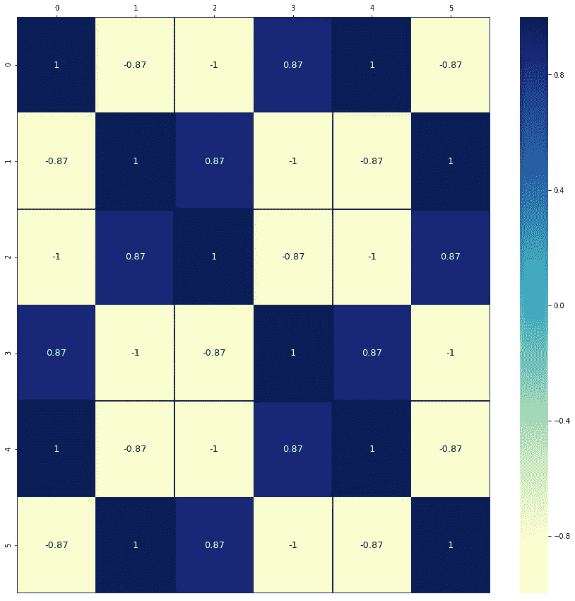

通过查看前两行，我们可以观察到我们已经成功地重构了原始矩阵。

此外，我们可以采用 Peter 博客文章中介绍的方法，得到相同的结果。

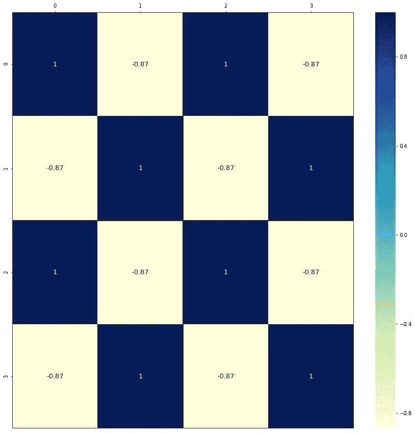

**大矩阵奇异值分解**

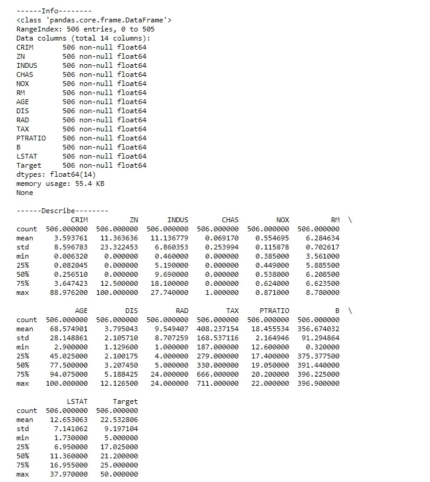

接下来让我们在一个更大的矩阵上应用 SVD，特别是来自 [load_boston](http://scikit-learn.org/stable/modules/generated/sklearn.datasets.load_boston.html) 的数据。乍一看，我们可以看到我们有 506 个例子，每个例子有 14 列。

上面是生成的相关矩阵以及目标与 LSTAT(具有最高相关值的属性)的散点图。)

按照同样的模式，我们可以计算给定矩阵 a 的特征向量和值。

一个不幸的事实是非零特征值的不匹配，这似乎是使用 numpy 时重复出现的问题。

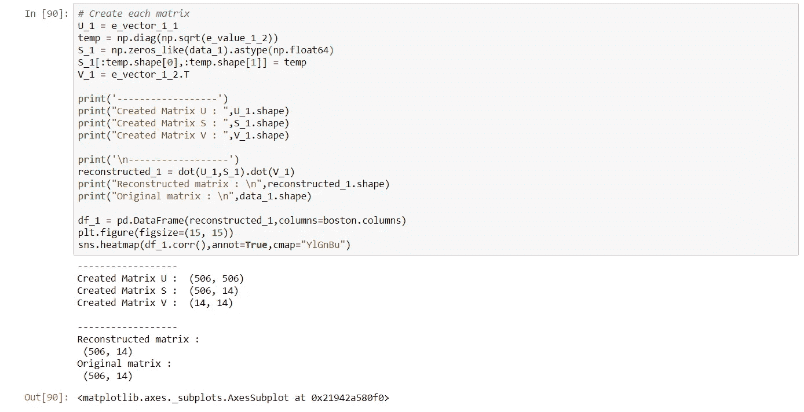

最后，我们可以计算重构矩阵，但是有一个问题。

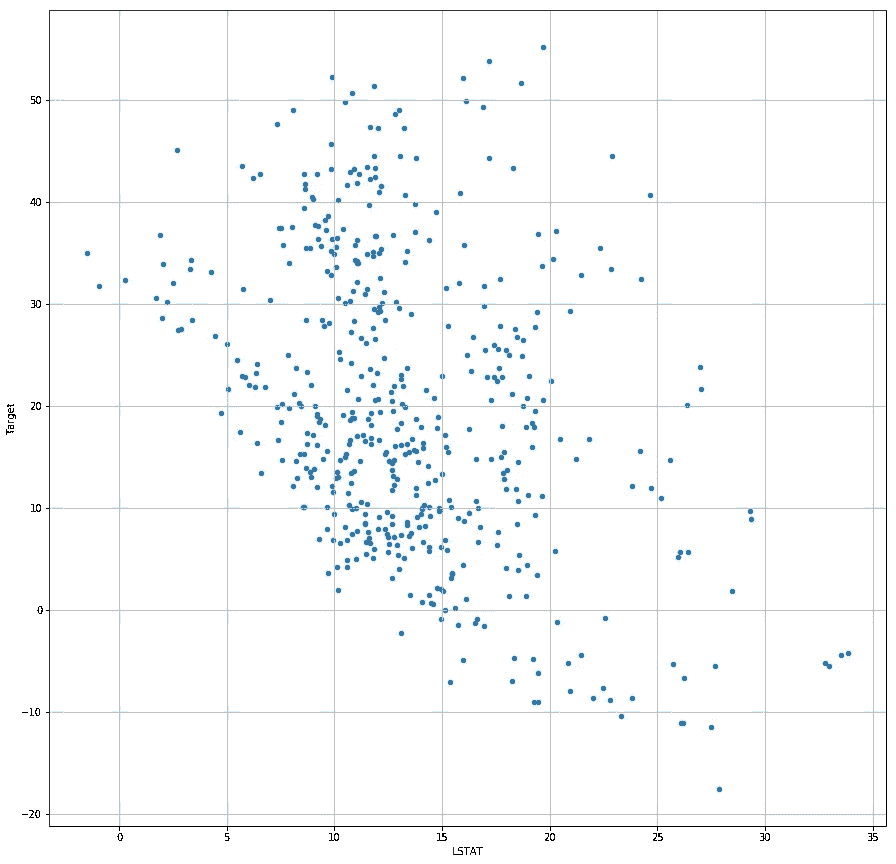

重建的矩阵丢失了很多信息，如上所述，相关矩阵与原始数据集以及散点图不匹配。

然而，当我们使用彼得在他的博客中介绍的方法时，我们可以得到如下结果。

与原始值完全相同的相关矩阵和散点图。所以到目前为止，我认为通过 Peter 的方法执行 SVD 是一个更好的主意。

**交互代码**

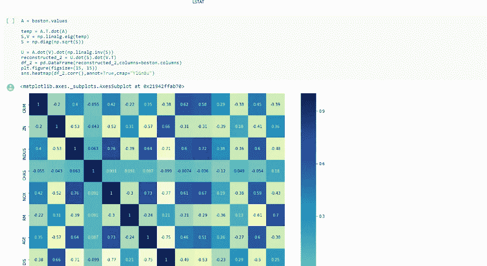

*对于 Google Colab，您需要一个 Google 帐户来查看代码，并且您不能在 Google Colab 中运行只读脚本，因此请在您的操场上创建一个副本。最后，我永远不会请求允许访问你在 Google Drive 上的文件，仅供参考。编码快乐！*

有关小型[矩阵的代码，请点击此处。](https://colab.research.google.com/drive/1iXxVkDRdwSXnkTDllKEupNmfNGIwjyLn)
关于大型[矩阵的代码请点击此处。](https://colab.research.google.com/drive/1wRhEBSC3CSTcS197M4IRsQbCob1tkArd)

**遗言**

线性代数确实是一个很好的研究课题。

**参考**

1.  线性代数直观指南-更好的解释。(2018).Betterexplained.com。检索于 2018 年 7 月 5 日，来自[https://betterexplained.com/articles/linear-algebra-guide/](https://betterexplained.com/articles/linear-algebra-guide/)
2.  奇异值分解。(2018).YouTube。检索于 2018 年 7 月 5 日，来自[https://www.youtube.com/watch?v=mBcLRGuAFUk](https://www.youtube.com/watch?v=mBcLRGuAFUk)
3.  模块:数据—浏览 v0.15.dev0 文档。(2018).Scikit-image.org。检索于 2018 年 7 月 15 日，来自[http://scikit-image.org/docs/dev/api/skimage.data.html](http://scikit-image.org/docs/dev/api/skimage.data.html)
4.  sk learn . datasets . load _ Boston-sci kit-learn 0 . 19 . 1 文档。(2018).Scikit-learn.org。检索于 2018 年 7 月 15 日，来自[http://sci kit-learn . org/stable/modules/generated/sk learn . datasets . load _ Boston . html # sk learn . datasets . load _ Boston](http://scikit-learn.org/stable/modules/generated/sklearn.datasets.load_boston.html#sklearn.datasets.load_boston)
5.  绘制交叉验证预测-sci kit-学习 0.19.1 文档。(2018).Scikit-learn.org。检索于 2018 年 7 月 15 日，来自[http://sci kit-learn . org/stable/auto _ examples/plot _ cv _ predict . html # sphx-glr-auto-examples-plot-cv-predict-py](http://scikit-learn.org/stable/auto_examples/plot_cv_predict.html#sphx-glr-auto-examples-plot-cv-predict-py)
6.  Faces 数据集分解-sci kit-学习 0.19.1 文档。(2018).Scikit-learn.org。检索于 2018 年 7 月 15 日，来自[http://sci kit-learn . org/stable/auto _ examples/decomposition/plot _ faces _ decomposition . html # sphx-glr-auto-examples-decomposition-plot-faces-decomposition-py](http://scikit-learn.org/stable/auto_examples/decomposition/plot_faces_decomposition.html#sphx-glr-auto-examples-decomposition-plot-faces-decomposition-py)
7.  框架，N. (2018)。规范化熊猫数据框的列。堆栈溢出。检索于 2018 年 7 月 15 日，来自[https://stack overflow . com/questions/26414913/normalize-columns-of-pandas-data-frame](https://stackoverflow.com/questions/26414913/normalize-columns-of-pandas-data-frame)
8.  seaborn . heat map-seaborn 0 . 8 . 1 文档。(2018).Seaborn.pydata.org。检索于 2018 年 7 月 15 日，来自 https://seaborn.pydata.org/generated/seaborn.heatmap.html
9.  matplotlib？，H. (2018)。如何改变用 matplotlib 绘制的图形的大小？。堆栈溢出。检索于 2018 年 7 月 15 日，来自[https://stack overflow . com/questions/332289/how-do-you-change-the-size-of-figures-drawn-with-matplotlib](https://stackoverflow.com/questions/332289/how-do-you-change-the-size-of-figures-drawn-with-matplotlib)
10.  Python，H. (2018)。如何在 Python 中指定绘制数据帧的 x 轴和 y 轴？堆栈溢出。检索于 2018 年 7 月 15 日，来自[https://stack overflow . com/questions/45738773/how-to-specify-x-y-axis-for-plotting-data frame-in-python](https://stackoverflow.com/questions/45738773/how-to-specify-x-and-y-axis-for-plotting-dataframe-in-python)
11.  法，一.(2018)。使用 pandas plot 方法设置图形大小时不一致。堆栈溢出。检索于 2018 年 7 月 15 日，来自[https://stack overflow . com/questions/42215252/consistency-when-setting-figure-size-using-pandas-plot-method](https://stackoverflow.com/questions/42215252/inconsistency-when-setting-figure-size-using-pandas-plot-method)
12.  熊猫。data frame . plot-pandas 0 . 23 . 1 文档。(2018).Pandas.pydata.org。检索于 2018 年 7 月 15 日，来自[http://pandas . pydata . org/pandas-docs/version/0.23/generated/pandas。DataFrame.plot.html](http://pandas.pydata.org/pandas-docs/version/0.23/generated/pandas.DataFrame.plot.html)
13.  NumPy . linalg . EIG—NumPy 1.14 版手册。(2018).Docs.scipy.org。检索于 2018 年 7 月 15 日，来自[https://docs . scipy . org/doc/numpy/reference/generated/numpy . Lina LG . EIG . html](https://docs.scipy.org/doc/numpy/reference/generated/numpy.linalg.eig.html)
14.  NumPy . sort—NumPy 1.14 版手册。(2018).Docs.scipy.org。检索于 2018 年 7 月 15 日，来自[https://docs . scipy . org/doc/numpy/reference/generated/numpy . sort . html](https://docs.scipy.org/doc/numpy/reference/generated/numpy.sort.html)
15.  新泽西州 python(2018 年)。Python，numpy 排序数组。堆栈溢出。检索于 2018 年 7 月 15 日，来自[https://stack overflow . com/questions/14875248/python-numpy-sort-array/14875366](https://stackoverflow.com/questions/14875248/python-numpy-sort-array/14875366)
16.  订单？，E. (2018)。高效地对 numpy 数组进行降序排序？。堆栈溢出。检索于 2018 年 7 月 15 日，来自[https://stack overflow . com/questions/26984414/efficiency-sorting-a-numpy-array-in-descending-order](https://stackoverflow.com/questions/26984414/efficiently-sorting-a-numpy-array-in-descending-order)
17.  VanderPlas，J. (2018)。排序数组| Python 数据科学手册。jakevdp . github . io . 2018 年 7 月 15 日检索，来自[https://jakevdp . github . io/python datascience handbook/02.08-sorting . html](https://jakevdp.github.io/PythonDataScienceHandbook/02.08-sorting.html)
18.  NumPy . diag—NumPy 1.14 版手册。(2018).Docs.scipy.org。检索于 2018 年 7 月 15 日，来自[https://docs . scipy . org/doc/numpy/reference/generated/numpy . diag . html](https://docs.scipy.org/doc/numpy/reference/generated/numpy.diag.html)
19.  复杂？，H. (2018)。如何让特征值和特征向量保持实数而不是复数？。堆栈溢出。检索于 2018 年 7 月 15 日，来自[https://stack overflow . com/questions/48695430/how-to-make-the-features-and-features vectors-stay-real-that-of-complex](https://stackoverflow.com/questions/48695430/how-to-make-the-eigenvalues-and-eigenvectors-stay-real-instead-of-complex)
20.  矩阵特征向量计算器。(2018).Symbolab.com。检索于 2018 年 7 月 15 日，来自[https://www . symbol ab . com/solver/matrix-特征向量-计算器/特征向量% 20% 5C begin % 7bp matrix % 7D 10% 260% 262% 5C % 5C % 200% 2610% 264% 5C % 5C % 202% 264% 262% 5C cend % 7bp matrix % 7D](https://www.symbolab.com/solver/matrix-eigenvectors-calculator/eigenvectors%20%5Cbegin%7Bpmatrix%7D10%260%262%5C%5C%200%2610%264%5C%5C%202%264%262%5Cend%7Bpmatrix%7D)
21.  [仅适用于 Numpy ]在 Numpy 中使用交互式代码体验特征值/向量的乐趣。(2018).走向数据科学。检索于 2018 年 7 月 15 日，来自[https://towards data science . com/only-numpy-having-fun-with-eigen-value-s-vectors-with-interactive-code-in-numpy-80d 3443 DFD 22](/only-numpy-having-fun-with-eigen-value-s-vectors-with-interactive-code-in-numpy-80d3443dfd22)
22.  在 Numpy 和 Tensorflow 中使用交互式代码通过梯度上升进行独立分量分析。(2018).走向数据科学。检索于 2018 年 7 月 15 日，来自[https://towards data science . com/independent-component-analysis-via-gradient-ascent-in-numpy-and-tensor flow-with-interactive-code-98 B9 a73 e5d 19](/independent-component-analysis-via-gradient-ascent-in-numpy-and-tensorflow-with-interactive-code-98b9a73e5d19)
23.  谷歌合作实验室。(2018).Colab.research.google.com。检索于 2018 年 7 月 15 日，来自[https://colab . research . Google . com/drive/1 vdozsx 3 ckcgmywmutmiutr 4 phfjkaz 2 # scroll to = w5 nfpzyb 6 jfs](https://colab.research.google.com/drive/1vDozsX3CkCGMywMutMiUTR4PhfjKAZz2#scrollTo=W5nfPzyB6jfS)
24.  Anon，(2018)。[在线]可在:[https://www . research gate . net/publication/281455336 _ NumPy _ SciPy _ Recipes _ for _ Data _ Science _ eigen values eigen vectors _ of _ 协方差 _ matrics](https://www.researchgate.net/publication/281455336_NumPy_SciPy_Recipes_for_Data_Science_EigenvaluesEigenvectors_of_Covariance_Matrices)查阅【2018 年 7 月 15 日】。
25.  奇异值分解教程。(2018).Web.mit.edu。检索于 2018 年 7 月 15 日，来自[http://web . MIT . edu/be . 400/www/SVD/Singular _ Value _ decomposition . htm](http://web.mit.edu/be.400/www/SVD/Singular_Value_Decomposition.htm)
26.  sk learn . datasets . load _ Boston-sci kit-learn 0 . 19 . 1 文档。(2018).Scikit-learn.org。检索于 2018 年 7 月 15 日，来自[http://sci kit-learn . org/stable/modules/generated/sk learn . datasets . load _ Boston . html](http://scikit-learn.org/stable/modules/generated/sklearn.datasets.load_boston.html)
27.  (2018).Datajobs.com。检索于 2018 年 7 月 15 日，来自[https://data jobs . com/data-science-repo/SVD-Tutorial-[Kirk-Baker]。pdf](https://datajobs.com/data-science-repo/SVD-Tutorial-[Kirk-Baker].pdf)