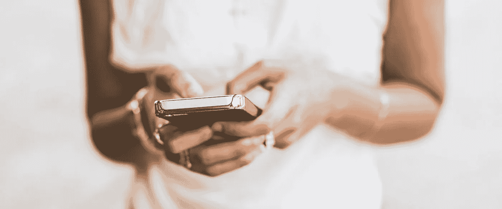
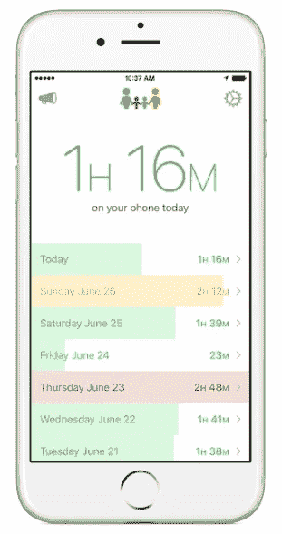
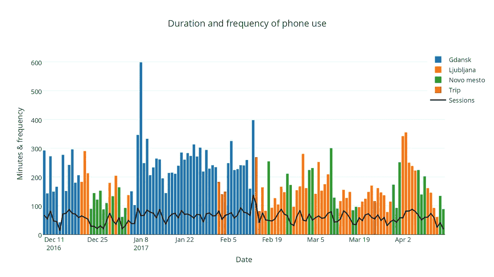
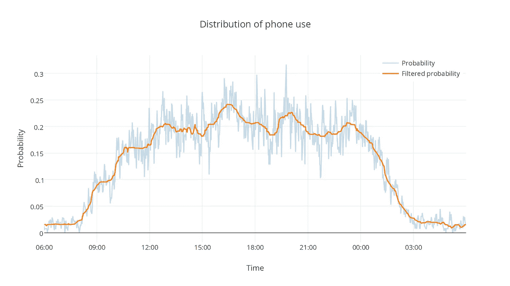
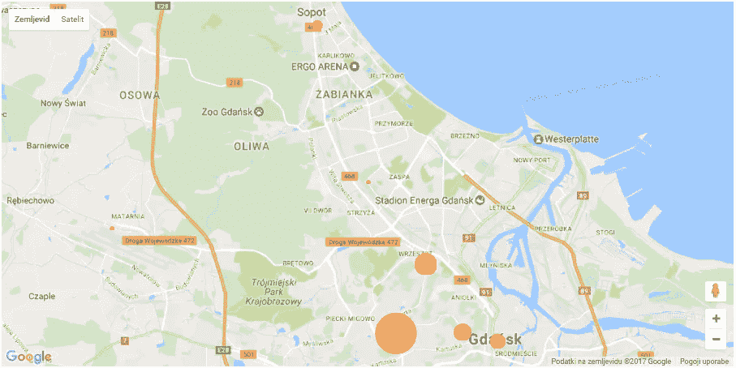

# 我的手机使用数字和图形

> 原文：<https://towardsdatascience.com/my-phone-use-in-numbers-and-graphs-886d040519f8?source=collection_archive---------1----------------------->

## Moment 应用数据的洞察力和可视化

[Image credit.](http://abcnews.go.com/US/apps-secretly-spy-cellphone/story?id=34950812)

在过去的几个月里，我一直对注意力经济感兴趣，现代技术如何劫持我们的思想来获取更多的利润。我还就这个话题写了一篇十页的文章，作为我的教员科目成绩的一部分。在研究过程中，我遇到了一个名为[花好时间](http://www.timewellspent.io/)的运动，它希望“改变注意力竞赛，使其符合我们的最佳利益”。他们的网站还提供帮助你节省时间而不是浪费时间的应用程序。其中之一就是[时刻](https://inthemoment.io/)。

Moment app.

# Moment 应用

Moment 是一个自动跟踪并帮助您管理手机使用时间的应用程序。Moment 的免费版本显示您每天使用手机的时长。付费版帮你打，限制使用。还有一款[家庭版](https://inthemoment.io/family)。

它可以选择导出 GPS 位置(纬度和经度)、日期、时间和会话持续时间。我使用这些数据进行了以下段落中的分析。

# 概观

我在 12 月初开始使用 Moment，直到最近才忘记它。当然，这个应用程序是独立运行的。下图显示了我每天和每个位置的手机使用情况。我计算了纬度和经度的加权平均值。让我提醒你，你可以点击图片或图表下方的超链接来获得互动图。

[See the interactive plot.](https://plot.ly/~mihagazvoda/17)

最近的一项研究显示，年轻人使用手机的时间略多于 5 小时，平均每天查看 85 次。让我们把这个和我的结果比较一下。我平均用了 3 小时 10 分钟，每天检查 60 次。我仍然觉得我在这上面浪费时间…

# 平均日

这就是我平常的一天，用我每分钟打电话的概率表示的样子。

[See the interactive plot.](https://plot.ly/~mihagazvoda/21)

每一分钟的概率都很嘈杂，所以我应用了中值滤波器来减少噪音。不幸的是，由于我‘自由’的生活方式(记住，我是在伊拉斯谟交易所)，你无法从剧情中学到很多东西。

# 平均会话

现在是时候更仔细地看看这些会议了——它们的持续时间——并将它们与之前提到的研究结果进行比较。

[See the interactive plot.](https://plot.ly/~mihagazvoda/19)

**我的** [**中位数**](https://en.wikipedia.org/wiki/Median) **会话时长 95 秒。**他们的，不到半分钟。我认为这是由于两个原因:

*   我一般会关掉移动数据或者 wifi。因此，每次我想在网上查看一些东西时，我都必须再次打开它，这需要一些时间。
*   我通常不使用推送通知。当我想查看社交媒体通知时，这需要额外的时间——尤其是当我沉迷于永不停息的新闻提要时。

# 最喜欢的地点

你可以从手机数据中获得比电话使用更多东西。例如，最喜欢的位置(用于使用我的手机)。我将这些限制在格但斯克，并决定将它们聚集在一起，组成前七名。标记区域与花在手机上的时间成正比。

My top 7 places (for using phone) in Gdansk.

最大的标记(93 小时)代表交换期间我的家。上面的点，我的大学。右边的标记，美丽的古镇。索波特，一个聚会的地方…

# 编码和编写

我想让这篇文章尽可能的简短有趣——不要讲太多细节(这篇文章是面向大众的)。让数字和图表自己说话。最初的计划还包括 t 测试，以比较我在清醒时使用和不使用特定社交媒体应用程序和分发的情况。最后，由于上面提到的原因，我决定不考虑他们。

我使用 [Jupyter Notebook](http://jupyter.org/) 用 Python 编程语言实现了代码。对于数据可视化(不包括地图)，我用了 [plotly](https://plot.ly/) 。