# 我用 25 个问题来测试一个数据科学家关于交互式代码的图像处理-第 1 部分

> 原文：<https://towardsdatascience.com/my-take-on-25-questions-to-test-a-data-scientist-on-image-processing-with-interactive-code-part-1-a6196f535008?source=collection_archive---------3----------------------->

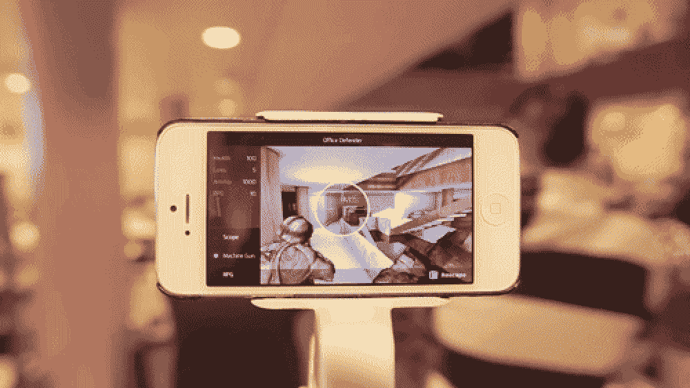

GIF from this [website](https://giphy.com/gifs/art-tech-computer-vision-128MlEHz7JeCje/download)

所以我找到了这个了不起的博主 [Faizan Shaikh](https://www.analyticsvidhya.com/blog/2017/10/image-skilltest/) ，他的博客上有一些令人惊奇的东西！所以请你查一查他，也就是他是“ [*25 题测试一个数据科学家对图像处理的*](https://www.analyticsvidhya.com/blog/2017/10/image-skilltest/) ”的创作者。所以我会试着挑战自己去解决它们。请注意，我的解决方案不会优化。

此外，对于每个问题，我会截屏正确的答案(原作者张贴的答案)。然而， ***我总是乐于学习和成长*** ，所以如果你知道一个更好的解决方案，请在下面评论。

还有，这是我用来做演示的两张图片。
1。 [*脑 MRI 来自 pixabay*](https://pixabay.com/en/mri-magnetic-x-ray-skull-head-782457/) *2。* [*自然图像来自 pixabay*](https://pixabay.com/en/sunset-lighthouse-dawn-dusk-sun-3120484/)

**1。将以下图像格式与其正确的通道数相匹配**

我的答案是 C，因为 RGB 图像有红色、绿色和蓝色，而灰度图像只有二进制值。我们甚至可以用 python 来证实这一点。

**红线** →通道大小为 3 的彩色图像
**蓝线** →通道大小为 1 的灰色图像(因为是二进制值，所以这里没有显示。)

**2。图像翻译**

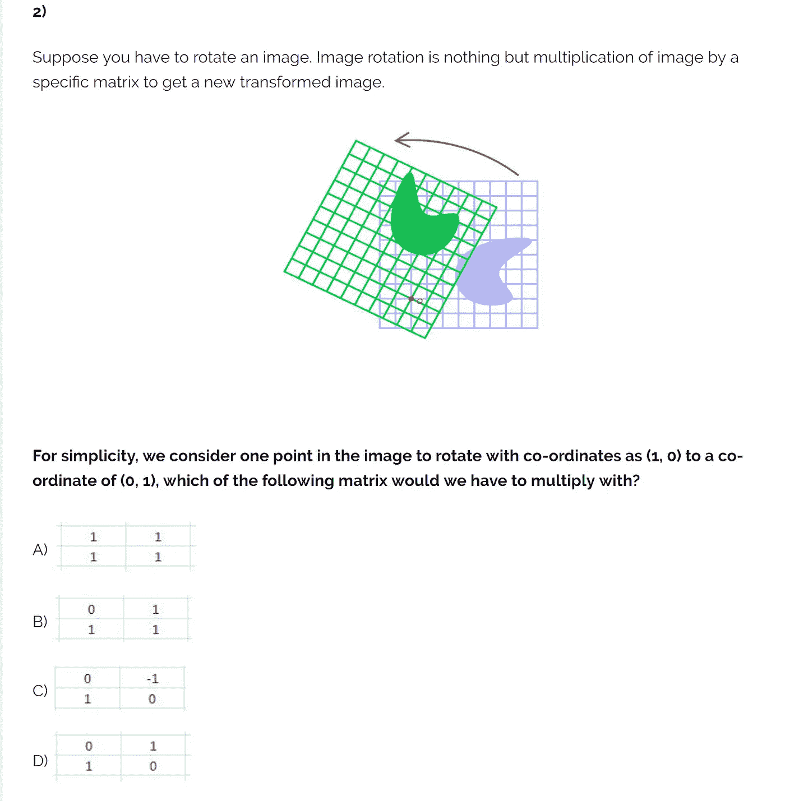

我的答案是 B，C 和 D，我们可以看到两个给定的坐标是(1，0)和(0，1)，所以要回答的基本问题是我们需要什么变换矩阵？如果我们真的做矩阵乘法，我们可以看到，除了 A，我们可以把原来的坐标转换到新的坐标。

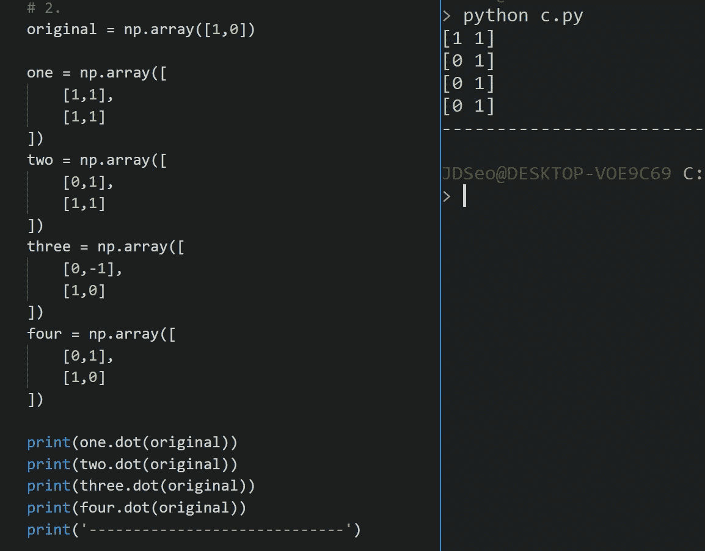

**3。[对或错]要模糊图像，您可以使用线性滤镜**

我对此的回答是正确的，因为我们可以使用均值滤波器(或平均滤波器)来平滑图像，同时保持线性。首先，让我们看看什么是线性滤波器……

Image from this [website](https://edoras.sdsu.edu/doc/matlab/toolbox/images/linfilt3.html)

好了，现在我们知道了线性滤波器的定义，让我们看看线性滤波器和非线性滤波器的区别。

Image from this [website](https://dsp.stackexchange.com/questions/14241/difference-between-linear-and-non-linear-filter)

好，现在我们知道均值滤波器可以用于求平均值。让我们实际看看它的作用。

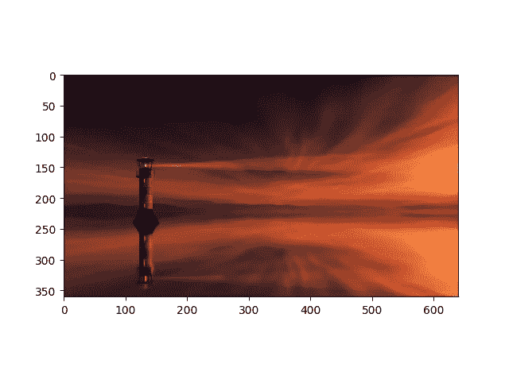

**左图像** →原始图像
**右图像** →均值滤波图像

我们可以清楚地看到，图像更加平滑。我认为作者弄错了。(如果我说错了，请告诉我。)

**4。处理计算机视觉问题时，以下哪一项是一项挑战？**

这肯定是 D，因为当涉及到计算机视觉时，上述所有问题都是要处理的巨大痛苦。以下是来自[斯坦福远景集团网站](http://cs231n.github.io/classification/)的挑战列表。

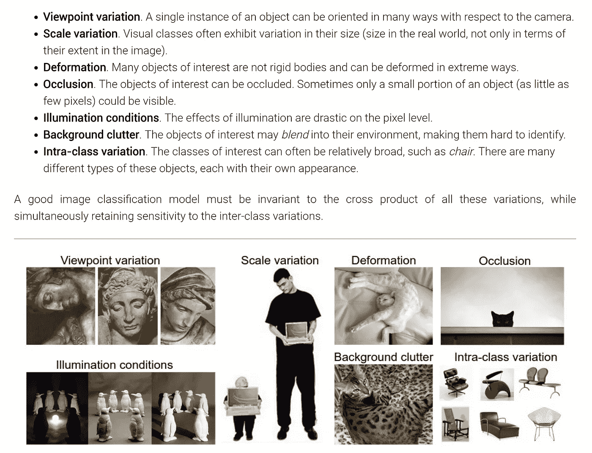

Image from this [website](http://cs231n.github.io/classification/)

**5。k 均值聚类**

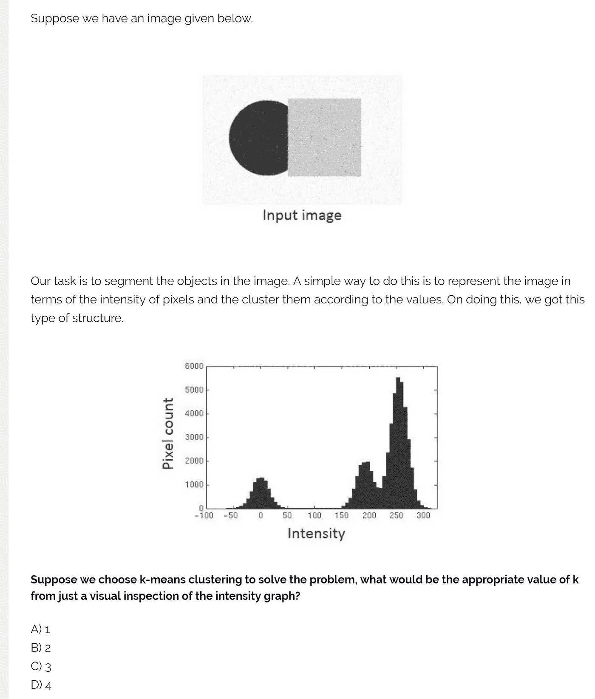

对于这个问题，我费了好大劲才弄明白。但是从逻辑上来说，我们需要三样东西。圆形、正方形和背景。我们可以看到，圆形具有最黑的像素强度(因此这将是一个聚类)，正方形具有灰色的像素强度(另一个聚类)，最后背景大部分是白色的(最终聚类)。所以我认为我们需要 3 个集群。

**6。图像不连续**

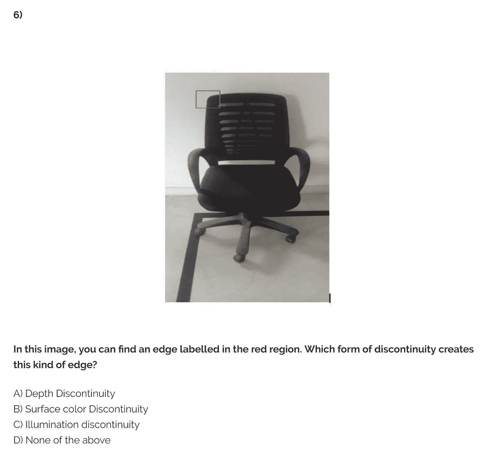

为了这个问题，我不得不回顾所有的不连续性，并找到了斯坦福大学和研究之门的一个很好的演示。

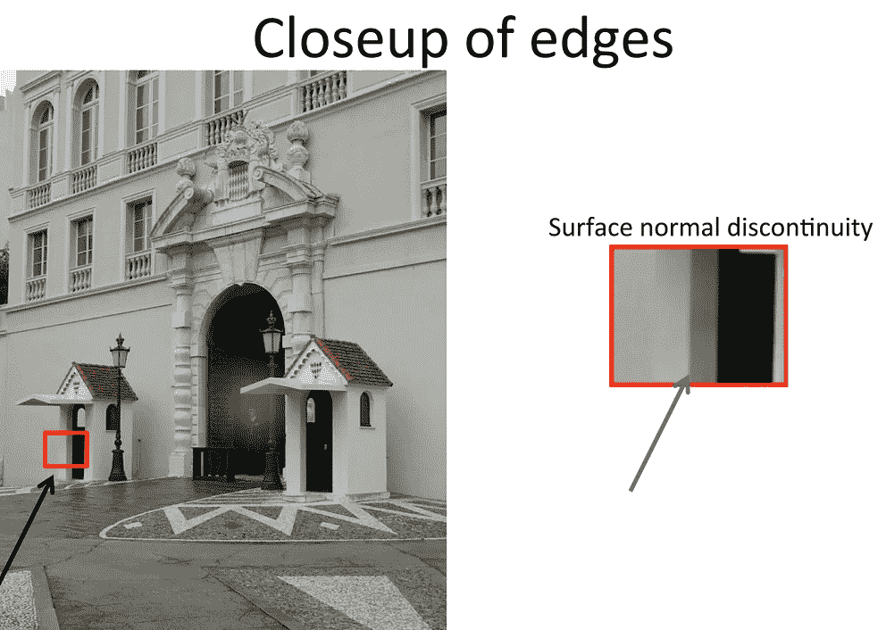

因此，从上面每个不连续的例子来看，我们需要得出结论，边缘是由于深度而被检测到的。椅子在墙的前面。

**7。去除噪声**

我们已经从上面的例子中看到我们如何使用均值滤波器平滑图像，这意味着如果图像中有噪声，我们需要平滑图像以减少噪声。让我们使用[我的旧代码](http://"Jaedukseo/Python_Basic_Image_Processing". 2018\. Github. Accessed April 11 2018\. https://github.com/JaeDukSeo/Python_Basic_Image_Processing/blob/master/4_Add_noise/four.py.)给图像添加一些噪声。

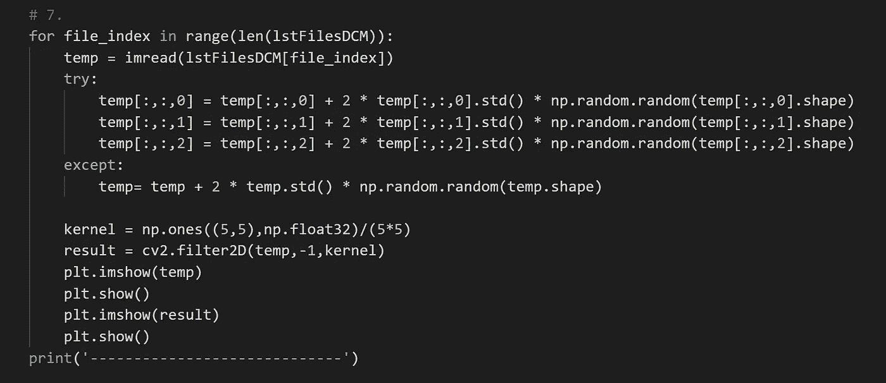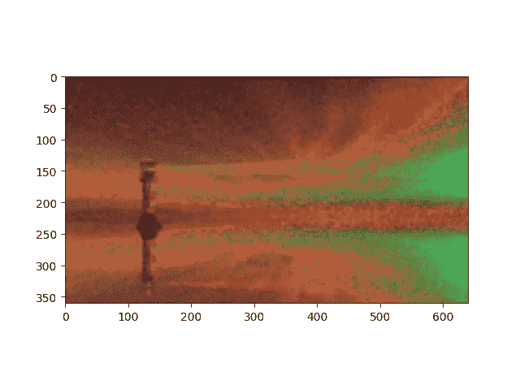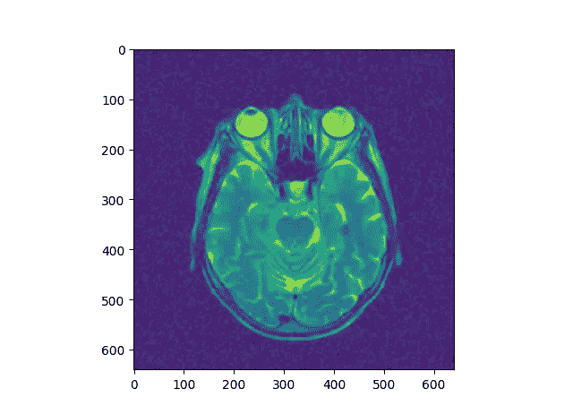

**左图像** →原始图像
**右图像** →平滑后的结果图像

因此答案是 c。

**8。我们需要多少尺寸的灰度级**

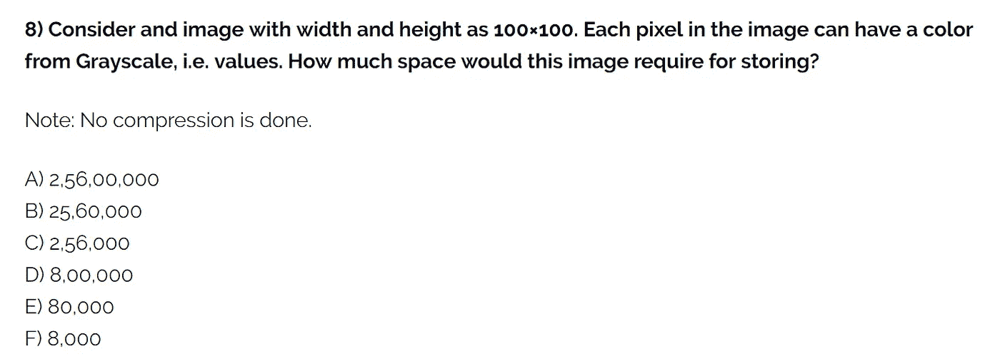

为此，我们可以肯定地知道我们需要做的第一个操作是 100*100，现在我们需要选择我们需要乘以什么值。为此，我们可以看看 scipy 中的 [imread 函数。](https://docs.scipy.org/doc/scipy-0.18.1/reference/generated/scipy.misc.imread.html)

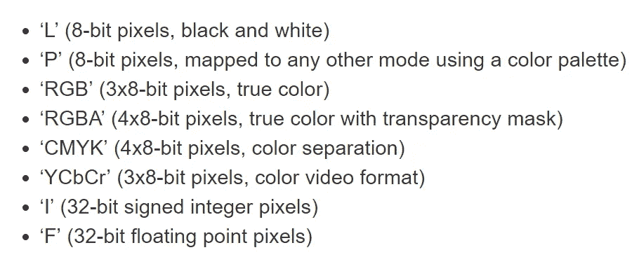

如上所示，黑白图像需要 8 位，但是我们也可以将它读入 32 位，因此答案可以是 E 或 3，200，00。

9。图像的量化

我不知道什么是量化过程，所以我必须去查一下。

*图像处理中涉及的量化是一种有损压缩技术，通过将一系列值压缩为单个量子值*— [维基](https://en.wikipedia.org/wiki/Quantization_(image_processing))

仅从这一陈述，我们可以得出结论，量化一幅图像涉及压缩，这意味着减少存储空间量，因此是正确的。

**10。具有重复值的图像**

这当然是因为，我们可以将 x 和 y 坐标值存储在一个字典中(键值为像素强度),这将大大减少所需的大小。

**交互代码**

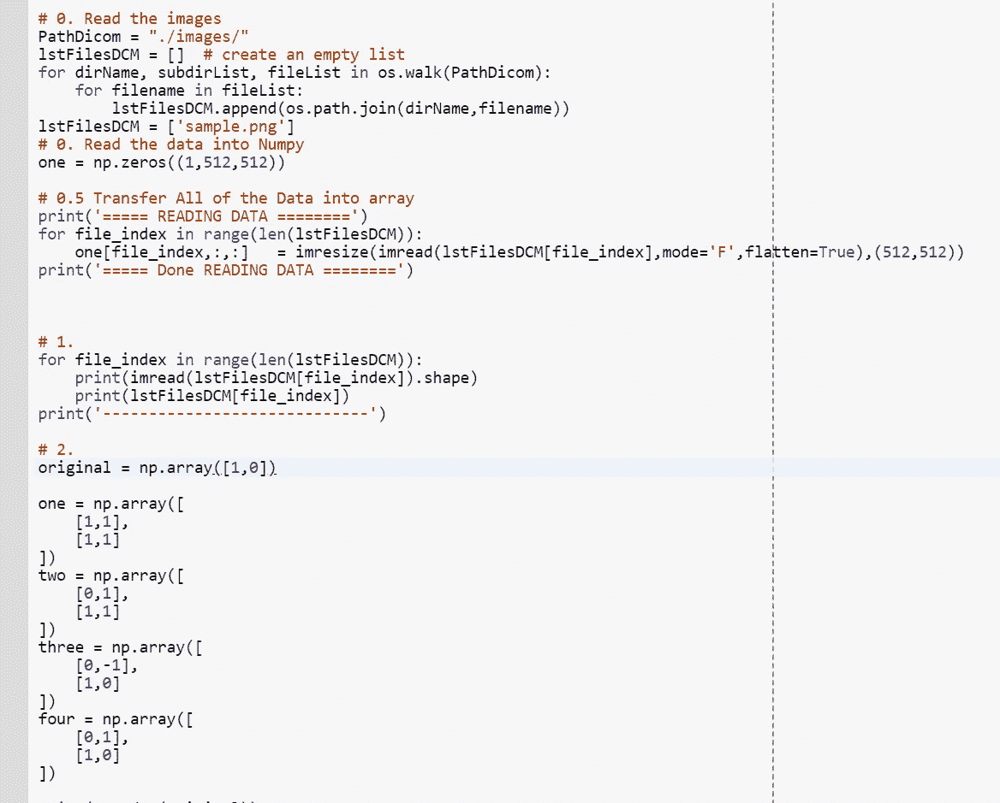

*对于 Google Colab，您需要一个 Google 帐户来查看代码，并且您不能在 Google Colab 中运行只读脚本，因此请在您的操场上创建一个副本。最后，我永远不会请求允许访问你在 Google Drive 上的文件，仅供参考。编码快乐！*

请注意，我不想滥用任何数据政策。所以对于谷歌 Colab，我找到了下面的图片，它被标记为重复使用。要访问在线代码，请点击此处。

Image from this [website](https://upload.wikimedia.org/wikipedia/commons/thumb/c/cb/Felix_Titling_sample.png/1280px-Felix_Titling_sample.png)

**遗言**

还有 15 个问题，但这些都是很好的问题。

如果发现任何错误，请发电子邮件到 jae.duk.seo@gmail.com 给我，如果你想看我所有写作的列表，请在这里查看我的网站。

同时，在我的推特[这里](https://twitter.com/JaeDukSeo)关注我，访问[我的网站](https://jaedukseo.me/)，或者我的 [Youtube 频道](https://www.youtube.com/c/JaeDukSeo)了解更多内容。如果你感兴趣的话，我还做了解耦神经网络[的比较。](https://becominghuman.ai/only-numpy-implementing-and-comparing-combination-of-google-brains-decoupled-neural-interfaces-6712e758c1af)

**参考**

1.  处理，2。，处理，2。，&谢赫，F. (2017)。测试数据科学家图像处理能力的 25 个问题。分析 Vidhya。检索于 2018 年 4 月 11 日，来自[https://www . analyticsvidhya . com/blog/2017/10/image-skilltest/](https://www.analyticsvidhya.com/blog/2017/10/image-skilltest/)
2.  线性滤波和滤波器设计(图像处理工具箱)。(2018).Edoras.sdsu.edu。检索于 2018 年 4 月 11 日，来自[https://edoras . sdsu . edu/doc/MATLAB/toolbox/images/Lin filt 3 . html](https://edoras.sdsu.edu/doc/matlab/toolbox/images/linfilt3.html)
3.  过滤器，D. (2018)。线性和非线性滤波器的区别。Dsp.stackexchange.com。检索于 2018 年 4 月 11 日，来自[https://DSP . stack exchange . com/questions/14241/difference-between-linear-and-non-linear-filter](https://dsp.stackexchange.com/questions/14241/difference-between-linear-and-non-linear-filter)
4.  OpenCV:平滑图像。(2018).Docs.opencv.org。检索于 2018 年 4 月 11 日，来自[https://docs . opencv . org/3 . 1 . 0/D4/d13/tutorial _ py _ filtering . html](https://docs.opencv.org/3.1.0/d4/d13/tutorial_py_filtering.html)
5.  用于视觉识别的 CS231n 卷积神经网络。(2018).cs 231n . github . io . 2018 年 4 月 11 日检索，来自[http://cs231n.github.io/classification/](http://cs231n.github.io/classification/)
6.  (2018).Vision.stanford.edu。检索于 2018 年 4 月 11 日，来自[http://vision . Stanford . edu/teaching/cs 131 _ fall 1516/lections/lectures 5 _ edges _ cs 131 . pdf](http://vision.stanford.edu/teaching/cs131_fall1516/lectures/lecture5_edges_cs131.pdf)
7.  [3]2018.【在线】。可用:[https://www . researchgate . net/figure/Factors-is-likely-to-corresponse-the-discontinuity-in-image-brightness-2 _ fig 5 _ 310301668。](https://www.researchgate.net/figure/Factors-that-are-likely-to-correspond-to-the-discontinuities-in-image-brightness-2_fig5_310301668.)【访问时间:2018 年 4 月 11 日】。
8.  “Jaedukseo/Python _ Basic _ Image _ Processing”。2018.Github。2018 年 4 月 11 日访问。[https://github . com/JaeDukSeo/Python _ Basic _ Image _ Processing/blob/master/4 _ Add _ noise/four . py](https://github.com/JaeDukSeo/Python_Basic_Image_Processing/blob/master/4_Add_noise/four.py)。
9.  “西皮。杂项 Imread — Scipy V0.18.1 参考指南”。2018.Docs.Scipy.Org。2018 年 4 月 11 日访问。[https://docs . scipy . org/doc/scipy-0 . 18 . 1/reference/generated/scipy . misc . im read . html](https://docs.scipy.org/doc/scipy-0.18.1/reference/generated/scipy.misc.imread.html)。
10.  Pixabay 上的免费图像——核磁共振成像，磁性，x 光，头骨，头部。(2018).Pixabay.com。检索于 2018 年 4 月 9 日，来自[https://pix abay . com/en/MRI-magnetic-x-ray-skull-head-782457/](https://pixabay.com/en/mri-magnetic-x-ray-skull-head-782457/)
11.  Pixabay 上的免费图像——日落、灯塔、黎明、黄昏、太阳。(2018).Pixabay.com。检索于 2018 年 4 月 9 日，来自[https://pix abay . com/en/sunset-light house-dawn-dusk-sun-3120484/](https://pixabay.com/en/sunset-lighthouse-dawn-dusk-sun-3120484/)
12.  Pixabay 上的免费图像——核磁共振成像，磁性，x 光，头骨，头部。(2018).Pixabay.com。检索于 2018 年 4 月 9 日，来自[https://pix abay . com/en/MRI-magnetic-x-ray-skull-head-782459/](https://pixabay.com/en/mri-magnetic-x-ray-skull-head-782459/)