# 我用 25 个问题来测试一个数据科学家对交互式代码的图像处理-第 2 部分

> 原文：<https://towardsdatascience.com/my-take-on-25-questions-to-test-a-data-scientist-on-image-processing-with-interactive-code-part-2-77eacfd96cf9?source=collection_archive---------4----------------------->

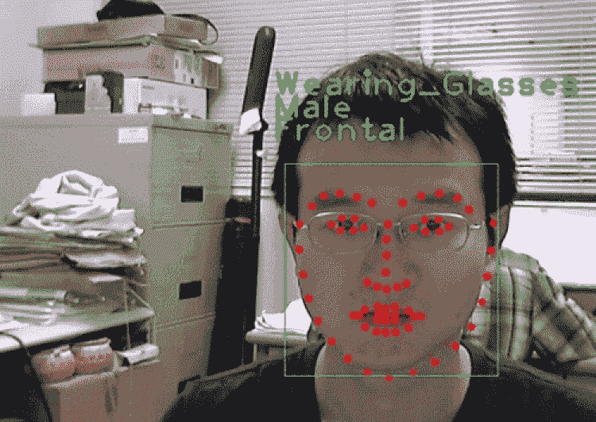

GIF from this [website](https://giphy.com/gifs/tech-facial-recognition-computer-vision-BD3GmP2qpDCX6/download)

所以我找到了这个了不起的博主 [Faizan Shaikh](https://www.analyticsvidhya.com/blog/2017/10/image-skilltest/) ，他的博客上有一些令人惊奇的东西！所以请你查一查他，也就是他是“ [*25 题测试一个数据科学家对图像处理的*](https://www.analyticsvidhya.com/blog/2017/10/image-skilltest/) ”的创作者。所以我会试着挑战自己去解决它们，这是第二部分！请注意，我的解决方案不会优化。

此外，对于每个问题，我会截屏正确的答案(原作者张贴的答案)。然而， ***我总是乐于学习和成长*** ，所以如果你知道一个更好的解决方案，请在下面评论。

还有，这是我用来做演示的两张图片。
1。 [*脑 MRI 来自 pixabay*](https://pixabay.com/en/mri-magnetic-x-ray-skull-head-782457/) *2。* [*自然图像来自 pixabay*](https://pixabay.com/en/sunset-lighthouse-dawn-dusk-sun-3120484/)

如果你想看第一部分，[请点击这里](/my-take-on-25-questions-to-test-a-data-scientist-on-image-processing-with-interactive-code-part-1-a6196f535008)。

**11)【是非】JPEG 是一种有损图像压缩技术**

对于这个问题，我不仅好奇 JPEG 是什么，也好奇 PNG 图像格式是什么，所以我决定去查一下。

Image from this [website](https://en.wikipedia.org/wiki/JPEG)

Image from this [website](https://en.wikipedia.org/wiki/Portable_Network_Graphics)

所以从上面的图片，我们可以得出两个结论。JPEG 是有损压缩，PNG 是无损压缩。因此答案是正确的。

**12)给定一幅只有 2 个像素，每个像素有 3 个可能值的图像，可以形成多少个可能的图像直方图？**

我真的不知道这个问题，但从逻辑上来说。我们有 2 个像素，每个像素都有 RGB 通道。因此，我们已经知道有 3 * 3 = 9 种可能配置组合。但是顺序对于直方图来说并不重要，重要的是像素强度的频率。因此 3 + 3 = 6。(作者和我不同意这一条，如果我错了请告诉我。)

**13) 1D 平均卷积**

假设上面的 1D 图像没有填充，我们可以简单地计算一下。(8+5+2)/3 = 15/3 = 5.因此倒数第二个像素值将保持不变。

**14) FMRI 问题(脑部核磁共振)**

首先，我需要知道什么是 FMRI，所以我做了一个简单的谷歌搜索。

Image from this [website](https://en.wikipedia.org/wiki/Functional_magnetic_resonance_imaging)

FMRI 似乎是一种测量大脑活动的简单技术。现在让我们看看这个 FMRI 的输出。

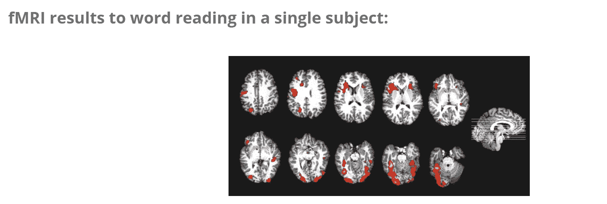

Image from this [website](https://med.nyu.edu/thesenlab/research-0/research-functional-magnetic-resonance-imaging-fmri/)

我试图找到对 FMRI 输出的解释，但是我不能找到确切的答案。但我找到了一个实验对象的功能磁共振成像结果。它似乎产生了 2D 输出。(然而我的答案是错的。)

**15)以下哪种方法被用作边缘检测的模型拟合方法？**

为了这个问题，我必须复习很多东西。从什么是模型拟合算法开始。

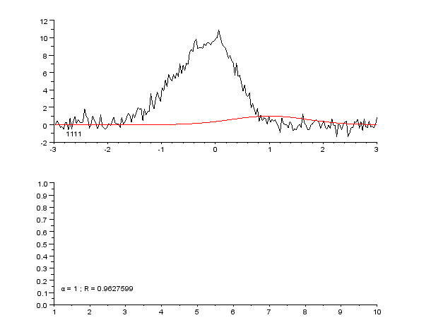

GIF from this [website](https://en.wikipedia.org/wiki/Curve_fitting)

从简单的谷歌搜索我们已经可以知道模型拟合算法做什么，在大多数情况下，它看起来像函数逼近。现在让我们回到这个问题，SIFT 是一个特征检测器，Gaussain 检测器可以理解为斑点检测。因此，答案必须是 RANSAC。

**16)中值滤波器**

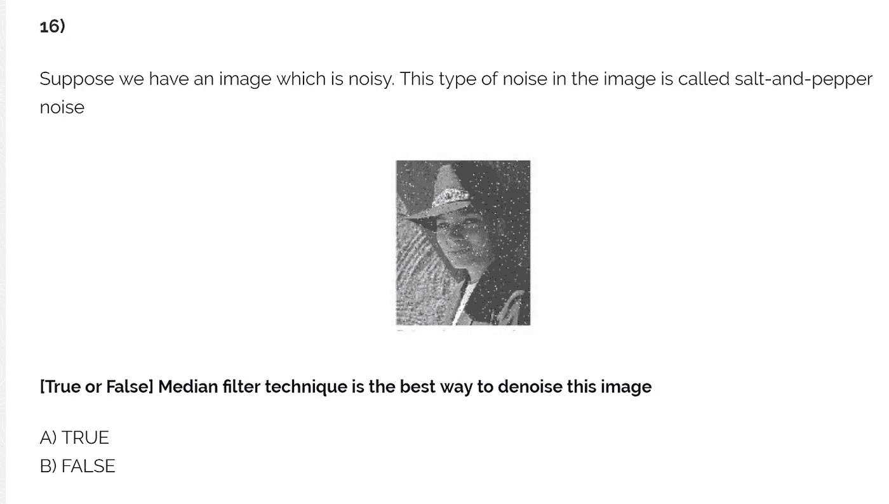

我不会说中值滤波是最好的方法，因为这要视情况而定，但是正如我们在下面看到的，它确实可以做到。让我们使用来自[栈溢出帖子](https://stackoverflow.com/questions/22937589/how-to-add-noise-gaussian-salt-and-pepper-etc-to-image-in-python-with-opencv?rq=)的这段代码来添加一些 s [alt 和 pepper 噪声](https://en.wikipedia.org/wiki/Salt-and-pepper_noise)并使用中值滤波器去噪。

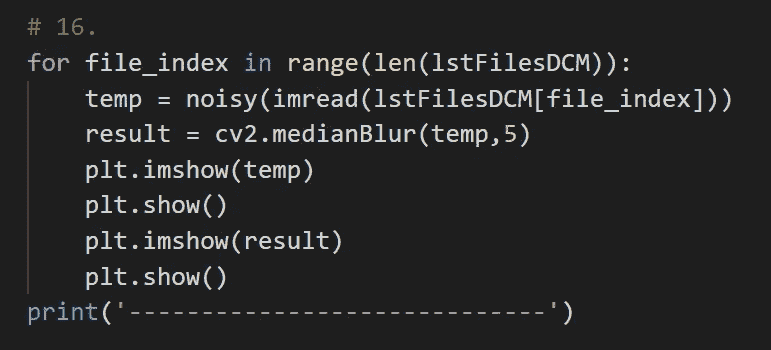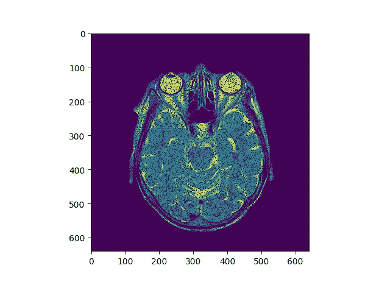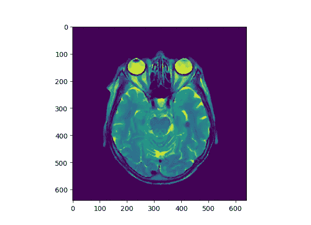

**左图** →有椒盐噪声的图像
**右图** →中值滤波后的图像

我们可以清楚地看到中值滤波器的出色表现。

**17)卷积运算**

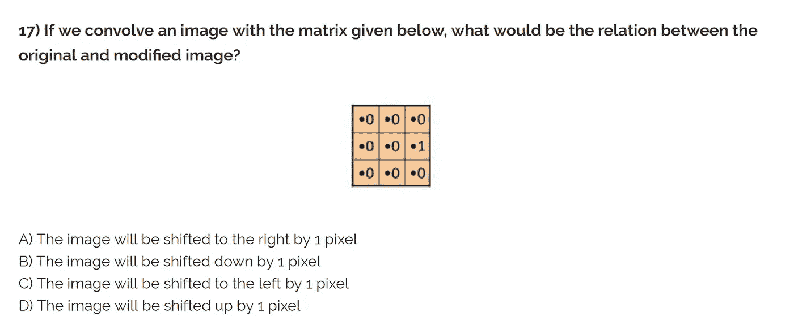

对于这个问题我们需要回顾一下，卷积运算之前内核发生了什么。

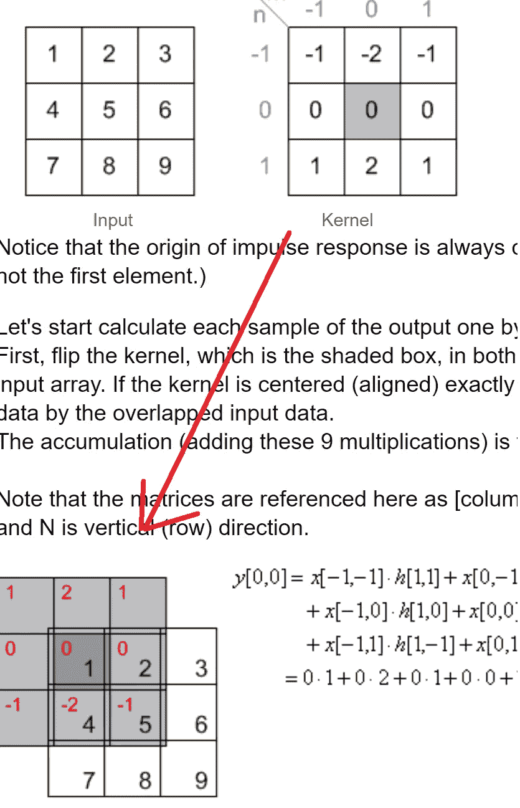

Image from this [website](http://www.songho.ca/dsp/convolution/convolution2d_example.html)

从这个网站上，我们可以清楚地看到一个卷积运算会发生什么。在应用卷积运算之前，我们将内核翻转 180 度。因此，我们可以得出结论，图像将向右移动，而不是向左。

**18)图像锐化**

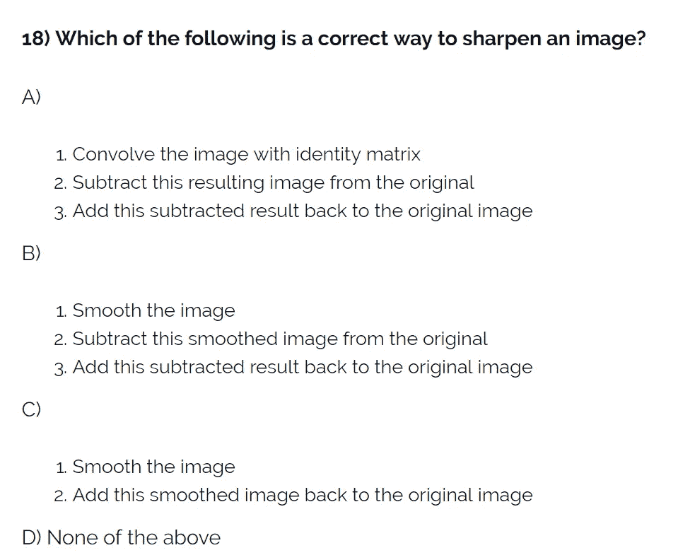

对于这个问题，我们可以清楚地知道选项 A 不是这种情况，因为从应用身份图像中减去结果图像将导致黑色图像。但是让我们试一试。

**左图** →原图
**中图** →中间结果图
**右图** →结果图

上面的图像是按照选项 A 的步骤生成的，正如我们所看到的，没有任何区别。

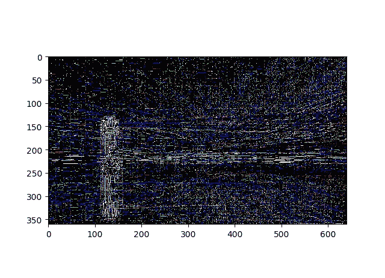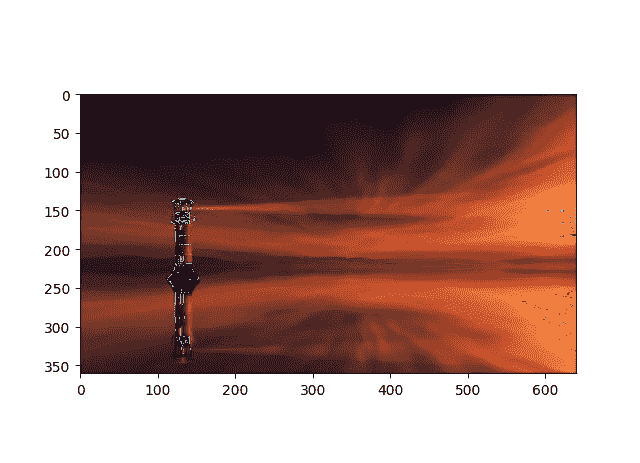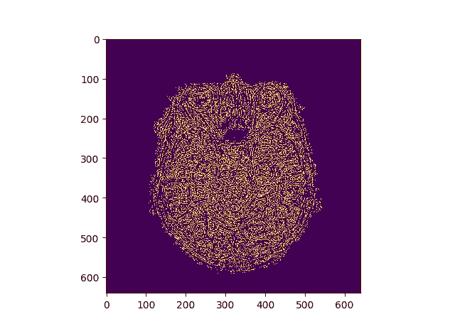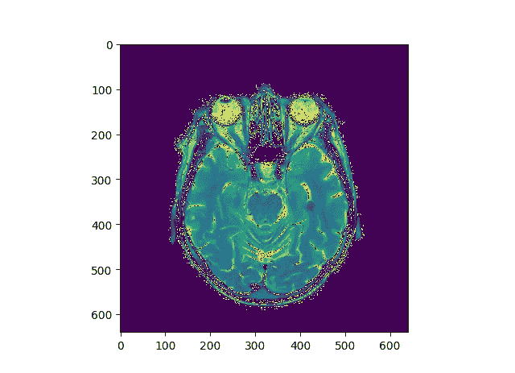

**左图像** →原始图像
**中间图像** →中间结果图像
**右图像** →结果图像

上面的图像是按照选项 B 的步骤生成的，我们可以看到图像中有一些奇怪的伪像，但是从中间生成的图像中，我们可以看到我们正在给原始图像添加边缘。

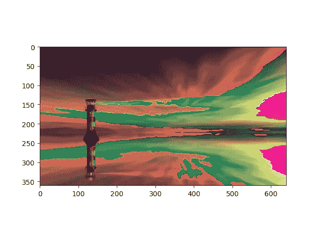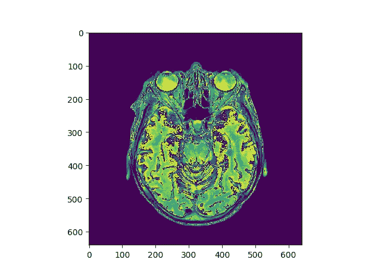

**左图** →原图
右图 →结果图

上面的图像是按照选项 C 的步骤生成的，我们可以看到图像中有一些奇怪的伪像，结果图像看起来没有那么清晰。所以答案会是选项 b。

**19)信号卷积**

对于这个问题，维基页面实际上在首页有直接的答案。

Image from this [website](https://en.wikipedia.org/wiki/Cross-correlation)

因此，从上图中，我们可以得出结论，运算 1 是卷积运算，运算 2 是互相关运算。因此答案是 b。

Video from this [website](https://www.youtube.com/watch?v=O9-HN-yzsFQ)

上面是一个视频，真实的例子。(然而，作者和我似乎又不同意，如果我错了，请让我知道。)

**交互代码**

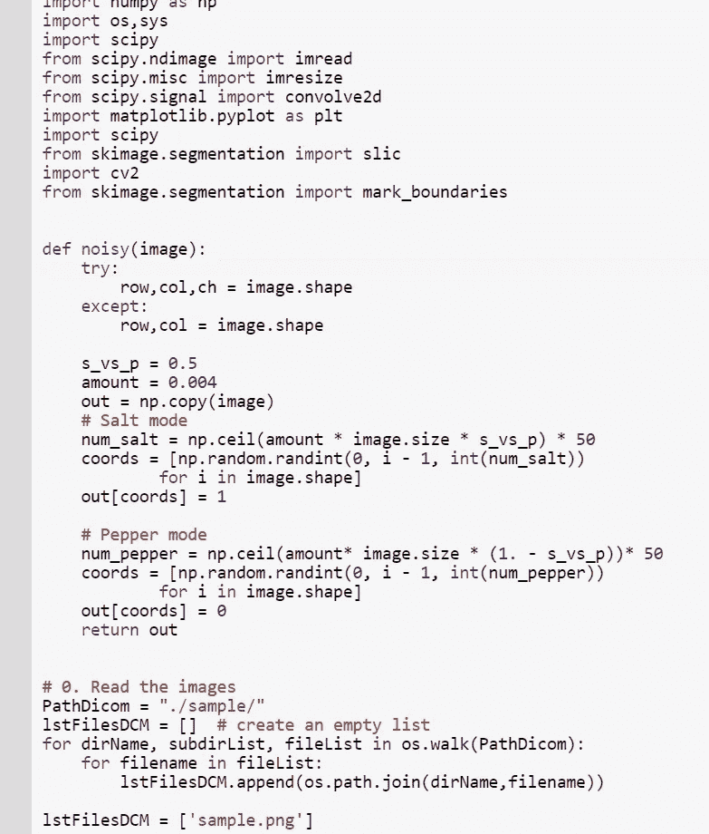

对于 Google Colab，你需要一个 Google 帐户来查看代码，而且你不能在 Google Colab 中运行只读脚本，所以在你的游戏场地上复制一份。最后，我永远不会请求允许访问你在 Google Drive 上的文件，仅供参考。编码快乐！

请注意，我不想滥用任何数据政策。所以对于谷歌 Colab，我找到了下面的图片，它被标记为重复使用。要访问在线代码，请点击此处。

Image from this [website](https://upload.wikimedia.org/wikipedia/commons/thumb/c/cb/Felix_Titling_sample.png/1280px-Felix_Titling_sample.png)

**最后的话**

在我的下一篇文章中，我会回答所有的问题。敬请关注！

如果发现任何错误，请发电子邮件到 jae.duk.seo@gmail.com 给我，如果你想看我所有写作的列表，请在这里查看我的网站。

与此同时，请在我的推特[这里](https://twitter.com/JaeDukSeo)关注我，并访问[我的网站](https://jaedukseo.me/)，或我的 [Youtube 频道](https://www.youtube.com/c/JaeDukSeo)了解更多内容。如果你感兴趣的话，我还做了解耦神经网络[的比较。](https://becominghuman.ai/only-numpy-implementing-and-comparing-combination-of-google-brains-decoupled-neural-interfaces-6712e758c1af)

**参考**

1.  “JPEG”。2018.En.Wikipedia.Org。2018 年 4 月 11 日访问。[https://en.wikipedia.org/wiki/JPEG](https://en.wikipedia.org/wiki/JPEG)
2.  “便携式网络图形”。2018.En.Wikipedia.Org。2018 年 4 月 11 日访问。[https://en.wikipedia.org/wiki/Portable_Network_Graphics](https://en.wikipedia.org/wiki/Portable_Network_Graphics)。
3.  Pixabay 上的免费图像——核磁共振成像，磁性，x 光，头骨，头部。(2018).Pixabay.com。检索于 2018 年 4 月 9 日，来自[https://pix abay . com/en/MRI-magnetic-x-ray-skull-head-782457/](https://pixabay.com/en/mri-magnetic-x-ray-skull-head-782457/)
4.  Pixabay 上的免费图像——日落、灯塔、黎明、黄昏、太阳。(2018).Pixabay.com。检索于 2018 年 4 月 9 日，来自[https://pix abay . com/en/sunset-light house-dawn-dusk-sun-3120484/](https://pixabay.com/en/sunset-lighthouse-dawn-dusk-sun-3120484/)
5.  Pixabay 上的免费图像——核磁共振成像，磁性，x 光，头骨，头部。(2018).Pixabay.com。检索于 2018 年 4 月 9 日，来自[https://pix abay . com/en/MRI-magnetic-x-ray-skull-head-782459/](https://pixabay.com/en/mri-magnetic-x-ray-skull-head-782459/)
6.  功能磁共振成像(fMRI)——NYU 认知神经生理学实验室。(2018).NYU 认知神经生理学实验室。检索于 2018 年 4 月 11 日，来自[https://med . NYU . edu/thesenlab/research-0/research-functional-magnetic-resonance-imaging-fmri/](https://med.nyu.edu/thesenlab/research-0/research-functional-magnetic-resonance-imaging-fmri/)
7.  [复本]，H. (2018)。如何用 OpenCV 在 Python 中给图像添加噪声(高斯/椒盐等)。Stackoverflow.com。检索于 2018 年 4 月 11 日，来自[https://stack overflow . com/questions/22937589/how-to-add-noise-Gaussian-salt-and-pepper-etc-to-image-in-python-with-opencv？rq=1](https://stackoverflow.com/questions/22937589/how-to-add-noise-gaussian-salt-and-pepper-etc-to-image-in-python-with-opencv?rq=1)
8.  椒盐噪声。(2018).En.wikipedia.org。检索于 2018 年 4 月 11 日，来自[https://en.wikipedia.org/wiki/Salt-and-pepper_noise](https://en.wikipedia.org/wiki/Salt-and-pepper_noise)
9.  我用 25 个问题来测试一个数据科学家关于交互式代码的图像处理-第 1 部分。(2018).走向数据科学。检索于 2018 年 4 月 11 日，来自[https://towards data science . com/my-take-on-25-questions-to-test-a-data-scientist-on-image-processing-with-interactive-code-part-1-a 6196 f 535008](/my-take-on-25-questions-to-test-a-data-scientist-on-image-processing-with-interactive-code-part-1-a6196f535008)
10.  安，S. (2018)。2D 卷积的例子。Songho.ca 于 2018 年 4 月 11 日检索，来自[http://www . song ho . ca/DSP/convolution/convolution 2d _ example . html](http://www.songho.ca/dsp/convolution/convolution2d_example.html)
11.  OpenCV:平滑图像。(2018).Docs.opencv.org。检索于 2018 年 4 月 11 日，来自[https://docs . opencv . org/3 . 1 . 0/D4/d13/tutorial _ py _ filtering . html](https://docs.opencv.org/3.1.0/d4/d13/tutorial_py_filtering.html)
12.  用 Matlab 实现互相关和卷积的可视化(已编辑)。(2018).YouTube。检索于 2018 年 4 月 11 日，来自 https://www.youtube.com/watch?v=O9-HN-yzsFQ
13.  交叉相关。(2018).En.wikipedia.org。检索于 2018 年 4 月 11 日，来自[https://en.wikipedia.org/wiki/Cross-correlation](https://en.wikipedia.org/wiki/Cross-correlation)
14.  曲线拟合。(2018).En.wikipedia.org。检索于 2018 年 4 月 11 日，来自[https://en.wikipedia.org/wiki/Curve_fitting](https://en.wikipedia.org/wiki/Curve_fitting)