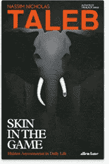
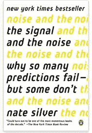
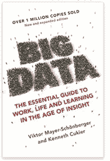

# 我对 2018 年数据科学的五大阅读

> 原文：<https://towardsdatascience.com/my-top-five-data-science-reads-of-2018-687afadcbe29?source=collection_archive---------16----------------------->

> "对于那些寻求超越平凡的人来说，阅读是必不可少的。"—吉米·罗恩

数据科学是一个新兴领域，每个人都试图磨练自己的技能来掌握它。人们对成为一名优秀的数据科学家所需的重要因素感到好奇。我相信对统计学的良好理解，对 R/Python 等工具的良好掌握，能够发现数据中的模式，能够应用准确的模型，这些只是所需的众多特征中的一部分。然而，优秀是一回事，成功是另一回事。一个**“成功的**”数据科学家不仅关注必要的工具和概念，还紧跟行业的当前趋势。

书籍是建立更好的视角和拓展想象力的绝佳方式。尽管互联网上有大量的数据科学资源，但书籍有助于加深对该主题的理解，并可以在需要时随时用作参考。

我对书籍和数据都有热情。因此，今年，我挑选了五本书，它们不是“**典型的**”数据科学类型，但却“有益于数据科学领域”。他们不仅增加了我的知识，还给了我很多关于数据领域的思考。如果你是一名有抱负的数据科学家，正在为慵懒的下午寻找一些读物，我推荐以下列表。

## [游戏中的皮肤:日常生活中隐藏的不对称](https://www.amazon.in/gp/product/0241300657/ref=oh_aui_detailpage_o01_s00?ie=UTF8&psc=1)

纳西姆·尼古拉斯·塔勒布是我们这个时代最重要的思想家之一。短语“游戏中的皮肤”是风险管理的支柱，但适用于包括数据科学在内的所有领域。如果你在游戏中有皮肤，你更有可能利用你的本地知识，使用重要的东西，丢弃不相关的东西。

如何适用于数据科学？这本书论述了公平、商业效率和应对风险的必要性，所有这些特征都是数据科学生态系统的重要组成部分。

## [赤裸裸的统计——从数据中剥离恐惧](https://www.amazon.in/gp/product/039334777X/ref=oh_aui_detailpage_o00_s00?ie=UTF8&psc=1)

查尔斯·惠兰 的《赤裸裸的统计学》是对统计学及其如何被使用、误用和歪曲的极好介绍。这本书通过剥去表面的争论和揭示主题的潜在价值强调统计学的真实世界的应用。

许多人把这本书比作没有数学的“统计 101 课程”。因此，如果你害怕统计，这本书试图解释直觉，从基本概率到中心极限定理，从描述性统计到回归分析，所有这些都以一种简单直观的方式，带着一点幽默。

## [真实度](https://www.amazon.in/Factfulness-Reasons-Wrong-Things-Better/dp/1473637465/ref=sr_1_1?s=books&ie=UTF8&qid=1545700201&sr=1-1&keywords=factfulness+hans+rosling)

这本书是由有远见的 [**汉斯·罗斯林**](https://en.wikipedia.org/wiki/Hans_Rosling) (以及他的儿子和儿媳)写的，既鼓舞人心又富有启示性，充满了生动的轶事和感人的故事。

汉斯·罗斯林用数据、统计和简洁的视觉化表达了对世界及其问题的不同观点。事实证明，尽管这个世界并不完美，但它比我们想象的要好得多。这本书强调需要用事实来衡量世界的进步和发展，以对抗全球的无知。

数据科学教育非常注重数据争论和假设检验。汉斯·罗斯林通过这本书巧妙地提醒我们，形成错误的假设是代价高昂的

## [信号和噪音:为什么如此多的预测失败了——但有些却没有](https://www.amazon.in/gp/product/0143125087/ref=oh_aui_detailpage_o01_s01?ie=UTF8&psc=1)

[**内特·西尔弗**](http://Nate Silver) 是一个无需介绍的名字。他是著名的统计学家、作家，也是获奖网站[FiveThirtyEight.com](https://fivethirtyeight.com/)的创始人。这本书帮助我们理解预测的局限性和它可以被证明是成功的领域。通过他的书，Nate 带领我们进入了预测的世界，在这个世界里，大量的数据都存在于噪音之中。

如果一个人有兴趣了解现实世界中预测是如何进行的，以及预测者如何克服偏见以揭示准确和有意义的预测，这是一个有用的阅读。

## [大数据:洞察时代工作、生活和学习的必备指南](https://www.amazon.com/Big-Data-Essential-Learning-Insight/dp/1473647207)

多年来，已经有很多关于“大数据”的书籍问世。然而，这本书的重点主要是大数据的应用，这些应用正在重新定义我们周围的业务和流程。

本书由世界上最受尊敬的两位数据专家 [**【维克托·迈尔·舍恩伯格】**](https://en.wikipedia.org/wiki/Viktor_Mayer-Sch%C3%B6nberger) 和 [**肯尼斯·库基尔**](https://en.wikipedia.org/wiki/Kenneth_Cukier) 撰写。他们谈论什么是大数据、大数据的好处以及如何有效利用大数据。通过本书分享的例子和现实生活中的经历，堪称典范。这本书不仅强调了大数据对从商业到政府，从科学到医学的几乎所有事物的日益增长的影响，而且还对大数据的**黑暗面**留下了深刻印象。

总的来说，这本书为大数据革命提供了强有力的介绍，对于探索该领域的有抱负的数据科学家来说，这是一本好书。

我很高兴我能读这些书，我希望你也能从中受益。虽然阅读一本书不会让你一夜之间成为一名成功的数据科学家，但它肯定会给你一个更好、更广阔的视角来看待和分析事物。毕竟，从数据中寻找意义是我们的工作。