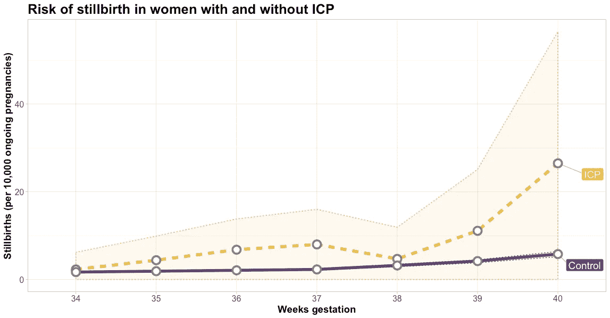
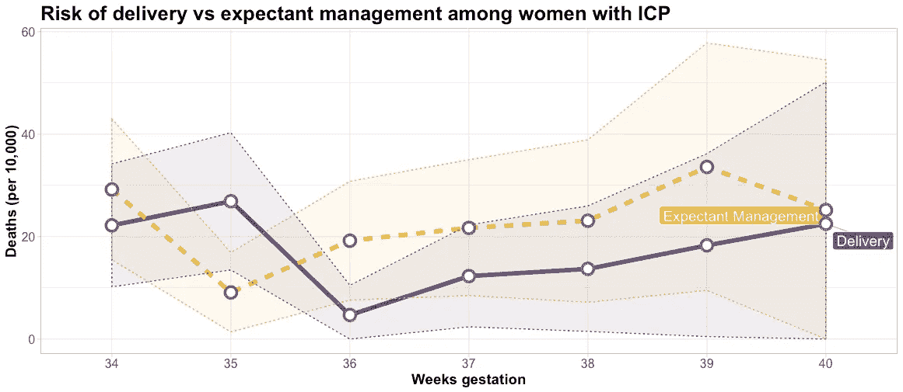
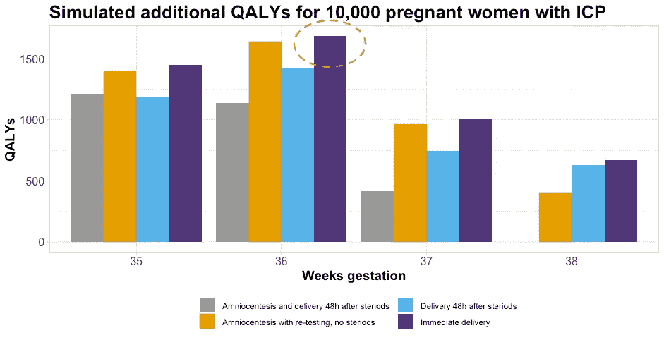
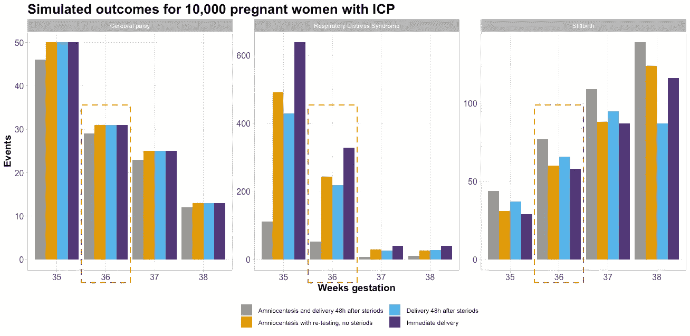
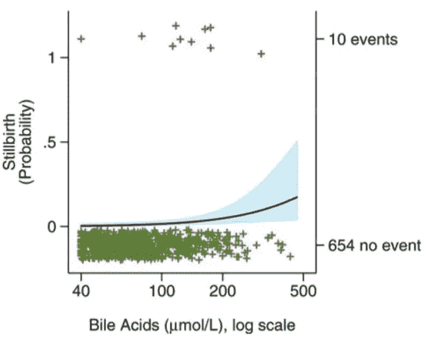

# 我妻子睡不着

> 原文：<https://towardsdatascience.com/my-wife-couldnt-sleep-550e206cd80a?source=collection_archive---------0----------------------->

## 她没有忽视瘙痒，你也不应该忽视

她又痒又累。她也怀了 29 周我们的第二个孩子。当然不是一场独特的斗争。不舒服和精疲力尽几乎是妊娠晚期的定义。

但是伊芙知道有些事情不对劲。当瘙痒开始时，睡觉让位于夜间抓痒——和谷歌搜索。起初，她在网上找到的东西令人放心——怀孕确实会因为皮肤血流量增加而让你发痒——但她的瘙痒似乎有所不同。更加强烈和广泛。然后她读到了一种相对罕见的肝脏疾病，这种疾病会导致怀孕期间的严重瘙痒*。这种疾病与婴儿的一些非常糟糕的结果有关，所以伊芙决定问问她的产科医生。医生认为这是很严重的可能性很小，但为了安全起见，她还是安排了检查。*

*肝功能结果最先出来，因为样本是在本地进行的。该国只有少数实验室评估胆汁酸水平，因此 Eve 的样本必须运出，这一过程需要 3 到 7 天。作为对我们耐心的回报，我们被告知她的数据看起来不错。似乎没什么可担心的。*

*又过了两周。为了工作，我去了肯尼亚和利比里亚。伊芙去 DC 参加一个会议。她的痒尾随而来，并分享一个房间。但是在那些深夜的狂欢中，她无法摆脱出问题的感觉。*

*她重复了这些测试，并于 6 月 8 日(第 31 周)收到了她的诊断结果: ***妊娠期肝内胆汁淤积症*** ，或 ICP。*

# *什么是 ICP？*

*肝脏(希腊文 [*hepato*](https://en.wiktionary.org/wiki/hepato-) )是一个相当整洁的器官。当你在五人餐厅狼吞虎咽地吃下一个汉堡时，你的肝脏会产生胆汁来分解脂肪。由于尚未完全了解的原因，ICP 中断了这一过程，并在血液中产生胆汁酸堆积(*)。如果不加以控制，ICP 会增加死胎和出生时呼吸问题的风险。血液中过量的胆汁酸是导致这些问题的原因，还是仅仅是一些其他疾病过程的标志还不清楚。**

**ICP 的唯一“治疗”是分娩；大多数女性在不再怀孕时，肝功能会恢复正常。怀孕期间的“管理”ICP 通常涉及规划早期分娩和使用药物[熊去氧胆酸](https://en.wikipedia.org/wiki/Ursodeoxycholic_acid)(又名 UDCA、熊去氧胆酸、Actigall)，这可能会缓解瘙痒并减少血液中有毒胆汁酸的量。血清胆汁酸水平大于 10 mol/L 标志着 ICP 的发作，40 mol/L 是“重度”ICP 的阈值。**

# **研究最佳交货周**

**当伊芙的结果显示是颅内压增高时，我们试图尽可能地了解病情。我于 6 月 9 日登陆 [ICP 关爱](http://www.icpcare.org/)网站，那天正好是 [ICP 宣传日](http://www.icpcare.org/get-involved/icp-awareness-month/)的前一天。以下是引起我注意的事情:**

> **如果不积极处理，妊娠期肝内胆汁淤积症期间死产的风险可高达 15%。然而，通过积极的管理，包括药物熊去氧胆酸和早期分娩(通常在妊娠 36-37 周)，风险被认为与无并发症妊娠大致相同，即低于 1%。**导致死胎的机制尚未完全了解，也不可能预测哪些妊娠存在风险。**虽然研究发现较高的胆汁酸水平似乎会带来较高的某些并发症风险，如呼吸窘迫和胎儿窘迫，但研究未能确定死产的相同关系。因此，所有 ICP 妊娠都建议提前分娩。**

**我们相信死产的总体风险应该很低，因为伊芙正在接受 UDCA 的“积极管理”,并初步计划在 37 周分娩，但两个问题促使我们开始深入研究:**

1.  **37 周是分娩的最佳时间吗？**
2.  **Eve 诊断时的胆汁酸水平是 25 mol/L，如果开始升高怎么办？有没有一个门槛可以促使我们更早地交付产品？**

## **按周来看死胎的风险是什么样的？**

**就 ICP 而言，分娩的“最佳时机”是做某事的风险小于什么都不做的风险的点(T21)。等太久才生，就有死胎的风险。行动太快，你就有婴儿死亡或活产并发症的风险。**

**这应该让你对我们的风险计算有所了解，我们通过寻找按周估计死产风险的研究开始了我们的研究之旅。我们发现的关于死胎率的最大研究是加利福尼亚州 160 万妊娠妇女的*回顾性队列研究。***

***在一项队列研究中，研究人员找出符合特定标准的人，并跟踪他们一段时间，看看谁产生了感兴趣的结果。在这项特殊的研究中， [**普尔吉奇和他的同事们**](https://www.ncbi.nlm.nih.gov/pubmed/25687562) 根据妇女的暴露程度——ICP 或无 ICP——从生命统计登记中选择妇女，并提取关于产妇、胎儿和婴儿结局的相关数据。这被认为是*回顾性*(或*非同期*或*历史性*)队列设计，因为在作者开始他们的研究时，怀孕和结果已经发生。***

**在他们 160 万例妊娠的数据集中，研究人员发现了 5545 例 ICP，发病率为 0.35%。这比其他研究发现的要低，这意味着有可能某些比例的实际 ICP 妊娠没有被正确编码。或者其他研究高估了 ICP 的发病率，而这项研究是正确的。很难知道。**

**作者以表格形式展示了一些结果，我认为用数字来表示更好，所以我尝试了一些图表(代码在这里是)。下图显示了患有和未患有 ICP 的妇女每周的死产风险。它表明，与没有 ICP 的妇女相比，患有 ICP 的妇女每周的死产风险更高，但 ICP 组的每周数字如此之小，以至于估计值非常不确定(黄色带是 ICP 的 95%置信区间，它包括所有非常精确估计的紫色对照值)。最明显的发现是患有 ICP 的妇女在期末死产的风险显著增加。根据定义，这些案例没有得到提前分娩的完全“管理”,因为它们没有在 38 周之前分娩，但是我们从数据中不知道服用 UDCA 的百分比。**

****

**Data for this plot come from Table 2 in Puljic et al. (2015). The risk of infant and fetal death by each additional week of expectant management in intrahepatic cholestasis of pregnancy by gestational age. [*American Journal of Obstetrics and Gynecology*, *212*(5), 667-e1](https://www.ncbi.nlm.nih.gov/pubmed/25687562). Plot code [here](https://gist.github.com/ericpgreen/e0d34b65cba75d070ee91a92c5f4434a).**

## **另一方面呢——过早交付的风险？**

**由普尔吉奇和他的同事进行的回顾性队列研究也提供了关于早产风险的部分数据。在患有 ICP 的女性群体中，作者计算了与分娩相关的婴儿死亡的每周风险——也就是做一些事情——并将其与他们所谓的*期待治疗*——也就是等待和不做任何事情——的复合死亡风险进行比较。复合风险是给定一周内死产的综合风险加上下一周分娩时婴儿死亡的风险。*换句话说，他们比较了在给定的一周内分娩的风险和多等一周的风险。***

**这是我试图绘制他们的数据。作者在论文中也画了点估计，但没有画不确定性，我认为我们需要看到这两个元素。这两条线在第 36 周交叉，表明这可能是最佳点，此时行动的风险低于等待的风险。**

****

**Data for this plot come from Table 3in Puljic et al. (2015). The risk of infant and fetal death by each additional week of expectant management in intrahepatic cholestasis of pregnancy by gestational age. [*American Journal of Obstetrics and Gynecology*, *212*(5), 667-e1](https://www.ncbi.nlm.nih.gov/pubmed/25687562). Plot code [here](https://gist.github.com/ericpgreen/e0d34b65cba75d070ee91a92c5f4434a).**

****当然，这份风险档案中遗漏了围产期发病率*——母亲和婴儿的不良后果，导致死亡。****这可能包括脑瘫和呼吸窘迫综合征等情况，这些情况更有可能是早产的结果。如果不考虑发病率，就不可能对早期分娩的风险进行真正的评估。***

***[**Lo 和他的同事**](https://www.ncbi.nlm.nih.gov/pubmed/25371372) 用他们的*决策分析模型*在这方面帮了我们。在这项研究中，作者模拟了一个假设的 10，000 名 ICP 妇女队列的结果，基于(a)产妇和新生儿的预期寿命，(b)文献中发现的几种不良结果的产妇和新生儿效用值，以及(c)四种不同分娩策略的新生儿和产妇发病率、ICP 死产和 35-38 周新生儿死亡的公布概率:***

1.  **服用类固醇(促进肺部发育)后 48 小时分娩，无需羊膜穿刺术**
2.  **使用类固醇后 48 小时分娩，羊膜穿刺术**
3.  **羊膜穿刺术和复检，没有类固醇**
4.  **立即分娩(无羊膜穿刺术，无类固醇)**

****

**Data for this plot come from Lo et al. (2015). Intrahepatic cholestasis of pregnancy and timing of delivery. [Journal of Maternal-Fetal & Neonatal Medicine, 28(18), 2254–2258](https://www.ncbi.nlm.nih.gov/pubmed/25371372). Plot code [here](https://gist.github.com/ericpgreen/e0d34b65cba75d070ee91a92c5f4434a). This plot shows additional QALYs relative to the minimum QALY value, which is delivery at 38 weeks following amniocentesis and steroids. This minimum value is set to 0 in the figure.**

**主要结果是总的 ***质量调整生命年*** ，或质量生命年。一年的健康相当于 1 QALY，所以人均预期生活质量越好。这里显示了模拟的主要结果。与所有其他策略相比，在 36 周立即分娩而不使用羊膜穿刺术或类固醇似乎能最大限度地提高质量生活质量。**

**作者总结道:**

> **当考虑权衡因素时，虽然与妊娠 37 周或更晚分娩相比，36 周分娩的新生儿发病率更高，但[死产]的风险降低。**

**以下图表显示了 QALY 计算和这一结论背后的趋势。像脑瘫和呼吸窘迫综合征的风险在 37 周前最高，但这被 37 周和 38 周死产风险的增加所抵消。**

****

**Data for this plot come from Lo et al. (2015). Intrahepatic cholestasis of pregnancy and timing of delivery. [Journal of Maternal-Fetal & Neonatal Medicine, 28(18), 2254–2258](https://www.ncbi.nlm.nih.gov/pubmed/25371372). Plot code [here](https://gist.github.com/ericpgreen/e0d34b65cba75d070ee91a92c5f4434a). These plots show the patterns of risk for three specific outcomes according to the model: the risks of cerebral palsy and respiratory distress syndrome decrease as babies mature in the womb, while the risk of stillbirth among women with ICP increases every week.**

**虽然不是绝对的，但这两项研究使我们倾向于在 36 周而不是计划的 37 周分娩。当 Eve 的下一次胆汁酸测试在接下来的一周回到 85 mol/L 时，我们进一步确信了这一点。**

**当我们得到这个结果时，我正在阅读一篇新发表的 2018 年 ICP 护理综述，该综述由杜克大学产科/GYN 部门母体胎儿医学部门的 Elizabeth Livingston 博士和她的同事发表。在这篇评论中， [**利文斯顿和他的同事**](https://www.ncbi.nlm.nih.gov/pubmed/29480924) 写道:**

> **考虑到 ICP 患者死产风险增加，通常建议在妊娠 37 周时进行引产，以平衡医源性早产风险和胎儿死亡风险。**当胆汁酸水平达到 100 μmol/L 或更高时，死产的风险显著增加，在这些情况下，可考虑在更早的孕龄分娩，如 35 至 37 周；然而，这些决定应该通过仔细的患者咨询来个体化。****

**伊芙是杜克卫生系统的一名病人，所以我们会见了利文斯顿医生，讨论我们的选择。考虑到伊芙的良好表现，利文斯顿对 36 周的分娩感到满意。但如果她的水平越过了 100 mol/L 大关呢？**

## **胆汁酸水平和死胎有什么关系？**

**利文斯顿及其同事的论文回顾了关于这种关系的最新证据，并总结了胆汁酸可能导致死产的主要假设。一种观点认为过量的胆汁酸会收缩胎盘中的血管。这可能是为什么 ICP 中的死产似乎是导致缺氧和死亡的急性事件的结果，而不是胎儿健康的慢性恶化的一个原因。如果是这样，这有助于解释为什么胎儿监测 Eve 每周进行两次——不能降低 ICP 中死产的风险(但仍被推荐)。**

**目前，高胆汁酸水平可能是死产风险增加的最佳诊断指标，但这仍然是一个有争议的问题。一个关键的证据来自一项在英国进行的对患有严重 ICP 的女性的前瞻性队列研究，该研究于 2014 年发表在期刊*上。在这项研究中，队列由多达 669 名患有**重度 ICP** (定义为妊娠期间任何时间胆汁酸水平≥ 40 mol/L)的妇女组成，感兴趣的结局是死产。***

**以下是来自重度 ICP 队列的一些值得注意的发现:**

1.  **这些妇女中的大多数接受了 UDCA 治疗(72%)，平均分娩时间为 37.5 周。因此，你可以说“主动管理”相当普遍，但肯定不是普遍的。**
2.  **669 名妇女中有 10 名经历了死产，发生率为 1.5%。(在下图中用红色加号表示)**
3.  **10 例死胎中有 6 例发生在 ***前*** 37 周。**
4.  **死产似乎聚集在胆汁酸水平高于 100 mol/L 的女性中。**

****

**Source: Geenes, V. et al. (2014). Association of severe intrahepatic cholestasis of pregnancy with adverse pregnancy outcomes: a prospective population‐based case‐control study. [*Hepatology*, *59*(4), 1482–1491](https://www.ncbi.nlm.nih.gov/pubmed/23857305). Figure 4(C). The estimated probability and 95% CIs of stillbirth in relation to the maternal serum bile acid level, based on simple logistic regression.**

**作者还观察了两组没有 ICP 的妇女的死产结果。重度 ICP 队列中死胎发生率为 1.5%，是非 ICP 对照组死胎发生率的 3 倍。**

## **夏娃的轨迹**

**最终，伊芙的胆汁酸水平永远不会超过 100 摩尔/升。她的峰值是 85.6 mol/L，分娩前的最终检测结果是 38.4 mol/L**

****

**Plot code [here](https://gist.github.com/ericpgreen/e0d34b65cba75d070ee91a92c5f4434a).**

# **我们的小痒来了**

**经过紧张的几个星期，安妮·格雷斯在 7 月 9 日，也就是夏娃的生日那天出生了。36 周零 1 天。我们感到无比幸运。如果你被诊断患有 ICP，现有的证据表明，你也有很大的机会获得良好的结果，特别是如果你的医生开了 UDCA，并将你的分娩时间安排在 36 周或 37 周(或者更早，如果考虑到你的情况有意义的话)。**

****

**Annie Grace**

**不幸的是，并不是每个人都这么幸运。在我们旅行的早期，我读了唐娜·贝纳维德斯的故事《T21》。她在 36 周时被诊断为 ICP，并计划在 38 周时引产。**

> **我感到困惑和害怕，这是我第一次怀孕。我在网上阅读了更多关于妊娠胆汁淤积症的信息，并打印了一些信息与我丈夫讨论，因为我阅读的文章中的统计数据显示，ICP 导致婴儿流产的比例很小。在我的反应性(非压力测试)后的第二天——离被诱导只有两天——我们失去了儿子乔丹。**

**唐娜继续创立了 T2 ICP 护理中心，并帮助无数家庭理解这个可怕的诊断。现在，她告诉其他女性去止痒。**

**唐娜的医生不知道开 UDCA。虽然今天人们对 ICP 有了更好的理解，但仍经常会读到 ICP Care 的 [***发痒的妈妈们***](https://www.facebook.com/groups/ICPCare/about/) 脸书妇女团体的故事，这些妇女努力让她们的提供者检测 ICP 并认真对待她们的症状。**

**被授权接受测试。用这份[博士讨论指南](http://www.icpcare.org/resources/dr-discussion-guide/)为你的预约做准备，并与你的提供者分享[这些资源](http://www.icpcare.org/resources/educational-brochures/)。**

*****不要忽视痒。*****

**[1] Eve 的第一次胆汁酸水平实际上为 11.5 mol/L，高于 [Wood et al. (2018)](https://www.ncbi.nlm.nih.gov/pubmed/29480924) 推荐的诊断 ICP 的临界值。她的结果被归类为“正常”，可能是因为杜克 MyChart 中 15 至 45 岁孕妇的参考范围是 3.7–14.5*mol/l。***