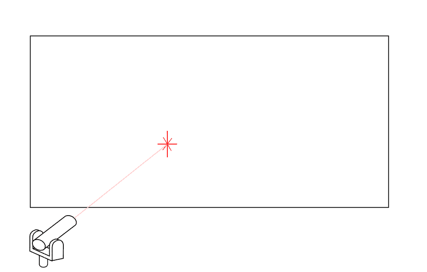
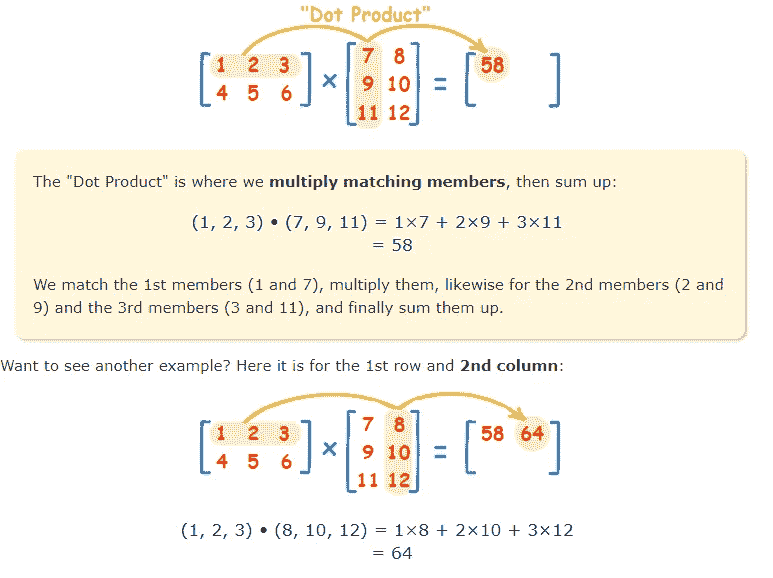
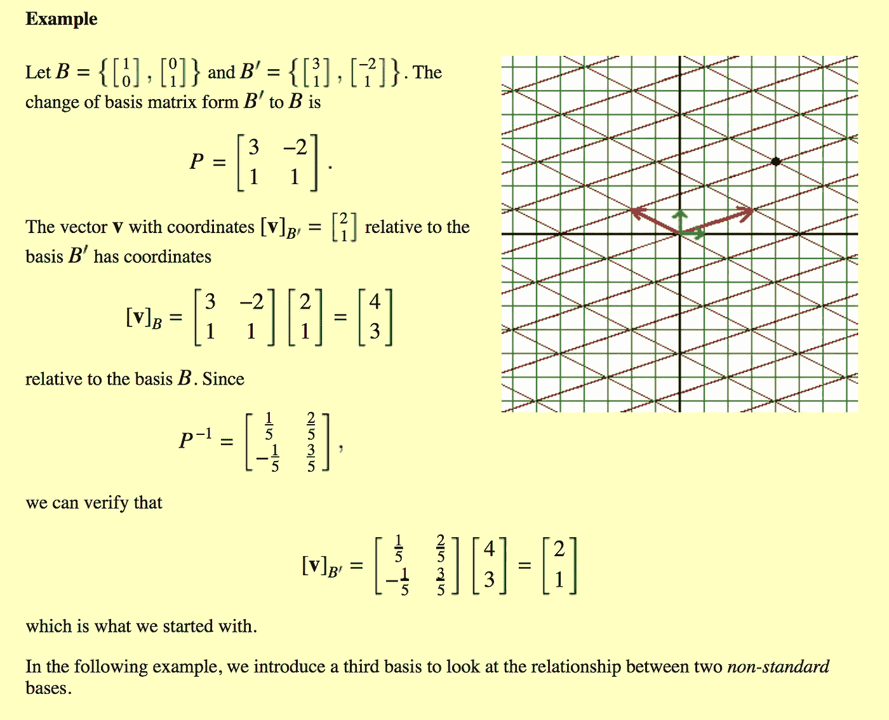
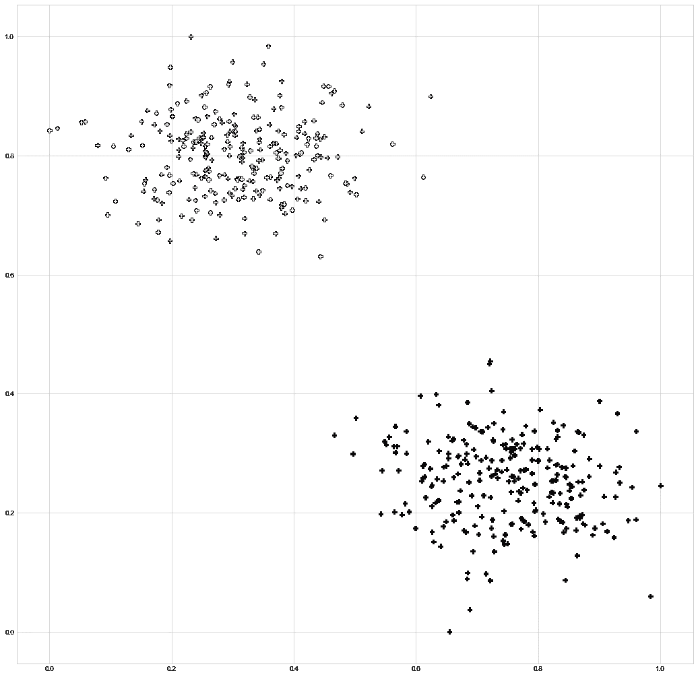
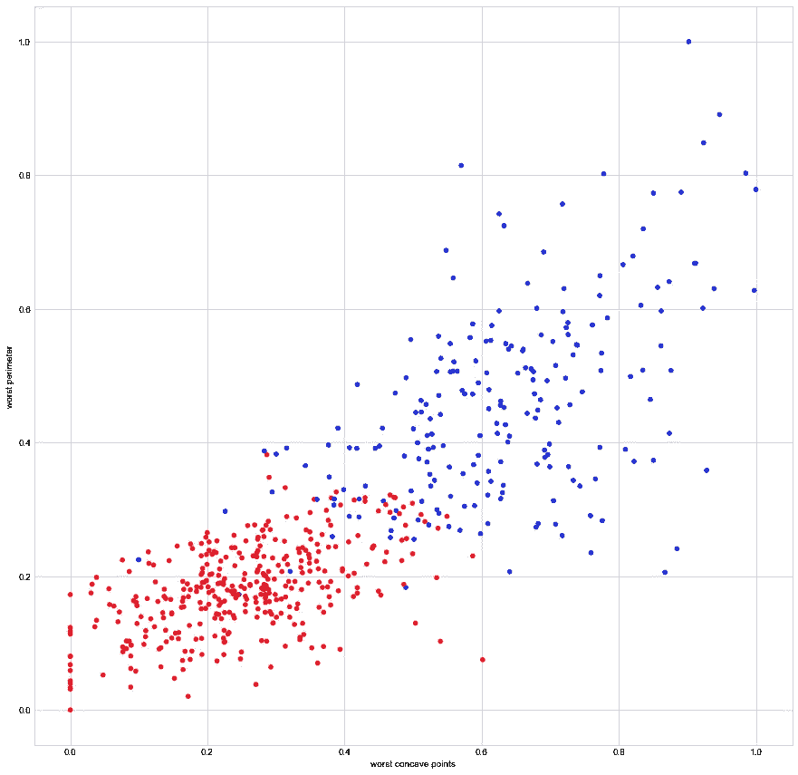
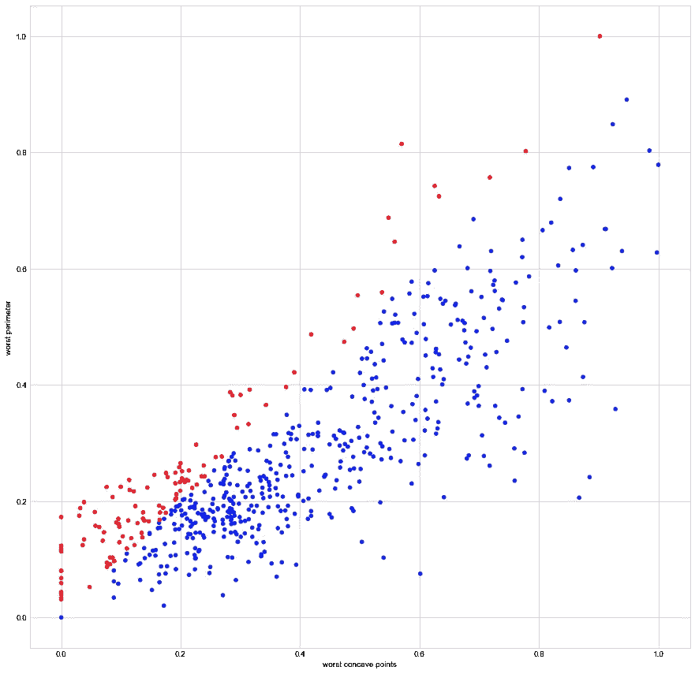
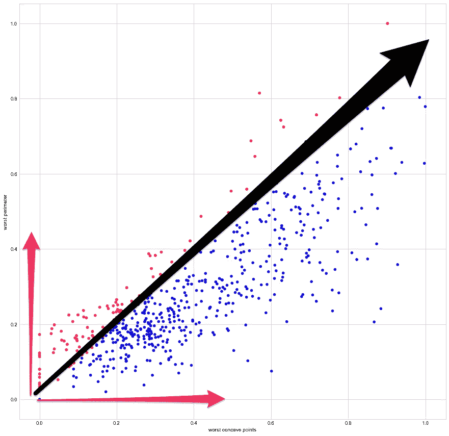
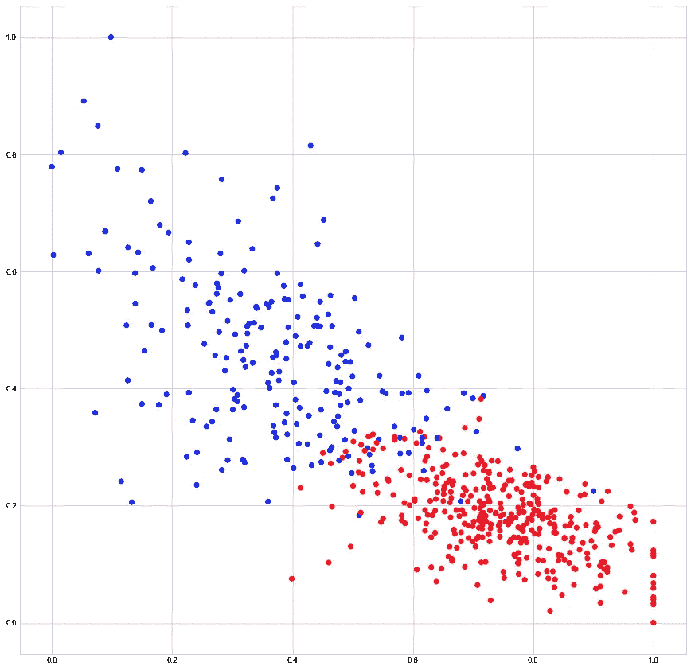
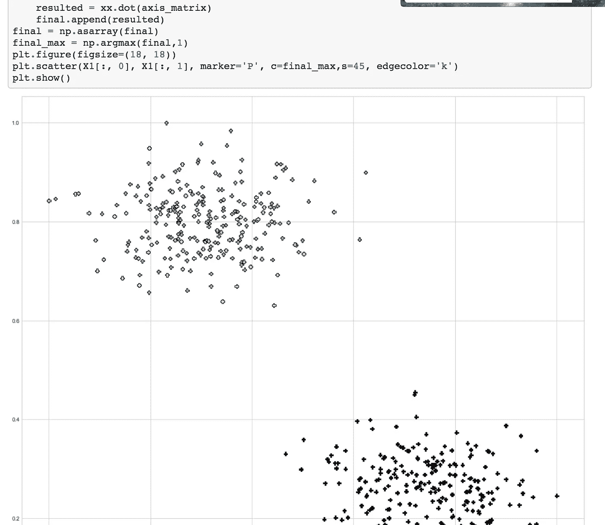

# 在 Numpy 中使用矩阵点积/具有交互代码的基变化的简单分类

> 原文：<https://towardsdatascience.com/naive-classification-using-matrix-dot-product-change-of-basis-with-interactive-code-in-numpy-4808e5aa955e?source=collection_archive---------5----------------------->

GIF from this [website](https://giphy.com/gifs/geometry-ldCckAh0jB76E)

昨天我研究了标量投影和点积，现在我希望进一步研究矩阵点积/基的变化，再次使用 [sklearn 乳腺癌数据集进行简单分类。](http://scikit-learn.org/stable/modules/generated/sklearn.datasets.load_breast_cancer.html#sklearn.datasets.load_breast_cancer)

> **请注意，这篇帖子是为了我对线性代数更深入的理解。**

**矩阵点积的简单/快速复习**

Image from this [website](https://www.mathsisfun.com/algebra/matrix-multiplying.html)

因此，上面的图像捕捉到了矩阵点积的数学运算，然而它没有覆盖点积的直觉，这是非常强大的。更多关于点产品背后的直觉的阅读，请访问我以前的[博客。](/naive-classification-using-scalar-projection-with-interactive-code-298279afb11f)

**基础变更**

Image from this [website](https://www.math.hmc.edu/calculus/tutorials/changebasis/)

在二维情况下，我们的大多数坐标系都是在[1，0]和[0，1]的基矢中。然而，并不总是这样，我们可以用一个简单的基变换来转换矢量的参考点。在数据领域，我将此理解为属性的组合。

**分类虚假数据集**

假设我们有如上所示的数据聚类，有多种方法来执行分类，但我将只使用两个矢量和矩阵点积来执行分类。现在，我们可以看到，当我们有一个向量[1，0]来捕获每个数据有多少分量轴 y 时(在数据域中，这可以是任何属性，如心跳或血压等)，我们可以使用向量[0，1]来捕获每个数据点如何包含轴 x，这也可以是任何属性。

如上所述，我们可以简单地取每个数据点的结果矩阵的最大自变量。具有更多[1，0]的数据点的最大参数为 0，而另一个数据点的最大参数为 1。(反之亦然，我没有检查，但逻辑保持不变。)

当我们绘制散点图时，使用捕获的 max 参数作为颜色，我们可以看到它已经被很好地分类了。

**天真地对乳腺癌数据集进行分类**

现在让我们来看一个真实世界的数据使用案例，上面是在获取与乳腺癌结果高度相关的 2 个属性时生成的散点图。(分别是“最差凹点”、“最差周长”，相关矩阵如下所示。)

Target is the outcome

现在，当我们采用完全相同的方法，用一个分类向量来捕捉一个数据点有多少关于最差凹点的信息，用另一个分类向量来捕捉最差周长的信息。以最大值为参数，我们得到如下结果。

之所以创建这个图表，是因为我们制作的边界线如下图所示。

我们可以观察我们选择的两个粉色分类向量。

**围绕 1 对乳腺癌数据集进行分类**

解决这一问题并获得更好结果的一种方法(尽管不完美)是使用单个矢量点，执行标量投影，并设置一个阈值来制作边界线。

这不是最好的解决方案，但却是更好的解决方案。

**在乳腺癌数据集分类上做了大约 2 个工作**

第二种方法是简单地改变基向量，正如上面看到的，当我们相对于 y 轴翻转所有的数据点时，我们可以得到类似上面的结果。换句话说，我们将基向量改为[-1，0]和[1，0]。x 轴现在被求反。(使用下面的代码。)

现在，我们可以简单地采用与第一步完全相同的方法。

如上所述，通过取两个向量[0，0.5]和[1，0]的点积，并取最大自变量，我们可以得到更好的结果。

**互动码**

要访问这篇文章的代码，请点击这里。

**遗言**

这么多这些强大的东西被隐藏在机器学习这个术语之外，用高级 API 工作很有趣。但是他们没有给你洞察力。

如果发现任何错误，请发电子邮件到 jae.duk.seo@gmail.com 给我，如果你想看我所有写作的列表，请在这里查看我的网站。

与此同时，请在我的 twitter [这里](https://twitter.com/JaeDukSeo)关注我，并访问[我的网站](https://jaedukseo.me/)或我的 [Youtube 频道](https://www.youtube.com/c/JaeDukSeo)了解更多内容。我还实现了[广残网，请点击这里查看博文 pos](https://medium.com/@SeoJaeDuk/wide-residual-networks-with-interactive-code-5e190f8f25ec) t。

**参考**

1.  如何乘矩阵？(2018).Mathsisfun.com。检索于 2018 年 7 月 5 日，来自[https://www.mathsisfun.com/algebra/matrix-multiplying.html](https://www.mathsisfun.com/algebra/matrix-multiplying.html)
2.  sk learn . datasets . load _ breast _ cancer-sci kit-learn 0 . 19 . 1 文档。(2018).Scikit-learn.org。检索于 2018 年 7 月 5 日，来自[http://sci kit-learn . org/stable/modules/generated/sk learn . datasets . load _ breast _ cancer . html # sk learn . datasets . load _ breast _ cancer](http://scikit-learn.org/stable/modules/generated/sklearn.datasets.load_breast_cancer.html#sklearn.datasets.load_breast_cancer)
3.  标题？，C. (2018)。从 Numpy 数组创建 Pandas DataFrame:如何指定索引列和列标题？。堆栈溢出。2018 年 7 月 5 日检索，来自[https://stack overflow . com/questions/20763012/creating-a-pandas-data frame-from-a-numpy-array-how-do-I-specify-the-index-column](https://stackoverflow.com/questions/20763012/creating-a-pandas-dataframe-from-a-numpy-array-how-do-i-specify-the-index-colum)
4.  控制图形美学-seaborn 0 . 8 . 1 文档。(2018).Seaborn.pydata.org。检索于 2018 年 7 月 5 日，来自 https://seaborn.pydata.org/tutorial/aesthetics.html
5.  绘制对角线相关矩阵——seaborn 0 . 8 . 1 文档。(2018).Seaborn.pydata.org。检索于 2018 年 7 月 5 日，来自[https://seaborn . pydata . org/examples/many _ pairwise _ correlations . html](https://seaborn.pydata.org/examples/many_pairwise_correlations.html)
6.  matplotlib？，H. (2018)。如何改变用 matplotlib 绘制的图形的大小？。堆栈溢出。检索于 2018 年 7 月 5 日，来自[https://stack overflow . com/questions/332289/how-do-you-change-the-size-of-figures-drawn-with-matplotlib](https://stackoverflow.com/questions/332289/how-do-you-change-the-size-of-figures-drawn-with-matplotlib)
7.  熊猫。data frame . plot . scatter—pandas 0 . 23 . 1 文档。(2018).Pandas.pydata.org。检索于 2018 年 7 月 5 日，来自[https://pandas . py data . org/pandas-docs/stable/generated/pandas。DataFrame.plot.scatter.html](https://pandas.pydata.org/pandas-docs/stable/generated/pandas.DataFrame.plot.scatter.html)
8.  法，一.(2018)。使用 pandas plot 方法设置图形大小时不一致。堆栈溢出。检索于 2018 年 7 月 5 日，来自[https://stack overflow . com/questions/42215252/consistency-when-setting-figure-size-using-pandas-plot-method](https://stackoverflow.com/questions/42215252/inconsistency-when-setting-figure-size-using-pandas-plot-method)
9.  可视化-pandas 0 . 23 . 1 文档。(2018).Pandas.pydata.org。检索于 2018 年 7 月 5 日，来自[https://pandas . pydata . org/pandas-docs/stable/visualization . html](https://pandas.pydata.org/pandas-docs/stable/visualization.html)
10.  可能吗？，P. (2018)。Python 使用 lambda 应用 pd。DataFrame 代替 for 嵌套循环可能吗？。堆栈溢出。2018 年 7 月 5 日检索，来自[https://stack overflow . com/questions/19178762/python-using-lambda-to-apply-PD-data frame-instead-for-nested-loop-is-possible](https://stackoverflow.com/questions/19178762/python-using-lambda-to-apply-pd-dataframe-instead-for-nested-loop-is-it-possible)
11.  使用标量投影和交互式编码的朴素分类。(2018).走向数据科学。检索于 2018 年 7 月 5 日，来自[https://towards data science . com/naive-class ification-using-scalar-projection-with-interactive-code-298279 AFB 11 f](/naive-classification-using-scalar-projection-with-interactive-code-298279afb11f)
12.  mplot3d 示例代码:scatter 3d _ demo . py—Matplotlib 2 . 0 . 0 文档。(2018).Matplotlib.org。检索于 2018 年 7 月 5 日，来自[https://matplotlib . org/2 . 0 . 0/examples/mplot 3d/scatter 3d _ demo . html](https://matplotlib.org/2.0.0/examples/mplot3d/scatter3d_demo.html)
13.  调色板？]，H. (2018)。如何使用连续值给散点图着色？].堆栈溢出。2018 年 7 月 5 日检索，来自[https://stack overflow . com/questions/39735147/how-to-color-matplotlib-scatter plot-using-a-continuous-value-seaborn-color](https://stackoverflow.com/questions/39735147/how-to-color-matplotlib-scatterplot-using-a-continuous-value-seaborn-color)
14.  numpy.dot()。(2018).[www.tutorialspoint.com](http://www.tutorialspoint.com)。检索于 2018 年 7 月 5 日，来自[https://www.tutorialspoint.com/numpy/numpy_dot.htm](https://www.tutorialspoint.com/numpy/numpy_dot.htm)
15.  git add，c. (2018)。git 添加、提交和推送命令合二为一？。堆栈溢出。2018 年 7 月 5 日检索，来自[https://stack overflow . com/questions/19595067/git-add-commit-and-push-commands-in-one](https://stackoverflow.com/questions/19595067/git-add-commit-and-push-commands-in-one)
16.  标记— Matplotlib 2.2.2 文档。(2018).Matplotlib.org。检索于 2018 年 7 月 5 日，来自[https://matplotlib.org/api/markers_api.html](https://matplotlib.org/api/markers_api.html)
17.  绘制随机生成的分类数据集-sci kit-learn 0 . 19 . 1 文档。(2018).Scikit-learn.org。2018 年 7 月 5 日检索，来自[http://sci kit-learn . org/stable/auto _ examples/datasets/plot _ random _ dataset . html](http://scikit-learn.org/stable/auto_examples/datasets/plot_random_dataset.html)
18.  基的变化-HMC 微积分教程。(2018).Math.hmc.edu。检索于 2018 年 7 月 5 日，来自 https://www.math.hmc.edu/calculus/tutorials/changebasis/