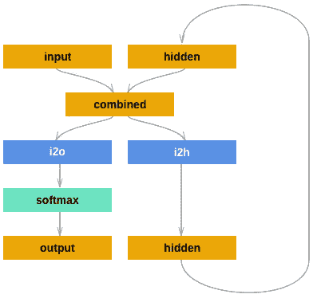
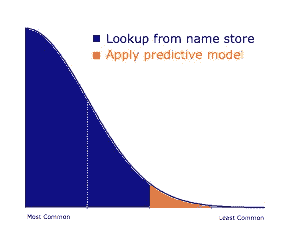

# 从多国名字中的字符序列推断性别

> 原文：<https://towardsdatascience.com/name2gender-introduction-626d89378fb0?source=collection_archive---------3----------------------->

Gender Inference from Character Sequences in Multinational First Names using Naïve Bayes and PyTorch Char-RNN

考虑到“约翰”和“辛迪”这两个名字，大多数人会立刻认为约翰是男性名字，而辛迪是女性名字。是这样吗*主要是*因为我们看到了太多男嫖客和女嫖客的例子，以至于我们的大脑在特定的名字和相应的性别之间建立了潜在的联系？大概吧。

但是名字本身的某些组成部分(它的拼写/字母组合)也在很大程度上决定了它的性别。想想“安迪”和“安迪”这两个名字。他们在发音上是一样的([/ˇn . di/](https://en.wiktionary.org/wiki/Andy#Pronunciation))，但是大多数人在看到拼写时会把“安迪”归类为男性，而“安迪”归类为女性。名字的后缀可以表明名字的性别；然而，规则并不是一成不变的。例如，以 *-yn* 结尾的名字似乎主要是女性，尽管事实上以 *-n* 结尾的名字往往是男性；而以 *-ch* 结尾的名字通常是男性，即使以 *-h* 结尾的名字往往是女性[【1】](https://medium.com/@ellisbrown/name2gender-introduction-626d89378fb0#fa55)。不仅仅是后缀，还有更多的字符模式对应着特定的性别分类——这个任务并不简单。

当你考虑到来自世界各地的所有名字的空间时，名字的性别分类变得越来越困难——我到目前为止给出的例子都是从一个标准的美国人的角度来看的。现在让我们来考虑两个印度名字(我几乎没有接触过这种文化):当我看到“Priyanka”和“Srikanth”这两个名字时，我立刻认为 Priyanka 是女性，Srikanth 是男性。这是为什么呢？我们的大脑是如何提取编码在组成一个名字的字符序列中的揭示性别的信息的？

## 谁在乎呢。

在市场营销、社会科学以及学术界和工业界的许多其他应用中，需要对未知个体的性别进行准确预测。也许一个人的性别最明显、最能说明问题的标志是他们的名字。在通过名字对性别进行分类方面，大多数先前的工作涉及使用已知姓名的大型语料库来给出已知姓名的概率预测。这篇文章试图通过研究名字的方方面面来探索未知名字的空间，特别关注名字中的字符序列，这些方面包含了重要的性别信息。这也是将 ML/DL 应用于实际问题的一次练习。

这个性别分类问题类似于自然语言理解中的一大类问题，但有着本质的不同。对于“猫”和“狗”这两个词，几乎所有人都会把猫归为雌性，把狗归为雄性。

source: [https://goo.gl/YZPEjm](https://goo.gl/YZPEjm)

这里的核心区别是，当我们阅读“狗”这个词时，我们的大脑将字符序列“d-o-g”翻译成抽象实体的高维表示，即*是我们对狗的理解。我们大脑中这种高维表征的一些特征组合，与我们对男性*的抽象表征相比，与女性*的抽象表征更密切相关；包含性别揭示信息的不是字符序列本身(至少在大部分情况下)。***

**当你把性别分类问题从名字抽象到所有的单词时，这个问题就变得更加有趣了。从语言学上来说，许多语言都是用语法性别的概念来构建的，其中语言中的名词类别在形式上与一组离散的性别相关联。在这种语言中，一个单词中的某些字符序列几乎可以确定该单词的语法性别。学习这些字符序列——无论是显式的还是隐式的——是学习语言的固有部分。此外，对这种字符模式的理解可以帮助理解未见过的单词。出于这些原因，研究嵌入字符序列中的信息似乎是语言学和 NLU 的一个有趣且不可或缺的话题，这超出了本文的范围。**

# **方法学**

> **该项目的所有代码可在[GitHub://Ellis brown/**name 2 gender**](https://github.com/ellisbrown/name2gender)获得。**

** [## ellisbrown/name2gender

### 在 GitHub 上创建一个帐户，为 name2gender 开发做出贡献。

github.com](https://github.com/ellisbrown/name2gender/) 

作为该主题的初始方法，我探索了一种普通的机器学习技术，使用已知与姓名的相关性别高度相关的姓名的硬编码特征(如前面提到的后缀)。这种快速而肮脏的实现实际上能够以最少的工作获得相当好的结果。

这种方法中使用的特性直接取自 NLTK 书籍:

> 以-a、-e 和-i 结尾的名字很可能是女性，而以-k、-o、-r、-s 和-t 结尾的名字很可能是男性……以-yn 结尾的名字似乎主要是女性，尽管以-n 结尾的名字往往是男性；以-ch 结尾的名字通常是男性，尽管以-h 结尾的名字往往是女性。[【1】](https://medium.com/@ellisbrown/name2gender-introduction-626d89378fb0#fa55)

Naïve-Bayes features of first name

这些特性被插入到 NLTK naive Bayes 分类器中，以便于训练和测试。

## 结果

我用 70/30 的训练-测试分割(大约 95k 训练名称，大约 40.6k 测试名称)来训练这个模型。测试精度大约在 **85%** 左右，对于这个任务来说可以说是相当不错了。

代码使用示例可在[naive _ Bayes/**demo . ipynb**](https://github.com/ellisbrown/name2gender/blob/master/naive_bayes/demo.ipynb)获得。

# 夏尔-RNN

当然，一个名字中有很多很多的字符模式可能包含性别暗示——尤其是当考虑到我们的全球(世界)名字空间时；当我们有深度学习的时候，试图硬编码每一个可能的模式似乎是荒谬的。在这种情况下，我使用 [PyTorch](http://pytorch.org/about/) 探索了一种字符级递归神经网络方法，该方法试图学习各种揭示性别的序列，而不必明确指定它们。

## 张量表示

这里的第一步是弄清楚如何将一个名字表示为一个张量。因为我们的目标是找出组成名字的字母序列中的所有细微差别，所以我们希望分解名字，逐个字符地看。为了表示每个字符，我们创建一个大小为`<1 x N_LETTERS>` 的[一键向量](https://hackernoon.com/what-is-one-hot-encoding-why-and-when-do-you-have-to-use-it-e3c6186d008f)(一个一键向量除了在当前字母的索引处填充 1 之外都填充 0，例如`"**c**" = <0 0 **1** 0 0 ... 0>`)。

Name/Tensor conversion

另一种方法可能是通过字符在字母表`"**c**" = 3`中的位置来存储字符的值；然而，这可能导致模型学习我们不希望的字符值中的一些模式(例如，它可能学习到“c”与“a”比与“x”更相似，因为它们在字母顺序上更接近，而实际上没有相似性差异)。

## 模型定义

然后，我们定义网络模块本身的结构:

source: https://goo.gl/BB7h2A

按照 [PyTorch name nationality 分类示例](https://goo.gl/BB7h2A)的指导，我们创建了一个简单的网络，其中 2 个[线性](https://en.wikipedia.org/wiki/Linear_map) [层](http://pytorch.org/docs/master/nn.html#linear-layers)在输入和隐藏状态上操作，一个 [LogSoftmax](http://pytorch.org/docs/master/nn.html#logsoftmax) 层在输出上操作。我用 128 个隐藏单位[【4】](https://medium.com/@ellisbrown/name2gender-introduction-626d89378fb0#e6fb)。

这是一个非常简单的网络定义，可以通过添加更多的线性图层或更好地塑造网络来进行改进。

RNN Module definition

## 结果

我再次用 70/30 的训练测试分割法分割数据集(约 95k 个训练名称，约 40.6k 个测试名称)。我能达到的最好的测试精度大约是 **75.4%精度**。我没有花太多时间调整超参数以获得更好的结果。

# 数据集— [名称 2 性别/数据/](https://github.com/ellisbrown/name2gender/tree/master/data)

我扩展了 NLTK 的姓名语料库，增加了更多代表各种文化的数据集，形成了一个大数据集(约 135 万个实例)，包含按性别分类的名字，可以在我的存储库中找到。请参见[data/**dataset . ipynb**](https://github.com/ellisbrown/name2gender/blob/master/data/dataset.ipynb)了解更多关于我如何将它整合在一起的信息。*注意:*我没有花太多的时间来检查和整理这个数据集，所以它可能并不令人惊讶或特别干净(如果有人关心或有时间，我将非常感谢任何公关！).

改进/清理该数据集可能是最初最有效的改进。此外，使用只包含来自单一文化特性的名称的资料集，在预测该文化特性中的名称方面可能会好得多。** 

# **放弃**

**值得承认的是，有许多名字，比如我自己的名字(埃利斯)，在两性中几乎一样常见。与世界上出现的频率相反，包含离散标签的数据集更容易遇到，因此我只考虑了这些数据集给出的名称的二进制分类。一个更可靠的方法是结合人群中出现的频率，给出一个更有概率的性别预测。刘的“性别-姓名关联分数”方法可能是一个好方法[【3】](https://medium.com/@ellisbrown/name2gender-introduction-626d89378fb0#408a)。性别不明确的名字的存在也限制了性别分类系统所能达到的最好的真实世界的准确性。**

**此外，在我们的社会中，越来越多的运动开始认可传统的二元男性和女性性别。由于这些努力仍处于起步阶段，包含这些扩大的性别分类的数据很少(如果有的话)，我没有试图将它们纳入这一分析。**

**我也只考虑用拉丁字母写的名字。对于这篇文章来说，抽象成完全语言不可知的分类是一个非常艰巨的任务。**

# **未来的工作**

**正如我上面提到的，改进数据集绝对是改进的最佳起点。**

**对发现名字分类有用的人来说，将这个名字应用到名字的变体的性别分类将是非常有用的。正如刘所说:**

> **昵称、缩写、混乱的名字和用户名经常包含不小的性别暗示。确定提取和使用这些线索来更准确地推断性别的策略是未来工作的一个有希望的方向。”**

****也有可能精心设计测试方案来更好地代表真实世界的用例。在我的分析中，我认为每个名字出现的可能性都是一样的。一个更好的真实世界数据集可能包括某个名字在世界上出现频率的某种表示。例如，“约翰”的频率比“埃利斯”高得多这种变化会影响测试结果的计算方式，以及整个系统。理想情况下，我们的数据集中应该包含大多数常见的名字。****

********

****Name Frequency scheme****

****对于这样的名字，我们可以简单地查找我们的数据存储中有哪些名字的性别。我们的预测系统将只适用于不常见的名称集。为了测试这个系统设置，我们可以按照频率等级对名字进行排序，并保留 30%最不常用的名字。****

# ****参考****

1.  ****伯德，s .，克莱因，e .和洛珀，e .“6 . 1 . 1 性别鉴定”*用 Python 进行自然语言处理:用自然语言工具包分析文本*，O'Reilly，2009，【www.nltk.org/book/ch06.html. ****
2.  ***“语法性别。”维基百科，维基媒体基金会，2017 年 12 月 21 日，[en.wikipedia.org/wiki/Grammatical_gender](https://en.wikipedia.org/wiki/Grammatical_gender)。***
3.  ***刘，w .和露丝，D 名字里有什么？在 Twitter 中使用名字作为性别推断的特征" *AAAI 春季研讨会系列* (2013)，2017 年 12 月 21 日[https://www . aaai . org/OCS/index . PHP/SSS/SSS 13/paper/view/5744/5908](https://www.aaai.org/ocs/index.php/SSS/SSS13/paper/view/5744/5908)。***
4.  ***用字符级 RNN 对名字进行分类*用字符级 RNN 对姓名进行分类*，PyTorch Docs，2017，[http://py torch . org/tutorials/intermediate/char _ rnn _ classification _ tutorial . html](http://pytorch.org/tutorials/intermediate/char_rnn_classification_tutorial.html)。***