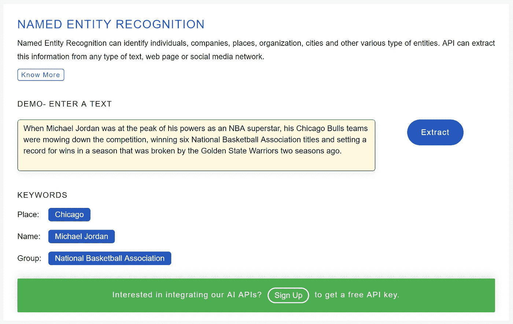
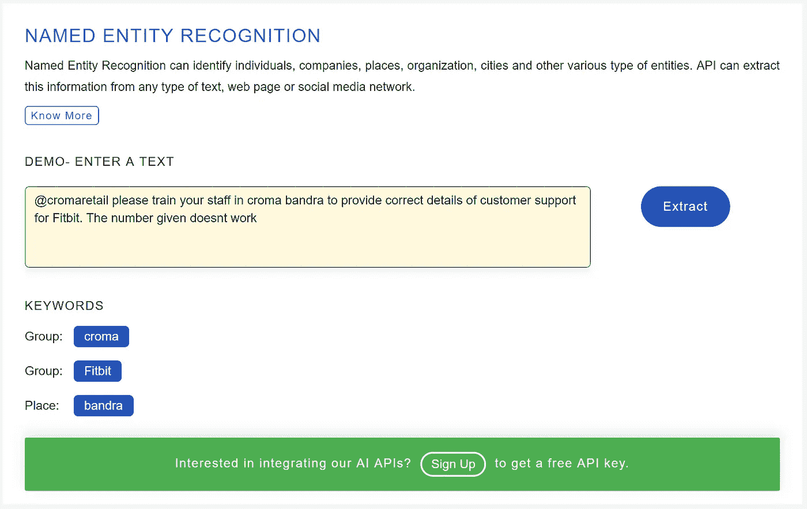

# 命名实体识别:应用和用例

> 原文：<https://towardsdatascience.com/named-entity-recognition-applications-and-use-cases-acdbf57d595e?source=collection_archive---------2----------------------->

命名实体识别是一个过程，其中算法将一串文本(句子或段落)作为输入，并识别该串中提到的相关名词(人、地点和组织)。在我们之前的博客中，我们给了你一瞥我们的[命名实体识别 API](https://www.paralleldots.com/named-entity-recognition) 是如何工作的。在这篇文章中，我们列出了命名实体识别技术的一些场景和用例。

# 命名实体识别的用例

# 为新闻提供商分类内容

新闻和出版社每天都会生成大量在线内容，正确管理这些内容对于充分利用每篇文章非常重要。命名实体识别可以自动扫描整篇文章，并揭示其中讨论的主要人物、组织和地点。了解每篇文章的相关标签有助于在定义的层次结构中自动对文章进行分类，并实现顺畅的内容发现。下面的例子说明了这种工作方式。

命名实体识别 API 已经成功地识别了文章的所有相关标签，并且这可以用于分类。

# 高效搜索算法

假设您正在为一家拥有数百万篇文章的在线出版商设计一个内部搜索算法。如果对于每一个搜索查询，算法最终都要搜索数百万篇文章中的所有单词，那么这个过程将会花费很多时间。相反，如果命名实体识别可以在所有文章上运行一次，并且与这些文章中的每一个相关联的相关实体(标签)被分开存储，这可以大大加快搜索过程。使用这种方法，搜索词将只与每篇文章中讨论的少量实体匹配，从而加快搜索执行速度。

# 支持内容推荐

命名实体识别的一个主要用例涉及推荐过程的自动化。推荐系统主导着我们在当今世界发现新内容和新想法的方式。网飞的例子表明，开发一个有效的推荐系统可以为媒体公司创造奇迹，让他们的平台更有吸引力，更容易吸引人。对于新闻出版商来说，使用命名实体识别来推荐类似的文章是一种行之有效的方法。BBC 新闻下面的例子展示了类似文章的推荐在现实生活中是如何实现的。这可以通过从特定的文章中提取实体并推荐其他文章来完成，这些文章中提到了最相似的实体。这是一种方法，我们已经有效地用于为媒体行业客户开发内容推荐。

# 客户支持

有许多方法可以使客户反馈处理过程顺利进行，命名实体识别可能是其中之一。我们举个例子来了解一下过程。如果您正在处理一家在全球有多个分支机构的电子商店的客户支持部门，您会在客户反馈中看到许多提及。比如像这样，

现在，如果您通过命名实体识别 API 传递它，它会提取出实体 Bandra(位置)和 Fitbit(产品)。这可以用来对投诉进行分类，并将其分配给组织内应该处理该投诉的相关部门。

同样，也可能有其他反馈推文，你可以根据它们的位置和提到的产品对它们进行分类。您可以创建一个按不同部门分类的反馈数据库，并运行分析来评估每个部门的能力。

# 研究论文

在线期刊或出版网站拥有数百万篇研究论文和学术文章。一个主题可能有数百篇论文，只需稍加修改。以结构良好的方式组织所有这些数据会变得非常复杂。在网上“浏览”那么多数据，寻找一个特定的信息可能不是最好的选择。根据相关实体对论文进行分类可以省去浏览大量主题信息的麻烦。例如，可能有大约 20 万篇关于机器学习的论文。如果你根据提取的实体给它们加上标签，你会很快找到讨论使用卷积神经网络进行人脸检测的文章。

非结构化的文本内容富含信息，但是找到相关的内容总是一项具有挑战性的任务。随着来自社交媒体、电子邮件、博客、新闻和学术文章的大量数据，从这些信息中提取、分类和学习变得越来越困难，也越来越重要。对于流程发现，可能有其他 NLP 技术，但是当您希望您的分类数据结构良好时，命名实体识别 API 是您的最佳选择。尝试我们的[命名实体识别 API](https://www.paralleldots.com/named-entity-recognition) 并亲自检查。如果您对命名实体识别的用例有其他想法，请在下面的评论部分分享。你也可以[注册](https://www.paralleldots.com/sign-up)获得一个免费的 API 密匙。

[parallel dots AI API](https://www.paralleldots.com/)，是由 [ParallelDots Inc](https://paralleldots.xyz/) 提供的深度学习支持的 web 服务，可以理解大量的非结构化文本和视觉内容，为您的产品提供支持。您可以查看我们的一些文本分析&视觉智能[API](https://www.paralleldots.com/text-analysis-apis)并通过填写此处的表格[或在 apis@paralleldots.com 给我们写信来联系我们。](https://www.paralleldots.com/contact-us)