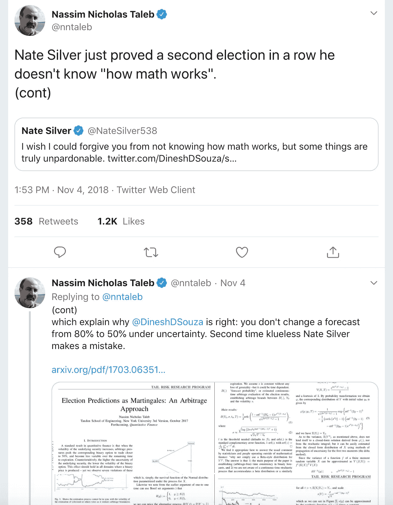

# 内特·西尔弗诉纳西姆·尼古拉斯·塔勒布和艾萨克·费伯

> 原文：<https://towardsdatascience.com/nate-silver-v-nassim-nicholas-taleb-and-isaac-faber-888e56e2acac?source=collection_archive---------15----------------------->

[Isaac Faber](https://medium.com/u/81d6b9acba62?source=post_page-----888e56e2acac--------------------------------) 最近在博客上写道，[为什么你应该关心 Nate Silver 和 Nassim Taleb 的推特之战:两个数据专家怎么会有这么大的分歧？在阅读他的简介时，我强烈反对他关于争论的性质和原因的观点。作为一名曾在芝加哥商业交易所从事衍生品交易的交易员，我发现塔勒布的观点很准确，但并不令人信服，而西尔弗的回应则简单粗暴，而且跑题了。我想是塔勒布先开始的，但他是出了名的尖酸刻薄，整个对话都是在 twitter 上进行的，所以我希望西尔弗能站在高处，像一个以严谨著称的统计学家那样，解决一些相关的数学问题。](/why-you-should-care-about-the-nate-silver-vs-nassim-taleb-twitter-war-a581dce1f5fc)

塔勒布认为，对选举的准确预测，无论是概率预测还是非概率预测，都不会随着时间的推移而大幅修改，除非出现彻底的混乱(比如宣布内战)。西尔弗认为，对选举的准确预测包括选举过程的不确定性，选民的变化会准确地导致结果概率预测的大幅波动。

费伯的文章没有抓住塔勒布的重点，引发了西尔弗经常提到的担忧，好像这些担忧是对他不利的证据。这些担忧对对话的健康发展至关重要，我相信塔勒布为西尔弗提供了另一个解决问题的途径。但显然西尔弗和费伯都没有注意到这三个人都在同一边，所以开始了。第一，Faber 的优秀背景:【如果你熟悉背景和 Taleb 和 Silver，就跳到酒吧的最后。]

> *“张瀚银是*[*fivethirtyeeight*](https://fivethirtyeight.com/)*的联合创始人。一个非常受欢迎的专注于数据的博客，因其准确预测 2008 年美国大选的结果而闻名。Silver 使用一种聪明的民意调查汇总技术来生成预测，这种技术考虑到了偏见，例如民意调查者只给使用座机的人打电话。*
> 
> 作为一名训练有素的统计学家，通过经济学，他将自己对棒球(sabermetrics)和扑克分析的热情引入了政治领域。事实上，FiveThirtyEight 这个名字是对美国选举人票数(538 张)的认可。然而，博客也涵盖了其他兴趣领域，如体育。内特把他的博客卖给了 ESPN，并接受了主编的工作。他们(ESPN)利用它作为一个平台，向观众提供体育赛事的预测，FiveThirtyEight 后来搬到了美国广播公司。对他们网站的例行访问是政治和体育文章的混合，带有详细的预测和数据可视化。

[*Silver (left) in conversation with NY1’s Pat Kiernan*](https://commons.wikimedia.org/wiki/File:Nate_Silver_in_Conversation_with_NY1%27s_Pat_Kiernan.jpg)

> *内特的预测能力已经成为大众媒体公认的标准。他是许多全国电视节目的常客，在每个全国选举周期讨论他的预测。因此，当畅销书作家、量化风险专家纳西姆·塔勒布(Nassim Taleb)公开宣布 FiveThirtyEight 不知道如何正确预测选举时，人们感到非常震惊！*
> 
> *对塔勒布来说，由于他对现实世界中概率的敏锐理解，他已经变得非常成功。他的书既有哲学的，也有技术的，重点是不确定性和风险。具体来说，他认为实践中使用的绝大多数定量模型都没有充分考虑到现实世界的风险。相反，它们给人一种短期价值的错觉(比如在一些很好理解的情况下是准确的)，但当不知情的用户经历模型设计不理解的情况时，他们会面临巨大的系统风险。*

*Nassim Taleb*

> 塔勒布之所以出名，部分是因为他通过暴露自己的财富将自己的哲学付诸实践。马尔科姆·格拉德威尔在《纽约客》上写了一篇文章，讲述了塔勒布是如何将他的风险哲学转变为一种极其成功的投资策略的。从那以后，他在不可预见的市场事件中获得了巨额财富，如黑色星期一、俄罗斯债务违约和 2008 年金融危机。塔勒布现在花很多时间写作和硬拉(我很嫉妒这一点)。他不羞于公开告诉别人他不同意他们的观点:内特·西尔弗就是其中之一。

*Taleb’s Tweets directed at Silver November 2018*

> 然而，西尔弗并没有屈服于这些侮辱！

> *Silver 和 Taleb 分别拥有 300 万和 30 万粉丝，在这些交易所引起了巨大的轰动(从 2016 年开始)。然而，快速浏览评论线程，你会发现很少有人理解这些论点。甚至西尔弗自己似乎也被塔勒布的攻击弄得措手不及。*

两人都是熟练的统计学家，西尔弗是更好的民意测验专家，而塔勒布是更好的数学家。塔勒布从未声称对民调了解多少，而西尔弗也没有数学博士学位。他们都在各自的领域享有专业的认可和成功，都是畅销书作家。他们都是贝叶斯统计的支持者，贝叶斯统计是统计学的一个实证主义子集，坚持通过合理的框架随着时间的推移纳入额外的信息。他们都喜欢使用蒙特卡罗方法，这是一种统计/算法方法，使用模型的重复随机抽样来获得数字结果。他们的共同点比争论点多得多。但是这个特殊的论点很重要。

他们的争论归结为一点:预测准确性的定义。准确性被定义为正确或精确的性质或状态，因此准确的预测是正确的、精确的和准确的(从精确的定义中得出)。一个数学家(或任何人，给定信息、工具、时间和倾向)可以说，“这里是候选人，这里是选举人团的选票，这里是投票区，如果一切都按特朗普的方式进行，这里会发生什么，如果一切都按希拉里的方式进行，这里会发生什么，如果 X 支持特朗普，Y 支持希拉里，这里会发生什么，”并继续对所有潜在的结果进行组合建模。这种组合建模是严格正确的，除非对所有可能的输入建模失败。

**塔勒布认为对选举的准确预测不会随着时间的推移而大幅修正，除非出现完全的混乱(比如宣布内战)。** [他有明确的标准来定义不可接受的大修改，以及在给定的选举中找到它的等式【ARXIV 文章，数学很重】](https://arxiv.org/pdf/1703.06351.pdf)。但他也坚持认为，预测的结果包括更高的不确定性，如果它存在的情况下。按照这些思路对 6 个月后的选举进行概率描述可能会是这样的:“希拉里有 75%的机会获胜，特朗普有 20%，还有 5%的可能性发生，不确定性给这些结果增加了大约 30%的灵活性。”固有的预测是‘希拉里会赢’。这种统计模型是整体的——它一次看到整个结果，概率完全是基于结果的。数值预测是如何得到的并不重要，一个超出修正标准的预测就是错误的。上述预测在 11 月份是错误的，尽管概率部分只有在结果不包含在组合可能性空间中时才是错误的。

Silver 在选举期间的帖子表明了他的想法，即在正常情况下，对选举的准确预测会随着时间的推移而被大规模修正(根据 Taleb 的定义)。他创建了每个附属选举的模型，使用民意调查的知情知识为每个附属选举的每个结果分配加权概率，并创建了所谓的选举蒙特卡洛模拟。在蒙特卡洛模拟中，统计学家创建他们的模型，然后通过数百或数千次模拟运行来运行该模型，并限制附属数字的随机性。这种受限的随机性导致了对所有可能结果的了解。蒙特卡罗方法可用于产生每个最终结论的净概率，如通过使用其加权随机因子多次运行该模型所证明的，但是辅助成分权重的小变化可导致大的修正。假设共和党的投票率增加 5%，但特别是那些在摇摆州的摇摆区的投票率，可以改变整个模拟结果，使其对特朗普更加有利。由于净概率是模型的组合潜力的叠加，任何包含在组合图中的结果都是可能的。

预测和概率是有区别的。概率是对某事可能发生的程度、某事发生的可能性或事实的估计。预测是对未来将会发生的特定事情或者某件事情的结果的陈述性估计。概率预测表明某一特定事件发生的概率是给定的。

西尔弗做概率预测。如果一个概率预测包含了已经发生的结果，它就没有错，就像一个组合分析不会因为一个结果在模型中比实际结果出现得更频繁而出错一样。说一件事情有 70%的可能性发生，并不意味着如果其他事情发生了，你就是错的，只要其他事情也包括在你的模型中。然而，如果你可以重复实验数百万次，并看到在绝大多数实际结果中有 80%或 50%的可能性发生，那就错了。预测只发生一次，所以实验不能重复。

[Isaac Faber](https://medium.com/u/81d6b9acba62?source=post_page-----888e56e2acac--------------------------------) 的帖子描述了随机不确定性和认知不确定性的区别:

> 随机不确定性与基本系统有关(在标准骰子上掷出六点的概率)。认知不确定性与系统的不确定性有关(骰子有几个面？掷出 6 的概率是多少？).像 FiveThirtyEight 这样的定制模型只向公众报告偶然的不确定性，因为它涉及到它们的统计输出(在这种情况下由蒙特卡洛进行推断)。麻烦在于认知的不确定性很难(有时不可能)估计。

他接着断言“塔勒布竭力反对的”是

> 如果一个预测不符合一些基本特征，它就不应该作为一种可能性被推销。更重要的是，一个预测应该从发布给公众的时候就开始判断，而不仅仅是在事件发生之前。预测者应该对偶然性和认知性的不确定性负责。

费伯的苏格拉底式的塔勒布(我个人没有发现塔勒布在哪里提出这个字面上的例子)抱怨内特·西尔弗不可能是错的，因为他在报告*概率*，但他这样做的方式导致他们很容易被视为没有概率元素的*预测*，这是不负责任的。这可能是真的，但是断言*在这个问题上有目的的*不负责任的疏忽是没有根据的，因为内特·西尔弗和五个三十岁的男孩已经尽力向那些感兴趣的人解释他们的方法。西尔弗同意，将他的概率作为严格预测的二次报道是新闻和媒体中的一个常见问题。

艾萨克的观点有些道理。像内特·西尔弗这种地位的人公开做出的概率预测，将被代理人解读，并根据内部程序采取行动。人类的一个这样的过程是把一个概率性的预测折叠成一个预测，然后从那里得到一个断言。有证据表明，史蒂夫·班农和川普竞选团队利用这一事实[和对民调的不信任](https://www.politico.com/story/2016/11/election-day-2016-update-clinton-trump-230919)，来保持自信和有目的，而他们自己的内部民调反映了不同的现实。这一结果的部分责任在于 Nate Silver、FiveThirtyEight 和任何报道概率预测的人，这些预测被[认为](https://psmag.com/news/forecasting-election-voting-midterms-politics-change-outcome-91818)到[降低了选民投票率](https://thinkprogress.org/calling-the-democratic-primary-early-may-have-led-to-lower-turnout-433a8baf36ab/) [在受青睐的一方](https://andrewgelman.com/2016/12/08/19-things-learned-2016-election/) [中，如果它们被解读为预示井喷](http://www.sfweekly.com/news/nine-things-to-keep-in-mind-if-the-blue-wave-comes-up-a-little-short/)。随着来自 Silver 的头条新闻，如“[特朗普正在加倍押注一个失败的策略](https://fivethirtyeight.com/features/trump-is-doubling-down-on-a-losing-strategy/)”以及概率预测，作者对读者认为民主党胜利已是囊中之物负有一定责任。

如果公众和二手报道没有明智地整合你提供的信息的倾向，并且你的网站显然会被报道和阅读，我个人同意有义务以一种不容易被误解的方式报道你自己的发现。对于 Nate Silver 和 FiveThirtyEight 来说，创建一个带有相关输入的蒙特卡罗模型的图形表示并显示过程的模糊性，而不生成或公布一个容易被误解的基于百分比的概率预测是很简单的。

然而，我认为 Silver 和 Taleb 之间的分歧比其他人报告预测的概率更重要。塔勒布曾亲自断言，精确的蒙特卡洛衍生的*基于百分比的概率预测*，就像任何概率预测一样，不应该偏离或随时间变化超过任何相关的、微小的修订标准。西尔弗坚持认为这是应该的。

**这是一个重要的区别，但如果你考虑到他们截然不同的背景，这就不足为奇了。** ***塔勒布，其背景是量化金融，习惯于波动的基础工具，以及复杂衍生品的创造和部署，以捕捉其内在的不确定性*** 。如果概率预测是不正确的，那么他在管理投资基金时会损失数十亿美元。一旦对基础资产的概率预测被锁定，市场就会创造衍生品来描述各种结果，并根据这种不确定性来定价。在塔勒布的世界里，情况的不确定性不是预测的不确定性的基础，而我和你的预测之间的差异是我们相应地给自己的东西定价并相互买卖的基础。然后，随着时间的推移，我们都将是正确的，或者我们都将被纠正，退出市场。

另一方面，西尔弗在民意调查方面的背景是习惯于动荡的政治和体育局势，但除了人为的终结之外，没有捕捉它们的不确定性的机制——一场比赛的结束，一场选举的结果。在白银领域，与市场的瞬间过程相比，反馈相对较少。与体育不同，政治中的规则和信息具有很强的可塑性和开放性。民意测验专家提供信息，选民和候选人在评判候选人、创造信息和开展竞选活动时都会考虑到这一点。

***两者背景的关键区别在于每时每刻决定行动路线的绝对正确性的价值。根据塔勒布的预测准确性标准，民意调查者、选民、候选人、竞选经理，这些人都不会从竞选期间对选举概率预测的准确公众评估中获得多少好处。这些信息将完全不在他们的任何决策阈值之内，并且没有机制来捕捉或受益于该过程固有的不确定性。***

一个公开的组合分析对于一个竞选经理来说已经足够了，他正在寻求把每一个可能的结果都推向他们的方向。他们想让选民知道哪些比赛正在进行。之后，预测的准确性是有价值的，只要它明确地*不是公开的，*特权信息在政治上不像在市场上那样是非法的。

对概率预测的准确解读会导致投票人理论上只关心娱乐价值。如前所述，这种娱乐以一种令人担忧的方式对投票本身施加激励，表明它们不是随机产生的。

候选人或许可以从准确性中受益，但往往无法亲自利用微妙的信息，特别是在权衡真正的未知可能给那些患有公共职位竞选精神病的人带来的额外压力时。此外，上述关于公共信息价值的说明对他们和他们的竞选经理都适用。班农从一开始就臭名昭著地告诉川普，“[你有百分之百的机会赢得](https://www.esquire.com/news-politics/a13266971/election-2016-behind-the-scenes/)。”

***西尔弗正在向市场报告他的蒙特卡洛方法的结果，作为概率预测，而市场并不像塔勒布那样关心准确性或从准确性中获取价值，西尔弗的新闻报道照原样非常受欢迎。作为一名记者/统计学家，他小心翼翼地将自己的预测描述为概率性的，按照塔勒布的标准，他报告的结果显然是不准确的。但是，只有在存在利用信息的机制的情况下，对绝对正确的实时概率模型的要求才是有价值的。***

我发现西尔弗和塔勒布在谈话中都非常傲慢。考虑到塔勒布的数学并没有失去任何严谨性，西尔弗的人身攻击([对不起，兄弟，但你已经有点成为一个知识分子，但白痴](https://twitter.com/natesilver538/status/1062782704159256576?lang=en)’)令人尴尬。尽管你很难责怪他，考虑到塔勒布愿意抄袭特朗普总统的剧本，称西尔弗为“[Klueless](https://twitter.com/nntaleb/status/1059202808208125952)”[原文如此]，以及塔勒布故意忽视缺乏任何激励机制来改变广泛变异的概率预测。

从历史上看，Silver 的模型在汇总民意调查信息方面比大多数公共来源更加准确。实际上，西尔弗可能必须每小时发表一篇毫无信息但准确的文章《我们不知道谁会赢》，才能成为塔勒布标准的“好预测者”，而塔勒布的标准忽视了民调新闻的激励作用。内特·西尔弗在新闻业的游戏中有太多的经验，不能忽视它的惯例。塔勒布声称“[预测选举不是内特·西尔弗的事情](https://twitter.com/nntaleb/status/1059202808208125952)”，这是天真的表现。这可能是对 Twitter 的控诉(我避开了这个平台，即使是对 Taleb 这样的热门平台，因为它总是奖励刻薄和尖刻的讽刺而不是理性)，但我发现令人难过的是，当他们有如此多的共同点时，他们却在互相攻击。

因此，[fivethirtyeeight](https://medium.com/u/2e5f29790cac?source=post_page-----888e56e2acac--------------------------------)和[纳西姆·尼古拉斯·塔勒布](https://medium.com/u/f138bf5466fe?source=post_page-----888e56e2acac--------------------------------)注意，如果我能挑选两个人来承担选举报道和新闻业中概率预测的失败，那将是你们两个。如果你们两个能更好地讨论准确的政治预测是什么样的，对选民和 Silver 的利益相关者有用，这对民主的未来非常重要，如果它导致知情人士中意外的选民自我抑制，我将不胜感激。