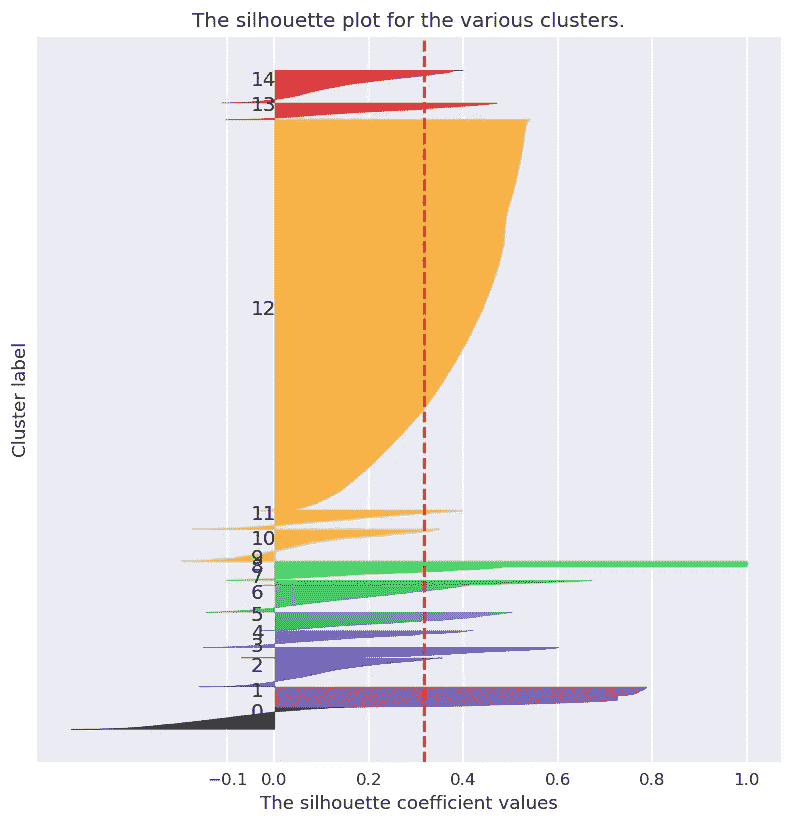
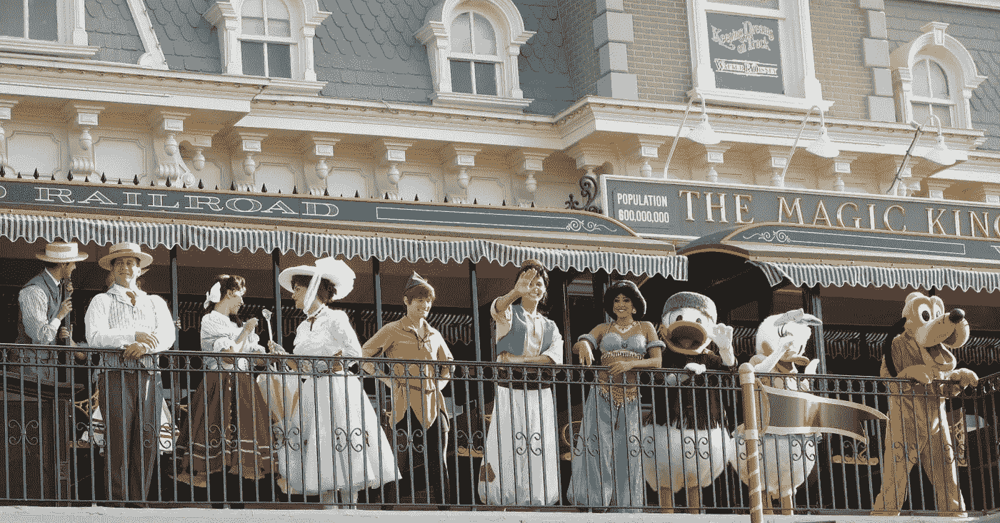

# 社交媒体内容的自然语言处理

> 原文：<https://towardsdatascience.com/natural-language-processing-analysis-of-social-media-content-55518ded990c?source=collection_archive---------4----------------------->

## 备用标题:全世界都在谈论华特·迪士尼公司吗？是的，是的，它是。

Photo by [geralt](https://pixabay.com/users/geralt-9301/) on [pixabay](https://pixabay.com/photos/people-google-polaroid-pinterest-3175027/)

# 该设置

华特·迪士尼公司是一家多产的跨国公司，拥有大约 20 万名员工，仅根据我写这篇文章时的股票价值和已发行股票的数量，我估计其总价值约为 1500 亿至 1600 亿美元。与大多数公司一样，你最好相信，他们有既得利益来衡量他们的客户和公众对他们提供的服务和他们创造的产品的感受，但收集这些信息，无论是通过亲自，通过电话，电子邮件或邮寄客户调查和问卷，都需要花费金钱和时间来创建，传播，收集和分析。我想看看我是否可以使用自然语言处理(NLP)工具和无监督的机器学习，以最低的成本实时衡量公众对迪士尼的看法。

# 获取数据

Photo by [geralt](https://pixabay.com/users/geralt-9301/) on [pixabay](https://pixabay.com/illustrations/twitter-keyboard-social-media-3075846/)

首先，我需要文本形式的数据，这是公开发布的，可能包含特定主题的观点；我转向推特。我使用 Twitter API(应用程序接口)编写了一个脚本来下载与关键字和标签“迪士尼”相关的推文，因为它们发布在网上。是的，任何人都可以对任何推文自由地这样做，甚至可以从存储的后备目录中查询它们。除了推文文本之外，你还可以下载与该推文以及发布或转发该状态的用户相关的大量数据和元数据，包括但*绝对不*限于:时间、日期、地点、语言、关注者数量、关注的账户数量、账户创建日期、个人资料图片以及发布该推文和转发该状态的用户的用户名。我将实时 tweet 流式传输到 MongoDB 集合中，因为我有很多 tweet 要分析，所以我将它们存储在个人 AWS (Amazon Web Services)实例中。如果有人对这些工具感兴趣，或者只是想了解整个电脑世界可以获得哪些关于你的 Twitter 账户的信息，我会在这篇文章的底部提供一些链接，你可以查看一下。

# 初步材料

我每天收集大约 100，000 到 120，000 条推文，使用 30 多种不同的语言，都与迪士尼有关。当我研究这些数据时，我发现了我的第一个偏见来源。当我搜索关键字 disney 的许多排列时(例如“disney”、“disney's”、“Disney # Disney”等)。)，这不会收集与我的主题相关的所有可能的推文，只会收集提到我的搜索列表中某个单词的推文。例如，我的搜索条件会收集到一条类似“我爱迪斯尼世界！”，而不是“我爱 EPCOT！”，因为第二条推文不包含类似于“迪士尼”的词我可以扩展我的搜索列表，以具体包括每个主题公园，但这会使我的推文偏向主题公园，我根本无法包括每部迪士尼电影、电视节目和角色的名称。为了让我的分析尽可能客观，我保持了我的搜索标准的普遍性，这使我的推文偏向于标题中有“迪士尼”字样的过度代表属性，如华特·迪士尼世界和迪士尼频道。

我把我的大约 50 万条迪士尼推文，削减到 32 万条英文，我实际上可以阅读，然后我通过一个名为 TextBlob 的 Python 库运行它们，它分析文本的每个数据点，在这种情况下是一条推文，并计算极性，介于-1(不利)和 1(有利)之间，0 表示情绪是中性的。所有推文的分布平均值约为 0.115，或正或负，如下图所示。

Image by Author

我想这是非常巧妙的，但事实是，迪士尼公司实际上是其他公司的巨大联合企业，包括漫威、卢卡斯影业、ESPN、ABC、迪士尼公园和度假村、迪士尼游轮公司等等，以及相关知识产权的非常多样化的组合。我不认为了解总体情绪会像了解特定知识产权或品牌的情绪那样对公司有用。为了将这些推文分组到单独的类别中，而不是单独查看每个类别，我们需要通过无监督学习转向聚类，但首先我们需要探索矢量化和降维！令人兴奋的东西。

# 数据清理和矢量化

Photo by [LoboStudioHamburg](https://pixabay.com/users/lobostudiohamburg-13838/) on [pixabay](https://pixabay.com/photos/phone-display-apps-applications-292994/)

总的来说，我觉得数据清理很有趣，但是读起来很乏味。不幸的是它也是超级重要的，所以我不得不提到它。使用 tweet 的最大问题是重复的 tweet。我不能排除收集转发，因为我觉得，一条被转发的正面推文仍然表明对该主题的新的积极情绪，并且可能在以后有用，但你不能用重复的数据点聚集数据；我稍后会谈到这一点，但现在请相信我的话，有大量完全相同的文本对我的分析非常不利。因此，我删除了任何推文中的任何 url、符号或转发标签，然后我只保留了每个文本数据点的唯一集合，以清除任何转发或自动机器人的内容，结果产生了大约 98，000 条推文。

所有算法的输入都是数字。有许多不同的方法可以将其他形式的数据转化为数字格式，例如将一张图片解构为每个像素的红色、绿色和蓝色值，或者在我的情况下，将一条 tweet 的单词转化为 tweet 中每个单词的计数，这称为标记化和矢量化。首先，定义什么是标记，它可以是每个唯一的单词、相邻单词的组合，甚至是一定数量的相邻字母的任意组合。根据您的需要，这些技术当然可以单独使用或组合使用。接下来，对文本进行矢量化，为每个数据点的每个标记分配一个值。最基本的例子是以文本“*我喜欢汤*”为例，它向量化为[ *我* :1，*喜欢* :1，*汤* :1]。我们现在有了文本的数字表示！接下来，为了将我们所有的推文放在同一个表中，我们不能只为“*我喜欢汤*”设置一行，为每个“*我*”、“*喜欢*”和“*汤*”设置一列，但是我们需要为包含在任何数据点中的每个单词设置一列。例如，如果我们的第二个数据点是“*我不喜欢飞行*”,*我喜欢汤*的矢量化现在必须扩展以指定它*不包含新单词，这样它的新值是[ *i* :1， *like* :1， *soup* :1， *do* :0， *not* 而“*我不喜欢飞*”的值为[ *i* :1， *like* :1，*汤* :0， *do* :1， *not* :1，*飞* :1]，这样我们两个数据点的值不同，但格式完全相同。 你可以看到 98，000 条独特的推文，每个文本数据点的计数将迅速变得巨大，即使大多数计数将是 0。*

Photo by [geralt](https://pixabay.com/users/geralt-9301/) on [pixabay](https://pixabay.com/illustrations/smartphone-hand-photomontage-faces-1445489/)

还和我在一起吗？太棒了。所以现在我们有一个漂亮的表格/数据集，有 98，000 行，每行代表一条推文，还有大约 10，000 列，每列代表一个独特的词在那条推文中出现的次数。这个表大部分是 0，也有一些 1，2，偶尔还有 3 混在里面，现在其实是另外一种问题了。如果有人(比如一个计算机程序)只看表格中的数字，并决定这些推文是相似还是不同，它们看起来都差不多，因为几乎每一行都由大约 10，000 个 0 组成，还有少量的 1，2 和 3。这是*维数灾难*的一个例子，这是许多分析领域每天都要面对的问题。

在继续进行降维之前，我还想提一下，我删除了停用词，如“*、*、*、*和“ *if”、*，这些词的分析价值很小，并且对这些词进行了加权，以便如果像“迪士尼”这样的词出现在许多数据点中，那么它在确定推文主题之间的差异方面的价值就较小。

# 降维

哇，这个帖子越来越长了，所以让我们向前冲，尝试覆盖一些地面。如果你休息了一会儿再回来，这里是我们的位置:我们想按迪士尼主题对一堆推文进行分组，我们已经将我们的文本转换成数字格式，现在我们有一个大约 10，000 列的数据集，其中大部分是零，这是准确的，但不利于分析。为了减少数据集中的列数，但仍然包含大量描述性信息，我使用了奇异值分解(SVD)。基本上，它所做的是获取 tweets 中的所有信息(可变性),并将其提取到少量新创建的专栏中。这个过程很抽象，线性代数很重，也很复杂。重要的是，我们可以将最初包含在 10，000 个令牌列中的大量信息压缩到几十个新列中，这很好。

我们现在已经创建了一个所谓的 LSI 空间(潜在语义索引)，可以帮助我们确定每个新列在将推文分成具有共同词汇的主题组方面的有用性。不幸的是，由于新列的“提炼”性质，这些数据比直接的字数统计更难解释，所以让我们将这些列提供给聚类算法。补充说明:新的专栏将把有共同词汇的推文放在一起，这就是为什么转发和机器人是不好的。如果完全相同的 20 个单词在相同的推文中出现 15000 次，那么它就会人为地在这些单词之间创建一种关系，从而混淆模型。

# 使聚集

我很想深入研究 K-Means 无监督聚类算法的来龙去脉，但我不会，相反，我只会说两件事。首先，该算法(或模型)将每个数据点分配给一个聚类数，以便文本相似的推文被聚集在一起，理想情况下是某种逻辑主题或话题。第二，让它不受监督的是，你**不用**用它来创建预测，然后对照已知数据进行测试，这将受到监督。监督学习的一个例子是给一个模型一些信息，比如星期几、天气状况、一天中的时间等等。，并让模型预测它认为公共汽车是否会准时或晚点。一旦你有了一个预测，你就将它与实际发生的事情进行比较，并决定它是对还是错；相当直接。对于像 k-means 这样的无监督模型，我给它一堆数据，如矢量化的推文，然后算法将数据点分组到集群中，但由于我们不知道推文的内容以查看模型的表现如何，我需要筛选每个分组的推文，以查看集群是否遵循一些有用的主题。开门见山地说，在这种情况下，他们没有。

Image by Author

上面是一个轮廓图，它基本上显示了我的大多数推文是在一个巨大的、相当分散的集群中(12)，而其他集群相比之下要小得多。当查看每个分组中包含的推文时，在某些情况下，有明确的主题，尽管主题之间几乎总是有很多重叠和信号中的混乱。换句话说，我无法找出一个单独的聚类，也无法相信它包含了某个特定主题的所有推文，比如品牌、人物、电影等等。

Image by Author

# 为什么迪士尼推文很难处理

因此，在进行了大量的模型调整和尝试不同的东西来让我的聚类算法产生一些真正令人兴奋和有见地的东西(给我发一条消息，我会很高兴地详细研究所有这些东西)之后，有一段时间我不得不得出结论，这些推文就是不想与我合作。也就是说，我认为仍然有一些东西可以学习，你甚至可能会发现它很有趣，所以让我们深入研究几个集群，看看为什么迪士尼推文不喜欢分成组。

首先，这是我的数据集中一条推文的常见例子:
- *“我想去迪士尼！”* 尽管我很欣赏，甚至可能同意这种观点，但如果你能想象这条推文的矢量化版本会是什么样，就没有多少模型可以使用了。如果非要给这条推文贴上一个话题的标签，会是什么？也许我们可以推断他们在谈论一个主题公园，但是并没有真正提到一个特定的公园，或者一部电影，或者甚至是一个角色作为主题标签。这条推文中肯定缺乏信号，或可用的信息。

Image by Author

当深入到另一个确定的集群时，我会看到下面的推文:
- *“爱丽儿是唯一一个生过孩子的迪士尼公主。”
——“风中奇缘怎么不是迪士尼公主？”从这些照片中，我可以看到某种类型的“迪士尼公主”主题开始形成，这将是伟大的！但是当我深入研究时，我发现在许多其他的分类中也提到了公主，这表明我的主题之间的混淆。
- *“迪士尼同时拥有漫威和卢卡斯的电影，idc 你怎么说首里和莱娅是我眼中的迪士尼公主”* 这是一条与前两条属于同一组的推文的例子，但第三条不可否认地包括了与漫威和卢卡斯电影有关的材料。如果我对漫威和星球大战/卢卡斯的电影有一个分类，模型会把这条推文放在哪里？*

最后一个例子:
*——“迪士尼不仅仅是迪士尼* ***乐园*** *！#迪士尼****smmc****@迪士尼* ***巡航****@迪士尼* ***奥拉尼****@****DVC****新闻@Disneymoms"* 在这条推文中我看到了‘公园’，‘smmc’(迪士尼的一个特别活动——社交媒体妈妈们与前面的例子一样，我将这解释为一条推文中的大量潜在信号，但没有足够明显的信号让模型能够将它与同一主题的文本相似的推文放在一个类别中。

Image by Author

# 结束语

因此，也许我不能像我希望的那样代表迪士尼完成高效、信息丰富、以品牌为中心的情感分析，但我确实带你快速或不那么快速地浏览了一个简单的 NLP 项目是如何构建的，以及在此过程中如何以及为什么要完成某些步骤。事实证明，迪士尼公司非常擅长获取知识产权，比如一个成功的角色，并将其传播到许多业务中。像阿拉丁这样的角色出现在电影、电视剧、主题公园、游轮、商品中，甚至更多，有时甚至与看似不相关的角色一起出现，这并不罕见。不仅如此，似乎当有人喜欢迪士尼电影时，他们可能也会喜欢公园、游轮，甚至可能会举办迪士尼婚礼，在一条 280 字的推特中提到这一切。这只是迪士尼如此成功的几个原因，也是为什么我的模型很难将这些推文分成不同的主题。

Image by Author

感谢你在整个过程中坚持下来，或者至少跳过技术部分阅读结尾！我希望你发现了一些有趣的东西，并随时在这里或 LinkedIn 上让我知道你的想法！([https://www.linkedin.com/in/sky-williams/](https://www.linkedin.com/in/sky-williams/)

# 资源

Twitter API:【https://developer.twitter.com/en/docs
亚马逊 Web 服务:[https://aws.amazon.com](https://aws.amazon.com)
MongoDB:[https://www.mongodb.com](https://www.mongodb.com)
如果你想了解我使用的任何技术、算法、方法或库的细节:[https://www.linkedin.com/in/sky-williams/](https://www.linkedin.com/in/sky-williams/)