# 【Nature / Google /论文摘要】利用电子健康记录进行可扩展的精确深度学习

> 原文：<https://towardsdatascience.com/nature-google-paper-summary-scalable-and-accurate-deep-learning-with-electronic-health-e67a05a9ccad?source=collection_archive---------4----------------------->

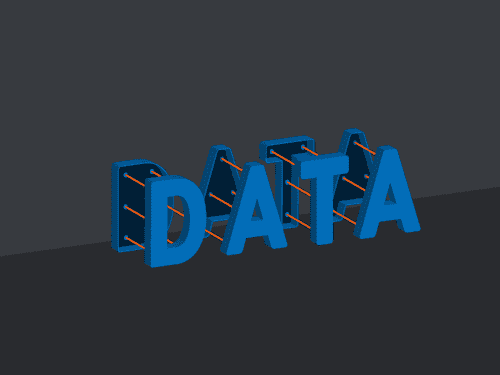

GIF from this [website](https://giphy.com/gifs/design-data-ORYgct7M6YynC)

另一个很好的例子，或者深度学习如何使医疗保健行业受益。

> **请注意，这篇文章是让未来的我回顾和回顾这篇论文上的材料，而不是从头再看一遍。**

**摘要**

使用电子健康记录(EHR)数据进行预测建模对医疗保健行业非常有益。然而，使用这些数据存在挑战，因为不同的医疗保健机构使用不同的格式，并且标准化所有这些数据是一个手动密集型过程，通常会丢弃许多患者数据。然而，这篇论文的作者使用原始 EHR 数据，并将其转换为[快速医疗保健互操作性资源](https://en.wikipedia.org/wiki/Fast_Healthcare_Interoperability_Resources) (FHIR)格式，以训练深度神经网络来预测与患者相关的不同医疗状况。这导致了较高的准确性，特别是住院死亡率(受试者操作曲线下面积[AUROC]跨站点 0.93-0.94)、30 天计划外再入院(AUROC 0.75-0.76)、住院时间延长(AUROC 0.85-0.86)和患者最终出院诊断(频率加权 AUROC 0.90)。此外，他们总共使用了 46，864，534，945 个数据点。

**简介**

最近收集了越来越多的患者数据，不幸的是，并非所有这些数据都用于预测建模。发生这种情况的主要原因是因为数据需要大量处理，传统方法才能很好地工作。(此外，有如此多的数据，所以传统方法只从这些数据中选择几个公共变量。这可能会导致性能下降。).这篇论文的作者使用深度学习来克服这些问题。神经网络的一个优点是，研究人员不必指定要考虑哪些变量，因为网络本身会这样做。

**相关工作**

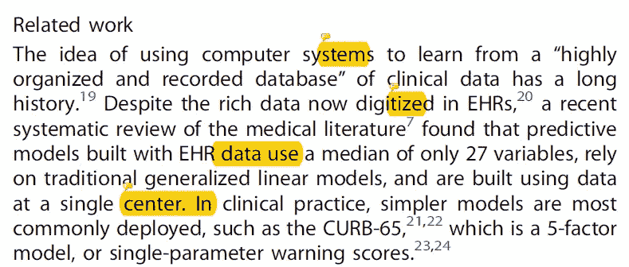

尽管我们有丰富的 EHR 数据集，但传统方法只使用 27 个变量的中位数。(而且多是广义线性模型。).另一个问题是，不同的机构使用不同的协议来保存数据，并且将这些数据预处理为规范化的数据需要大量时间。尽管它不能确保语义的一致性，但一种叫做 [FHIR](https://www.hl7.org/fhir/overview.html) (快速医疗互操作性资源)的灵活数据结构变得可用。许多不同的研究人员使用不同类型的神经网络(自动编码器、CNN 和 RNN)来预测传统 EHR 数据的不同结果。但是，大多数先前的工作只集中在使用可用数据的子集。最后，作者指出了对世界的两大贡献。
1) **一个通用的数据处理管道，可以将原始 EHR 数据作为输入，并在没有手动特征协调的情况下产生 FHIR 输出**2)E**深度学习模型在各种预测问题和设置(例如，多个预测时间)中的有效性。(使用两家医院的数据。)**

**结果**

Table of Characteristics of hospitalizations in training and test sets

上表显示了从两个机构收集的数据的一些统计特性。作者指出的其他一些特性…
*1)涉及 114，003 名患者的 216，221 次住院治疗的总数
2)住院期间死亡率为 2.3% (4930/216，221)，非计划 30 天再入院率为 12.9% (27，918/216，221)，长期住院率为 23.9%。
3)患者的出院诊断范围为 1–228。
4)平均入院有 137，882 个标记(将在方法部分描述)
5)考虑了出院时进行的 46，864，534，945 个 EHR 数据标记的预测。*

**结果:死亡率**

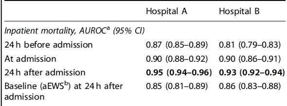

在死亡率预测任务中，深度学习方法立即能够大幅度超越传统方法。如上所述，与[增强预警分数](https://www.philips.ca/healthcare/articles/early-warning-scoring-tools-for-rapid-response/turn-vital-signs-into-vital-action)相比，深度学习方法在两个机构上都具有更高的准确性。不仅拯救了宝贵的生命，也拯救了资源。

**结果:再次入院/长期住院**

同样，深度学习方法继续保持连胜，甚至预测了 30 天内的意外再入院，与传统预测方法相比有巨大的优势。

此外，对于预测入院 24 小时后的住院时间，深度学习方法再次以巨大的优势胜过传统方法。

**结果:推断出院诊断**

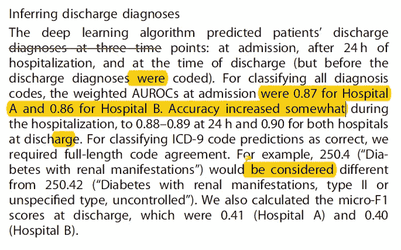

深度学习模型在三个不同的时间戳做出关于出院诊断的预测。(1 点在入院时，2 点在 24 小时后，3 点在医生给出诊断之前。)并且该模型能够以 86.5 的平均准确度成功地预测出院诊断，并且该准确度随着患者在医院停留的时间延长而提高。(高达 90 度)

**结果:模型解释案例研究**

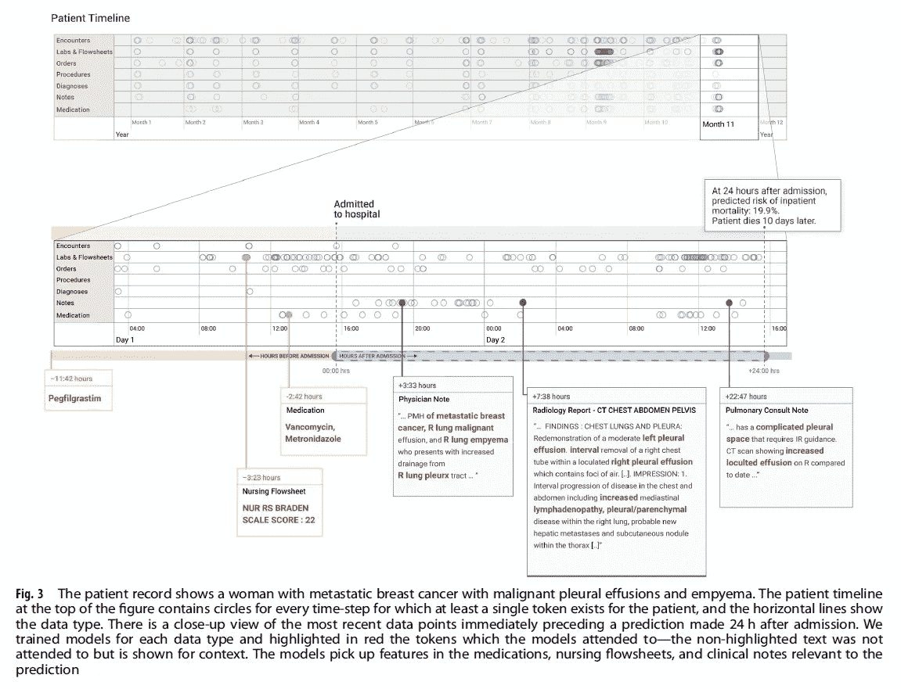

完成了一个案例研究，作者将深度学习模型与传统方法模型进行了比较。对于一名患者，深度学习模型预测死亡风险为 19.9%，传统方法预测死亡风险为 9.3%。不幸的是，患者在入院 10 天后去世。上图显示了深度学习模型已经考虑进行预测的所有 175，639 个数据点。该模型对一些特征给予了很高的权重，这些特征包括来自 notes 的恶性胸腔积液和脓胸的证据、使用的抗生素和压疮高风险的护理文件(即 Braden 指数 41)。(上面加粗的部分是模型认为重要的所有特性。不涉及手动部分。)

**讨论**

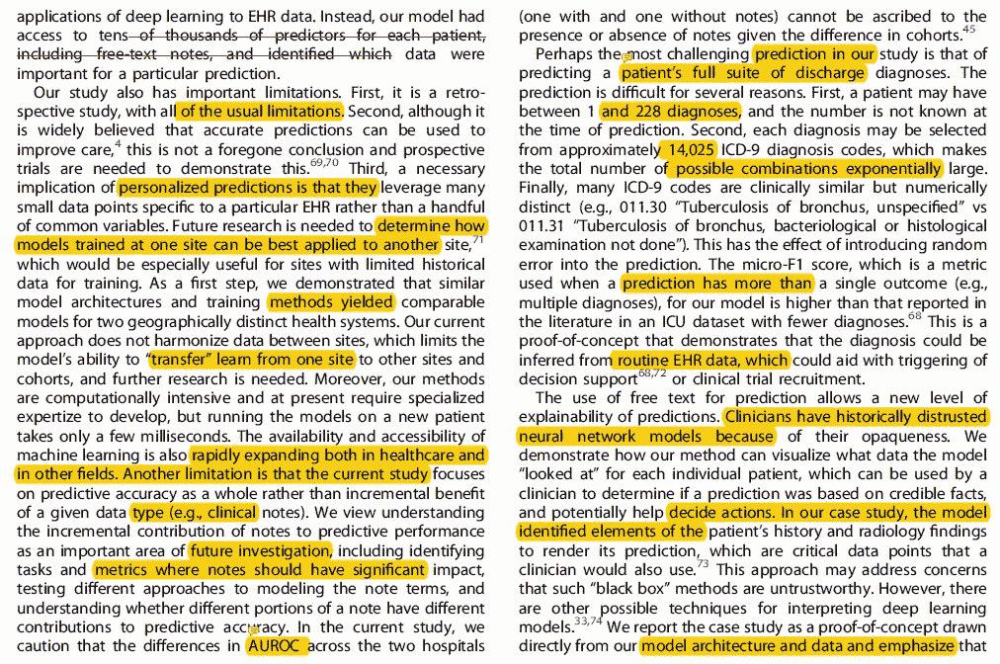

作者对深度学习方法是否可以很好地扩展很感兴趣，所以他们使用单一的数据结构来进行所有的预测。(这优于传统方法。).这种方法一个额外的好处是，模型在做决策时考虑了更多的特征，这有助于获得更好的性能。

总的来说，深度学习模型能够优于预测死亡率、意外再入院和住院时间增加，由于设置的差异，其他领域很难直接进行比较。一个有趣的发现是，深度学习模型发出的警报数量是传统预测模型的一半，因为它的假阳性少得多。这项研究之所以重要的另一个原因是，它不涉及专家的干预。(选择功能时)

这项研究的一些局限性包括…
1) [回顾性研究](https://www.youtube.com/watch?v=6jy8Q0bibgk)
2)需要更多的试验来证明这种模型如何更好地使用
3)个性化预测利用了许多特定于特定 EHR 的小数据点，而不是一些常见变量。
4)不清楚在一个地点训练的模型是否能在其他地点表现良好
5)计算成本高
6)由于 ICD-9 码的结构，可能会在预测中引入随机误差。

**方法:数据集**

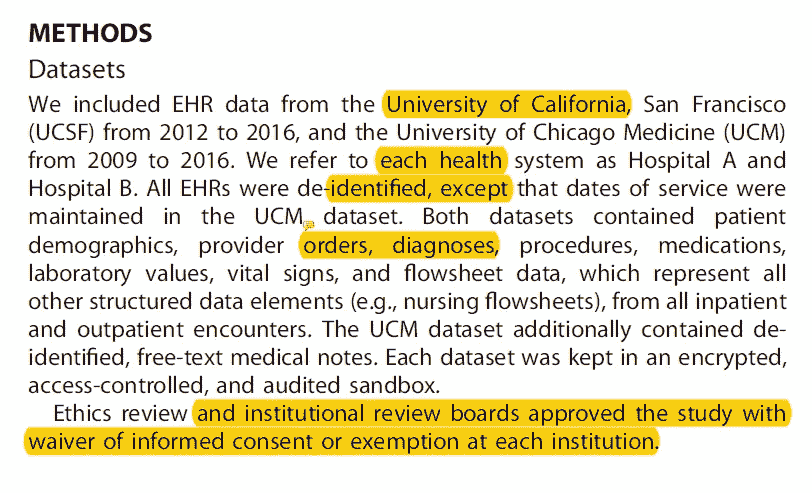

所有数据均由加州大学和芝加哥大学医学系提供。(每个都有不同的时间线，所有的数据都被删除。)

**方法:数据表示和处理**

所有输入的数据都被转换成单一的数据结构，以模拟时间线事件，并使用 FHIR 标准数据结构。(所有数值都被归一化，FHIR 属性被分割成离散值，作者将其命名为令牌。)数据管线的图示可以在下面看到，更详细的解释可以在补充阅读中看到。

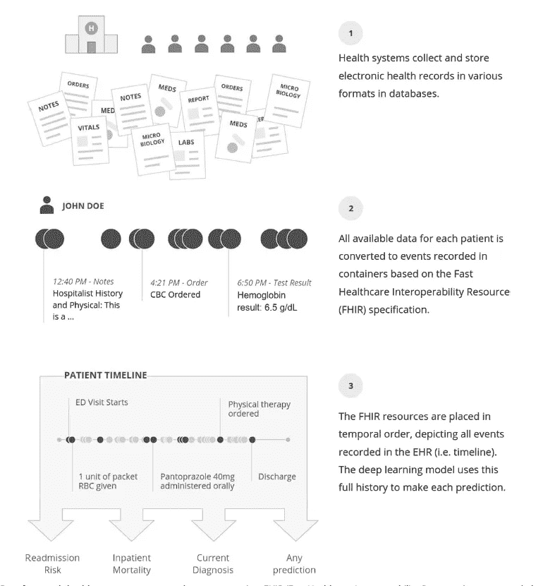

**方法:结果**

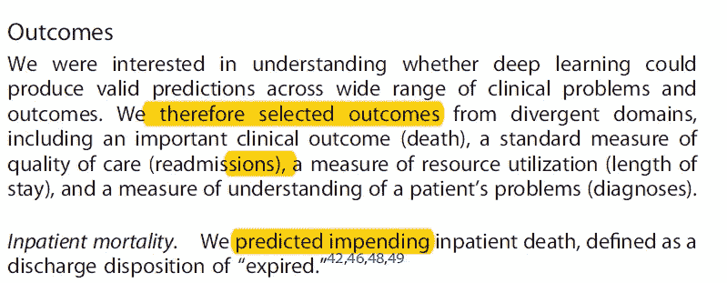

在这一节中，作者描述了他们所做预测的每一个属性，每一个属性都可以归纳为。

**住院死亡率:**预测即将发生的住院死亡
**30 天计划外再入院:**出院后 30 天内住院
**住院时间长:**住院时间至少 7 天
**诊断:**原发性和继发性 ICD-9 账单诊断

**方法:队列研究**

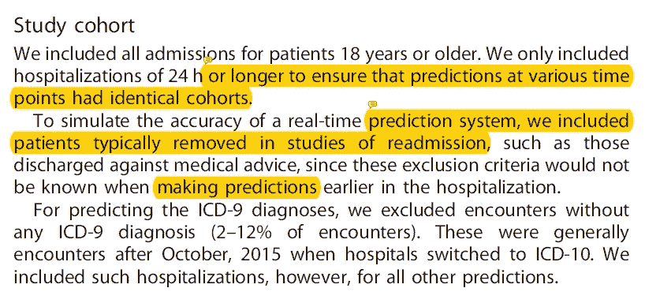

总之，患者年龄都在 18 岁或以上，住院时间最短为 24 小时，不包括没有 ICD-9 诊断的住院患者。，(自从医院制定了新的 ICD-10 协议)

**方法:算法开发与分析**

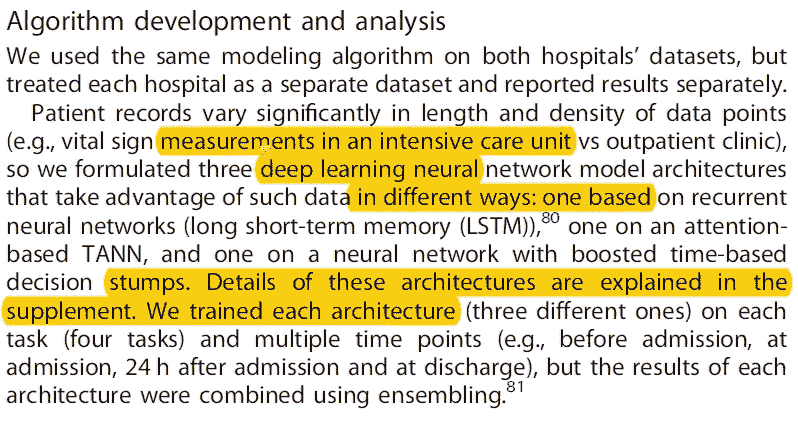

作者使用了三种不同的网络架构，循环神经网络(长短期记忆(LSTM))，80 一种是基于注意力的 TANN，另一种是基于增强的基于时间的决策树桩的神经网络。

**方法:解释预测**

更多的细节在补充阅读中，但简而言之 Tensorflow 和 C++被用来建立模型。和 scikit-learn 用于统计分析。

**最后的话**

我从来不知道通过使用 tensorflow 和 scikit-learn 我们可以完成多少工作。但是知道这篇论文(发表在《自然》杂志上)的作者使用 python 来构建他们的模型让我很兴奋。

**参考**

1.  (2018).Arxiv.org。检索于 2018 年 6 月 27 日，来自[https://arxiv.org/ftp/arxiv/papers/1801/1801.07860.pdf](https://arxiv.org/ftp/arxiv/papers/1801/1801.07860.pdf)
2.  快速医疗互操作性资源。(2018).En.wikipedia.org。检索于 2018 年 6 月 27 日，来自[https://en . Wikipedia . org/wiki/Fast _ health care _ inter operability _ Resources](https://en.wikipedia.org/wiki/Fast_Healthcare_Interoperability_Resources)
3.  Anon，(2018)。[在线]可在:[https://www.hl7.org/fhir/overview.html](https://www.hl7.org/fhir/overview.html)【2018 年 6 月 30 日获取】。
4.  将生命体征转变为重要行动。(2018).飞利浦。检索于 2018 年 6 月 30 日，来自[https://www . Philips . ca/health care/articles/early-warning-scoring-tools-for-rapid-response/turn-vital-signs-to-vital-action](https://www.philips.ca/healthcare/articles/early-warning-scoring-tools-for-rapid-response/turn-vital-signs-into-vital-action)
5.  回顾性队列研究。(2018).YouTube。检索于 2018 年 6 月 30 日，来自 https://www.youtube.com/watch?v=6jy8Q0bibgk