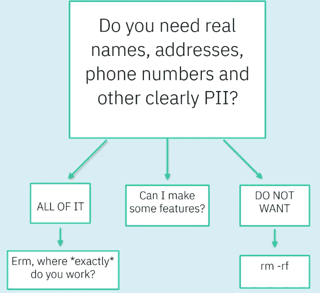
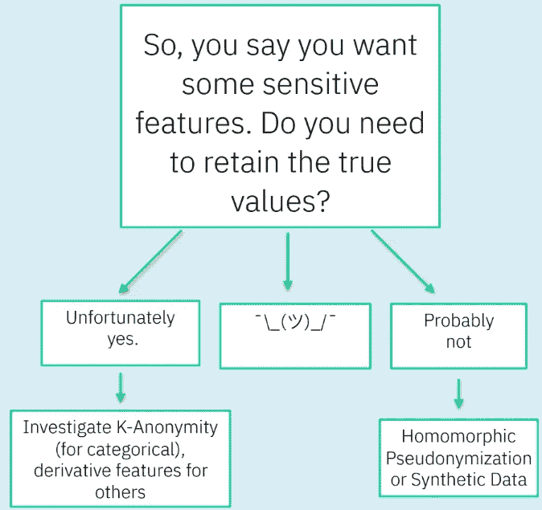
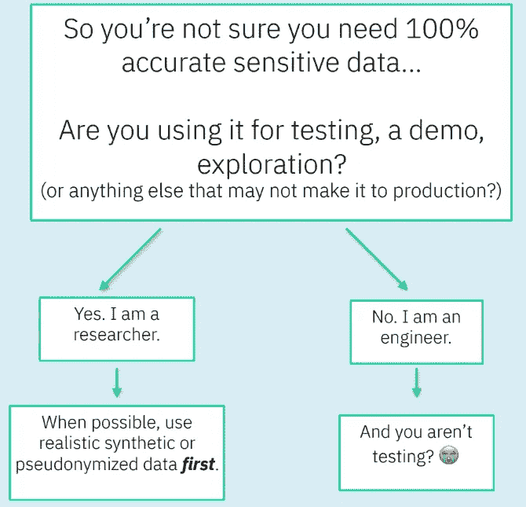
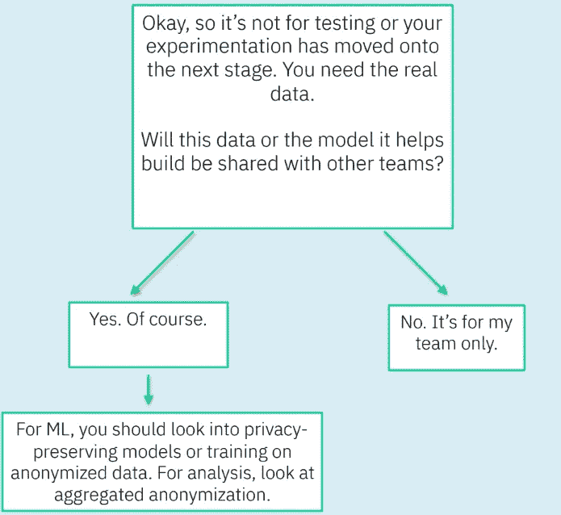
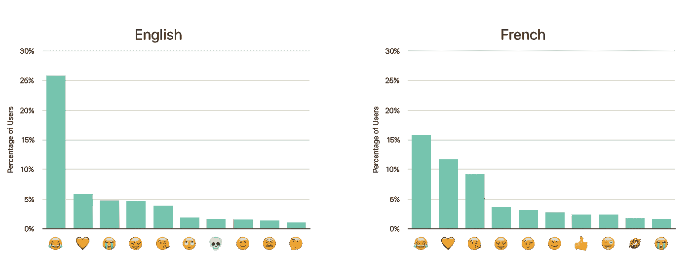
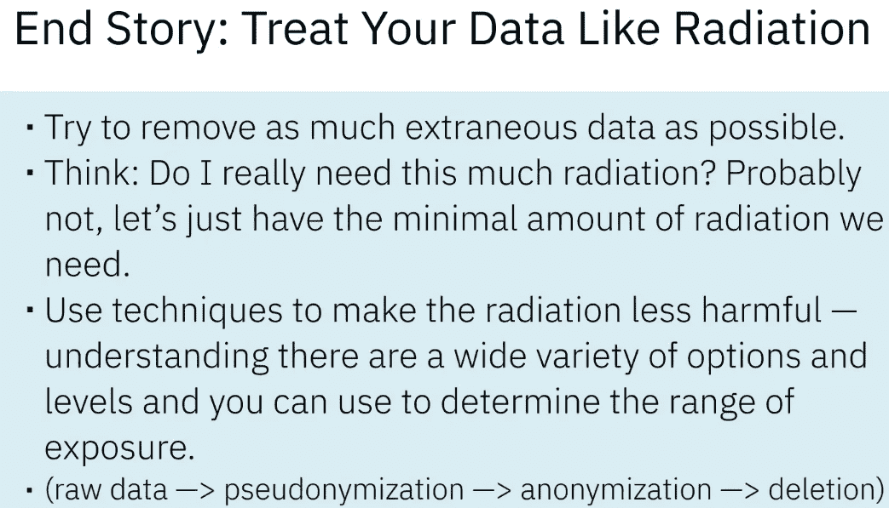

# 穿越数据隐私迷宫:给数据科学家的提示

> 原文：<https://towardsdatascience.com/navigating-the-data-privacy-maze-tips-for-data-scientists-c2f784969f29?source=collection_archive---------6----------------------->

决定如何最好地保护数据和隐私是很困难的。如果您是一名处理潜在敏感数据的数据科学家，这意味着确定您可以使用哪些数据以及如何最好地保护这些数据。这可能会导致您在失败中放弃——完全放弃并选择使用原始数据，这反过来会使您的数据分析和模型暴露于信息泄漏，并使它们容易受到攻击。

我们在[ki protect](https://kiprotect.com)的目标是尝试让这个过程对您来说更简单—您如何在专注于数据科学的同时还能确保您的数据受到保护？我最近在爱丁堡的 PyData 上给了[一个关于这个](https://www.meetup.com/PyData-Edinburgh/events/252667141/)的演讲——这启发了我写这篇文章([在 GitHub 上的完整幻灯片](https://github.com/pydataedinburgh/meetups/tree/master/meetup-2018-07-25))。

我们将从概述您的困境开始:您是一名数据科学家，专注于使用客户数据分析或构建模型。您知道隐私和安全性很重要(理论上)，但是您没有花太多时间考虑安全性，并且通常将它留给您的 IT 团队。也就是说，你知道你正在管理客户数据，你想*做正确的事情***。**

**那么，如何开始呢？我们将通过流程图探索您的旅行，因为——嗯——它们很有趣。当然，信息也很丰富。**

**你的第一选择是关于你的数据。最好的策略是一开始就不要使用任何敏感数据。让我们从这里开始:**

****

**所以，你可能会说——是的，我需要数据！很明显！但我真的希望你考虑一下。所以，我再问一次——这次用稍微不同的方式。**

****

**因为..我真的希望你考虑一下。如果你没有数据，你真的需要足够的数据去收集它吗？很多时候，拥有一些额外的数据或变量可能是件好事，但你并不真的需要它——或者你无法证明收集它的必要性。**

**现在，我在这一步得到了很多涉及未知的问题。它是这样的:“但是 kjam，我只是不知道*是否需要它！如果后来发现，一个人名字的最后一个字符确实决定了他的信用度，那该怎么办？”(我们可以就这种类型的特征工程的伦理进行大量的讨论，但是我将把它留给另一篇文章)。***

**我要求你做的是像基线一样对待你最初的分析；就像你测试一个新的模型或技术一样。首先，您建立一个基线，这是您对隐私风险最小的数据进行的数据分析。如果你愿意的话，尽量少暴露。我保证你可以**总是**在以后添加数据回来。但是，根据您构建或使用分析的目的，稍后删除数据可能会很棘手。建立一个低隐私风险基线，并发现是的，你的数据有足够的信息，同时仍然保护隐私是最佳结果。因此，删除敏感数据的风险要小得多！**

**让我们进入流程图的下一步——假设您确定确实需要私人数据。让我们想想我们可以保护它的方法！**

****

**希望你不需要明确的私人信息，如姓名、地址或身份证号码。也许你想从这些属性中提取一些特征(比如，地理位置、性别或受教育程度)。只要有可能，首先尝试删除它们，并查看您的隐私基线对其他不太敏感的功能有何看法。但是，如果你已经确定你需要他们，继续前进到我们流程图的下一步…**

****

**如果您必须保留敏感数据，并且需要使用真实值(即邮政编码或城市或教育水平)。对于这些数据，确定 K-匿名是否有助于保护隐私。这个概念是由拉坦亚·斯威尼博士在她的论文[*k-匿名:保护隐私的模型*](http://www.cs.pomona.edu/~sara/classes/cs190-fall12/k-anonymity.pdf) 中首次提出的。在揭露马萨诸塞州州长威廉·韦尔德的健康数据可以通过将选民登记记录与“匿名化”的医院记录联系起来来识别之后，她提出了这一方法(这是在他声称健康记录发布将完全匿名化之后的[)。](https://arstechnica.com/tech-policy/2009/09/your-secrets-live-online-in-databases-of-ruin/)**

**K-匿名通过创建桶来保护身份识别攻击，桶中的任何单个人都由一组 K 个人来代表。这意味着您实际上是在尝试缩小数据——使用城市而不是邮政编码或年龄范围(35-45)而不是实际年龄。这就允许了一些貌似合理的否认(确切地说，这不是我的记录——可能是我团队中其他 4 个人中的任何一个！).在研究 K-匿名时，还需要回顾一下[l-多样性](https://www.utdallas.edu/~muratk/courses/privacy08f_files/ldiversity.pdf)和[t-亲密度](https://www.utdallas.edu/~mxk055100/courses/privacy08f_files/tcloseness.pdf)，这有助于增强隐私——特别是如果你的小组有相当不平衡的目标或特征(即，一个小组中的所有个人都有相同的目标变量，因此知道小组暴露了目标)。**

**如果不需要保留敏感变量，使用同态假名化或合成数据将允许您保留数据集中的有效值，而不会暴露真实值。合成数据通常是仍然有效的虚构数据，所以虚构的名字代替真实的名字等等。这通常是不可逆的(或者，如果是这样的话，它通常被称为“令牌化”,并且需要有一个非常大的查找表，其中名称或其他数据被映射到不同的值，并且可以被映射回来。当然，这意味着名称被存储在一个大的查找表中…从安全性以及随着输入空间的增长而增加的大小和复杂性来看，这不是一个好主意。)**

**在 KIProtect，我们已经发布了[我们的同态假名化 API](https://docs.kiprotect.com) ，它允许您在保护隐私的同时保留数据的某些有效性和结构。我们基于加密的方法意味着您还可以通过密钥对数据进行去假名化，以揭示真实值(如果您不确定以后是否需要真实值，这非常有用，因为您可以从假名化的值中恢复它们)。假名化方法允许前缀保留数据类型-例如，数据集中的所有年份都可以映射到同一个新年假名-保留那些日期或其他数据的信息，其中与附近点的关系是一个重要的功能(有兴趣尝试一下吗？注册我们的测试版 API 。**

**但是，假设您还不确定是否需要保留真正的价值…让我们通过流程图继续探索！**

****

**(I tease because I love)**

**同样，让我们关注基线用例。如果这只是为了研究或探索，请先使用化名或合成数据！同样，您可以在以后添加更多的信息——但是如果您在没有敏感数据的情况下获得有用的结果，那么您可以保护这些数据。**

**如果您不进行测试或研究，并且仍然需要使用私有数据，那么您的下一步就是开始研究如何安全地发布该数据分析或模型。让我们继续…**

****

**如果你正在发布一个基于敏感数据的机器学习模型，你应该知道保护隐私的机器学习——一个活跃的研究领域，旨在建立保护个人隐私(或来自机器学习服务或平台的数据隐私)的模型。在这个主题上有许多活跃的研究人员，包括尼古拉斯·帕伯诺特(目前在谷歌)、T2、SAP 莱昂纳多团队和 T4 新加坡大学的礼萨·肖克里教授等等。但是，如果您还没有在私有数据上训练您的模型(或者您已经事先对数据进行了适当的匿名化)，那么您可以到这里来！(+1 用于隐私保护基线！)**

**如果你没有发布模型，而是展示数据分析结果，看看聚合匿名化——就像苹果差分隐私团队的表情符号研究。他们能够展示的是，差异隐私聚合结果仍然提供了足够的信息来做出产品改变——例如，预测法语键盘用户的亲吻脸表情符号和英语键盘用户的哭泣脸。**

****

**Apple Differential Privacy Team: Top Emoji Use by Keyboard Language**

**最后，假设您正在开发一个仅供内部使用的模型或数据分析，该模型或数据分析现在很流行，公司希望将其公开或与第三方共享。你如何着手保护它？**

****

**您的最佳策略是尝试通过采用相同的方法(隐私保护 ML 或聚合匿名化)来修复模型。这也指出了为什么拥有一个适当匿名(或在适用时使用假名)数据的基线是一个很好的起点。如果信息不属于隐私或敏感信息，那么您可以公开发布，而不必担心个人隐私受到侵犯。(您仍然应该考虑数据本身何时可能存在安全风险，例如[最近的 Strava 运行地图显示了秘密军事基地，即使它不一定会造成个人隐私风险](https://www.technologyreview.com/s/610090/stravas-privacy-pr-nightmare-shows-why-you-cant-trust-social-fitness-apps-to-protect-your/))。**

**如果您已经将基于私有数据训练的模型发布到生产中， ***请*** 锁定您的 API，并与您的安全和工程团队讨论如何防止对模型的恶意访问。具有开放 API 的机器学习模型基本上就像在公共网络上有一个带有默认凭据的漂亮数据库，所以要采取相应的行动(想了解更多关于隐私风险和黑盒攻击的信息获取吗？参见 [Shokri 的成员推理攻击](https://www.researchgate.net/publication/317002535_Membership_Inference_Attacks_Against_Machine_Learning_Models)论文)。**

****结论****

**我希望我已经让你笑了，哭了，并思考你当前的数据使用实践可能需要在数据隐私和安全方面进行一些调整。我在这里的目标不是公开羞辱你，而是给你一些导航提示和正确方向的帮助。**

****

**说到底，敏感数据就像辐射一样。你不想有长时间的暴露(或者任何可能的话)，你想尽你所能来减轻不利影响，一般来说，少*真的是*多。像对待辐射一样对待您的敏感数据，您将从一开始就避免潜在的令人尴尬的泄漏和安全漏洞。**

**有关我们在 KIProtect 开发的数据安全和隐私解决方案的更多信息，请访问[https://kiprotect.com](https://kiprotect.com)查看我们的信息。我们的测试 API 可用于结构化假名化，我们还有一些其他保护隐私的数据科学工具，所以请随意[注册并了解更多信息](https://kiprotect.com/signup.html)。**