# reddit 评论的 Net upvote 预测和基于 subreddit 的句子完成:

> 原文：<https://towardsdatascience.com/net-upvote-prediction-and-subreddit-based-sentence-completion-for-reddit-comments-98668b510a1a?source=collection_archive---------17----------------------->

## 从互联网首页构建的模型

这个项目是由里沙布·拉伊、贾扬特·谢诺伊、陈亦飞、王巍和 Shruthi Krish 完成的

Photo by [Brett Jordan](https://unsplash.com/@brett_jordan?utm_source=medium&utm_medium=referral) on [Unsplash](https://unsplash.com?utm_source=medium&utm_medium=referral)

作为互联网上最受欢迎的网站之一，Reddit 是一个信息宝库。自 2005 年成立以来，Reddit 记录了世界各地人们就任何可以想象的话题进行的互动。

这些互动可以以评论的形式出现，每条评论都得到了用户的评分，用户要么投票赞成，要么投票反对。评论是按文章分组的，但是它们更一般的领域是由它们所在的子编辑指定的。

# 目标

因为 Reddit 用户既是网站的消费者也是贡献者，贡献者的用户体验是 Reddit 发展的关键。写评论时更好的体验会鼓励 Reddit 上更多的互动，我们的目标是通过模型的组合来创建这一点。

Redditors 非常重视他们的因果报应，这是通过向上投票获得的。通过创建一个预测净投票数的模型，我们可以帮助评论者更好地了解他们评论的预期质量。此外，由于子编辑的多样性，通过创建基于子编辑变化的句子完成系统，我们可以帮助用户更快更容易地做出贡献。

使用由 [redditor](https://www.reddit.com/user/Stuck_In_the_Matrix) 创建的优秀的[累积评论数据集](https://files.pushshift.io/reddit/)，我们能够创建评论模型。

# 构建净向上投票回归器:

为 Reddit 评论构建一个净 upvote 回归器的过程涉及训练许多不同的模型，以找到哪一个模型能够根据特征最好地预测 upvote 计数。

**数据集**

完整的评论数据集包含了自 2005 年以来 Reddit 上的所有评论。由于处理如此巨大的数据量(数百千兆字节的文本)超出了我们的资源范围，我们将训练集和测试集分别限制在 2018 年 2 月 1 日和 2 日的评论。每天的数据集包含超过 300 万条评论的数据，在删除无效数据后，我们分别剩下 280 万和 240 万个训练和测试示例。虽然我们更希望有更多的数据分布在一段时间内，但每组的大量数据使我们能够相当确定我们的

**特征工程**

让我们来看看数据集中存在的要素，以及我们可以从中获得什么:

*作者*

我们认为对作者姓名的句法或语义解释都不会产生有用的特征。虽然我们考虑了“一次性”账户的存在，这是一个临时的账户，往往有着莫名其妙的用户名，但不管是不是一次性账户发表的评论，都不太可能对它获得多少赞成票产生影响。同一个作者可以对各种主题发表评论，所以作者的用户名很可能与评论的内容无关。如果我们要考虑作者评论的历史以及它们有多成功，我们也许能够使用这些信息，但是由于缺乏时间和计算资源，这样做是不可行的。此外，包含此类信息很有可能会导致噪音(因为在实践中，以前评论的受欢迎程度对新评论的受欢迎程度影响很小)或导致模型对很少或没有评论历史的用户有偏见。

*作者 Cakeday*

用户的生日也绝对与他们的评论获得多少支持票无关。

*作者风格 CSS 类和作者风格 CSS 文本*

author flair css 类和文本引用与子编辑相关的标签。这些 flairs 向具有领域知识的 redditors 提供信息，并且它们通常需要领域知识来创建。在一个简单的例子中，在 NBA subreddit 上，flair 可以将用户标记为某个球队的球迷。在下面来自 r/TheLastAirbender 的例子中，尽管对任何人来说，第一个用户是一个名叫亚纱美的人的粉丝是显而易见的，但是只有具有领域知识的用户才会理解第二个用户是一只巨大的狮子龟的粉丝。

*有天赋*

虽然 flair 的实际语义可能不一定与评论的成功相关，但是它的存在意味着用户在这个子编辑上更活跃，并且具有更丰富的领域知识。这种领域知识可能意味着更高质量的评论更有可能获得更多的投票。

*正文*

注释的主体是指它的实际文本内容。这是最重要的功能，因为它是 upvotes 的来源，许多功能可以从它设计出来。

*感悟*

使用 NLTK VADER 图书馆，我们确定了评论中积极、中立、消极和复合情绪的数量。评论的情感极性可能是其成功的一个强有力的指标。

*用户提及次数和子编辑提及次数*

我们分析了评论主体中提到的其他用户或子编辑，因为将投票者引向外部来源可能会鼓励或阻碍投票。

*Reddit 链接数量和外部链接数量*

外部内容或其他 Reddit 内容的链接数量可能意味着更多的回复，因为有用的重定向，或者更少的回复，因为垃圾广告。不管怎样，这两个特性都是有用的，所以我们为它们解析了主体。

*可读性*

我们使用 textstat 库来确定每个注释的可读性，该库包含一个度量，它是各种标准可读性度量的集合。这样做可以让我们对一篇文章的可读性达成共识，尽管有各种各样的可用指标。

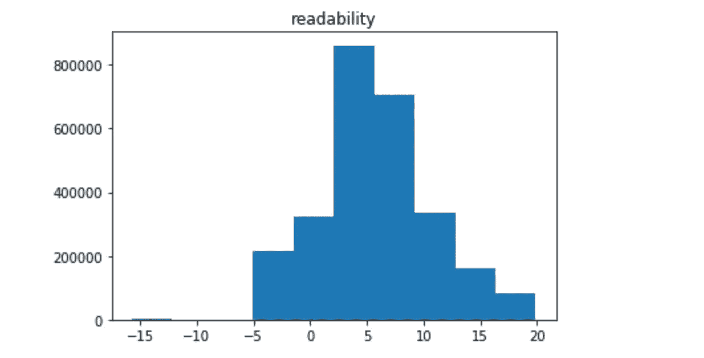

*大写比例*

大写字符占帖子总字符数的比率可以作为评论兴奋度或紧迫性的衡量标准。高比例也会吸引评论的注意。

*长度*

一篇文章的长度是读者首先注意到的方面之一。它经常作为一个评论是否会被阅读的决定因素，所以值得把它作为一个特性包含进来。

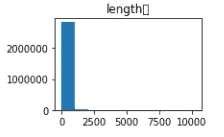

*毒性*

有毒和煽动性的评论可能会引起争议。至少，他们获得了回应。为了确定毒性，我们尝试对数据集应用预先构建的模型，但缺乏必要的计算资源迫使我们暂时跳过这一功能。

*问题数量*

评论主体中的问题越多，对评论的回应可能越多，因此可能是投票上升的指标。

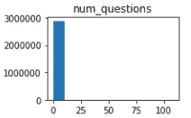

*Doc2Vec 嵌入*

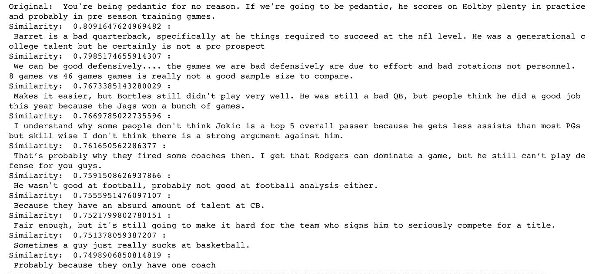

A training comment along with semantically similar comments determined by Doc2Vec

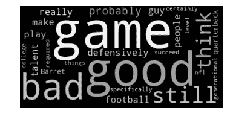

In this word cloud of the above example, we can see what these comments have in common

到语义空间的映射对于决定评论的成功是至关重要的。这可以使用 Doc2Vec 来完成，它将文档的语义表示为嵌入向量。Doc2Vec 通过在学习单词嵌入的同时添加文档标签，然后创建指定维度的文档嵌入，将文档映射到语义空间。我们从训练 dm 模型开始，该模型创建大小为 300 的嵌入向量，训练超过 125 个时期。虽然这个模型是准确的，但是所有评论的向量数据的庞大规模对我们的资源来说是太多了。结果，我们在 50 个时期内训练了新的 50 维嵌入模型。这个模型足够小，我们可以用它来进行预测，而且，在定性地检查了一些例子之后，看起来嵌入的整体准确性并没有受到太大的影响。从二维角度来看 Doc2Vec 嵌入，我们可以看到流行评论的集群。这可能是由于共同的语义，但它很可能只是某些子记录上更多活动的结果。

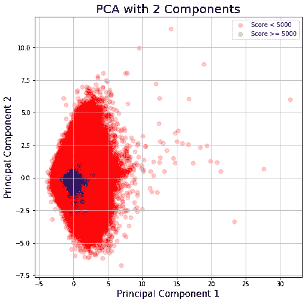

*镀金*

一条被镀金的评论在 Reddit 世界被赋予了一定的金额。我们放弃了这一功能，因为它是在发表评论后确定的，并且在他人发表评论前不可用。

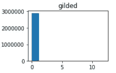

*可以镀金*

这是指一个评论能不能镀金。因为镀金的评论在一个帖子上有更多的曝光和推广，一个可以镀金的评论有机会成为镀金的并获得更多的投票。

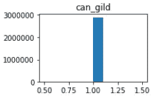

*争议性*

有争议的评论是那些有很多赞成票和反对票的评论。我们放弃了这个特性，因为它是在评论获得投票后确定的，因此不能用于进行预测。

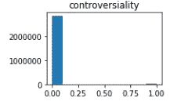

*创造了 UTC*

我们决定放弃创建时间，因为尽管 Reddit 拥有庞大的北美用户群，但它在国际上得到广泛使用。这意味着一天中发表评论的时间可能是噪音，而不是成功的标志。此外，我们只有一天的数据，所以我们不能尝试使用日期作为区分因素。

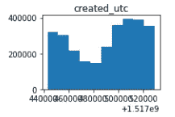

*被粘住*

一个粘贴的评论被钉在了帖子的顶部，这导致了更大的曝光率和更多的投票。然而，由于评论在发表后可能会被其他用户粘贴，我们不能将此用作预测功能。

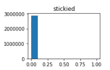

*尊贵的*

杰出评论当版主发表评论时，在用户名旁边添加一个“[M]”。因为区分对评论的排名没有影响，标签也没有像天赋一样给路人提供任何洞察力，所以评论是否被区分不太可能影响它的成功。

*已编辑*

因为编辑过的评论可能意味着该评论已经获得了关注，并且因为编辑过的评论可以被视为新的评论，所以编辑过的特征可以被用作未来成功的指示器。

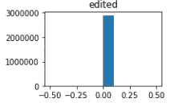

*是提交人*

被批准的提交者被允许发布任意多次，这意味着这个人有相当多的评论经验，可能会获得更多的支持票。

*永久链接*

永久链接是评论的链接。它包含文章的标题。

*帖子标题*

我们从链接中提取标题，并使用字典来修复最初有撇号的单词(缩写不能是 url 的一部分)。虽然我们计划将 Doc2Vec 模型应用于这些标题，并计算标题嵌入与注释嵌入的余弦距离来确定相关性，但由于时间限制，我们无法完全实现该功能。

*题目是问题*

回复一个问题的评论可能会得到更多的支持票，但是唯一确定的方法是把这个作为从文章标题中提取的一个特征包括进来。

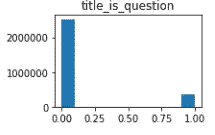

*得分*

这个作为标签，所以肯定是需要的。

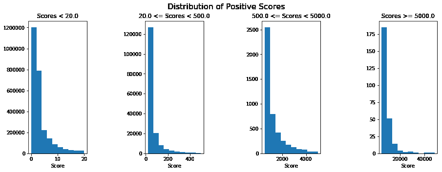

*子编辑*

使用 Viterbi 算法进行单词分割，我们分割子编辑名称中的组合单词，以创建可以应用 Doc2Vec 模型的文档。同样，目标是计算评论与子编辑的相关性。然而，由于时间限制，我们无法完全实现这一功能。

*检索于*

检索到的日期和时间对于确定我们估计净 upvote 计数的时间段非常重要。训练集的周期为 11 天，而测试集的周期为 15 天。我们不认为这是预测评估中的一个大问题，因为天数的小差异对 upvotes 没有什么影响(因为评论可能在其存在之初获得大多数投票)，特别是考虑到 Reddit 内容经常在几年内发挥作用。

*ID、链接 ID、父 ID 和子编辑 ID*

评论的 id 肯定和它的成功没有任何关系。

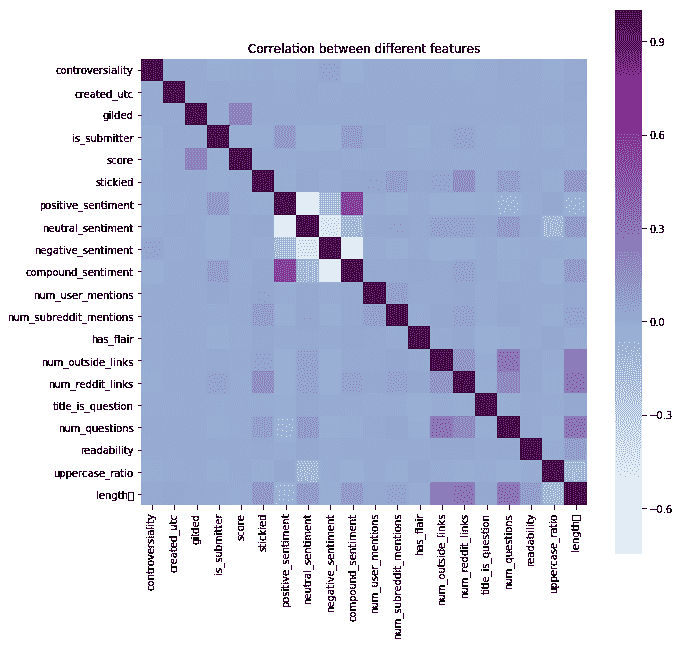

The correlation heatmap

**构建和评估净增加投票回归器**

在为我们的模型调整超参数时，为模型评分确定一个好的评估标准非常重要。基于训练数据的分数分布，绝大多数评论的上票数很少，这意味着数据是向右倾斜的。因此，使用某些回归评估指标，如 RMSE，对大错误给予高权重，可能会导致偏向高票数的评论。从 Zillow housing price kaggle 竞赛中汲取灵感，该竞赛涉及一个具有类似右偏数据集的回归问题，我们决定使用平均绝对误差(MAE)作为评估指标，因为它不会对无关评论产生偏见。

**超参数调谐**

上述梯度增强树模型的超参数调整是构建 upvote 预测器最耗时的方面。模型的调优是在使用 40GB RAM 和 GPU 的 google cloud 实例上完成的。我们尝试了几种不同的技术来优化我们的模型参数。在参数调整时，所有模型都使用 4 倍的训练集进行交叉验证。

*使用超点的贝叶斯优化*

超视是一种通过统计方法搜索参数空间的复杂方法。通过智能随机抽样，我们能够使用 HyperOpt 来适当地最小化梯度增强树模型的平均绝对误差。

*随机搜索 CV*

为了对我们的贝叶斯优化搜索结果进行健全性检查，我们还进行了随机搜索，以了解最佳匹配的大概值。

**使用 XGBoost 的梯度增强决策树**

*动机*

梯度推进决策树通常在表格数据的实践中工作得很好(正如它们在许多涉及回归的 Kaggle 竞赛中的成功所证明的那样)，所以我们决定从梯度推进树构建几个不同的模型。我们首先将 XGBoostRegressor 调成默认模型。在训练模型之前，所有的分类特征都是一次性编码的。

*输入特性*

*   能镀金
*   编辑
*   Is _ 提交者
*   积极情绪
*   中性 _ 情绪
*   消极情绪
*   复合 _ 情绪
*   用户提及次数
*   数量 _ 子编辑 _ 提及次数
*   Has_flair
*   数量 _ 外部 _ 链接
*   数量 _reddit_links
*   标题是问题
*   可读性
*   大写 _ 比率
*   长度
*   所有 Doc2Vec 载体

Credit: [http://arogozhnikov.github.io/2016/06/24/gradient_boosting_explained.html](http://arogozhnikov.github.io/2016/06/24/gradient_boosting_explained.html)

*结果*

虽然 XGBoost 总体上表现不错，但是我们的 XGBRegressor 模型是这个场景中最差的模型。该模型的损耗计算为 12.34 CV MAE，测试 MAE 为 12.34 CV MAE。测试预测的散点图如下所示。预测的 upvote 值范围从-200 到 2000。根据散点图，该模型似乎对现实中得分较低的评论过高地给出了许多分数。

**使用 CatBoost 的梯度提升决策树**

*动机*

CatBoost 是 Yandex 开发的梯度提升树模型，它为分类特征提供输入。在训练之前，CatBoost 应用一种复杂的算法来正确编码指定的分类特征。因为我们的训练数据具有一些可能会给 XGBoost 模型带来问题的分类特征，所以我们尝试构建一个 CatBoost 回归器来更好地处理这些特征。在模型被训练之前，所有的分类特征都被 CatBoost 编码。

*输入特性*

*   能镀金
*   编辑
*   Is _ 提交者
*   积极情绪
*   中性 _ 情绪
*   消极情绪
*   复合 _ 情绪
*   用户提及次数
*   数量 _ 子编辑 _ 提及次数
*   Has_flair
*   数量 _ 外部 _ 链接
*   数量 _reddit_links
*   标题是问题
*   可读性
*   大写 _ 比率
*   长度
*   所有 Doc2Vec 载体

*结果*

与 XGBoost 模型相比，结果明显更好。与 XGBoost 的预测不同，CatBoost 预测值的范围要小得多。因此，该模型无法预测任何得分极高的外围评论。尽管如此，模型的损失被计算为 8.32 CV MAE，测试 MAE 为 8.32 CV MAE，表明分类特征的专门编码是朝着正确方向迈出的一步。基于模型的特征重要性分数，分类特征 has_flair 似乎对模型具有最大的影响，而 can _ guilded 和 edited 甚至没有被考虑。现在我们有了两个有趣的特征重要性图，是时候开始移除可能增加 MAE 的噪声特征了。

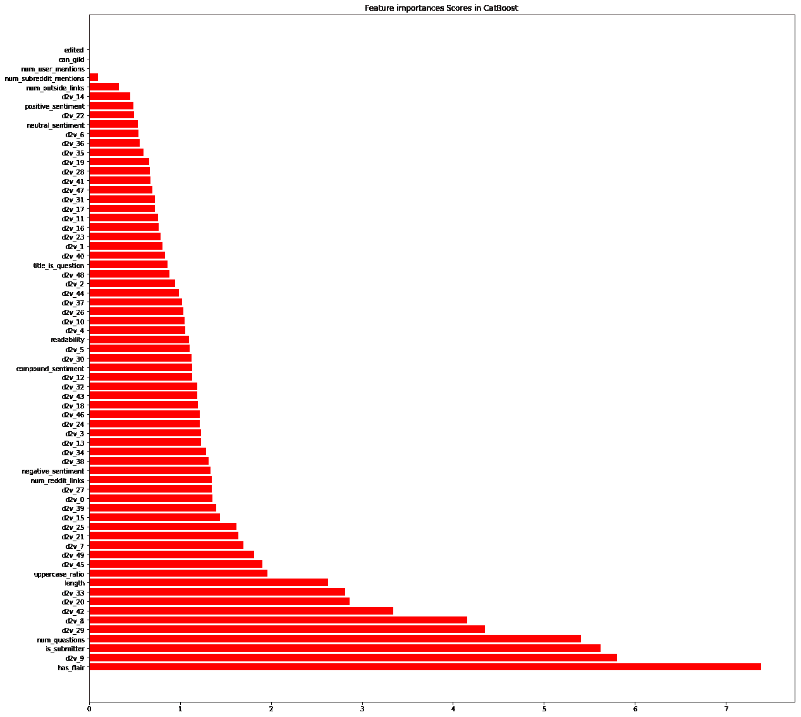

**神经网络**

*动机*

有了云实例和从梯度增强树多样化的愿望，我们决定尝试几个基于神经网络的模型。我们最好的一个涉及下面的架构，一个密集的顺序网络，有 67 个单元的输入，两个各有 50 个单元的隐藏层，使用 ReLU 激活函数，以及一个线性激活的最终输出层。对于培训，我们使用了 Adam 优化器和 MAE 评估指标。

此外，我们决定尝试通过删除某些不太适合神经网络的特征来减少以前模型中的模型噪声，这些特征在以前两个模型的特征重要性方面得分较低。

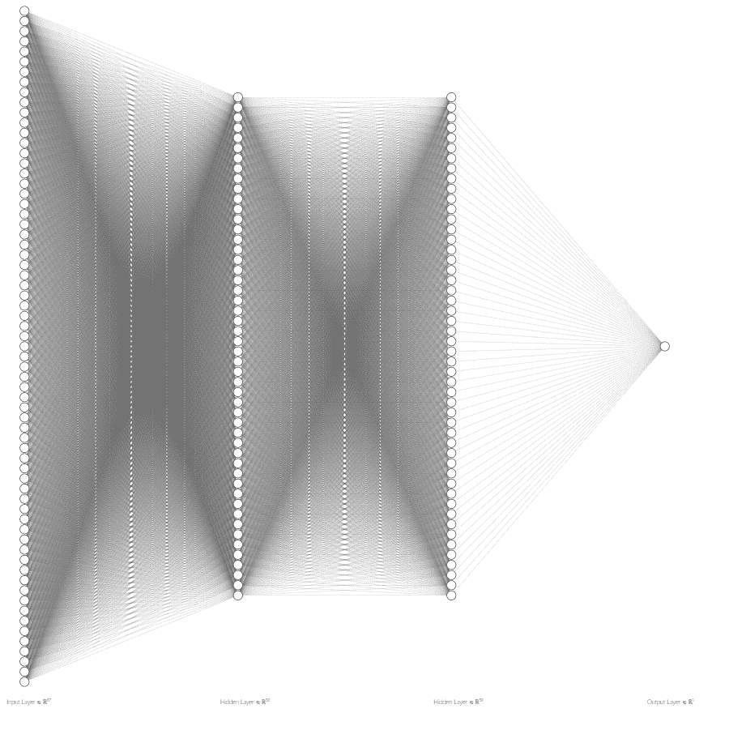

*输入特性*

*   积极情绪
*   中性 _ 情绪
*   消极情绪
*   复合 _ 情绪
*   用户提及次数
*   数量 _ 子编辑 _ 提及次数
*   Has_flair(编码)
*   数量 _ 外部 _ 链接
*   数量 _reddit_links
*   标题是问题
*   可读性
*   大写 _ 比率
*   长度
*   所有 Doc2Vec 载体

*结果*

非常令人惊讶的是，神经网络产生了比预期好得多的结果。我们只能训练它几个时期，这可以通过下面的学习和验证曲线清楚地看到。该模型仍然没有完全收敛于我们为其训练的几次迭代，但它仍然设法获得了 7.27 的 CV MAE 和 7.17 的测试 MAE，因为总体曲线趋势保持不变。不同寻常的是，根据散点图，预测值的范围变得更小了。尽管我们最初选择 MAE 作为评估标准，但是这个模型似乎偏向于高值的评论。然而，似乎移除我们生成的一些特征有助于减少模型中的噪声。

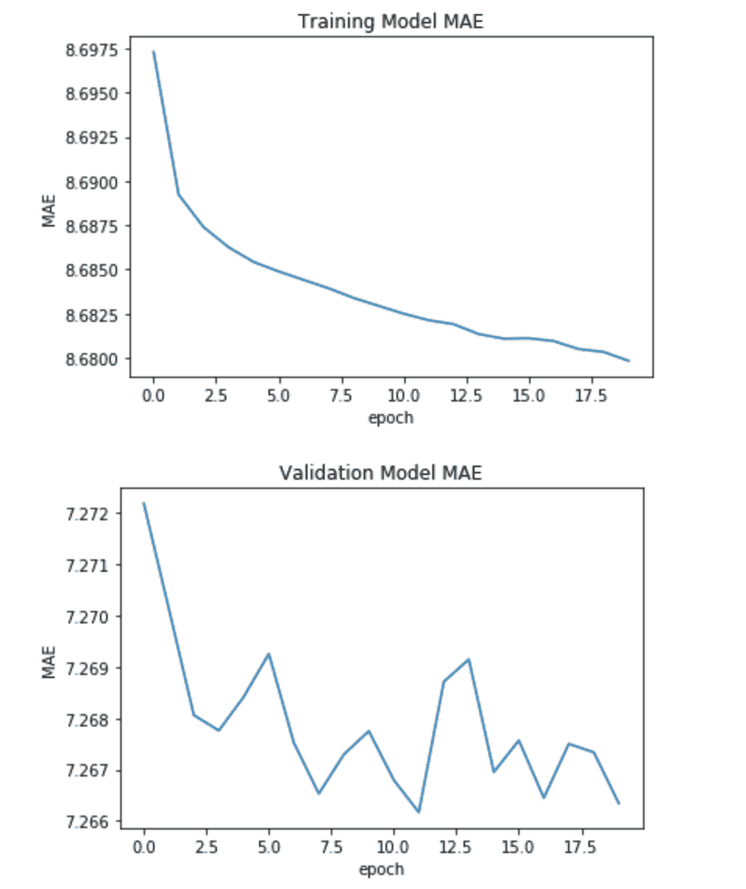

**4。混合合奏**

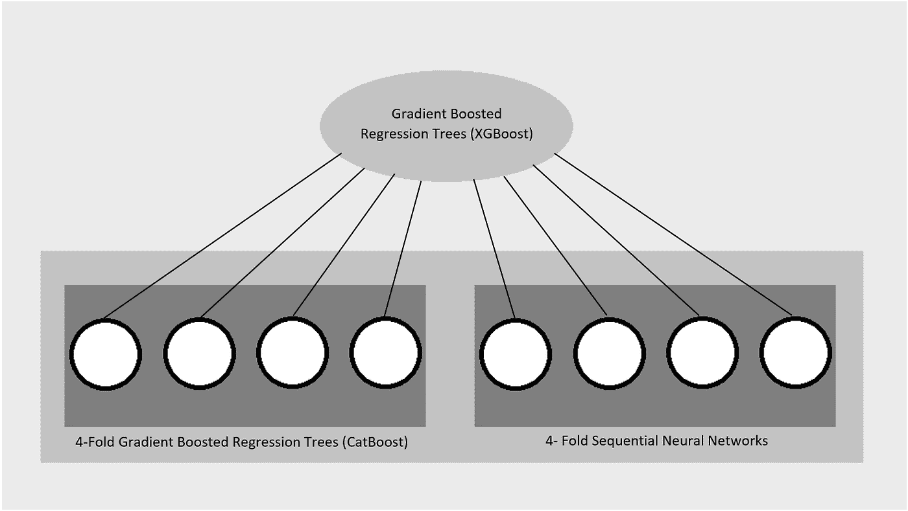

The goal model

*动机*

对于我们的最终模型，我们希望尝试一些具有强大预测能力的东西，希望进一步降低我们的 MAE 测试分数。本质上，我们设计的模型是梯度增强树和 4 重组合序列神经网络的 4 重组合。来自这些主要模型的预测将由 supervisor XGBoost 回归器模型进行堆叠和预测，该模型将返回最终的得分预测集。我们设计这个主管模型的思考过程是结合我们以前调整过的模型的好与坏，看看结果会如何结束。

*输入特性*

*   积极情绪
*   中性 _ 情绪
*   消极情绪
*   复合 _ 情绪
*   用户提及次数
*   数量 _ 子编辑 _ 提及次数
*   Has_flair(编码)
*   数量 _ 外部 _ 链接
*   数量 _reddit_links
*   标题是问题
*   可读性
*   大写 _ 比率
*   长度
*   所有 Doc2Vec 载体

*结果*

不幸的是，虽然我们能够完全编码我们的集合模型，但我们的计算能力阻止了我们实际训练模型。在神经网络和 CatBoost 模型的 k 倍训练阶段，我们的 google cloud 实例 GPU 不断耗尽内存。我们尝试了几次实验，但是在云服务器上训练失败的结果是一致的。

**最终预测结果**

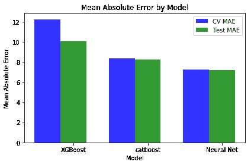

上面我们可以看到我们得到的结果的比较。当我们用以前的经验来指导我们的努力，尝试新的模型时，我们看到我们的误差稳步下降。我们相信成功地实现目标模型将会延续这一趋势，并且我们的目标是在未来使用更多的计算资源来实现这一目标。

# 为不同的子编辑创建预测键盘

为了创建一整套工具供 Reddit 用户在评论时使用，我们为不同的子编辑构建了一个定制的预测键盘。一般而言，预测键盘观察过去的打字习惯和词汇使用以及当前的上下文，以估计哪些单词具有被键入的高可能性，并向用户建议这些单词。

**预处理**

在大多数自然语言处理问题中，第一步是处理文本以消除任何字符噪声。在我们的例子中，我们决定采取一种不干涉的方法，尽可能少地修改文本，以保留尽可能多的来自评论的信息。无论如何，一些语法元素，如标点符号和大写字母增加了更多的噪音，所以我们决定删除它们。

除了典型的预处理，我们还面临生成合适语料库的更新颖的问题。大多数 NLP 模型需要一个语料库来进行训练，因此模型可以首先了解文本中可能存在的模式。在我们的例子中，原始数据来自数以百万计的不同评论，而不是一个集中的语料库，所以我们必须从现有的数据中生成自己的语料库。为此，我们决定简单地将所有注释附加在一起，同时使用特殊的定界字符来区分不同的注释。

有了所有可用形式的数据和对预测键盘如何工作的简单理解，我们决定直接开始实现我们的第一个基于马尔可夫链的模型。

**马尔可夫链模型**

马尔可夫链模型似乎很适合我们的问题，因为它可以通过 n 元语法考虑单词的上下文，并通过记忆单词出现的概率来跟踪过去的历史。马尔可夫链可以被认为是有限状态机，其中每个状态都有一定的概率根据过去的历史转移到其他阶段。当应用于文本时，这意味着每组单词都是一种可能的状态，所有的边都是基于下一个单词出现的概率形成的，如下所示。对于我们的模型，我们决定在分离句子时使用二元语法，因此我们不是查看单个单词，而是一次查看两个单词，这允许我们考虑某些单词的上下文，同时不会使我们的训练数据过于稀疏。

在对我们的数据训练马尔可夫模型后，我们发现它非常善于生成大量可读的文本。这个模型的性能特别快，因为它只需要一遍所有的数据就可以记住所有的概率。这个模型能够接受非常短的起始短语，并能够从中推断出很多。例如，当在 subreddit r/Fitness 上训练模型时，我们让模型继续生成单词，直到它认为评论应该结束，从单词“我是”开始生成以下 commnet:“我倾向于认为你不可能每天都全力以赴而没有任何肌肉损伤”。

乍一看，这似乎很完美，但是仔细观察，这个自动生成的评论揭示了我们模型的一些主要优点和缺点。一方面，注释可读性很强，更重要的是，它符合 fitness 子编辑的上下文，因此我们的马尔可夫链似乎能够非常有效地生成特定于子编辑的注释。然而，我们理想的用例应该更多地关注建议更短的短语或单词，并高度准确地符合用户的期望。因此，如果我们再次运行这个模型，但在一个单词后停止，我们将得到短语“我倾向于”。这个短语在语法上可能非常好，但它实际上可能不是太准确的预测，因为单词“倾斜的”实际上可能不会经常跟在短语“我是”后面。当然，完美地预测下一个单词基本上是不可能的，特别是考虑到我们只有两个单词可以脱离上下文。这个问题的一个解决方案是使用一个更好地考虑上下文的模型(我们稍后使用 LSTM)，另一个更直接的解决方案是将更多的数据输入到我们当前的模型中。我们决定尝试第二种方法来提高我们的准确性，只尝试在键入单词的中途预测单词，因此使用与前面相同的示例，如果用户已经键入了“我是公司”，我们将只预测“我倾向于”。为了得到这个想要的效果，我们需要修改我们的马尔可夫模型，使之基于角色。

这是一个极端的变化，因为这意味着我们不再预测单个单词，而是着眼于字符。作为其中的一部分，我们还决定一次将 4 个字母组合在一起，以获得更具可读性的文本。这让我们得到了我们想要的中间词预测，但它也带来了糟糕透顶的句子，甚至连合适的词都很少见。我们认为这是由于模型过于天真，在解释环境方面不够好。因此，我们决定重新考虑我们的第一个解决方案，寻找一个不同的模型，更好地考虑环境。

**我们如何改进马尔可夫模型——神经语言建模**

让我们想想人类是如何处理和解释句子的。人类通常从左到右浏览文本，在每个单词之后获得文本内容的一些上下文，直到到达结尾；因此，我们逐渐理解了整篇文章。鉴于这是人类阅读和理解句子的方式，我们可以获得一些关于人类如何预测给定单词的句子中的下一个单词或字符的见解:我们从句子开头的单词开始阅读并积累信息，直到我们到达结尾，然后给定这些单词的上下文，我们可以确定接下来什么是有意义的。递归神经网络(RNNs)背后的思想非常相似。

在其他神经网络中，网络的输入被认为是相互独立的。例如，您的标准多层感知器(MLP)或前馈神经网络通过神经元传递输入，神经元对模型的输入执行一些数学功能。通过训练这些模型，你可以对这些输入进行数学运算，看看你有多差，然后通过一个称为反向传播的过程，重新调整网络中神经元的权重。这对于一些用例来说很好，然而，在自然语言处理中，我们的输入通常不是相互独立的。过去的输入可以帮助我们识别当前输入的更好输出，这正是 rnn 试图做的:利用顺序信息。

递归神经网络是递归人工神经网络的变体，其中神经元之间的连接进行定向循环。它的输出不仅取决于当前的输入，还取决于先前步骤的状态；这种记忆使网络能够更好地处理先前输入的上下文很重要的问题。这个属性是使 RNNs 成为处理自然语言处理问题的非常强大的工具的关键因素，我们将尝试使用 RNNs 来创建更好的预测键盘。

**LSTM 基于角色的模型**

考虑到这些结果，我们决定尝试开发一个新的模型，它可以匹配 subreddit 行为，同时还引入了中词预测。最初，我们试图简单地将我们的马尔可夫链模型转换成基于 ac 字符的模型，这导致了糟糕的结果，因为该模型不够复杂，无法从它预测的字符中生成真实的单词。

因此，我们创建了一个长短期记忆(LSTM)递归神经网络。常规递归神经网络遭受消失和爆炸梯度问题，因此它们很少在实践中使用。相反，我们使用了 LSTM 递归神经网络(如下所示),该网络使用门来流动梯度并减少消失梯度问题。

*图片取自* [*Colah 的博客*](http://colah.github.io/posts/2015-08-Understanding-LSTMs/)

假设我们的数据是来自子编辑的注释，我们需要以一种特定的方式格式化数据，这种方式很好地与神经网络一起工作。将每个注释作为字符串数组传递在神经网络中并不合适，更好的方法是将它们表示为分类特征或数字特征。在我们的字符 LSTM 的例子中，我们首先创建一个字符到索引和索引到字符的映射，稍后我们将使用它对我们的序列进行一次热编码。我们还记录了字符集的大小，大约有 200 个不同的字符。

接下来，我们需要将我们的注释映射到 LSTM 可以接受的某种表示。为此，我们可以为整个文本创建长度为 40 的字符序列。当我们创建这些序列时，我们为序列中的每个字符创建一个 hot 编码向量来表示每个字符。这是有用的，因为神经网络通常对于具有分类特征的多类分类表现良好。创建完这些序列后，我们剩下一个三维矩阵(我们的 X):第一维表示序列号，第二维表示序列中的字符，第三维是表示特定字符的一键向量。在我们创建序列的同时，我们创建了下一个字母矩阵(我们的 Y)。对于序列 N，我们给出了字符 1 到 30，我们试图预测 Y，也就是字符 31。我们的 Y 数组应该是一个二维数组:第一维表示序列号，第二维是一个表示我们的模型试图预测的特定字符的一键向量。

然后，我们创建用于预测输入序列的下一个字符的模型。我们使用大小为 128 的 LSTM 层的 Keras 序列模型，进入大小为我们字符集大小的全连接密集层，最后我们将这些结果放入 softmax 激活层，以输出其奇异真实指数代表我们试图预测的字符的 one hot vector。我们使用 RMSprop 优化器(通常适用于递归神经网络的优化器)编译该模型，学习率为 0.01，损失函数为 categorical _ crossentropy(适用于多类分类中的神经网络)。我们将该模型拟合到上述 20 个时期的 X 和 Y 矩阵，并观察下面的精度和损失。

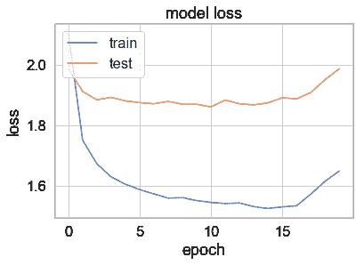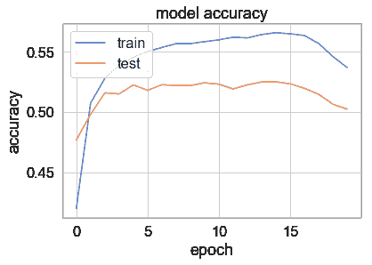

我们可以看到，对于我们的验证数据，我们的模型可以实现大约 0.55 的准确性，而损失大约为 1.9。这意味着给定一个长度为 30 的字符序列，模型有 55%的机会正确猜测序列中的下一个字符。对于我们在/r/2007scape 上训练的模型，它表现得相当好，因为它可以学习一些只在那些特定子编辑中使用的单词。例如，给定一个输入序列“Old School Runesc”，我们的模型可以预测[“cape”、“hools”、“ores”、“scenity”、“and”]，这将使预测成为“Old School Runescape”。这突出了我们的模型与马尔可夫模型相比的一些优点和缺点:我们的模型现在能够在给定过去上下文的情况下以相当高的准确度预测不完整的单词。然而，给定非常模糊的上下文，例如“O”，我们的模型预测[“One”、“Other”、“Ore”、“Oin”、“Oent]]，向我们显示我们的模型不能保证给我们有效的单词。此外，如果我们给它的序列已经有了完整的单词，我们的模型也不能很好地工作，例如“我想吃饭”给我们的输出是[“tion”、“h”、“the”、“er”、“o”]，所以我们的模型实际上并不知道完整的单词，也不真正理解语法的概念。下面是我们为演示我们的模型而构建的 web 应用程序的快速浏览。

总之，我们的模型对于需要自动补全成在子编辑中使用但不在其他地方使用的词(例如游戏城市、老板、怪物等)的不完整的词工作得很好。).然而，对于预测下一个单词，我们的模型表现不佳，因为它没有真正理解单词/语法的概念，因为它是在字符而不是单词上训练的。接下来，我们将提出一个可以很好预测下一个单词的模型。

**LSTM word2vec 嵌入模型(** [**演示此处**](https://github.com/davidzchen-ut/subreddit-predictive-keyboard) **)**

我们之前的字符神经语言模型在预测不完整单词和特定于子编辑的单词方面工作得很好。但是，有没有一个模型在预测单词时表现更好，符合语法规则的方法呢？现在，我们尝试创建一个模型，该模型使用 LSTM RNNs 和单词嵌入模型来预测给定单词序列的单词。同样，我们使用 LSTM rnn 而不是常规 rnn，因为它们能够处理消失和爆炸梯度问题，并且因为我们试图使用序列特征进行预测。

在我们开始尝试之前，回顾一下单词嵌入会给模型带来什么好处是很重要的。单词嵌入是将字符串转换为向量的过程。这个过程包括在数学上将每个单词的一个维度嵌入到一个更低维度的连续向量空间中。这允许我们减少“维数灾难”,因为一个单词词汇集的热编码可能导致词汇集长度超过十万。具体来说，我们探索了使用 Word2Vec，这是一个为每个唯一单词创建唯一单词嵌入向量的模型。Word2Vec 的特殊之处在于，它生成的单词向量的位置使得在语料库中共享共同上下文的单词在向量空间中彼此靠近。我们试图为我们的模型利用这个属性，因为我们认为 Word2Vec 向量捕获的上下文将为模型提供更多的上下文，从而提高模型的输出。下面是由 Word2Vec 模型生成的单词嵌入的可视化。

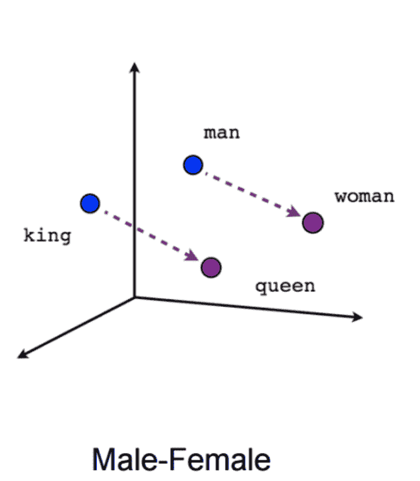

我们的输入仍然是相同的单词集，所以我们需要将这些数据转换成我们的模型可以接受的东西。我们首先将语料库标记为字符串数组，然后创建并训练一个 gensim Word2Vec 模型。在训练我们的模型之后，我们通过创建类似的三维数组(我们的 X 矩阵)在整个数据集上创建我们的 30 个单词长的滑动窗口序列:第一维仍然表示序列号，第二维表示单词序列，第三维表示单词(通过在 Word2Vec 模型中查找单词并使用单词嵌入)。我们还创建了一个表示 Y 矩阵的二维数组:第一维表示序列号，第二维表示我们试图预测的单词(作为单词向量)。

我们使用的模型非常类似于我们基于字符的神经语言模型。我们使用 Keras 序列模型，该模型使用大小为 128 的 LSTM 神经网络层，进入大小为我们的 Word2Vec 输出维度的完全连接的密集层，最后我们输出结果。我们用学习率为 0.01 的 AdamOptimizer 编译了这个模型，损失函数为 mean_absolute_error。我们用 X 和 Y 拟合这个模型 150 个时期，看看我们得到什么结果。

不幸的是，我们模型的结果相当糟糕。在我们将模型的结果转换回单词后，我们看到我们的模型一直输出一个或两个它认为最正确的单词。鉴于我们在网上看到的例子，我们认为我们的模型是不适合的。如果有更多的时间和资源，如果我们继续训练这个模型，我们相信这个模型会输出可以转换成实际单词的单词嵌入，并且应该是语法正确的。

# 结论

我们这个项目的目标是改善 Reddit 上的评论体验。使用 redditor 创建的数据集的一天评论，我们构建了两个不同的模型来帮助用户进行评论。我们项目的第一部分是创建一个向上投票预测器。顺序神经网络预测器是我们设法完全创建和训练的最佳模型；它在测试集上的平均绝对误差为 7.17。我们项目的第二部分是生成特定于每个子编辑的预测键盘。在整个过程中，我们一直面临的一个问题是数据量超出了我们的管理能力。

# 后续步骤

**子编辑预测键盘改进**

为了创建最佳模型，我们将用更多的资源和时间来完成我们的单词嵌入神经语言模型的训练。然后，我们将结合我们的字符语言模型和单词嵌入模型来创建一个自动完成键盘，它可以预测您正在键入的当前单词，并根据您刚刚键入的单词的上下文给出下一个单词的准确建议。这种模式更类似于 Gmail 新的智能撰写功能。创建更准确的模型的另一个考虑是尝试 seq2seq 模型，该模型使用两个 LSTM，一个 LSTM 用于编码当前上下文，另一个 LSTM 用于解码该序列，并在给定编码器权重的情况下生成预测。在谷歌的 AI 博客上，我们发现谷歌考虑使用 seq2seq 模型，但其性能太慢。然而，他们发现 seq2seq 模型具有更好的准确性，因此如果我们对单词嵌入神经语言模型的准确性不够，我们也可以考虑使用该模型。训练该 seq2seq 模型的计算复杂度高于训练单词嵌入神经语言模型，因此在实践中这可能是不可行的。

**向上投票预测器**

在改进 upvote 预测模型时，有许多方向可以探索。乍看之下，几乎可以肯定，我们尝试的所有模型的超参数都可以改进。如果我们能够以某种方式克服训练模型时遇到的 GPU 内存问题，那么将模型输入基于 XGBoost 的管理模型几乎肯定会带来改进。探索不同的神经网络架构也可能是有用的，特别是因为嵌入可能需要与独立特征区别对待。由于缺乏计算能力和/或时间，我们不得不放弃一些特性，在模型的下一次迭代中包含这些特性会非常有帮助。不管我们采取什么步骤，我们无疑都需要获得更多的计算资源。

**组合模型**

虽然这两种模式可以分别帮助 Redditors 改善用户体验，但一种组合模式可以为用户做更多的事情。upvote 预测器可用于测量评论的预计质量，并且该信息可被输入键盘用于帮助提高评论质量的完成。这对贡献者和消费者来说都意味着更好的体验。